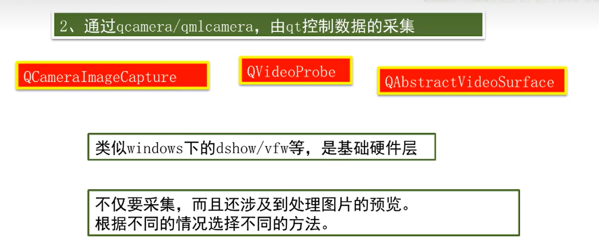

# qt for android + opencv的配置及使用

1：下载[opencv](https://so.csdn.net/so/search?q=opencv&spm=1001.2101.3001.7020) for android

网址：https://opencv.org/releases.html


2：下载后解压，放到一个英文的路径里，路径里不要带中文和空格。


 

3：新建qt项目，在pro文件里添加库

```cpp
unix {
 
ANDROID_OPENCV = E:/ku/opencv-4.0.1-android-sdk/OpenCV-android-sdk/sdk/native
 
 
INCLUDEPATH += $$ANDROID_OPENCV/jni/include/opencv2 \
               $$ANDROID_OPENCV/jni/include
 
LIBS += $$ANDROID_OPENCV/staticlibs/armeabi-v7a/libopencv_calib3d.a \
        $$ANDROID_OPENCV/staticlibs/armeabi-v7a/libopencv_core.a \
        $$ANDROID_OPENCV/staticlibs/armeabi-v7a/libopencv_dnn.a \
        $$ANDROID_OPENCV/staticlibs/armeabi-v7a/libopencv_features2d.a \
        $$ANDROID_OPENCV/staticlibs/armeabi-v7a/libopencv_flann.a \
        $$ANDROID_OPENCV/staticlibs/armeabi-v7a/libopencv_highgui.a \
        $$ANDROID_OPENCV/staticlibs/armeabi-v7a/libopencv_imgcodecs.a \
        $$ANDROID_OPENCV/staticlibs/armeabi-v7a/libopencv_imgproc.a \
        $$ANDROID_OPENCV/staticlibs/armeabi-v7a/libopencv_ml.a \
        $$ANDROID_OPENCV/staticlibs/armeabi-v7a/libopencv_objdetect.a \
        $$ANDROID_OPENCV/staticlibs/armeabi-v7a/libopencv_photo.a \
        $$ANDROID_OPENCV/staticlibs/armeabi-v7a/libopencv_stitching.a \
        $$ANDROID_OPENCV/staticlibs/armeabi-v7a/libopencv_video.a \
        $$ANDROID_OPENCV/staticlibs/armeabi-v7a/libopencv_videoio.a \
        $$ANDROID_OPENCV/3rdparty/libs/armeabi-v7a/libcpufeatures.a \
        $$ANDROID_OPENCV/3rdparty/libs/armeabi-v7a/libIlmImf.a \
        $$ANDROID_OPENCV/3rdparty/libs/armeabi-v7a/liblibjasper.a \
        $$ANDROID_OPENCV/3rdparty/libs/armeabi-v7a/liblibjpeg-turbo.a \
        $$ANDROID_OPENCV/3rdparty/libs/armeabi-v7a/liblibpng.a \
        $$ANDROID_OPENCV/3rdparty/libs/armeabi-v7a/liblibprotobuf.a \
        $$ANDROID_OPENCV/3rdparty/libs/armeabi-v7a/liblibtiff.a \
        $$ANDROID_OPENCV/3rdparty/libs/armeabi-v7a/liblibwebp.a \
        $$ANDROID_OPENCV/3rdparty/libs/armeabi-v7a/libquirc.a \
        $$ANDROID_OPENCV/3rdparty/libs/armeabi-v7a/libtbb.a \
        $$ANDROID_OPENCV/3rdparty/libs/armeabi-v7a/libtegra_hal.a \
        $$ANDROID_OPENCV/libs/armeabi-v7a/libopencv_java4.so
 
}
```

  4：最后一个库libopencv_java4.so是动态库，要加入到安卓的apk里。按照顺序将动态库加入进去。

 

 

5：正常编写opencv的代码即可。

 

# 设置手机app图标


# 简单使用


文件Demo01

```c++
#ifndef WIDGET_H
#define WIDGET_H

#include <opencv2/core/core.hpp>
#include <opencv2/highgui/highgui.hpp>
#include <opencv2/imgproc/imgproc.hpp>
#include <QWidget>

using namespace cv;
QPixmap Mat2QImage(Mat src);

QT_BEGIN_NAMESPACE
namespace Ui
{
    class Widget;
}
QT_END_NAMESPACE

class Widget : public QWidget
{
    Q_OBJECT

public:
    Widget(QWidget* parent = nullptr);
    ~Widget();

private slots:
    void on_pushButton_2_pressed();

private:
    Ui::Widget* ui;
};
#endif // WIDGET_H

```


```c++
#include "widget.h"
#include "ui_widget.h"
#include <QFileDialog>

//using namespace cv;
//cv::Mat tmp;


Widget::Widget(QWidget* parent)
    : QWidget(parent)
    , ui(new Ui::Widget)
{
    ui->setupUi(this);
}

Widget::~Widget()
{
    delete ui;
}


void Widget::on_pushButton_2_pressed()
{
//    QString fileName = QFileDialog::getOpenFileName(this, "Open Image", ".", "Image Files(*.jpg *.png *jeg *.bmp)");
//    Mat src = imread(fileName.toStdString());
//    //图片处亚
//    cvtColor(src, src, COLOR_BGR2GRAY);
//    int thresh = 100;
//    Canny(src, src, thresh, thresh * 2, 3);
//    //将图片显示到tabeL上
//    QPixmap pix = Mat2QImage(src);
//    ui->label->setPixmap(pix);
    Mat src(Size(640, 480), CV_8UC1, cv::Scalar(255));
    circle(src, Point(100, 100), 100, Scalar(0), -1);
    //格式转换
    QPixmap qpixmap = Mat2QImage(src);
    //将图片显示到tabeL上
    ui->label->setPixmap(qpixmap);
}

/* ////////////////////////heLper函数/////////////////////////////////////////////*/
//格式转换
QPixmap Mat2QImage(Mat mat)
{
    QImage img;
    //根据QT的显示方法进行转换
    if(mat.channels() == 3)
    {
        cvtColor(mat, mat, COLOR_BGR2RGB);
        img = QImage((const unsigned char*)(mat.data), mat.cols, mat.rows, QImage::Format_RGB888 );
    }
    else
    {
        img = QImage((const unsigned char*)(mat.data), mat.cols, mat.rows, QImage::Format_Grayscale8);
    }
    QPixmap qimg = QPixmap::fromImage(img);
    return qimg;
}
```


#  在widget下引入camera，获取实时图像

##  四种方式

**法1.  qt不支持:**


**法2.  推荐使用**



**法3.  推荐**


**法4.** 


最重要的函数


使用:


