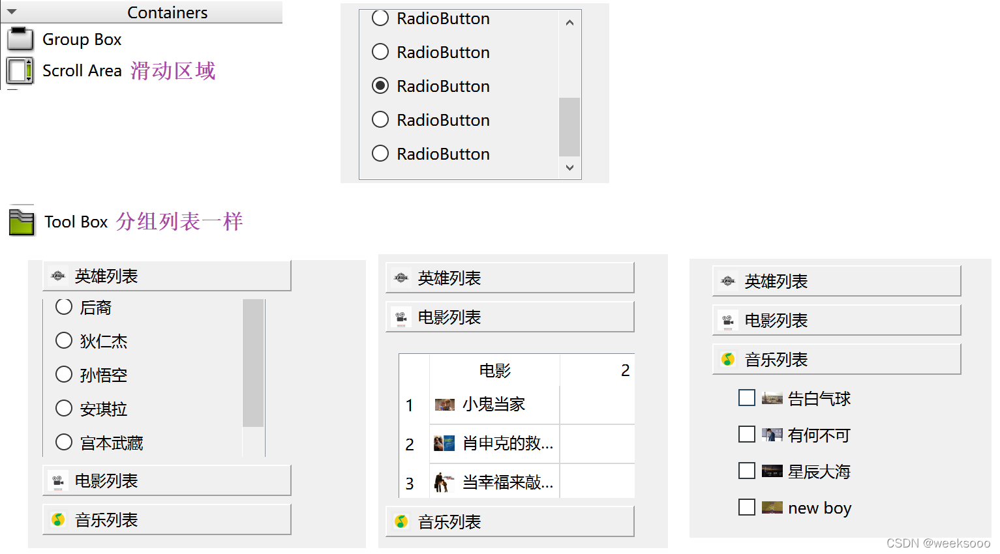
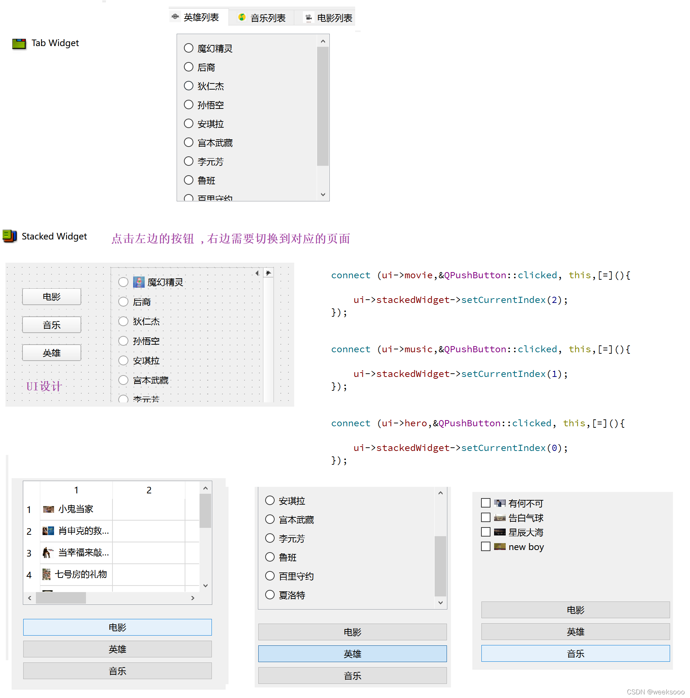
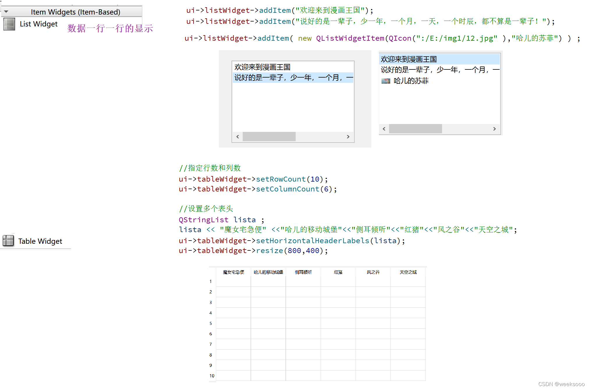
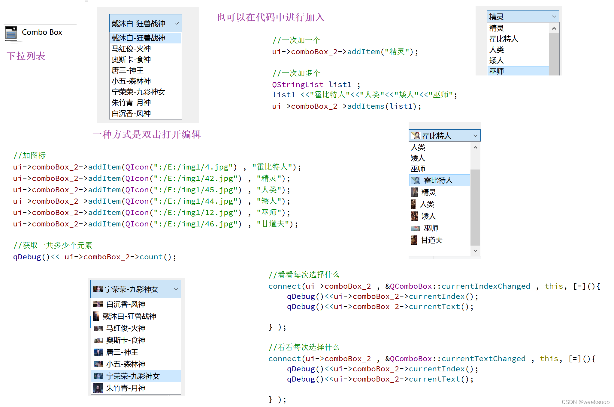
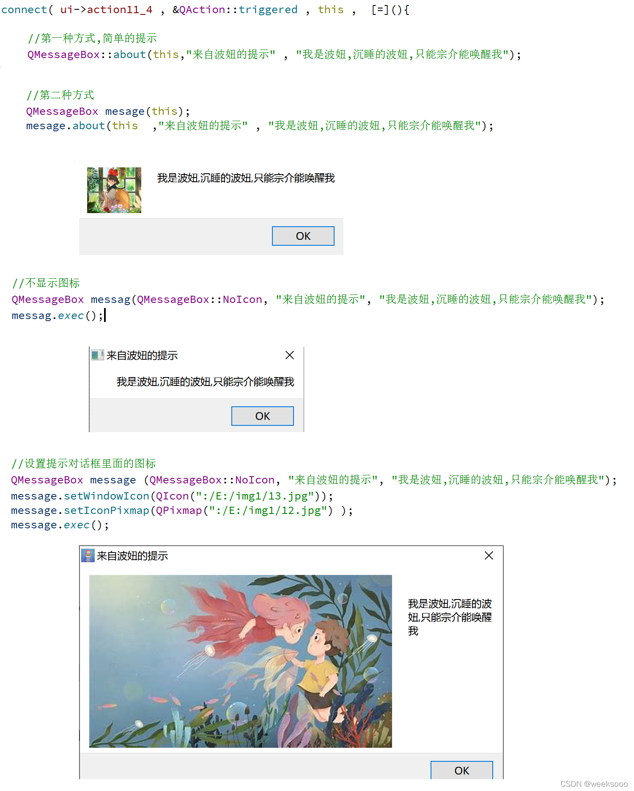
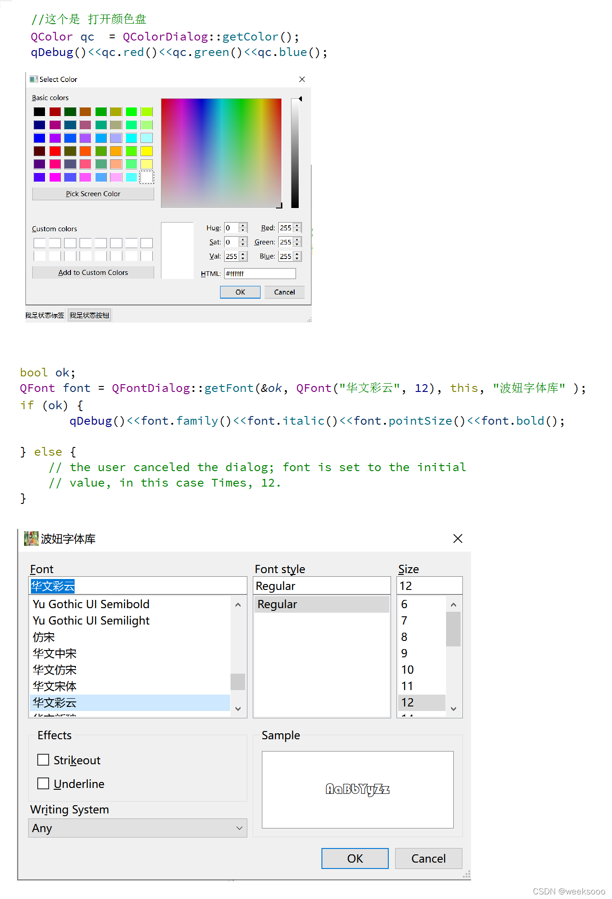

# day01

+  1，快捷键
  //注释  ctrl + /
  //运行  ctrl + r
  ==//保存  ctrl + s==
  ==//编译  ctrl + b==
  //查找  ctrl + f
  //字体缩放 ctrl+ 鼠标滚轮
  ==//帮助文档  f1==
  ==//自动对齐  ctrl + i==
  ==//同名之间的.h 和.cpp文件的切换 f4==
  
+ 2，文件名和创建路径==一定不能用中文==

+ **QT中main（）认识：**

+ 

## 知识点一: 按钮的使用与窗体的简单设置

  + 1. \#include <QPushButton>

    2. QPushButton  * btn3 = new  QPushButton("按键内容" , this);  

    3.  内存自动回收： 
    
    4. ```
           QT中的对象指针在满足下列情况会自动回收内存
           // 1. 从QObject派生的类 1.直接 2.间接
           // 2. 指定父类, 父亲析构的时候,先析构他的孩子
           // 创建自定义按钮对象
       ```
    
    3. 窗体相关属性设置：
       
       ```c++
       show()方法会以顶层方式重新弹出来一个窗口
       
       move（x,y） 改变位置
       
       """
       setText(”文本“) 设置文本   <=> QPushButton  * btn3 = new                                               QPushButton("按键内容" ,this); 
       setParent（this）设置父类
       """
       
       resize(600,1200);   //设置窗口大小，左上角是原点 
       
       setFixedSize(600,800); //设置指定窗口的大小,不能被移动
       
       setWindowIcon(QIcon("E:\\1.jpg图片路径")); //给窗口加图标
       
       setWindowTitle（”标题“） //设置窗口标题
       
       //当前主窗口的宽度与高度
       int a = this->width();   
       int b = this->height() ;
       

+ 资源文件：

  + 设置图片（==setWindowIcon(QIcon("E:\\1.jpg图片路径")); //给窗口加图标== ）
  + 

## 知识点二: 信号槽机制(重要)

  + 

  ==  普通信号普通槽,系统带的 ==
   / /例如QPushButton的父类QAbstractButton 有Signals里面有 clicked , pressed , released,toggled
  ​//信号和槽函数 都是函数,其中  **信号只需要声明**,不需要函数定义 ,  而**信号槽需要声明和定义**,属于回调函数  

```c++
// 需求 点击上面的btn按钮,执行窗口关闭动作   
    //建立两者的连接:  connect(btn, 发出的信号, this, 处理信号的槽函数);
    connect(&btn, &QPushButton::clicked, this, &MyWidget::close);
    /*      格式:  & + 信号发出者类的名字 + :: + 信号的名字
     * b1: 信号的发出者, 此参数必须是是一个指针
     * &QPushButton::clicked: 信号发出者, 内部的一个信号
     * this: 信号的接收者, 此参数是一个指针
     * &MyWidget::close: 信号的处理函数, 属于this
    */ emit
```

**自定义槽函数 ** 

定义对象->声明一个槽函数->定义一个槽函数：写明具体功能

回去： 先通过槽函数发信号 ，主窗口接受再发过来信号  （定义一个槽函数和信号（目的发起信号）再定义一个槽函数去接受发过来的信号）

```
// 自定义槽函数
    /*
     * 1. 槽函数在Qt5 可以是任意类成员函数, 全局函数, 静态函数, lambda表达式(隐式函数)
     * 2. 槽函数需要与信号对相应(返回值, 参数)
     * 3. 信号,槽函数返回值: void
     * 4. void mysig(int, double, QString);
     *    void myslot(int, double);
     * 5. 槽函数的参数是为了接受信号传过来的的数据
     * 6. 槽函数的参数应该是不能够大于信号的参数个数, 可以少于信号的参数个数
     * 7. 槽函数可以重载，注意槽函数重载了，必须使用函数指针QT的格式: void (Subwigdet::*MySigSub)() = 
                                                                           &Subwigdet::sigSub;
     * 8. emit发信号
```

**代码**：

```c++
mainwidget.h文件
    
#ifndef WIDGET_H
#define WIDGET_H

#include <QWidget>
#include<QPushButton>
#include<subwigdet.h> //a自己添加的类在那用就要include

class Widget : public QWidget
{
    Q_OBJECT

public:
    Widget(QWidget *parent = 0);
    ~Widget();

private:
    QPushButton* btn;
    QPushButton b1;
    //a1
    QPushButton* b3;

 //1自定义槽函数
    void slotForwidget();

    void slotHideme(); // a4

    //创建一个子窗口对象（a）
    Subwigdet subw;       //b2
    //  b 槽函数
    void slotshowme();   //b3
    void slotsubmsg(int num, QString str); //c

};

#endif // WIDGET_H


```

```c++
mainwidget.cpp文件

#include "widget.h"
#include<QPushButton>
#include<QDebug>  //输出

Widget::Widget(QWidget *parent)
    : QWidget(parent)
{
    btn = new QPushButton("按钮",this);
    btn->move(300,200);

    this->setWindowTitle("fcc");
    this->setWindowIcon(QIcon("c:\\Users\\16658\\Desktop\\q"));
    connect(btn,&QPushButton::clicked,this,&Widget::close);

    //1定义槽函数：
    b1.setText("老二");
    b1.setParent(this);
    connect(&b1,&QPushButton::released,this,&Widget::slotForwidget); // 简单的使用自定义槽函数


    //a2
    b3 = new QPushButton("软件园",this);
    b3->move(200,200);
    b3->resize(100,50);
    connect(b3,&QPushButton::clicked,this,&Widget::slotHideme);  //a3开始定义槽函数
    //a进去子窗口之后在回到主窗口b1
    //b2开始设置信号和信号接收对象
    void (Subwigdet::*MySigSub)() = &Subwigdet::sigSub;  //函数指针
        connect(&subw,MySigSub,this,&Widget::slotshowme);   //slotshowme槽函数

    void (Subwigdet::*MysigPlus)(int,QString) = &Subwigdet::sigSub; //函数指针
    connect(&subw,MysigPlus,this,&Widget::slotsubmsg);  //槽函数重载c //函数指针,如果你的信号或者超发生重载就要使用函数指针

}
Widget::~Widget(){}
//1
void Widget::slotForwidget()
{
    b1.setText("修改了");
}

//a5 写槽函数的目的  写明具体功能
void Widget::slotHideme()
{
    //隐藏自己（主窗口）
    hide();
    //显示软件园窗口 a6去编写子窗口按钮
    subw.show();
}

//b
void Widget::slotshowme()  //slotshowme
{
    //显示自己
    show();
    //软件园窗口
    subw.hide();
}

void Widget::slotsubmsg(int num, QString str)
{
    qDebug() << num << str;
}

```


```c++
subwidget.h

#ifndef SUBWIGDET_H
#define SUBWIGDET_H

#include <QWidget>
#include<QPushButton>

//Subwiget是一个窗口类但是一个子窗口
class Subwigdet : public QWidget
{
    Q_OBJECT
public:
    explicit Subwigdet(QWidget *parent = nullptr);

signals:
    //在signals下面定义信号
    void sigSub();        //b2
    //1,可以有参数
    //2,可以重载
    //3,返回zhi为void
    //4,发送信号： emit + 信号名
                //emit sigsub()；
    void sigSub(int,QString); //c


public slots:
    void myslot();        //b3

private:
    QPushButton* b1; //a7（1）

};

#endif // SUBWIGDET_H

```


```c++
subwidget.cpp

#include "subwigdet.h"

Subwigdet::Subwigdet(QWidget *parent) : QWidget(parent)
{
    //b7 子窗口的编写
    b1 = new QPushButton("中层",this);
    b1->resize(100,100);
    b1->setWindowTitle("软件园窗口");
    resize(400,600);

    //a进去子窗口之后在回到主窗口b
    connect(b1,&QPushButton::clicked,this,&Subwigdet::myslot);  //myslot() 子窗口的槽函数

}

//b  子窗口的槽函数
void Subwigdet::myslot()
{
    //发出信号
    emit sigSub();
    emit sigSub(250, "二百五"); //c
}

```


## 知识点三: QT的输出qDebug()<<


```c++
#include <QDebug>

qDebug()<<"hello , 您好";

int num = 18;
QString str = "小魔女琪琪";
qDebug() <<num << str;
qDebug() <<num << str.toUtf8().data();  //如果出现中文乱码的情况,可以这样
```

## 知识点四: QT中的lambda表达式


+ **lambda作为槽函数就不需要额外的定义了 **（槽函数简单的时候用来直接代替槽函数）`,当然这种方式需要在 .pro文件中 引入c+11的特性,因为lambda是c++11的一个特性,引入命令`

+ 1.**CONFIG += c++11**

+ 2.

  connect(对象, &+ 信号发出者类的名字 + :: + 信号的名字,对象，【=】()
  
  {    
  
  ​          **.............**
  
  });
  
  
  
  ==如：==
  
  
  
  +++

# day02

## 知识点五: 带UI界面的项目

==**通过ui->控件名**==         访问到控件

+++++

### 各种控件作用：


<!-->组框一般与radio button 连用


+ 


++++





<!---->==**使用setCurrentIndex（索引）**==   **跳转到相应页面**   “可瑞婷大克斯”

+++++++

<!---->==**使用在控件中添加一行内容 ：      additem（“一行内容”）**==：    可以是文本可以是 

+ ==**<!-==

```c++
Table Widget设置：
setRowCount（10） 设置行数   “肉”
setColumnCount（6）设置列数  “抗蒙”

QStringList list；
list <<  "" << "" << "" << "" ;  一次性加多个

setHorizontalHeaderLables(list)     以水平的方式设置上述内容
----------------------
addItem（list）                      以一行一行的设置内容
```

-->==



**浮动窗口：**


浮动窗口要使用show()方法   会以顶层方式重新弹出来一个窗口

++++

### QMainWindow初试

#### 1.**菜单栏**：

==single一般用==      **&QAction::triggered**


​                                                                                                                                                          **通过这个名字访问控件**

#### 2.**工具栏：**


+++

#### 3.状态栏：

```c++
状态栏只能通过代码控制进行插入,可以插入widget派生的任何东西.

状态栏的名字默认叫statusBar  通过ui->statusBar访问
addWidget( 控件 )          将控件添加到状态栏 
```


**效果：**


++++


### 知识点六：文件对话窗：

```c++
方法：
#include<QFileDialog>  //文件对话窗
#include<QMessageBox>   //提示对话框

connect(ui->selectFile,&QPushButton::clicked,this,[=]()
{
     QString filename = QFileDialog::getOpenFileName(this,"窗口名（“标题”）","窗口路径  （"C:\\"）"，"过滤条件") ; //会弹出相应窗口，并且返回打开文件的一个路径；
   
  //没有选择文件进行警告：
 if (filename.isEmpty()==true)
 {
      QMessageBox::warning(this,"warning","select file faild!");
      return;
  }
//ui->filePath->setText(filename); //把文件路径显示到到filePath文本窗口中
//创建文件对象,并打开文件（filename）：
//QFile file(filename);
    
}
```

==要点：==

**#include<QFileDialog>  //文件对话窗**

 **QString filename = QFileDialog::getOpenFileName(this,"窗口名（“标题”）","窗口路径（"C:\\"）")**

==效果：==


+++


### 知识点七 ：对话框

```
类型一: 模态对话框 ,特点弹出对话框不能操作其他窗口.
```


```
类型二: 非模态对话框 ,特点弹出对话框依然能操作其他窗口.
```

解释一：


解释二：


==要点：==

**#include<QDialog> **

第一种：

​        **QDialog dig(this);  **       

​         **dig.exec();**

第二种： 

​      **dig.exec();QDialog *  dig = new QDialog(this)  **

​     **dig->setAttribute(Qt::WA_DeleteOnClose); **    ==Qt::WA_DeleteOnClose==主动关闭时候去析构

​     **dig->show();  **

==效果：==


+++


### 知识点八 : 提示对话框

```
方法：
#include <QMessageBox>
```

**简单的提示窗口**

==about默认的提示==




**提示对话框里面的按钮操作定义**

==critical:错误提示== ”亏提口“


==question:问题==

```c++
QMessageBox::question(this,"erro","系统文件错误",QMessageBox::Ok      |QMessageBox::Cancel,QMessageBox::Cancel);   //返回值是设置的按钮（QMessageBox::Cancel）
```

+++


### 知识点九: 字体和颜色对话框

```
方法：
#include <QColorDialog> //颜色对话框   ”卡勒儿“
#include <QFontDialog>  //字体对话框   ”放特“
```



++++

### 知识点十:  给标签控件加图片\动态图片

```c++
#include <QMovie>    //加动态图片
```


+++


# day03

## 知识点十一: 自定义控件


++++


                                                                                                                                                                                                                                                                                                                                                                                                                                                                                                                                                                                                                                                                      

+++

QSpinBox ”死频波克斯 “和 horizontalSlider:   "死来爹儿"：


代码：

```c++
子窗口.h
    
#ifndef SMALLWIDGET_H
#define SMALLWIDGET_H

#include <QWidget>

namespace Ui {
class SmallWidget;
}

class SmallWidget : public QWidget
{
    Q_OBJECT

public:
    explicit SmallWidget(QWidget *parent = 0);
    ~SmallWidget();

    // 获取值
    int getValue();
    // 设置值
    void SetValue(int value);

private:
    Ui::SmallWidget *ui;
};

#endif // SMALLWIDGET_H

```

```c++
子窗口.cpp

#include "smallwidget.h"
#include "ui_smallwidget.h"

SmallWidget::SmallWidget(QWidget *parent) 
    QWidget(parent
    ui(new Ui::SmallWidget)
{
    ui->setupUi(this);

    void (QSpinBox::*sigValueChange)(int) = &QSpinBox::valueChanged;
    connect(ui->spinBox, sigValueChange, ui->horizontalSlider, &QSlider::setValue);

    connect(ui->horizontalSlider, &QSlider::valueChanged, ui->spinBox, &QSpinBox::setValue);
}

SmallWidget::~SmallWidget()
{
    delete ui;
}

void SmallWidget::SetValue(int value)
{
    if(value > 0 && value < 100)
    {
        ui->spinBox->setValue(value);
    }
}

int SmallWidget::getValue() //获取值
{
    return ui->spinBox->value();
}

```


**上述代码用指针函数的原因：该信号就是重载的**

## 知识点十二: QString

**qt字符串的拼接**：


## 知识点十三: 事件

### 1.鼠标事件


#include <QMouseEvent>

子窗口==.h文件：==

```c++
#ifndef MYLABEL_H
#define MYLABEL_H

#include <QLabel>        //自己修改的

class MyLabel : public QLabel   //自己修改的
{
    Q_OBJECT
public:
    explicit MyLabel(QWidget *parent = 0);

signals:

public slots:

protected:
    // 鼠标进入
    void enterEvent(QEvent *);
    // 鼠标离开
    void leaveEvent(QEvent *);
    // 鼠标按下
    void mousePressEvent(QMouseEvent *ev);
    // 鼠标释放
    void mouseReleaseEvent(QMouseEvent *ev);
//    // 鼠标移动
    void mouseMoveEvent(QMouseEvent *ev);
    
};

#endif // MYLABEL_H

```

子窗口==.cpp文件：==

```c++
#include "mylabel.h"
#include <QMouseEvent>

// QWidget 默认是不追踪鼠标事件的
MyLabel::MyLabel(QWidget *parent) : QLabel(parent)
{
    // 设置窗口追踪鼠标键
    this->setMouseTracking(true);
}

// 进入还是离开边界的一瞬间来完成的
// 鼠标进入
void MyLabel::enterEvent(QEvent *)
{
    setText("你不要在我身上乱摸!!!!");
}

// 鼠标离开
void MyLabel::leaveEvent(QEvent *)
{
    setText("终于离开了...");
}

void MyLabel::mousePressEvent(QMouseEvent *ev)
{
    // 字符串拼接 QString().arg()
    // %1, %2, %3 -- 占位符
    QString btn;
    if(ev->button() == Qt::LeftButton)
    {
        btn = "LeftButton";
    }
    else if(ev->button() == Qt::RightButton)
    {
        btn = "RightButton";
    }
    else if(ev->button() == Qt::MidButton)
    {
        btn = "MidButton";
    }
    QString str = QString("MousePree[%3]:(%1, %2)").arg(ev->x()).arg(ev->y()).arg(btn);

    setText(str);
}

void MyLabel::mouseReleaseEvent(QMouseEvent *ev)
{
    QString btn;
    if(ev->button() == Qt::LeftButton)              // button()表示瞬间的状态

    {
        btn = "LeftButton";
    }
    else if(ev->button() == Qt::RightButton)
    {
        btn = "RightButton";
    }
    else if(ev->button() == Qt::MidButton)
    {
        btn = "MidButton";
    }
    QString str = QString("MouseRelease[%3]:(%1, %2)").arg(ev->x()).arg(ev->y()).arg(btn);

    setText(str);
}

void MyLabel::mouseMoveEvent(QMouseEvent *ev)
{
    QString btn;
    if(ev->buttons() & Qt::LeftButton )
    {
        btn = "LeftButton";
    }
    else if(ev->buttons() & Qt::RightButton)
    {
        btn = "RightButton";
    }
    else if(ev->buttons() & Qt::MidButton)
    {
        btn = "MidButton";
    }
    QString str = QString("MouseMove[%3]:(%1, %2)").arg(ev->x()).arg(ev->y()).arg(btn);

    setText(str);
}


```

==要点：==

+ 1.鼠标函数用 protected方式定义

+ 2.button（）==  表示瞬间的状态

   + 3.buttons（）&  表示一种连续的方法
   + 把创建的class c++ 文件（不是qt设计文件） 的.h文件 更改类为自己想定义的类  看上面代码


###  2.定时器

+ 1.**定时器—>第一种写法**:
+ 


```c++
.h文件：
// 定时器
void timerEvent(QTimerEvent *);


.cpp文件：
#include <QTimerEvent>

MyLabel::MyLabel(QWidget *parent) : QLabel(parent)
{
    // 启动定时器
    // 参数 1: 触发定时器的时间, 单位: ms
    // 参数2: 使用默认值
    // 返回值: 定时器ID
    id = startTimer(2000);
}
    
    
// 每触发一次定时器, 进入该函数中
void MyLabel::timerEvent(QTimerEvent *e)
{
    QString str;
    if(e->timerId() == id)
    {
        static int num = -100;
        str = QString("%1: %2").arg("Time out: ").arg(num++);
        if(num >= 100)
            killTimer(id); // 关闭定时器        
    }
 }   
```

++++


+ **定时器—>第二种写法**:


```c++
第二种定时器用法：
    
#include <QTimer> //导入QTimer类
     
 QTimer * timer = new QTimer(this);
 timer->start(100);                                    //说明定时器每隔100ms触发一次
 connect(timer, &QTimer::timeout, this, [=]()          //&QTimer::timeout每到100ms就触发一次信号
 {
     static int number = 0;                            // 只初始化一次
     this->setText(QString::number(number++));
  });

```

++++


## 知识点十四: QT绘图—>QPainter

”屏特儿”


