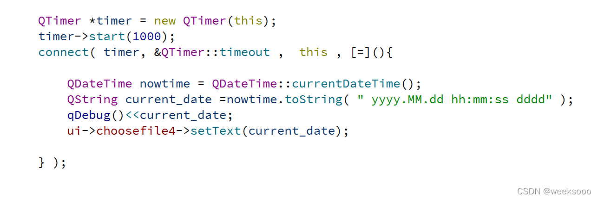

#  


# day01

+  1，快捷键
  //注释  ctrl + /
  //运行  ctrl + r
  ==//保存  ctrl + s==
  ==//编译  ctrl + b==
  //查找  ctrl + f
  //字体缩放 ctrl+ 鼠标滚轮
  ==//帮助文档  f1==
  ==//自动对齐  ctrl + i==
  ==//同名之间的.h 和.cpp文件的切换 f4==
  
+ 2，文件名和创建路径==一定不能用中文==

+ **QT中main（）认识：**

+ 

## 知识点一: 按钮的使用与窗体的简单设置

  + 1. \#include <QPushButton>

    2. QPushButton  * btn3 = new  QPushButton("按键内容" , this);  

    3.  内存自动回收： 
    
    4. ```
           QT中的对象指针在满足下列情况会自动回收内存
           // 1. 从QObject派生的类 1.直接 2.间接
           // 2. 指定父类, 父亲析构的时候,先析构他的孩子
           // 创建自定义按钮对象
       ```
    
    3. 窗体相关属性设置：
       
       ```c++
       show()方法会以顶层方式重新弹出来一个窗口
       
       move（x,y） 改变位置
       
       """
       setText(”文本“) 设置文本   <=> QPushButton  * btn3 = new                                               QPushButton("按键内容" ,this); 
       setParent（this）设置父类
       """
       
       resize(600,1200);   //设置窗口大小，左上角是原点 
       
       setFixedSize(600,800); //设置指定窗口的大小,不能被移动
       
       setWindowIcon(QIcon("E:\\1.jpg图片路径")); //给窗口加图标
       
       setWindowTitle（”标题“） //设置窗口标题
       
       //当前主窗口的宽度与高度
       int a = this->width();   
       int b = this->height() ;
       

+ 资源文件：

  + 设置图片（==setWindowIcon(QIcon("E:\\1.jpg图片路径")); //给窗口加图标== ）
  + 

## 知识点二: 信号槽机制(重要)

  + 

  ==  普通信号普通槽,系统带的 ==
   / /例如QPushButton的父类QAbstractButton 有Signals里面有 clicked , pressed , released,toggled
  ​//信号和槽函数 都是函数,其中  **信号只需要声明**,不需要函数定义 ,  而**信号槽需要声明和定义**,属于回调函数  

```c++
// 需求 点击上面的btn按钮,执行窗口关闭动作   
    //建立两者的连接:  connect(btn, 发出的信号, this, 处理信号的槽函数);
    connect(&btn, &QPushButton::clicked, this, &MyWidget::close);
    /*      格式:  & + 信号发出者类的名字 + :: + 信号的名字
     * b1: 信号的发出者, 此参数必须是是一个指针
     * &QPushButton::clicked: 信号发出者, 内部的一个信号
     * this: 信号的接收者, 此参数是一个指针
     * &MyWidget::close: 信号的处理函数, 属于this
    */ emit
```

**自定义槽函数 ** 

定义对象->声明一个槽函数->定义一个槽函数：写明具体功能

回去： 先通过槽函数发信号 ，主窗口接受再发过来信号  （定义一个槽函数和信号（目的发起信号）再定义一个槽函数去接受发过来的信号）

```
// 自定义槽函数
    /*
     * 1. 槽函数在Qt5 可以是任意类成员函数, 全局函数, 静态函数, lambda表达式(隐式函数)
     * 2. 槽函数需要与信号对相应(返回值, 参数)
     * 3. 信号,槽函数返回值: void
     * 4. void mysig(int, double, QString);
     *    void myslot(int, double);
     * 5. 槽函数的参数是为了接受信号传过来的的数据
     * 6. 槽函数的参数应该是不能够大于信号的参数个数, 可以少于信号的参数个数
     * 7. 槽函数可以重载，注意槽函数重载了，必须使用函数指针QT的格式: void (Subwigdet::*MySigSub)() = 
                                                                           &Subwigdet::sigSub;
     * 8. emit发信号
```

**代码**：

```c++
mainwidget.h文件
    
#ifndef WIDGET_H
#define WIDGET_H

#include <QWidget>
#include<QPushButton>
#include<subwigdet.h> //a自己添加的类在那用就要include

class Widget : public QWidget
{
    Q_OBJECT

public:
    Widget(QWidget *parent = 0);
    ~Widget();

private:
    QPushButton* btn;
    QPushButton b1;
    //a1
    QPushButton* b3;

 //1自定义槽函数
    void slotForwidget();

    void slotHideme(); // a4

    //创建一个子窗口对象（a）
    Subwigdet subw;       //b2
    //  b 槽函数
    void slotshowme();   //b3
    void slotsubmsg(int num, QString str); //c

};

#endif // WIDGET_H


```

```c++
mainwidget.cpp文件

#include "widget.h"
#include<QPushButton>
#include<QDebug>  //输出

Widget::Widget(QWidget *parent)
    : QWidget(parent)
{
    btn = new QPushButton("按钮",this);
    btn->move(300,200);

    this->setWindowTitle("fcc");
    this->setWindowIcon(QIcon("c:\\Users\\16658\\Desktop\\q"));
    connect(btn,&QPushButton::clicked,this,&Widget::close);

    //1定义槽函数：
    b1.setText("老二");
    b1.setParent(this);
    connect(&b1,&QPushButton::released,this,&Widget::slotForwidget); // 简单的使用自定义槽函数


    //a2
    b3 = new QPushButton("软件园",this);
    b3->move(200,200);
    b3->resize(100,50);
    connect(b3,&QPushButton::clicked,this,&Widget::slotHideme);  //a3开始定义槽函数
    //a进去子窗口之后在回到主窗口b1
    //b2开始设置信号和信号接收对象
    void (Subwigdet::*MySigSub)() = &Subwigdet::sigSub;  //函数指针
        connect(&subw,MySigSub,this,&Widget::slotshowme);   //slotshowme槽函数

    void (Subwigdet::*MysigPlus)(int,QString) = &Subwigdet::sigSub; //函数指针
    connect(&subw,MysigPlus,this,&Widget::slotsubmsg);  //槽函数重载c //函数指针,如果你的信号或者超发生重载就要使用函数指针

}
Widget::~Widget(){}
//1
void Widget::slotForwidget()
{
    b1.setText("修改了");
}

//a5 写槽函数的目的  写明具体功能
void Widget::slotHideme()
{
    //隐藏自己（主窗口）
    hide();
    //显示软件园窗口 a6去编写子窗口按钮
    subw.show();
}

//b
void Widget::slotshowme()  //slotshowme
{
    //显示自己
    show();
    //软件园窗口
    subw.hide();
}

void Widget::slotsubmsg(int num, QString str)
{
    qDebug() << num << str;
}

```


```c++
subwidget.h

#ifndef SUBWIGDET_H
#define SUBWIGDET_H

#include <QWidget>
#include<QPushButton>

//Subwiget是一个窗口类但是一个子窗口
class Subwigdet : public QWidget
{
    Q_OBJECT
public:
    explicit Subwigdet(QWidget *parent = nullptr);

signals:
    //在signals下面定义信号
    void sigSub();        //b2
    //1,可以有参数
    //2,可以重载
    //3,返回zhi为void
    //4,发送信号： emit + 信号名
                //emit sigsub()；
    void sigSub(int,QString); //c


public slots:
    void myslot();        //b3

private:
    QPushButton* b1; //a7（1）

};

#endif // SUBWIGDET_H

```


```c++
subwidget.cpp

#include "subwigdet.h"

Subwigdet::Subwigdet(QWidget *parent) : QWidget(parent)
{
    //b7 子窗口的编写
    b1 = new QPushButton("中层",this);
    b1->resize(100,100);
    b1->setWindowTitle("软件园窗口");
    resize(400,600);

    //a进去子窗口之后在回到主窗口b
    connect(b1,&QPushButton::clicked,this,&Subwigdet::myslot);  //myslot() 子窗口的槽函数

}

//b  子窗口的槽函数
void Subwigdet::myslot()
{
    //发出信号
    emit sigSub();
    emit sigSub(250, "二百五"); //c
}

```


## 知识点三: QT的输出qDebug()<<


```c++
#include <QDebug>

qDebug()<<"hello , 您好";

int num = 18;
QString str = "小魔女琪琪";
qDebug() <<num << str;
qDebug() <<num << str.toUtf8().data();  //如果出现中文乱码的情况,可以这样
```

## 知识点四: QT中的lambda表达式


+ **lambda作为槽函数就不需要额外的定义了 **（槽函数简单的时候用来直接代替槽函数）`,当然这种方式需要在 .pro文件中 引入c+11的特性,因为lambda是c++11的一个特性,引入命令`

+ 1.**CONFIG += c++11**

+ 2.

  connect(对象, &+ 信号发出者类的名字 + :: + 信号的名字,对象，【=】()
  
  {    
  
  ​          **.............**
  
  });
  
  
  
  ==如：==
  
  
  
  +++

# day02

## 知识点五: 带UI界面的项目

==**通过ui->控件名**==         访问到控件

+++++

### 各种控件作用：


<!-->组框一般与radio button 连用


+ 


++++


<!---->==**使用setCurrentIndex（索引）**==   **跳转到相应页面**   “可瑞婷大克斯”

+++++++

<!---->==**使用在控件中添加一行内容 ：      additem（“一行内容”）**==：    可以是文本可以是 

+ ==**<!-==

```c++
Table Widget设置：
setRowCount（10） 设置行数   “肉”
setColumnCount（6）设置列数  “抗蒙”

QStringList list；
list <<  "" << "" << "" << "" ;  一次性加多个

setHorizontalHeaderLables(list)     以水平的方式设置上述内容
----------------------
addItem（list）                      以一行一行的设置内容
```

-->==


**浮动窗口：**


浮动窗口要使用show()方法   会以顶层方式重新弹出来一个窗口

++++

### QMainWindow初试

#### 1.**菜单栏**：

==single一般用==      **&QAction::triggered**


​                                                                                                                                                          **通过这个名字访问控件**

#### 2.**工具栏：**


+++

#### 3.状态栏：

```c++
状态栏只能通过代码控制进行插入,可以插入widget派生的任何东西.

状态栏的名字默认叫statusBar  通过ui->statusBar访问
addWidget( 控件 )          将控件添加到状态栏 
```


**效果：**


++++


### 知识点六：文件对话窗：

```c++
方法：
#include<QFileDialog>  //文件对话窗
#include<QMessageBox>   //提示对话框

connect(ui->selectFile,&QPushButton::clicked,this,[=]()
{
     QString filename = QFileDialog::getOpenFileName(this,"窗口名（“标题”）","窗口路径  （"C:\\"）"，"过滤条件") ; //会弹出相应窗口，并且返回打开文件的一个路径；
   
  //没有选择文件进行警告：
 if (filename.isEmpty()==true)
 {
      QMessageBox::warning(this,"warning","select file faild!");
      return;
  }
//ui->filePath->setText(filename); //把文件路径显示到到filePath文本窗口中
//创建文件对象,并打开文件（filename）：
//QFile file(filename);
    
}
```

==要点：==

**#include<QFileDialog>  //文件对话窗**

 **QString filename = QFileDialog::getOpenFileName(this,"窗口名（“标题”）","窗口路径（"C:\\"）")**

==效果：==


+++


### 知识点七 ：对话框

```
类型一: 模态对话框 ,特点弹出对话框不能操作其他窗口.
```


```
类型二: 非模态对话框 ,特点弹出对话框依然能操作其他窗口.
```

解释一：


解释二：


==要点：==

**#include<QDialog> **

第一种：

​        **QDialog dig(this);  **       

​         **dig.exec();**

第二种： 

​      **dig.exec();QDialog *  dig = new QDialog(this)  **

​     **dig->setAttribute(Qt::WA_DeleteOnClose); **    ==Qt::WA_DeleteOnClose==主动关闭时候去析构      setAttribute（） 设     置属性

​     **dig->show();  **

==效果：==


+++


### 知识点八 : 提示对话框

```
方法：
#include <QMessageBox>
```

**简单的提示窗口**

==about默认的提示==


**提示对话框里面的按钮操作定义**

==critical:错误提示== ”亏提口“


==question:问题==

```c++
QMessageBox::question(this,"erro","系统文件错误",QMessageBox::Ok      |QMessageBox::Cancel,QMessageBox::Cancel);   //返回值是设置的按钮（QMessageBox::Cancel）
```

+++


### 知识点九: 字体和颜色对话框

```
方法：
#include <QColorDialog> //颜色对话框   ”卡勒儿“
#include <QFontDialog>  //字体对话框   ”放特“
```


++++

### 知识点十:  给标签控件加图片\动态图片

```c++
#include <QMovie>    //加动态图片
```


+++


# day03

## 知识点十一: 自定义控件


++++


                                                                                                                                                                                                                                                                                                                                                                                                                                                                                                                                                                                                                                                                      

+++

QSpinBox ”死频波克斯 “和 horizontalSlider:   "死来爹儿"：


代码：

```c++
子窗口.h
    
#ifndef SMALLWIDGET_H
#define SMALLWIDGET_H

#include <QWidget>

namespace Ui {
class SmallWidget;
}

class SmallWidget : public QWidget
{
    Q_OBJECT

public:
    explicit SmallWidget(QWidget *parent = 0);
    ~SmallWidget();

    // 获取值
    int getValue();
    // 设置值
    void SetValue(int value);

private:
    Ui::SmallWidget *ui;
};

#endif // SMALLWIDGET_H

```

```c++
子窗口.cpp

#include "smallwidget.h"
#include "ui_smallwidget.h"

SmallWidget::SmallWidget(QWidget *parent) 
    QWidget(parent
    ui(new Ui::SmallWidget)
{
    ui->setupUi(this);

    void (QSpinBox::*sigValueChange)(int) = &QSpinBox::valueChanged;
    connect(ui->spinBox, sigValueChange, ui->horizontalSlider, &QSlider::setValue);

    connect(ui->horizontalSlider, &QSlider::valueChanged, ui->spinBox, &QSpinBox::setValue);
}

SmallWidget::~SmallWidget()
{
    delete ui;
}

void SmallWidget::SetValue(int value)
{
    if(value > 0 && value < 100)
    {
        ui->spinBox->setValue(value);
    }
}

int SmallWidget::getValue() //获取值
{
    return ui->spinBox->value();
}

```


**上述代码用指针函数的原因：该信号就是重载的**

## 知识点十二: QString

**qt字符串的拼接**：


## 知识点十三: 事件

### 1.鼠标事件


#include <QMouseEvent>

子窗口==.h文件：==

```c++
#ifndef MYLABEL_H
#define MYLABEL_H

#include <QLabel>        //自己修改的

class MyLabel : public QLabel   //自己修改的
{
    Q_OBJECT
public:
    explicit MyLabel(QWidget *parent = 0);

signals:

public slots:

protected:
    // 鼠标进入
    void enterEvent(QEvent *);
    // 鼠标离开
    void leaveEvent(QEvent *);
    // 鼠标按下
    void mousePressEvent(QMouseEvent *ev);
    // 鼠标释放
    void mouseReleaseEvent(QMouseEvent *ev);
//    // 鼠标移动
    void mouseMoveEvent(QMouseEvent *ev);
    
};

#endif // MYLABEL_H

```

子窗口==.cpp文件：==

```c++
#include "mylabel.h"
#include <QMouseEvent>

// QWidget 默认是不追踪鼠标事件的
MyLabel::MyLabel(QWidget *parent) : QLabel(parent)
{
    // 设置窗口追踪鼠标键
    this->setMouseTracking(true);
}

// 进入还是离开边界的一瞬间来完成的
// 鼠标进入
void MyLabel::enterEvent(QEvent *)
{
    setText("你不要在我身上乱摸!!!!");
}

// 鼠标离开
void MyLabel::leaveEvent(QEvent *)
{
    setText("终于离开了...");
}

void MyLabel::mousePressEvent(QMouseEvent *ev)
{
    // 字符串拼接 QString().arg()
    // %1, %2, %3 -- 占位符
    QString btn;
    if(ev->button() == Qt::LeftButton)
    {
        btn = "LeftButton";
    }
    else if(ev->button() == Qt::RightButton)
    {
        btn = "RightButton";
    }
    else if(ev->button() == Qt::MidButton)
    {
        btn = "MidButton";
    }
    QString str = QString("MousePree[%3]:(%1, %2)").arg(ev->x()).arg(ev->y()).arg(btn);

    setText(str);
}

void MyLabel::mouseReleaseEvent(QMouseEvent *ev)
{
    QString btn;
    if(ev->button() == Qt::LeftButton)              // button()表示瞬间的状态

    {
        btn = "LeftButton";
    }
    else if(ev->button() == Qt::RightButton)
    {
        btn = "RightButton";
    }
    else if(ev->button() == Qt::MidButton)
    {
        btn = "MidButton";
    }
    QString str = QString("MouseRelease[%3]:(%1, %2)").arg(ev->x()).arg(ev->y()).arg(btn);

    setText(str);
}

void MyLabel::mouseMoveEvent(QMouseEvent *ev)
{
    QString btn;
    if(ev->buttons() & Qt::LeftButton )
    {
        btn = "LeftButton";
    }
    else if(ev->buttons() & Qt::RightButton)
    {
        btn = "RightButton";
    }
    else if(ev->buttons() & Qt::MidButton)
    {
        btn = "MidButton";
    }
    QString str = QString("MouseMove[%3]:(%1, %2)").arg(ev->x()).arg(ev->y()).arg(btn);

    setText(str);
}


```

==要点：==

+ 1.鼠标函数用 protected方式定义

+ 2.button（）==  表示瞬间的状态

   + 3.buttons（）&  表示一种连续的方法
   + 把创建的class c++ 文件（不是qt设计文件） 的.h文件 更改类为自己想定义的类  看上面代码


###  2.定时器

+ 1.**定时器—>第一种写法**:
+ 


```c++
.h文件：
// 定时器
void timerEvent(QTimerEvent *);


.cpp文件：
#include <QTimerEvent>

MyLabel::MyLabel(QWidget *parent) : QLabel(parent)
{
    // 启动定时器
    // 参数 1: 触发定时器的时间, 单位: ms
    // 参数2: 使用默认值
    // 返回值: 定时器ID
    id = startTimer(2000);
}
    
    
// 每触发一次定时器, 进入该函数中
void MyLabel::timerEvent(QTimerEvent *e)
{
    QString str;
    if(e->timerId() == id)
    {
        static int num = -100;
        str = QString("%1: %2").arg("Time out: ").arg(num++);
        if(num >= 100)
            killTimer(id); // 关闭定时器        
    }
 }   
```

++++


+ **定时器—>第二种写法**:


```c++
第二种定时器用法：
    
#include <QTimer> //导入QTimer类
     
 QTimer * timer = new QTimer(this);
 timer->start(100);                                    //说明定时器每隔100ms触发一次
 connect(timer, &QTimer::timeout, this, [=]()          //&QTimer::timeout每到100ms就触发一次信号
 {
     static int number = 0;                            // 只初始化一次
     this->setText(QString::number(number++));
  });

```

++++


## 知识点十四: 绘图—>QPainter

”屏特儿”


```c++
#ifndef WIDGET_H
#define WIDGET_H

#include <QWidget>

namespace Ui {
class Widget;
}

class Widget : public QWidget
{
    Q_OBJECT

public:
    explicit Widget(QWidget *parent = 0);
    ~Widget();

protected:
    /*
     *  1. 回调函数
     *  2. 此函数不需要用户与调用, 再刷新的时候会自定调用
     *      1. 窗口显示的时候
     *      2. 最大化, 最小化
     *      3. 窗口被这遮挡, 重新显示的时候
     *      4. 用户强制刷新的时候
     *      5. ...........
     *  3. 如果想使用画家类在窗口中画图, 操作必须在paintEvent函数中完成
    */
    void paintEvent(QPaintEvent *);  // 核心

private:
    Ui::Widget *ui;
 // int x;
};

#endif // WIDGET_H

```

**重点：在当前窗口实现绘画的话     就是在protected下定义  “画家函数” void paintEvent(QPaintEvent *);**

​                                                             **并且只能在画家函数下使用画家类**

+++


**重点：//#include <QFont>**

+++


==效果：==


+++


```c++
#include "widget.h"
#include "ui_widget.h"

#include <QPainter>
#include <QFont>

Widget::Widget(QWidget *parent) :
    QWidget(parent),
    ui(new Ui::Widget)
{
    x = 20;
    ui->setupUi(this);

 /* connect(ui->move, &QPushButton::clicked, this, [=]()
    {
       // 手动刷新窗口
       update();   // 系统调用paintEvent 函数
    });
 */
}

Widget::~Widget()
{
    delete ui;
}


void Widget::paintEvent(QPaintEvent *)    //定义画家类
{
    // 创建画家类对象
    QPainter p(this);   // 指定绘图设备（重要）

    // 创建新画笔 -- 轮廓
    QPen pen;
    pen.setColor(/*Qt::green*/QColor(0, 255, 0));
    pen.setWidth(10);   // 像素
    pen.setStyle(Qt::DotLine);
 
    // 闭合区域使用画刷  brush 刷
    QBrush brush(QPixmap(":/Image/face.png"));
    p.setBrush(brush);

    // 将新画笔设置给画家类
    p.setPen(pen);
    
    // 画背景图   drawPixmap
    p.drawPixmap(0, 0, QPixmap(":/Image/xks.png"));  //（0，0）表示开画的初始位置

    // 画直线
    p.drawLine(QPoint(100, 100), QPoint(300, 500));

    // 画椭圆
    p.drawEllipse(QPoint(200, 200), 100, 50);

    // 画矩形
    p.drawRect(400, 200, 200, 200);

    // 写字
    //QFont 设置字体：
    QFont font("华文彩云", 48, 75, true);
    p.setFont(font);
    p.drawText(100, 400, "我是中国人, 我爱我的祖国!!!");

    
  /*  提供海贼船：
    int width = this->width();
    int heght = this->height();
    x += 5;
    if(x > this->width()) //x如果大于窗口宽度就重新赋值
    {
        x = 20;
    }
    p.drawPixmap(x, 100, QPixmap(":/Image/sunny.png"));
   */
}

```


## 知识点十五: 强制刷新窗口


==要的：==

​        **手动刷新的是刷新 画家函数里的东西**

++++


## 知识点十六: 绘图设备（给画家的纸）


```
// QWidget
// QPixmap QImage QPicture QBitmap(黑白图片)
// QBitmap 父类 QPixmap
// QPixmap -- 图片类, 主要用来显示, 它针对于显示器显示做了特殊优化, 依赖于平台的, 只能在主线程中使用(UI线程)
// QIamge -- 图片(image)类 , 不依赖有平台（格式不会变）, (图片传输 , 可以在多线程中对其进行操作)

// 有绘图设备就不用非要画家函数了
```
+ 在QPixmap中画图:

```c++
// 在QPixmap中画图
    QPixmap pix(300, 300);  // 纸的大小（默认是黑色）

    pix.fill(Qt::red); // 设置一下纸的颜色

    QPainter p(&pix);    //创建一个画家

    p.setPen(QPen(t::green, 10));  //设置画家的画笔
    p.drawRect(10, 10, 280, 280);    //画个矩形
    p.drawEllipse(150, 150, 50, 50);  //画个圆

    pix.save("C:\\mypixmap.png");   //保存图片
```

+ > 指定绘图设备 1. 构造函数中(参数是绘图设备)如：如上：
  >
  > ​                          2.或者： begin(参数是绘图设备)和 end();   对应使用

  + 在QImage中画图：

```c++
// 在QImage中画图
    QImage img(300, 300, QImage::Format_RGB32);  // 纸的大小,指定格式

    img.fill(Qt::white)  //设置一下纸的颜色
        
    p.begin(&img);  // begin(参数是绘图设备) 和 end();   对应使用

    p.setPen(QPen(Qt::green, 10));  //设置画家的画笔
    p.drawRect(10, 10, 280, 280);    //画个矩形
    p.drawEllipse(150, 150, 50, 50);  //画个圆

    p.end();         // 2. begin(参数是绘图设备)和 end();   对应使用
    img.save("C:\\myImage.png")
```


+ 在QPicture中画图（只是一个绘图设备）:
   **作用：// 1. 保存的是  绘图步骤 -- 画家类**
               **// 2. 不是图片, 二进制文件(save保存生成的文件)（这个可以用任意后缀）**
              **// 3. 不依赖平台**
   

  ```c++
  在QPicture中画图:
       QPicture pic;  // 纸的大小（有默认值）（假纸）
       p.begin(&pic);
       p.setPen(QPen(Qt::green, 10));
       p.drawRect(10, 10, 280, 280);
       p.drawEllipse(150, 150, 50, 50);
       p.end();
       pic.save("C:\\mypic.aaa");
       //作用不依赖与平台
  ```

  > QPicture绘画完虽然以.jpg保存,但并不是 一个图片,而是绘图步骤,所以我们可以通过重写画家类把这个绘图步骤绘画出来.
  >
  > 可以使用任何的扩展名 , 如果我们要画一个机密图 ,就可以采用这种方式,别人即使得到我们的文件,也不一定知道我们是用QT中的Qpicture绘画出来的.

  ==**在窗口中画出来**==（相当于画背景图）

  ==**集合：**==

```
#include "widget.h"
#include "ui_widget.h"
#include <QPainter>
#include <QPicture>

Widget::Widget(QWidget *parent) :
    QWidget(parent),
    ui(new Ui::Widget)
{
    ui->setupUi(this);

    // 使用QPixmap画图
    QPixmap pixmap(300, 300);
    pixmap.fill();
    QPainter p;
    p.begin(&pixmap);
    p.setPen(QPen(Qt::red, 5));
    p.drawRect(10, 10, 280, 280);
    p.drawEllipse(QPoint(150, 150), 50, 50);
    p.end();
    pixmap.save("d:\\mypixmap.png");

    // 使用QImage 画图
    QImage image(300, 300, QImage::Format_RGB32);
    image.fill(Qt::yellow);
    p.begin(&image);
    p.setPen(QPen(Qt::blue, 5));
    p.drawRect(10, 10, 280, 280);
    p.drawEllipse(QPoint(150, 150), 50, 50);
    p.end();
    image.save("d:\\myimage.png");

    // 使用QPicture 画图
    QPicture pic;
    p.begin(&pic);
    p.setPen(QPen(Qt::blue, 5));
    p.drawRect(10, 10, 280, 280);
    p.drawEllipse(QPoint(150, 150), 50, 50);
    p.end();
    pic.save("d:\\mypic.pic");
}

Widget::~Widget()
{
    delete ui;
}

//在窗口中画出来
void Widget::paintEvent(QPaintEvent *)
{
    QPainter p(this);
    QPicture pic;
    pic.load("D:\\mypic.pic");
    p.drawPicture(10, 10, pic);
}

```


+++


## 知识点十七: 不规则窗口—>透明窗口


==**核心：**==

```c++
    // 去掉边框      Flags标志
    this->setWindowFlags(Qt::FramelessWindowHint);   
    // (框)设置背景透明：
    this->setAttribute(Qt::WA_TranslucentBackground);   //120 Attribute “啊崔bui特” 属性   //对话                                                          框的属性设置一样
```

**代码：**

.h文件：

```c++
#ifndef WIDGET_H
#define WIDGET_H

#include <QWidget>

namespace Ui {
class Widget;
}

class Widget : public QWidget
{
    Q_OBJECT

public:
    explicit Widget(QWidget *parent = 0);
    ~Widget();

protected:
    void paintEvent(QPaintEvent *);  //绘图事件
    
//下面代码不是蝴蝶动的代码：
    void mousePressEvent(QMouseEvent *); //重写鼠标事件  按压
    void mouseMoveEvent(QMouseEvent *);  //重写鼠标事件  移动

private:
    Ui::Widget *ui;
    
    QPoint pt;  // 差值
    bool fly;
    int x;
    int y;
};

#endif // WIDGET_H

```

.cpp文件：

```c++
#include "widget.h"
#include "ui_widget.h"
#include <QPainter>
#include <QMouseEvent>
#include<QTimer>

Widget::Widget(QWidget *parent) :
    QWidget(parent),
    ui(new Ui::Widget)
{
    ui->setupUi(this);
    // 加载图片 // 两张图
    QPixmap up;
    QPixmap down;     
    up.load(":/image/up");
    down.load(":/image/down");
    
    // 去掉边框：
    this->setWindowFlags(Qt::FramelessWindowHint);
    // (框)设置背景透明：
    this->setAttribute(Qt::WA_TranslucentBackground);  //120  //对话框的属性设置一样

    fly = true;
    // 定时器 设置时间间隔
    // QTimer
    // connect(timer, timeout, [=](){ 刷新窗口 });
    //定时器每个1s执行：
    QTimer* timer = new QTimer(this);
    timer->start(100);
    connect(timer,&QTimer::timeout,this,[=](){
        fly = !fly;
        qsrand(time(NULL));
        x = qrand()%20 + x;  //20以内
        y = qrand()%20 + y;

        //做一个边界判断
        if (x > this->width())
            x = 0;
        if (y > this->height())
            y = 0;
        if (x < 0)
            x = this->width();
        if (y < 0)
            y = this->height();

        update();  //更新窗口
    });

    //主窗口最大化
    this->showMaximized();
    
    qsrand(time(NULL)); //时间种子
    x = qrand()% this->width();
    y = qrand()% this->height();

//  QDesktopWidget* wg = QApplication::desktop(); //staric function//获取屏幕（显示器）的对象

}

Widget::~Widget(){delete ui;}

void Widget::paintEvent(QPaintEvent *)
{
    //在指定绘图设备
    QPainter p(this);
    // 在窗口中将图片画出来
    if (f)
        p.drawPixmap(x, y, up);
    else
        p.drawPixmap(x, y, down);

}

//下面代码不是蝴蝶动的代码：
/*
//右击鼠标关闭窗口,左键鼠标拖动:

//重写鼠标事件  按的操作
void Widget::mousePressEvent(QMouseEvent *e)
{
    if(e->button() == Qt::LeftButton)   //button是判断一瞬间的状态
    {
        // 求差值（ 鼠标左键按下的点 - 图像窗口坐上角的点坐标） 才是真鼠标移动的
        pt = e->globalPos() - this->frameGeometry().topLeft();  //this->frameGeometry().topLeft();
                                                                //返回的是窗口的位置信息
    }
    else if(e->button() == Qt::RightButton)  //按下鼠标右键就关闭
    {
        // close windows
        this->close();
    }
}

//重写鼠标事件  移动的操作
void Widget::mouseMoveEvent(QMouseEvent *e)
{
    // mvoe x , y 使用的是屏幕坐标系
    //而 e->x() , e->y() 是窗口的坐标系 Widget（看鼠标事件那章）

    this->move(e->globalPos() - pt);
}
*/
```

==效果：可以随机移动；并且可以扇翅膀（因为有两张翅膀）。==


+++


## 知识点十八: Qt中的随机数

```c++
生成随机数：
    
qsrand(time(NULL));
Int n1= qrand();
```


# day04

## 知识点十九: 重写事件event/eventFilter–>过滤事件


事件分发器的规则是 :
`如果返回值true--代表事件被处理过了,不再向下分发,停止了.`
`false --事件没有被处理,会继续分发.`
event过滤事件是在event中进行拦截处理

**定时器的第一种写法:重写timerEvent**

需要在对应的.h文件中申明 `void timerEvent(QTimerEvent *envent);`

```c++
//需要在对应的.h文件中声明bool event(QEvent  *event1);

bool mylabel::event(QEvent  *event1)
{
    /*返回值
     * true --代表事件被处理过了,不再向下分发,停止了.
     * false --事件没有被处理,会继续分发.
    */
        if(event1->type() == QEvent::Timer ) //过滤定时器事件 
        {
            return  true;     //返回一个true就不会执行该操作

        }

        return  QLabel::event( event1) ;  // 让父类执行默认的处理

}

```

## 知识点二十: 事件过滤器eventFilter


.
步骤一: 给窗口安装事件过滤器,例如前面是给实例化的对象dsq
`dsp -> insatllEventFilter(this) ;`
.
步骤二: 需要在事件过滤器中处理


==   注意return的是主窗口的类 ==

## 知识点二十一: 

### QT文件读取

> 需求:点击选择文件按钮,就打开本地选择文件 ,右边的line Edit里面显示文件的路径,下面Text Edit显示文本内容

==效果：==


```c++
#include "widget.h"
#include "ui_widget.h"

#include<QFile>          //读取文件
#include<QFileDialog>    //文件对话框
#include<QMessageBox>    //提示对话框

Widget::Widget(QWidget *parent) :
    QWidget(parent),
    ui(new Ui::Widget)
{
    ui->setupUi(this);
    connect(ui->selectFile,&QPushButton::clicked,this,[=]()
    {
       /*//打开文件对话框:
       
       QString filename = QFileDialog::getOpenFileName(this,"open file","C:\\") ;  
       //没有选择文件进行警告：
       if (filename.isEmpty()==true)
       {
           QMessageBox::warning(this,"warning","select file faild!");
           return;
       }
       
       */
       ui->filePath->setText(filename); //把文件显示到到filePath文本窗口中

       //创建文件对象,并打开文件（filename）开始读取对象：
       QFile file(filename);
        
     //采用file对象读取 中文乱码转换：
      /* QT中读文件;默认读取的文件格式不是是utf-8,需要转换
//       #include <QTextCodec>
//       QTextCodec * textcode = QTextCodec::codecForName( "gbk") ;
//       setText(textcode->toUnicode(array));
*/

       //指定打开方式：
       bool a = file.open(QFile::ReadOnly);  // Readonly是只读 ， 返回值是bool
       //打开失败的情况：
       if (a == false){
           QMessageBox::critical (this  ,   "警告" , "文件打开失败");
           return ;
       }

       //读文件： //默认读取的文件格式是utf-8,也就是说如果你的txt文件是utf8格式的就正常显示 ,如果是gbk格式的就会乱码，用上述方法修改
       QByteArray array =  file.readAll() ;  //直接所有读取

    //一行一行读取：
    /*QByteArray array ;
     while (! file.atEnd())
     {    //如果不在最后一行,那么一直读:
          QByteArray array = array + file.readLine() ;
     }
    */

       //显示到textEdit文本框:
       ui->textEdit->setText(array);

       //关闭文件:
       file.close();
    });
}


Widget::~Widget()
{
    delete ui;
}
```


**//设置文件打开方式：file.open(QFile::ReadOnly)**

```
     * QIODevice::ReadWrite 可读写
     * QIODevice::Text 换行符生效
     * QIODevice::Append 追加写入
     * QFile::Truncate 表示将原文件清空
```

### QT文件写入


## 知识点二十二: QT中的文本流和数据流

### 文本流QTextStream的读写方式

> \#include <QTextStream>   //操作基础数据类型:  int , float , string

**文本流的读取方式**


**文本流的写入方式**：


+++

###   **数据流QDataStream的读写方式**

> #include <QDataStream>   //可以操作二进制类型: QImage  Qpoint  QRect ,不依赖于平台


不建议使用：


**对内存进行操作,读写内存**QByteArray（读写)

> 网络通信


## 知识点二十三: QFileInfo文件属性

```c++
#include <QFileInfo>
```


> 要的：间接放个文件   或者直接放一个路径

### QDateTime 获取系统时间

#include <QTimer>
#include <QDateTime>




## 知识点二十四: QT中的TCP通信

```
#include<QTcpServer>  // 监听套接字
#include<QtcpSocket>  // 通讯的套接字 “说剋特”
```


### 服务器端：

**.pro文件；**

```c++
QT       += core gui network
```

**.h文件：**

```c++
#ifndef SERVER_H
#define SERVER_H

#include <QWidget>

#include<QtcpSocket>       // 通讯的套接字    “说剋特”
#include<QtcpSocket>       // 监听套接字

namespace Ui {
class Server;
}

class Server : public QWidget
{
    Q_OBJECT

public:
    explicit Server(QWidget *parent = 0);
    ~Server();

private:
    Ui::Server *ui;
    QTcpServer* server;  //监听套接字
    QTcpSocket* conn; // 通讯的套接字
};

#endif // SERVER_H
```

**.cpp文件：**

```c++
#include "server.h"
#include "ui_server.h"

Server::Server(QWidget *parent) :
    QWidget(parent),
    ui(new Ui::Server)
{
    ui->setupUi(this);
        
    //ui实例化
    ui->sIp->setText("127.0.0.1");  //在sIp命名的文本窗口里设置127.0.0.1（本地）
    ui->sPort->setText("9999");
        
      
    //实例化 init
    server = new QTcpServer(this);
    //监听
    server->listen(QHostAddress(ui->sIp->text()),ui->sPort->text().toInt());  //port是字符串，用toint（）转化成整形值
    
      
    //链接(建立链接)【接受信号&QTcpServer::newConnection】
    connect(server,&QTcpServer::newConnection,this,[=](){
       //接受客服端的套接字对象 accpept
       //sock_addr 结构体 == 相当于qt中的 类QTcpSocket
       conn = server->nextPendingConnection();  //监听请求队列拿到一个请求给“通讯”,初始化了conn .  nextPendingConnection()接受客服端的套接字对象【及保存客户端的IP，port】
       ui->msg_record->append("有新的连接.....");
        
       //保证conn 是一个有效的对像
       //接受数据 【&QTcpSocket::readyRead】 （保证在连接成功的情况下接受数据）
       connect(conn,&QTcpSocket::readyRead,this,[=]()
       {
           QByteArray array = conn->readAll();  //conn->readAll();读取数据    QByteArray array接受返回值
           ui->msg_record->append("对方说的：" +array);   //接受到的数据也放到聊天记录文本框
       });
    });
   
        
    //发送数据【write】
    connect( ui->send,&QPushButton::clicked,this,[=]()
    {
        conn->write(ui->msg->toPlainText().toUtf8().data());  //访问发送的文本框内容，并发送数据   //toPlainText()返回值是QString 而write（）接受值是char*或QBytearrayy
//把QString转化成QBytearrayy 用.toUtf8().data()转化
        ui->msg_record->append("My Say: " + ui->msg->toPlainText() );  //在msg_record命名聊天记录文本框中显示聊天记录
        //clear
        ui->msg->clear();  //发送完成后清空 msg_record命名聊天记录文本框
    });
}

Server::~Server(){delete ui;}
```


==**要的：**==

+ **server->listen(QHostAddress(ui->sIp->text()),ui->sPort->text().toInt()   **
  + 建立连接**接受信号【&QTcpServer::newConnection】   用toInt（）转化成整形值**

+ **nextPendingConnection()接受客服端的套接字对象【及保存客户端的IP，port】**

+ **接受数据 【&QTcpSocket::readyRead】**

+ **conn->readAll();  接受读取数据**   

+ **发送数据【write（）】       .toPlainText().toUtf8().data()转换： 把QString转化成QBytearrayy**

+++

### 客户端：

客户端 .h 文件：

```c++
#ifndef CLIENT_H
#define CLIENT_H

#include <QWidget>
#include<QTcpSocket>
namespace Ui {
class Client;
}

class Client : public QWidget
{
    Q_OBJECT

public:
    explicit Client(QWidget *parent = 0);
    ~Client();

private:
    Ui::Client *ui;
    
    QTcpSocket* client;    // 通讯的套接字
};

#endif // CLIENT_H
```


客户端.cpp文件：

```c++
#include "client.h"
#include "ui_client.h"
#include<QHostAddress>

Client::Client(QWidget *parent) :
    QWidget(parent),
    ui(new Ui::Client)
{
    ui->setupUi(this);
    //ui实例化
    ui->sIp->setText("127.0.0.1");
    ui->sPort->setText("9999");
    
    //init
    client = new QTcpSocket(this);
        
    //链接(建立链接）  连接服务器（它不管什么时候连接成功的 ）
    client->connectToHost(QHostAddress(ui->sIp->text()),ui->sPort->text().toInt());
        
    //接收数据:  [如果链接成功去]
    connect(client,&QTcpSocket::readyRead,this,[=](){
       //接受数据
        QByteArray array = client->readAll();  //client->readAll();读取数据    QByteArray array接受返回值
        ui->msg_record->append("对方说的：" + array);   //接受到的数据也放到聊天记录文本框
    });
        
        
    //发送数据
    connect( ui->send,&QPushButton::clicked,this,[=]()
    {
        client->write(ui->msg->toPlainText().toUtf8().data());  //访问发送的文本框内容，并发送数据   toPlainText()返回值是QString 而write（）接受值是char*或QBytearrayy
                                                              //把QString转化成QBytearrayy 用.toUtf8().data()转化
        ui->msg_record->append("Me Say: " + ui->msg->toPlainText() );  //在聊天记录文本框中显示聊天记录
        //clear
        ui->msg->clear();  //发送完成后清空
    });
}

Client::~Client()
{
    delete ui;
}
```

+++

main.cpp文件：

```c++
#include "server.h"
#include <QApplication>
#include<client.h>           //添加客户端头文件

int main(int argc, char *argv[])
{
    QApplication a(argc, argv);
    
    
    Server w;
    w.show();
    w.setWindowTitle("server");
    w.setFixedSize(714,650);

    Client c;
    c.show();
    c.setWindowTitle("client");
    c.setFixedSize(496,430);


    return a.exec();
}
```


## 知识点二十五: QT中的UDP通信


**.pro文件；**   

```
+= core gui network
```

*.h文件：

```c++
#ifndef WIDGET_H
#define WIDGET_H

#include <QWidget>
#include<QUdpSocket>

namespace Ui {
class Widget;
}

class Widget : public QWidget
{
    Q_OBJECT

public:
    explicit Widget(QWidget *parent = 0);
    ~Widget();

private:
    Ui::Widget *ui;
    
    QUdpSocket* udp1;        // 通讯的套接字

};

#endif // WIDGET_H
```


**.cpp文件：**

```c++
#include "widget.h"
#include "ui_widget.h"
#include<QHostAddress>

Widget::Widget(QWidget *parent) :
    QWidget(parent),
    ui(new Ui::Widget)
{
    ui->setupUi(this);
        
    ui->cIp->setText("127.0.0.1");
    ui->cPort->setText("9999");
        
    ui->sPort->setText("8888");  //服务器端口
    //init
    udp1 = new QUdpSocket(this);
    //if want recive must bind port绑定自己的端口
    udp1->bind(ui->sPort->text().toInt());
        
        
    //send msg发送数据       （不能保证在连接成功的情况下接受数据）
    connect(ui->send,&QPushButton::clicked,this,[=]()
    {
        udp1->writeDatagram(ui->msg->toPlainText().toUtf8().data(), QHostAddress(ui->cIp->text()),ui->cPort->text().toInt() ); //QHostAddress(ui->cIp->text(),ui->cPort->text().toInt(
                                                                                                                             //对方的
        ui->msg_record->append("My say: " + ui->msg->toPlainText());
        ui->msg->clear();     //清理msg
    });
        
        
    //read msg接受数据：
    connect(udp1,&QUdpSocket::readyRead,this,[=]
    {
        qint64 size = udp1->pendingDatagramSize();   //pending待定   Datagram数据报
        QByteArray array(size,0);
        udp1->readDatagram(array.data(),size);
        
        ui->msg_record->append("对方： " + array);

    });
}

Widget::~Widget()
{
    delete ui;
}
```

客户端 .h 文件：没有添加的

**客户端.cpp文件：**

```c++
#include "client.h"
#include "ui_client.h"

Client::Client(QWidget *parent) :
    QWidget(parent),
    ui(new Ui::Client)
{
    ui->setupUi(this);

    ui->setupUi(this);
    ui->sIp->setText("127.0.0.1");
    ui->sPort->setText("8888");
        
    ui->cPort->setText("9999"); //自己的端口

    udp2 = new QUdpSocket(this);
    //if want recive must bind port
    udp2->bind(ui->cPort->text().toInt());
        
        
    //send msg指定要发送的客户端IP和端口
    connect(ui->send,&QPushButton::clicked,this,[=]
    {
        udp2->writeDatagram(ui->msg->toPlainText().toUtf8().data(),QHostAddress(ui->sIp->text()),ui->sPort->text().toInt());
        ui->msg_record->append("My say: " + ui->msg->toPlainText());
        ui->msg->clear();
    });
        
        
    //read msg、接受数据
    connect(udp2,&QUdpSocket::readyRead,this,[=]{

        qint64 size = udp2->pendingDatagramSize();
        QByteArray array(size,0);
        udp2->readDatagram(array.data(),size);

        ui->msg_record->append("对方: " + array);
    });

}

Client::~Client()
{
    delete ui;
}

```


==要点：==

+ **bind(ui->sPort->text().toInt())    直接建立连接，不用监听**

* **发送数据 writeDatagram**      .toPlainText().toUtf8().data()转换： 把QString转化成QBytearrayy****

+ **接受数据 【&QTcpSocket::readyRead】****

  + **qint64 size = udp1->pendingDatagramSize();   //pending待定   Datagram数据报**

  ​       **QByteArray array(size,0);**
  ​       **udp1->readDatagram(array.data(),size);**


## 知识点二 十六: QT广播/组播

### **广播**：UDP

> 例如前面在UDP中， 我们发送信息都是指定发送的内容，对方的IP地址和对方的端口号，相当于给一个人发信息。广播的意义在于给好多人发消息。
> .
> **于是IP换一下就成为广播了**


**组播**

> 例如服务器要进行组播,组播的话要进行设置组播段号,同时还需要要自身绑定更改


+++

# day05

## 知识点二十七: TCP文件传输


