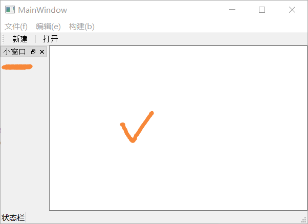
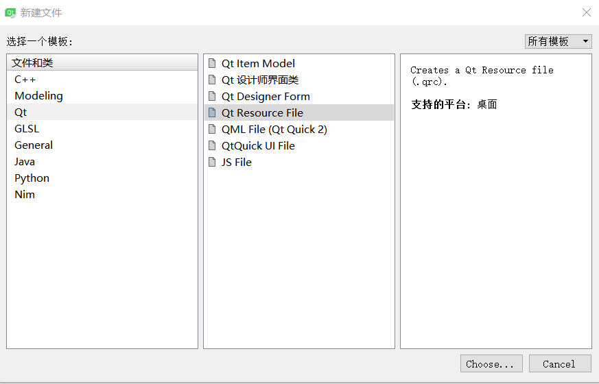
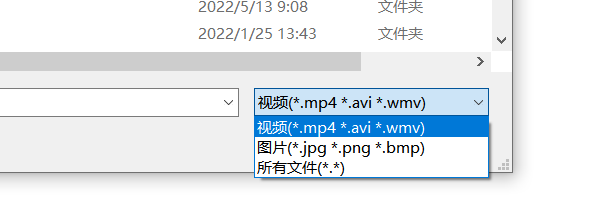
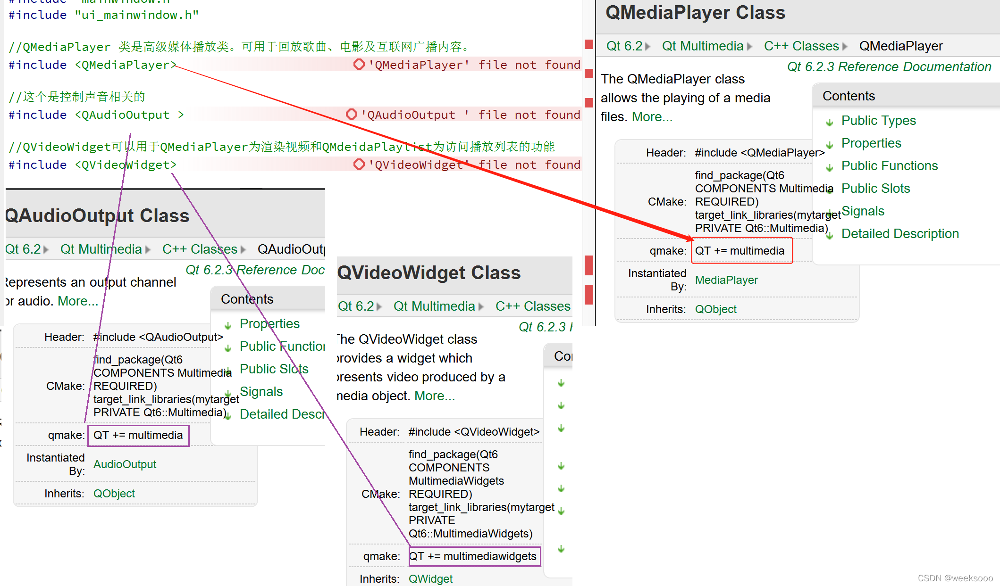
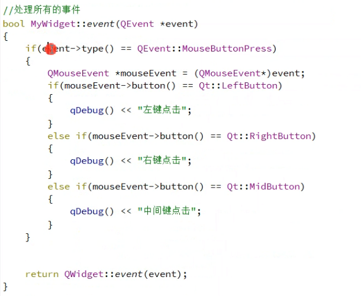
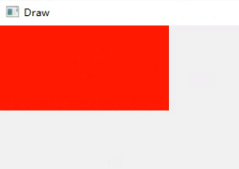
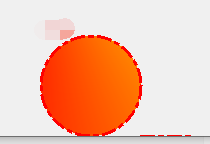
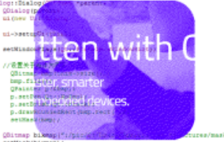
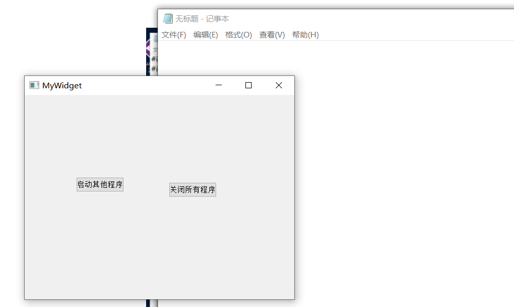
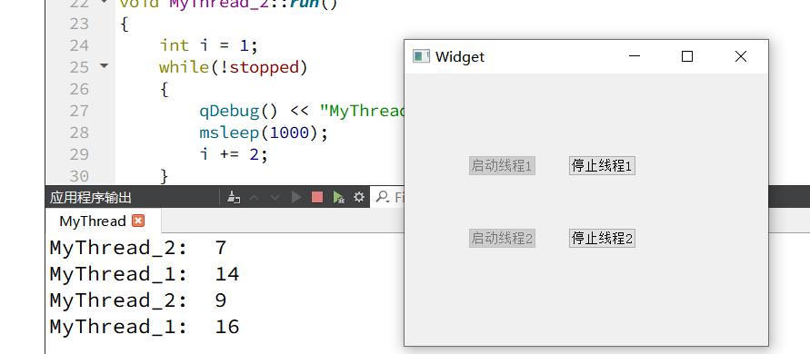

#                                                         程序运行发布和设置APP图标

[(21条消息) Qt打包可执行文件.exe的两种方式_qt打包成可执行程序_阿衰0110的博客-CSDN博客](https://blog.csdn.net/m0_50669075/article/details/119413531)

## 程序运行发布(给别人电脑上能够正常运行):

+  **用  release** 下创建


+ 得到 exe文件


+ 拷贝exe文件道要发布的文件夹里

  

**cmd 打开**

+ 借助工具-->自动生成exe文件的一系列依赖

     添加好环境变量就能直接使用工具      windeployqt

  


+ 最终结果(可以打包成压缩包)


## 设置APP图标

+ 原本的:(比较丑)


+ **修改方式 ** 如下:   

1. 网上找 .ico后缀的图片
2. 把图片放到源代码中,注意不是release中
3. 添加一行代码  ==RC_ICONS = res\imgs\ioc.ico  (相对路径)==
4. 


## debug里面的程序打不开解决办法

-------------------


解决:


## qt更新组件

[(24条消息) Qt使用MaintenanceTool更新组件设置临时储存库_Mr_Bobcp的博客-CSDN博客](https://blog.csdn.net/Mr_Bobcp/article/details/97796585)


#   QMainWindow、QWidget、QDialog的区别

**QMainWindow 类提供一个有菜单条、锚接窗口（例如工具条）和一个状态条的主应用程序窗口。** 主窗口通常用在提供一个大的中央窗口部件（例如文本编辑或者绘制画布）以及周围菜单、工具条和一个状态条。QMainWindow常常被继承，因为这使得封装中央部件、菜单和工具条以及窗口状态条变得更容易，当用户点击菜单项或者工具条按钮时，槽会被调用。

**QWidget类是所有用户界面对象的基类。** 窗口部件是用户界面的一个基本单元：它从窗口系统接收鼠标、键盘和其它事件，并且在屏幕上绘制自己。每一个窗口部件都是矩形的，并且它们按Z轴顺序排列。一个窗口部件可以被它的父窗口部件或者它前面的窗口部件盖住一部分。

**QDialog 是最普通的顶级窗口。** 一个不会被嵌入到父窗口部件的窗口部件叫做顶级窗口部件。通常情况下，顶级窗口部件是有框架和标题栏的窗口（尽管使用了一定的窗口部件标记，创建顶级窗口部件时也可能没有这些装饰。）在Qt中，QMainWindow和不同的QDialog的子类是最普通的顶级窗口

##  选用原则

1. **如果是主窗体**，则基于QMainWindow创建。
2. 如果是顶级对话框，则基于QDialog创建。
3. **如果需要嵌入到其他窗体中**，则基于QWidget创建
4. 如果不确定，或者1 2两种情况都有，那么，就选择QWidget。


# 项目文件组成及分析

## 0.创建项目注意事项


--------------------

**类名一定遵循首字母大写**


------------


Qt项目文件

- [介绍一下项目管理文件（.pro文件）](https://blog.csdn.net/weixin_43288201/article/details/105105777#pro_10)
- [Qt的main介绍](https://blog.csdn.net/weixin_43288201/article/details/105105777#Qtmain_49)
- [Qt的widget.h介绍](https://blog.csdn.net/weixin_43288201/article/details/105105777#Qtwidgeth_72)
- [Qt的widget.cpp介绍](https://blog.csdn.net/weixin_43288201/article/details/105105777#Qtwidgetcpp_92)
- - [Widget::Widget(QWidget *parent) : QWidget(parent)](https://blog.csdn.net/weixin_43288201/article/details/105105777#WidgetWidgetQWidget_parent__QWidgetparent_109)

在 Qt Creator 中新建一个 Widget Application 项目 samp2_1，在选择窗口[基类](https://so.csdn.net/so/search?q=基类&spm=1001.2101.3001.7020)的页面选择 QWidget 作为窗体基类，并选中“Generate form”复选框。创建后的项目文件目录树如图 1 所示。
图 1 项目文件的目录树
这个项目包含以下一些文件：

- 项目管理文件 samp2_1.pro，存储项目设置的文件。
- 主程序入口文件 main.cpp，实现 main()函数的程序文件。
- 窗体界面文件 widget.ui，一个 XML 格式存储的窗体上的元件及 其布局的文件。
- widget.h 是所设计的窗体类的头文件，widget.cpp 是 widget.h 里 定义类的实现文件。C++ 中，任何窗体或界面组件都是用类封装的，一个类一般有一个头文件（.h 文件）和一个源程序文件（.cpp 文件）。


## 一. 项目管理文件（.pro文件）

**后缀为“.pro”的文件是项目的管理文件，文件名就是项目的名称，如本项目中的 samp2_1.pro。 下面是 samp2_1.pro 文件的内容。**

- ```c++
  QT       += core gui	//包含的模块
  //QT       += sql  // 需要sql
  greaterThan(QT_MAJOR_VERSION, 4): QT += widgets	  //大于Qt4的版本 才需要包含widgets
  TARGET = samp2_1		//应用程序名 生成的.exe文件名
  TEMPLATE = app			//模板类型 应用程序模板
  SOURCES += \			//包含的源文件
          main.cpp \
          widget.cpp
  HEADERS += \			//包含的头文件
          widget.h
  FORMS += \				//包含的ui文件
          widget.ui
  
  ```

  

项目管理文件用于记录项目的一些设置，以及项目包含文件的组织管理。

- ```
  “Qt += core gui”表示项目中加入 core gui 模块。core gui 是 Qt 用于 GUI 设计的类库模块，
  如果创建的是控制台（Console）应用程序，就不需要添加 core gui。
  ```

  

Qt 类库以模块的形式组织各种功能的类，根据项目涉及的功能需求，在项目中添加适当的类库模块支持。例如，如果项目中使用到了涉及数据库操作的类就需要用到 sql 模块，在 pro 文件中需要增加如下一行：

```
Qt +=sql
```

samp2_1.pro 中的第 2 行是：

```
greaterThan(Qt_MAJOR_VERSION, 4): Qt += widgets
```

这是个条件执行语句，表示当 Qt 主版本大于 4 时，才加入 widgets 模块。

- ```
  “TARGET = samp2_1”表示生成的目标可执行文件的名称，即编译后生成的可执行文件是 samp2_1.exe。
  
  “TEMPLATE = app”表示项目使用的模板是 app，是一般的应用程序。
  ```

  

后面的 SOURCES、HEADERS、FORMS 记录了项目中包含的源程序文件、头文件和窗体文件（.ui 文件）的名称。这些文件列表是 Qt Creator 自动添加到项目管理文件里面的，用户不需要手动修改。当添加一个文件到项目，或从项目里删除一个文件时，项目管理文件里的条目会自动修改。

## 二. main.cpp介绍

main.cpp

- ```c++
  #include "widget.h"
  #include <QApplication>
  
  int main(int argc, char *argv[])
  {
      //QApplication 应用程序类 初始化我们的应用程序
      QApplication a(argc, argv);
  
      //创建一个窗口控件
      Widget w;
  
      //显示一个窗口  hide隐藏窗口
      //窗口默认是隐藏的
      w.show();
  
      //a.exec() 主事件循环（带阻塞 等待用户操作界面）
      return a.exec();
  }
  ```

  

## 三. Qt的widget.h介绍

widget.h

```c++
#ifndef HELLOWORLD_H
#define HELLOWORLD_H

#include <QWidget>

namespace Ui {  // 名称空间
class HelloWorld;  //自动生成的ui-xxx文件
}

class HelloWorld : public QWidget   //HelloWorld 和上面的那个不是一会事,只是同名.   // 这个是继承 QWidget
{
    Q_OBJECT  // 宏 //让Widget支持信号和槽机制

public:
    explicit HelloWorld(QWidget *parent = 0);  // 构造
    ~HelloWorld();  // 析构

private:
    Ui::HelloWorld *ui;  //通过ui 指向ui界面的组件
};

#endif // HELLOWORLD_H
```


## 四.Qt的widget.cpp介绍

- ```c++
  #include "helloworld.h"
  #include "ui_helloworld.h"
  
  HelloWorld::HelloWorld(QWidget *parent) :      // 派生类的构造函数   //QWidget(parent)是基类的构造函数
      QWidget(parent),        // Widget是调用了QWidget下面的构造函数
      ui(new Ui::HelloWorld)  // 成员初始化列表的方式
  {
      ui->setupUi(this);   // setupUi()一个函数,实现各种基础功能 //界面的设计是在 窗口控件的构造函数中设计
  }
  
  HelloWorld::~HelloWorld()  //析构
  {
      delete ui;
  }
  
  ```

  

Widget::Widget(QWidget *parent) : QWidget(parent)

既然调用了QWidget(parent)这个构造函数，QWidget父类都做了哪些动作呢？
下面是QWidget源码中的一部分节选：

- ```c++
  QWidget::QWidget( QWidget *parent, const char *name, WFlags f )
      : QObject( parent, name ), QPaintDevice( PDT_WIDGET ),
        pal( parent ? parent->palette()		// use parent's palette//使用父母的板
             : *qApp->palette() )			// use application palette
  {
      if ( parent ) {
  	QChildEvent *e = new QChildEvent( Event_ChildInserted, this );
  	QApplication::postEvent( parent, e );
      }
  }
  
  ```

  

从上面可以看出，如果parent参数非空的话，那么该构造函数使用了其父窗口的调色板，并且发送了QChildEvent事件，这会让新的窗口成为parent所指窗口的子窗口，那么当父窗口被删除时，子窗口也会自动的被删除。


## 五ui_widght.h文件

自动生成的


------------------


#  **main（）认识：**

 **快捷键**

//注释  ctrl + /
//运行  ctrl + r
==//保存  ctrl + s==
==//编译  ctrl + b==
//查找  ctrl + f
//字体缩放 ctrl+ 鼠标滚轮
==//帮助文档  f1==
==//自动对齐  ctrl + i==
==//同名之间的.h 和.cpp文件的切换 f4==

+  2，文件名和创建路径==一定不能用中文==

+  **QT中main（）认识：**

+  

+++++

 **QT有的类为什么不添加头文件也能直接使用原因**：

==类继承很复杂你已经添加头文件中已经引入其他类的头文件了==

++++

**代码化ui设计的原则:**

+  能用可视化u的方式就用可视化的方式,有些组件不能通过ui的方式就用代码

-------------


# 基本数据类型

##   Qpoint点

**基本操作:**

/qPoi   --> Qpoint

```c++
3、QPoint点         // QPoi
QPoint()
QPoint(int xpos,int xpos)
bool, isNull() sonst.      //判断点是不是空点和(O,0)一个效果
QPoint pos1;
if(true ==  pos1.isNul1())
gDebug()<<"为空"<<endl;     //为空else
gDebug()<<"不为空"<<endl;
```

```c++
//设置点的x的值  //设置点的y的值 
void setX(int x)
void setY(int y)
    
    
//获取点的x的值  //获取点的y 的值  // 不可修改
int x() const.
int y() conss.

//获取点的x的值  //获取点的y 的值  // 可修改
int & rx()
int & ry()
QPoint p(1，2);
p.rx()--;
qDebug()<< p.x()<<""<< p.y()<<endl;  //x=0,y =2
```

**点之间可加可减:**

```c++
QPoint pt1(50,30),pt2 (10,20);
qDebug() <<pt1 + pt2<<endl;
qDebug()<< pt1 *3<<endl; I
```


## QRect矩形区域

**基本使用**

qrec ---> Qrect

```c++
QRect()
QRect(const. QPoint. &toplsft, const. QPoint &bottomRight)
QRect(const, QPoint, &toplsft, const. Qsize, &size)
    
QRect(int x, int y, int width,int height)
int x() const;
//返回矩形左边缘的x坐标和 left()相同
int y() const,
//返回矩形上边缘的y坐标和top()相同
int left() const,
//返回矩形左边缘的x坐标
int top() const.,
//返回矩形上边缘的y坐标
int right() const,
//返回矩形右边缘的x坐标、注意,由于历史原因，此函数返回left()+ width() -1;
//使用×()+ width()检索真实的x坐标
int bottom() const.
//返回矩形底边的y坐标。注意，由于历史原因，此函数返回 top()+ height()-1;
 //使用y()+ height()检索真实的y坐标。
    
    
QPoint center() const.,
//返回矩形的中心点。注意中心点
QPoint togleft() sonst,
//返回矩形左上角的位置。
QPoint tapRight( ) const.
//返回矩形右上角的位置。
QPoint battomLeft() sonst.
//返回矩形左下角的位置。注意，由于历史原因，此函数返回QPoint(left()，top()+ height()-1)。
QPoint battomRight() const.
//返回矩形右下角的位置。注意,由于历史原因，此函数返回QPoint( left()+ width()-1,，top()+ height()-1)。
int width() const,
//返回矩形的宽度。
int height() const
//返回矩形的高度。
```

```c++
QRect rt(QPoint(0,0), QPoint(200,100));
qDebug() << rt <<endl;
qDebug()<< rt.x();
qDebug()<< rt.y();
qDebug() <<rt.left();
qDebug() <<rt.top();

qDebug()<< rt.right();
qDebug()<< rt.top()+ rt.height()-1
qDebug() <<rt.bottom();
qDebug()<< rt.top()+ rt.height()-1
```

lef --> left

rig --> right

客户区和 非客户区 :

## QSize 大小

```c++
QSize(int width, int height)
bool is.Emptx( ) const
//如果width 和l height之一小于或等于o,则返回true;否则，返回 true。否则返回false .
bool, isNull())sonst.
//如果 width和l height均为o,则返回true ;否则,返回 false .
bool isMalid()) const.
//如果 width 和l height都等于或大于0，则返回 true;否则，
```

```c++
QSize size(300,200);
qDebug() << size << endl;
qDebug()<<size.width() <<endl;
qDebug()<< size.height()<<endl;
```


## QList

```c++
QList<int> list;
list << 5 <<10 <<20 <<30 ;
qDebug() << list[0]<<endl;
```

```c++
//交换
list.swap( 2,6);
for(int i=o;i<list.count() ;i++)
{
	qDebug() << list[i] <<"，";
}
// at()

//包含
if(true == list.contains (31))   //自定义数据里必须有 operator==
	qDebug() <<"包含";
else
	qDebug() <<"不包含";

//查找
int pos = list.indexOf ( 30 );
qDebug() << pos ;
    
//移除元素
list.removeAt(0);
takeFirst();   // 删除并得到链表第一个数据

//移动位置
list.move ( 1,3);
```

##  QMap

```c++
// 键=>值
QMap<QString, int> map;
map["One"] = 1;
map["Two"] =2;
qDebug() << map[ "One"];
map.insert( "Three",3);
Imap.contains ("Four" );
```

```c++
//遍历一下
QMap<QString,int>::iterator it = map.begin();
while(it != map.end())
{
	qDebug()<< it.key() << "--"<< it.value();
    it++;
}
```


## QColor

1.用rgb:

```c++
QColor(224, 223, 227)
```

2.使用Qt定义的:

```c++
Qt::red
```


#    按钮的使用与窗体的简单设置(重要)


**代码化ui设计的原则 :**

+  **能用可视化u的方式就用可视化的方式,有些组件不能通过ui的方式就用代码**

--------------

  + 1. \#include <QPushButton>

    2. QPushButton  * btn3 = new  QPushButton("按键内容" , this);  

    2. 尽量别再方法中声明按钮

    3.  **内存自动回收：** 

    4. ```
           QT中的对象指针在满足下列情况会自动回收内存
           // 1. 从QObject派生的类 1.直接 2.间接
           // 2. 指定父类, 父亲析构的时候,先析构他的孩子
           // 创建自定义按钮对象
       QPushButton的常用信号：&QPushButton::clicked  
       ```
       
    3. 窗体相关属性设置：
       
       **下列全是方法**
       
       ```c++
       
       show()方法  //默认是会以顶层方式重新弹出来一个窗口
       colse()    // 关闭
       showFullScreen() // 全屏显示
           showMaximized() //窗口最大化
       
       move（x,y）  //改变子窗位置
       
       """
       setText(”文本“) 设置文本   <=> QPushButton  * btn3 = new                                                                                       QPushButton("文本" ,this); 
       setParent（this）设置父类  <=>
       """  
       
       resize(600,1200);   //设置窗口大小，左上角是原点 
       
       setFixedSize(600,800); //设置窗体固定窗口的大小,不能被移动
       
       setWindowIcon(QIcon("E:\\1.jpg图片路径")); //给窗口加图标
       
       setWindowTitle（”标题“） //设置窗口标题
       
       setStyleSheet("background-color: balck");    // 设置背景黑色
       setStyleSheet("background-image:url(资源文件));    
           
       //当前主窗口的宽度与高度
       int a = this->width();   
       int b = this->height() ;  // 默认480
       
       ```

# 窗体背景

```c++
//背景颜色
setStyleSheet("background-color: white;");
// 背景图片
this->setStyleSheet("background-image:url(:/res/images/背景.jpg);");
//方式2:  通过绘图事件设置
void MainWindow::paintEvent(QPaintEvent* event)
{
    QPainter myPainter(this);
    myPainter.setOpacity(0.9);          //背景图片透明度
    myPainter.drawPixmap(0, 0, this->width(), this->height(), 		     QPixmap(":/image/images/background.jpg"));
}
```

效果 :

背景图片是设置的客户区(包括了工具栏和菜单栏)

设置颜色是设置的非客户区 :


解决 :  界面中的子控件的背景也会被设置成同一背景图片:

```c++
#组件名{

 	border-image: url(:/resource/2850Demo_background.jpg);
}
```

默认的颜色:

```
ui->statusBar->setStyleSheet("background-color: rgb(224,223,227);");
```

```
ui->textEdit->setStyleSheet("background-color: rgb(87,97,105);");
```

**工具栏 状态栏的颜色样式:**

 QToolBar的时候，设置样式

```c++
QToolBar* pToolBar = new QToolBar(this);
if(pToolBar)
{
	pToolBar->setStyleSheet(“QToolTip{background-color:red}”);
}
```


**QT菜单栏颜色与背景颜色设置: **

```c++
this->setStyleSheet("QMenu::item:selected{background-color:#f7fcfd;}QMenu::item{background-color:#e6f5f9;}QMenu::item:disabled{background-color:#dfdfdf;color:#c0c0c0}");
```

使用以上代码可达到一下效果：


## 客户区非客户区


**资源文件：**

+ 设置图片（==setWindowIcon(QIcon("E:\\1.jpg图片路径")); //给窗口加图标== ）
+ 

# windowFlags()

## 置顶窗口

```c++
void Widget::on_pushButton_clicked()
{
    if(!istop)
    {
        // 置顶窗体
        Qt::WindowFlags m_flags = windowFlags();
        setWindowFlags(m_flags | Qt::WindowStaysOnTopHint);
        show();
        qDebug()<<"always top";
    }else{
        //Qt::WindowFlags m_flags = windowFlags();
        //setWindowFlags(Qt::Widget);
        setWindowFlags(NULL);          // 取消置顶
        show();
        qDebug()<<"no always top";
    }
    istop=!istop;
}
```


```c++
  setWindowFlags(Qt::FramelessWindowHint | Qt::Tool); //去掉窗口边框,和任务栏图标
    setAttribute(Qt::WA_TranslucentBackground);//设置背景透明
```

1. 如果该窗体是主窗体：
   （1）直接使用showMaximized()（showMaximized()）最大化和最小化
   （2）使用showFullScreen() //功能：全屏显示 （只对主窗口有用）

\#窗口关闭：
直接调用自带close()函数，但是有个返回值，定义一个bool给收掉
bool b = this->close();

## 去掉xx

xx


- 只能设置一个的窗口标志对照表

| 窗口标志         | 描述                                       |
| ---------------- | ------------------------------------------ |
| Qt::QWidget      | 窗口的默认属性                             |
| Qt::Window       | 带有窗口系统框架和标题栏                   |
| Qt::Dialog       | 对话框(通常标题栏中没有最大化或最小化按钮) |
| Qt::Sheet        | macOS表单式窗口                            |
| Qt::Drawer       | macOS抽屉式窗口                            |
| Qt::Popup        | 弹出式顶层窗口                             |
| Qt::Tool         | 显示**工具按钮**的窗口                     |
| Qt::Tooltip      | 没有标题栏和窗口边框的窗口                 |
| Qt::SplashScreen | 启动窗口类似于`QSplashScreen`              |

- 可以设置多个的窗口标志对照表

| 窗口标志                         | 描述                                                         |
| :------------------------------- | :----------------------------------------------------------- |
| Qt::MSWindowsFixedSizeDialogHint | Windows系统固定大小窄边框窗口                                |
| Qt::X11BypassWindowManagerHint   | 无窗口边框的窗口，完全忽视窗口管理器和用户无法使用键盘进行输入 (除非手动调用`QWidget::activateWindow()`函数 |
| Qt::FramelessWindowHint          | **无法移动和改变大小**的**无窗口边框**的窗口                 |
| Qt::NoDropShadowWindowHint       | 禁用**窗口阴影**                                             |
| Qt::WindowTitleHint              | 带**标题栏**的窗口                                           |
| Qt::WindowSystemMenuHint         | 带**系统菜单**和尽可能地添加一个**关闭按钮**的窗口           |
| Qt::CustomizeWindowHint          | **关闭**默认窗口**标题提示栏**                               |
| Qt::WindowMinimizeButtonHint     | 窗口添加一个**最小化按钮**                                   |
| Qt::WindowMaximizeButtonHint     | 窗口添加一个**最大化按钮**                                   |
| Qt::WindowCloseButtonHint        | 窗口添加一个**关闭按钮**                                     |
| Qt::WindowContextHelpButtonHint  | 窗口添加一个**帮助按钮**                                     |
| Qt::WindowShadeButtonHint        | 如果窗口管理器支持，则在**最小化按钮**的位置添加一个阴影按钮 |
| Qt::WindowStaysOnTopHint         | 通知窗口系统**置顶窗口**                                     |
| Qt::WindowStaysOnBottomHint      | 通知窗口系统**置于最底层窗口**                               |


**去掉标题栏中最大化、最小化按钮**

```c++
//关闭按钮失效
//this->setWindowFlags(Qt::WindowMinMaxButtonsHint);
//去掉最大化、最小化按钮，保留关闭按钮
this->setWindowFlags(Qt::WindowCloseButtonHint);
```

 **去掉窗口边框,和任务栏图标**

```
setWindowFlags(Qt::FramelessWindowHint);  // 去掉窗口边框
setWindowFlags(Qt::FramelessWindowHint | Qt::Tool); //去掉窗口边框,和任务栏图标
setWindowFlags(Qt::FramelessWindowHint | Qt::Tool | Qt::WindowStaysOnTopHint); // 去掉标题栏,去掉任务栏显示，窗口置顶
```

**使用透明图标和空标题——>就相当于除去了**

如:


# 多窗口切换

**方法:**

1. **使用qt设计师类创建新的窗体**

```c++
this->close();        // 本窗口关闭
// 打开UserWindow窗口
UserWindow* uw = new UserWindow;      //自己写的另一个窗口类 
uw->setWindowTitle("用户机票管理"); //设置标题

if(setWindow->isHidden())  // 如果隐藏了就显示
{
uw->show();  // 显示
}
```

2. **使用stack wight实现**

3. **通过界面控件的隐藏和显示实现**

   ```c++
   ui->pushButton_calenBtn->isHidden()  //判断是否隐藏
   //控件初始时不用不显示的
   ui->name_label->setVisible(false);
   ui->name_lineEdit->setVisible(false);
   ui->idcardnum_label->setVisible(false);
   ui->idcardnum_lineEdit->setVisible(false);
   ```


# win开机自启

```c++
void SetWin::SetMyAppAutoRun(bool isstart)
{
    //NativeFormat在windows下就是系统注册
    QSettings nsettings("HKEY_CURRENT_USER\\SOFTWARE\\Microsoft\\Windows\\CurrentVersion\\Run",
                        QSettings::NativeFormat) ;
    qDebug() << nsettings.allKeys();
    QString napppath = QApplication::applicationFilePath();
    QString nappname = QApplication::applicationName();
    napppath = napppath.replace("/", "\\");
    if(isstart)
    {
        nsettings.setValue(nappname, napppath);
    }
    else
    {
        nsettings.remove(nappname);
    }
}

```


# 对象树

+ **当创建一个以另一个对象作为父对象的QObject时，它被添加到父对象的children()列表中，并在父对象是时被删除。**

+ **但关闭窗口时,组件是依附窗体,会自动关闭. 所以不用delete**

+ **内存自动回收:**

  ```c++
  QT中的对象指针在满足下列情况会自动回收内存
  // 1. 从QObject派生的类 1.直接 2.间接
  // 2. 指定父类, 父亲析构的时候,先析构他的孩子
  // 创建自定义按钮对象
  ```

  


# 知识点二: 信号槽机制(重要)(难点)

signal and slot

  + 

##  普通信号普通槽(系统自带)


+ 例如QPushButton的父类QAbstractButton 有Signals里面有 **clicked , pressed , released,toggled**
    ​
    
+ 信号和槽函数 都是函数,

+ **信号只需要声明(只是函数的声明)**（需要发出去时要用emit发送）,不需要函数定义 ,  

+ **槽需要声明和定义**,属于回调函数  

+ **使用connect()**

+ 槽函数需要与信号对相应(返回值, 参数)

    ==信号,  槽函数返回值是:   void==
    
+ 

    ==格式如下不要去深究:==

```c++
// 需求 点击上面的btn按钮,执行窗口关闭动作  

    //建立两者的连接:  connect(btn, 发出的信号, this, 处理信号的槽函数);

    connect(&btn, &QPushButton::clicked, this, &MyWidget::close);

    /*      格式:  & + 信号发出者类的名字 + :: + 信号的名字
     * b1: 信号的发出者, 此参数必须是是一个指针
     * &QPushButton::clicked: 信号发出者, 内部的一个信号   // 在类以外直接用类的属性或者方法 用::
     * this: 信号的接收者, 此参数是一个指针
     * &MyWidget::close: 信号的处理函数, 属于this
    */ emit
```

第二种写法(出里非静态的信号):

```c++
connect(this, SIGNAL(closeSignal()), m_passive_nectWorkHandler, SLOT(destroySocket() ));
connect(&trans,SIGNAL(send_to_mainwind(QString,float)),this,SLOT(get_trans_msg(QString,float)));
```


**总结:**

信号如果有重载:

```c++
void	buttonClicked ( QAbstractButton * button )    
void	buttonClicked ( int id )
```

使用第二个函数:

```c++
方式1:
connect(&btn, SIGNAL(buttonClicked(int)), this, SLOT(clicked(int)));  // 不可以用lambda

void clicked(int id)
{
    //...//do somethings...
}
```

```c++
方式2:
void (QPushButton:: *pf)(int) = &QPushButton::buttonClicked;
connect(&btn, pf, this, &MyWidget::clicked);  // 可以用lambda

void clicked(int id)
{
    //...//do somethings...
}
```


```
sender() 返回调用对象
```


==**注意：是发出槽函数的类，不一定是qt自带的类**==

1. 槽函数可以发出信号或者自己做某些功能
2. 一个信号可以触发另一个信号，
3. 一个信号关联多个槽函数

--------


### 自定义槽函数

不创建新的c++的情况

1. 声明


2. 定义


3. 使用


### 重点  看 Signal_Slot的代码


## **自定义信号和槽函数 **

定义对象->声明一个槽函数->定义一个槽函数：写明具体功能

==回去： 先通过槽函数发出信号 ，主窗口接受再发过来信号  （定义一个槽函数和信号（目的通过这个槽函数发起信号）再主窗口定义一个槽函数去接受发过来的信号==

```c++
// 自定义槽函数
    /*
     * 1. 槽函数在Qt5 可以是任意类成员函数, 全局函数, 静态函数, lambda表达式(隐式函数)
     * 2. 槽函数需要与信号对相应(返回值, 参数)
     * 3. 信号,槽函数返回值是: void
     定义成共有部分
     * 4. void mysig(int, double, QString);
     *    void myslot(int, double);
     * 5. 槽函数的参数是为了接受信号传过来的的数据
     * 6. 槽函数的参数应该是不能够大于信号的参数个数, 可以少于信号的参数个数
     * 7. 槽函数可以重载，注意槽函数重载了，必须使用函数指针QT的格式: void (Subwigdet::*MySigSub)() = 
                                                                           &Subwigdet::sigSub;
     
     * 8. emit发信号
```

```c++
//信号: (任何地方都可以发送)
   void sigSub();       
    //1,可以有参数
    //2,可以重载
    //3,返回zhi为void
    //4,发送信号： emit + 信号名
emit sigSub(250, "二百五");
```

**需要新建一个.cpp文件**

+ 在signals: 下面定义信号

+ 在public slots: 下声明槽函数

  

**代码**：

### 定义槽函数

```c++
mainwidget.h文件
    
#ifndef WIDGET_H
#define WIDGET_H

#include <QWidget>
#include<QPushButton>
#include<subwigdet.h> //a自己添加的类在那用就要include

class Widget : public QWidget
{
    Q_OBJECT

public:
    Widget(QWidget *parent = 0);
    ~Widget();

private:
    QPushButton* btn;
    QPushButton b1;
    //a1
    QPushButton* b3;

 //1自定义槽函数
    void slotForwidget();

    void slotHideme(); // a4
 
    //创建一个子窗口对象（a）
    Subwigdet subw;       //b2  // 创建一个子窗口对象 Subwidget: 就是封装了一个子窗口
    //  b 槽函数
    void slotshowme();   //b3
    void slotsubmsg(int num, QString str); //c

};

#endif // WIDGET_H


```

```c++
mainwidget.cpp文件

#include "widget.h"
#include<QPushButton>
#include<QDebug>  //输出

Widget::Widget(QWidget *parent)
    : QWidget(parent)
{
    btn = new QPushButton("按钮",this);
    btn->move(300,200);

    this->setWindowTitle("fcc");
    this->setWindowIcon(QIcon("c:\\Users\\16658\\Desktop\\q"));
    connect(btn,&QPushButton::clicked,this,&Widget::close);

    //1定义槽函数：
    b1.setText("老二");
    b1.setParent(this);
    connect(&b1,&QPushButton::released,this,&Widget::slotForwidget); // 简单的使用自定义槽函数


    //a2
    b3 = new QPushButton("软件园",this);
    b3->move(200,200);
    b3->resize(100,50);
    connect(b3,&QPushButton::clicked,this,&Widget::slotHideme);  //a3开始定义槽函数
    //a进去子窗口之后在回到主窗口b1
    //b2开始设置信号和信号接收对象
    void (Subwigdet::*MySigSub)() = &Subwigdet::sigSub;  //函数指针
    connect(&subw,MySigSub,this,&Widget::slotshowme);   //slotshowme槽函数

    void (Subwigdet::*MysigPlus)(int,QString) = &Subwigdet::sigSub; //函数指针
    connect(&subw,MysigPlus,this,&Widget::slotsubmsg);  //槽函数重载c //函数指针,如果你的信号或者超发生重载就要使用函数指针

}
Widget::~Widget(){}
//1
void Widget::slotForwidget()
{
    b1.setText("修改了");
}

//a5 写槽函数的目的  写明具体功能
void Widget::slotHideme()
{
    //隐藏自己（主窗口）
    hide();
    //显示软件园窗口 a6去编写子窗口按钮
    subw.show();
}

//b
void Widget::slotshowme()  //slotshowme
{
    //显示自己
    show();
    //软件园窗口
    subw.hide();
}
//显示一下发过来的重载信号
void Widget::slotsubmsg(int num, QString str)
{
    qDebug() << num << str;
}

```

-----------


### 定义信号

```c++
subwidget.h

#ifndef SUBWIGDET_H
#define SUBWIGDET_H

#include <QWidget>
#include<QPushButton>

//Subwiget是一个窗口类但是一个子窗口
class Subwigdet : public QWidget
{
    Q_OBJECT
public:
    explicit Subwigdet(QWidget *parent = nullptr);

signals:
    //在signals下面定义信号
    void sigSub();        //b2
    //1,可以有参数
    //2,可以重载
    //3,返回zhi为void
    //4,发送信号： emit + 信号名
                //emit sigsub()；
    void sigSub(int,QString); //c


public slots:
    void myslot();        //b3

private:
    QPushButton* b1; //a7（1）

};

#endif // SUBWIGDET_H

```


```c++
subwidget.cpp

#include "subwigdet.h"

Subwigdet::Subwigdet(QWidget *parent) : QWidget(parent)
{
    //b7 子窗口的编写
    b1 = new QPushButton("中层",this);
    b1->resize(100,100);
    b1->setWindowTitle("软件园窗口");
    resize(400,600);

    //a进去子窗口之后在回到主窗口b
    connect(b1,&QPushButton::clicked,this,&Subwigdet::myslot);  //myslot() 子窗口的槽函数

}

//b  子窗口的槽函数
void Subwigdet::myslot()
{
    //发出信号
    emit sigSub();
    emit sigSub(250, "二百五"); //c
}

```

重点：

==**注意：是发出槽函数的类，不一定是qt自带的类**==

==**信号的发出者, 此参数必须是是一个指针**==

==**尽量别再方法中声明按钮**==,除非用动态对象时

==**要用就必须连用  public slots:和  signals: 在去定义相应的槽函数和信号**==


-----------------------------


# QT的输出qDebug()函数

**qDebug()  <<**

```c++
#include <QDebug>

qDebug() << "hello , 您好";

int num = 18;
QString str = "小魔女琪琪";
qDebug() << num << str;
qDebug() << num << str.toUtf8().data();  //如果出现中文乱码的情况,可以这样
```


# QStringlist  所有字符串的列表

**返回包含子字符串 str 的所有字符串的列表：**

1. ```c++
   1.  QStringList list;
   2.  list << "Bill Murray" << "John Doe" << "Bill Clinton";
   ```

   qslis  --> QString


# 知识点四: QT中的lambda表达式


+ **lambda作为槽函数就不需要额外的定义了 **（槽函数简单的时候用来直接代替槽函数）`,当然这种方式需要在 .pro文件中 引入c+11的特性,因为lambda是c++11的一个特性,引入命令`

+ 1.**CONFIG += c++11**

+ 2.

  connect(对象, &+ 信号发出者类的名字 + :: + 信号的名字,  对象，【=】()
  
  {    
  
  ​        函数实现
  
  });
  
  
  
  ==如：==
  
  
  

要的：

==**#include <QDebug>**==

==**qDebug() << "hello , 您好";**==


# 回顾总结:

setwti  标题

setfis  固定大小

setwic  设置图标

setss   设置背景颜色/背景图片

 setwic   --> setWindowIcon

resi   设置大小

qde  之后手动选择

this->hei  

this->wid

qslis -->     QStringList

# ----------------------------------------------------

-----------------------

#  带UI界面的项目


## **通过ui->控件名**        访问到控件

## 一般情况下;   回去点击跳转到槽----->可以直接自动声明槽函数(方便)

+++++

## 各种控件作用


## Buttons控件


```c++
//得到所选按钮
connect(bodyBox, SIGNAL(buttonClicked(int)), this, SLOT(bodyChange(int)));
```

```c++
QPushButton* bodyBtn[NUM], *earsBtn[NUM];  //各部件对应按钮
QButtonGroup * bodyBox =  new QButtonGroup;
QButtonGroup * earsBox =  new QButtonGroup;
bodyBox->setExclusive(true);  //在任何给定时间组中只能选中一个按钮
earsBox->setExclusive(true);
for(int i = 0; i < NUM; i++)
{
    bodyBtn[i] = new QPushButton(this);
    bodyBtn[i]->setFixedSize(80, 40);
    bodyBtn[i]->move(80, 1 + i * 230 + 210);
    bodyBtn[i]->setIcon(QIcon(":/images/icon/choose.png"));
    bodyBtn[i]->setCheckable(1);
    bodyBox->addButton(bodyBtn[i], i);
    earsBtn[i] = new QPushButton(this);
    earsBtn[i]->setFixedSize(80, 40);
    earsBtn[i]->move(280, 1 + i * 230 + 210);
    earsBtn[i]->setIcon(QIcon(":/images/icon/choose.png"));
    earsBtn[i]->setCheckable(1);
    earsBox->addButton(earsBtn[i], i); 
}
```

//在任何给定时间组中只能选中一个按钮


###  1. ToolButton


[(23条消息) QT系统学习系列：1.3 ToolButton（工具按钮）_花狗Fdog的博客-CSDN博客_qt toolbutton](https://blog.csdn.net/Fdog_/article/details/113061676)

------

###  2.Radio Button  &&  Group Box

+ **成组使用, 只能单选.**


==注意:  按setch 然后选出  setChecked();  就是默认开启\关闭的意思==


**组框一般与radio button 连用**  .  目的: 让几个成组的radio button不是同一个组的东西, 


[(10条消息) QT checkBox 小试牛刀 checkState，setCheckState，stateChanged，setTristate，常用函数_QT风的季节的博客-CSDN博客_setcheckstate](https://blog.csdn.net/yi3d3d3d/article/details/125621333)


### 3.Cheak Bax


​																**勾选后会有三种状态**


```c++
//连接checkBox的 选中状态的的信号，槽函数是自定义的，用来响应每checkBox的状态改变
connect(ui->checkBox_2,&QCheckBox::stateChanged,this,&Widget::onstateChanged);

//checkBox的3种状态 
ui->checkBox->setCheckState(Qt::Checked);    //选中
ui->checkBox->setCheckState(Qt::Unchecked);    //未选中
ui->checkBox->setCheckState(Qt::PartiallyChecked);    //半选 实心方块
```


## List Widget控件

注意:  ==**只能通过代码**==

### 1.list Widget


####  additem(字符串)

==**使用在控件中添加一行内容 ：      additem（“一行内容”）**==：    可以是文本可以是 图片 ,可以同时加


##### 同时加上图标


------------

 **文本对齐方式**:     ==setTextAlignment()==    Alignment   对齐

----------------


**总结:**

```c++
ui->listWidget->addItem("2");
ui->listWidget->addItem("3");
ui->listWidget->addItem(new QListWidgetItem(QIcon("图片路径")), "4");   // 或者使用setIcon(QIcon()) 设置
```

lwid   --->  listWidget

qlwit    --->  QListWidgetItem  // it就是item   // ql  // 对比   QTreeWidgetItem 

qic --> Qicon

addi 然后手选  (用additem 不用选)

```c++
设置当前默认选项
setcurrentRow(1)   // 选择第一行

// 获得选中
int res = 组件->currentRow();
if(res < 0)
    return -1;

删除
takeItem(res);
```


#### addItems(list列表)


```c++
QStringList list;
list << "r" << "g" << "b";
ui->listWidget->addItems(list);
```


==**设置listWidget文本属性:**==


#### QSS

```css
// 有无QListWidget的边框
QListWidget{
	border:none;
}

QListWidget::item{
	padding-top:24px;   // 每行大小
	color:rgba(121,112,52,1);
   	margin-left:40px;  // 左边里边框多远
}
QListWidget::item:hover{
	background-color:transparent;
	border-bottom:1px solid rgb(121,112,52);
}
QListWidget::item:selected
{
    border-bottom:1px solid rgb(121,112,52);
    padding:0px;
    margin:0px;
    color:red;
}
QListWidget::item:selected:!active
{
    border-width:0px;
}
```


```c++
void Client::on_listWidget_doubleClicked(const QModelIndex& index)
{
    if (!index.isValid())  //如果索引有效
    {
        return;
    }
    QString ip = ui->listWidget->item(index.row())->data(0).toString();
    connectServer(ip);
}
```


-------------

### 2. Tree Widget控件

#### 基本使用

```c++

ui -> 组件名-> setHeaderlabels(列表)   // 设置表头
//ui->treeWidget->setHeaderLabels(QStringList() << "jj" << "gg");
    
// 设置内容   三步
QTreeWidgetItem *一级文件 = new QTreeWidgetItem(QStringList() << )  
ui ->组名->addTopLevelItem(一级文件)
一级文件->setIcon(索引, 图片路径);

QTreeWidgetItem *二级文件 = new  QTreeWidgetItem(QStringList() << )  
 p->addChild(二级文件);   


反正就是找到对应的位置在使用对应的函数
```

```c++
// 添加表头信息:
ui->treeWidget->setHeaderLabels(QStringList() << "jj" << "gg");

// 添加表头信息:
//一级
QTreeWidgetItem* p = new QTreeWidgetItem(QStringList() << "s" << "ss");
ui->treeWidget->addTopLevelItem(p);
p->setIcon(0, QIcon(""));
// 下一级
QTreeWidgetItem* p1 = new QTreeWidgetItem(QStringList() << " ");
p->addChild(p1);
....
```

twid -- >  treeWidget

sethl  然后首选 -->  setHeaderLabels  对应tablewidget的 setHorizontalHeaderLabels();记忆

qtwit  -->  QTreeWidgetItem   // wit 是  WidgetItem 

addt   --> addTopLevelItem   // 增加

addc  -->  addChild

setIc   ---> 设置图标

基本


#### 加上图标


------------------

再添加分支:


#### 默认展开那项


第一个展开hunan所在项. 第二个是展开所有

#### 获得文本


### 3.Table Widget

表格


例子2:


#### **基本使用**

```c++
Table Widget设置：
setRowCount（10） //设置行数   “肉”
setColumnCount（6）//设置列数  “抗蒙”
int n = ui->tableWidget->rowCount();  //返回当前一共的行数
ui->tableWidget->insertRow(n);         // 插入空行
//注意:  表头是计算到行列个数中
    

// 添加表头信息:
QStringList list；                              //
list <<  "" << "" << "" << "" ;  // 一次性加多个    // 等价 QStringList() << <<  
setHorizontalHeaderLables(list)     //以水平的方式设置上述内容
----------------------

// 添加Table Widget内容:
setItem（row, col, new QTablewWidgetItem(" ")）    // 定位到某行某列的设置内容
```

-->==

setrc   -->  setRowCount

setcc   -->  setColumnCount

sethhl  -->  setHorizontalHeaderLabels

setit --> setItem

-------------

#### **隐藏序号**

```c++
tabte->verticalHeader()->setVisible(false);
//隐藏序号 n. 垂直的
```


#### **设置是否能编辑**

```c++
 ui->order_cen_tableWidget->setEditTriggers(QAbstractItemView::NoEditTriggers);             
//设置每行内容不可编辑
```


####  **设置选择行为,  选择整个行**

```c++
 ui->order_cen_tableWidget->setSelectionBehavior(QAbstractItemView::SelectRows);            //设置选择行为，以行为单位
```


**改进**

只能选择一行不能选择多行


```c++
ui->tableWidgetSong->setSelectionMode(QAbstractItemView::SingleSelection);
```


```
cellDoubleClicked  //双击信号
```


#### **删除**


#### 清空表格内容

```c++
ui->my_home_tableWidget->clearContents();
```

#### 右键菜单

槽函数

```c++
ui->tableWidget->setContextMenuPolicy(Qt::CustomContextMenu);
```


```c++
// tableWidget右键菜单
void OneDeskServer::on_tableWidget_customContextMenuRequested(const QPoint &pos)
{
    QMenu menu;
    QAction *selectAll = menu.addAction(tr("全选"));
    menu.addSeparator();
    QAction *clear = menu.addAction(tr("清空内容"));
    menu.addSeparator();
    QAction *init = menu.addAction(tr("初始化表格"));

    connect(selectAll, &QAction::triggered, [=](){
        ui->tableWidget->selectAll();
    });

    connect(clear, &QAction::triggered, [=](){
        ui->tableWidget->clear();
    });

    connect(init, &QAction::triggered, [=](){
        initForm(ui->tableWidget);
    });

    menu.exec(QCursor::pos());
}

```


####  设置复选框

**单纯的复选框:**

```c++
QTableWidgetItem* check = new QTableWidgetItem();
check->setCheckState(Qt::Unchecked);
table_widget_->setItem(row, col, check);
```


**文字前面加上复选框:**

```c++
QString text = QString("Item_%1-%2").arg(row).arg(col);
QTableWidgetItem *item = new QTableWidgetItem(text);
table_widget_->setItem(row, col, item);
item->setCheckState(Qt::Unchecked);
```


[(10条消息) QTableWiddget实现复选框和自定义编辑功能_笨小孩要多学习的博客-CSDN博客_qtablewidgetitem设置勾选框](https://blog.csdn.net/tormi21c/article/details/124226217?spm=1001.2101.3001.6650.5&utm_medium=distribute.pc_relevant.none-task-blog-2~default~BlogCommendFromBaidu~Rate-5-124226217-blog-10900343.pc_relevant_3mothn_strategy_and_data_recovery&depth_1-utm_source=distribute.pc_relevant.none-task-blog-2~default~BlogCommendFromBaidu~Rate-5-124226217-blog-10900343.pc_relevant_3mothn_strategy_and_data_recovery&utm_relevant_index=6)

[(10条消息) PyQt5 QTreeWidge（一）一个QTreeWidget 获得checked（复选框）的item，并实现另一个QTreeWidget展现出来，并不重复_请叫我阿黄的博客-CSDN博客](https://blog.csdn.net/qq_40930972/article/details/95631737?spm=1001.2101.3001.6650.3&utm_medium=distribute.pc_relevant.none-task-blog-2~default~CTRLIST~Rate-3-95631737-blog-10900343.pc_relevant_3mothn_strategy_and_data_recovery&depth_1-utm_source=distribute.pc_relevant.none-task-blog-2~default~CTRLIST~Rate-3-95631737-blog-10900343.pc_relevant_3mothn_strategy_and_data_recovery&utm_relevant_index=4)

####  获取

**使用item获取后, 还要经过转换**

//

```c++
QString str = ui->TableWidget->item(row,column)->text();//取出字符串
int num = str.toInt();//转成int
```

//

```c++
QByteArray b_order_num = ui->order_cen_tableWidget->item(pay_list.at(i), 1)->text().toUtf8();
```


---------

### 设置行宽列宽

**第一种方式:**

```c++
ui->flight_que_tableWidget->horizontalHeader()->setStretchLastSection(true);
```

是能自动完成列头的自动填充，但是有一个缺点：**列头中空余的其余部分都是用最后一列来填充的，**这样造成的问题就是最后一列很宽，严重影响美观。

**ps: 第一种和第二种可以同时写**


**第二种方式:**

设置自动列宽并且还能根据内容自适应

```c++
//使用下面两句可以实现 
table->horizontalHeader()->setSectionResizeMode(QHeaderView::Stretch);    //x先自适应宽度
table->horizontalHeader()->setSectionResizeMode(0, QHeaderView::ResizeToContents);     //然后设置要根据内容使用宽度的列


ui>tableView->horizontalHeader()->setSectionResizeMode(QHeaderView::Stretch);
ui->tableView->verticalHeader()->setSectionResizeMode(QHeaderView::Stretch); //根据内容自适应
//这两句必须在setModel（）之前调用，否则无效。
```

 手动调整

```c++
ui->tableWidget.horizontalHeader().setSectionResizeMode(QHeaderView.Interactive)
```

效果如下：


 固定值

```c++
ui->.tableWidget.horizontalHeader().setSectionResizeMode(QHeaderView.Fixed)
```

效果如下：


用户无法调整该部分的大小。该部分只能使用resizeSection()以编程方式调整大小。节大小默认为defaultSectionSize。

---------------

```c++
ui->flight_que_tableWidget->horizontalHeader()->setSectionResizeMode(QHeaderView::Stretch);
ui->my_home_tableWidget->horizontalHeader()->setSectionResizeMode(0, QHeaderView::ResizeToContents);
```

我们把它和列宽自动分配结合在一起看，效果立马显现。

效果如下：


行宽列宽结合

```c++
ui->tableWidget.horizontalHeader().setSectionResizeMode(QHeaderView.Stretch)
ui->tableWidget.horizontalHeader().setSectionResizeMode(0, QHeaderView.Interactive)
```

效果如下：


看到没有，**列宽是自动分配的**，但是第一列我们可以**手动调整宽度**，而表格整体的列宽仍是**自动分配**的。第二、三列我们没有办法调整列宽，这个是自动分配的。

自定义列宽

```c++
ui->tableWidget.setColumnWidth(0, 40)
ui->tableWidget.setColumnWidth(1, 200)
ui->tableWidget.setColumnWidth(2, 200)
```

效果如下：

!

## Containers控件


---------


--------------


-------

#### stack wight

**通过按钮才能切换控件**

stack wight 顾名思义一推控件   // swi           // setcin

需要用槽函数换页


<!---->==**使用setCurrentIndex（索引）**==   **跳转到相应页面**   “可瑞婷大克斯”

设置方式:

**方法1:**

 **setCurrentIndex**

```c++
connect（ui->movie,&QPushButton::cticked，this,[=1(){
ui->stackedwidget->setCurrentIndex(2):
})；
```

**方法2:**(推荐)

**把控件放到 一个Widget控件里在使用setCurrentWidget(Widget控件名)**

```c++
 connect(ui->Btn_M_Setting, &QPushButton::clicked, this, [ = ]()
    {
        ui->stackedWidget->setCurrentWidget(ui->pagesetting);
    });
```

+++++++


---------------

## Input Widget控件


###  **Combo Box  **

**下拉项**


####  **同时加上图标**


[(10条消息) Qt之QComboBox(添加纯文本item、添加带图标的item、信号、item携带自定义数据、可编辑属性)_danxiao898的博客-CSDN博客_qcombox添加文本](https://blog.csdn.net/qq_14945437/article/details/98615157)


### Line Edit

**读写edit中的文字   : ;**

```c++
//读取：
QString a = ui->lineEdit->text();

//写入：
ui->lineEdit->setText("About");   // 接受参数都是是QString/QByteArray
```

**设置焦点**

```c++
// 设置成焦点 (就是光标的位置)
ui->tel_num_lineEdit->setFocus();  //设置成焦点 
```

一、QLineEdit（取值、赋值、背景文字、字体样式）

**取值：**

```rust
//获取LineEdit中的值.是QString类型，不能直接用double
QString FileName_1 = ui.le_FilePath_1->text();
// 转换成QByteArray
QByteArray arr = ui->lineEdit->text().toLatin1();  // Latin1 n.拉丁 //这里按照ASCII编码转换  
QByteArray byte2 = str.toUtf8();   //按照Utf-8编码转换，可以转换中文
//类型转化也是可以的
double value = ui.le_FilePath_1->text().toDouble();
```

**赋值**

```scss
ui.le_FilePath_1->setText("内容");
```

**提示信息**

```scss
ui.le_FilePath_1->setPlaceholderText("中国"); 
```

**字体样式**

```less
ui.le_FilePath_1.setFont(QFont( "Timers" , 28 ,  QFont::Bold) );
```

 二、QTextEdit

**取值**

```vbscript
getpagsize = ui.TextEdit_Obj->toPlainText().toInt();
```

**赋值**

```scss
ui.TextEdit_Obj->setText("内容");
```

 三、QPlainTextEdit

**插入**

```scss
ui.PlainTextEdit_obj->insertPlainText("内容");
```

sette  -- > settext


...............

### text Edit

#### 1.读取

```cpp
//获取TextEdit内所有内容
QString text = ui->textEdit->toPlainText();
qDebug() << text;
```

tpt  -->  toPlainText();

#### 2.写入

```haskell
 QString qstr = "插入字符";
 ui->textEdit_2->insertPlainText(qstr);
 
 //5.添加数据并且换行
 QStr="插入换行,开始下一行输入";
 ui->textEdit->insertPlainText(QStr +='\n');
 
```

ipt --->  insertPlainText();

#### 3.保持在最后一行添加(自动滚屏)

```cpp
//保持编辑器在光标最后一行
QTextCursor cursor=ui->textEdit->textCursor();
cursor.movePosition(QTextCursor::End);
ui->textEdit->setTextCursor(cursor);

QStr="添加一行";
ui->textEdit->insertPlainText(QStr +='\n');
```

#### 4.控件刷新(删除数据)

```cpp
//如果超过一定行数清空一下
if(ui->textEdit->document()->lineCount() >  20)
{
    ui->textEdit->clear();
}
```


####  5. 复制 ,粘贴之类的槽函数

```c++
ui->textEdit->undo(); 撤销
ui->textEdit->cut(); 剪切
ui->textEdit->copy(); 复制
ui->textEdit->paste();  粘贴
ui->textEdit->selectAll(); 全选
```


#### 6.向鼠标位置插入一行字符

```cpp
//像当前鼠标位置插入一行
ui->textEdit->textCursor().insertText(QStr+"\n");
```

#### 7.设置字体颜色属性

```cpp
//第一个属性是字体样式，第二个是大小，第三个是加粗（权重是75）
QFont textEditFont ( "宋体", 10, 75);
ui->textEdit_2->setFont(textEditFont);

//设置texteidt窗口的颜色
ui->textEdit_2->setStyleSheet("#textEdit{color:rgb(255, 255, 255);}");
```

qfon --> QFont


#### 8.带有提示

法一:  推荐


法二:

```cpp
ui->textEdit->setPlaceholderText()
```


#### 9. document

##### 一. 判断文本是否被修改


```c++
 //  判断是否修改内容  但是不是动态的 
ui->textEdit->document()->isModified()   // doc  // ism
```

##### 二.  实现QTextEdit的删除所在行

```c++
// 删除所在行
void MainWindow::on_action_delete_triggered()
{
    QTextCursor txtcur = ui->textEdit->textCursor();   // 得到当前光标
    txtcur.select(QTextCursor::BlockUnderCursor);
    txtcur.removeSelectedText();   // 移除选择的文本//
}
```


#### 10. textChanged信号和textEdited信号区别

**textChanged信号：**每当文本改变时，就会发出这个信号。文本参数是新文本。

与textEdited()不同，当以编程方式更改文本时，例如，**通过调用setText()也会发出此信号。**

**textEdited信号：**每当文本被编辑(保存)时，就会发出这个信号。文本参数是新文本。

与textChanged()不同，当以编程方式更改文本时，例如，**通过调用setText()不会发出此信号。**

```c++
connect(ui->textEdit, &QTextEdit::textChanged, this, [ = ]()   // 动态检测 // 有变得就会进入
{
    //  判断是否修改
    if (ui->textEdit->document()->isModified())
    {
        setWindowTitle(strWindowTitle + "*");  // 修改了在标题上再都显示一个 *
    }
});
```

-----------------

#### 11. QTextEdit 中的选中的文本

tcur  -->  textCursor() 

stex  -->  光标有的内容

```c++
textCursor()  // 得到光标
```

```c++
//获取选中的文本
ui->textEdit->QTextEdit::textCursor().selectedText();
```

---------


### Date Edit 日期


```c++
//获取当前日期时间，设置日期时间数据，并转换为字符串
QDateTime curDateTime=QDateTime::currentDateTime();
ui->dateEdit->setDate(curDateTime.date());
```


**想要QDateEdit控件显示大日历**比如:


1. QDateEdit控件显示日历，需要用下面的setCalendarPopup(true)；

```scss
ui.dateEdit->setCalendarPopup(true);
```

​    

**日历样式修改:**

\2. 日历样式的修改需要用到QCalendarWidget控件。其样式的调整可以在QSS中调整。


下面就图中的标记进行说明：

1）**左右两边的箭头，是用代码实现的。**

```haskell
QToolButton *prevBtn = calendar->findChild<QToolButton*>(QLatin1String("qt_calendar_prevmonth"));
 
  QToolButton *bextBtn = calendar->findChild<QToolButton*>(QLatin1String("qt_calendar_nextmonth"));
 
  prevBtn->setIcon("你自己的图标");
 
  bextBtn->setIcon("你自己的图标");
 
"qt_calendar_prevmonth"名字是查看源码知道的
```

```CSS
QToolButton#qt_calendar_prevmonth {
    background: transparent;
    border: none;
    width: 40px;
    qproperty-icon: url(:/images/images/btnPrevMonth.png);
}

QToolButton#qt_calendar_nextmonth {
    background: transparent;
    border: none;
    width: 40px;
    qproperty-icon: url(:/images/images/btnNextMonth.png);
}
```

\2. 中间白色部分

```scss
QCalendarWidget QTableView 
{
    alternate-background-color: rgb(128, 128, 128); //颜色自己可以改
}
```

\3. 背景色

```css
QCalendarWidget QTableView 
{
    alternate-background-color: rgb(128, 128, 128); //颜色自己可以改
    background-color: #2F2F3E;
}
```

4和5. 月份 和年份

```less
QToolButton#qt_calendar_monthbutton,#qt_calendar_yearbutton{
 
color: #9ea5a9; //修改字体颜色
 
font: 9pt simHei; //也可以修改字体
 
}	
```

\6.  显示月份和年份所在的导航

```less
QCalendarWidget QWidget#qt_calendar_navigationbar{
 
background-color: #2F2F3E;//这个一般设置渐变色比较多，可以自行修改
 
}
```

 

基础设置:

```c++
Qt::WindowFlags m_flags = windowFlags();
calenWindow->setFirstDayOfWeek(Qt::Sunday);  // 第一行为周1
calenWindow->setWeekdayTextFormat(Qt::Saturday, calenWindow->weekdayTextFormat(Qt::Monday));  // 将周六日的颜色去掉
calenWindow->setWeekdayTextFormat(Qt::Sunday, calenWindow->weekdayTextFormat(Qt::Monday));
// 去除边框
calenWindow->setWindowFlags(m_flags | Qt::WindowStaysOnTopHint | Qt::FramelessWindowHint);
calenWindow->setVerticalHeaderFormat(QCalendarWidget::NoVerticalHeader); //去掉列表头
calenWindow->setHorizontalHeaderFormat(QCalendarWidget::LongDayNames);  //星期使用长的名字
calenWindow->resize(600, 400);
```


```c++
QCalendarWidget QTableView {
       alternate-background-color:rgb(244, 241, 241);  
       selection-background-color: rgb(170, 85, 255);  
       background-color: rgb(244, 250, 250);
 }
   
 QToolButton#qt_calendar_monthbutton,#qt_calendar_yearbutton{
       color: rgb(0, 170, 127); 
       font: 700 9pt "Microsoft YaHei UI"; 
 }
   
 QCalendarWidget QWidget#qt_calendar_navigationbar{
 		background-color: #dfdff1ea;
 }

QToolButton#qt_calendar_prevmonth {
    qproperty-icon: url(:/images/icon/left.png);
}

QToolButton#qt_calendar_nextmonth {
    qproperty-icon: url(:/images/icon/right.png);
}

```


## qslider如何更改滑块和进度条的样式

###  鼠标点击进行滑动条滑块定位

```c++
    ui->playProgressSlider->installEventFilter(this);  //给不同窗口安装事件过滤器
    ui->volumeSlider->installEventFilter(this);


// 鼠标点击进行滑动条滑块定位
bool OneMusic::eventFilter(QObject* obj, QEvent* event)
{
    //  ui->playProgressSlider控件  h
    if(obj ==  ui->playProgressSlider)
    {
        if (event->type() == QEvent::MouseButtonPress)
        {
            QMouseEvent* mouseEvent = static_cast<QMouseEvent*>(event);
            if (mouseEvent->button() == Qt::LeftButton)
            {
                int dur =  ui->playProgressSlider->maximum() -  ui->playProgressSlider->minimum();
                int pos =  ui->playProgressSlider->minimum() + dur * ((double)mouseEvent->x() /  ui->playProgressSlider->width());
                if(pos < ( ui->playProgressSlider->sliderPosition()) || pos > ( ui->playProgressSlider->sliderPosition()))
                {
                    ui->playProgressSlider->setValue(pos);
                }
            }
        }
    }
    
    //  ui->volumeSlider控件 滑块
    if(obj ==   ui->volumeSlider)
    {
        if (event->type() == QEvent::MouseButtonPress)
        {
            QMouseEvent* mouseEvent = static_cast<QMouseEvent*>(event);
            if (mouseEvent->button() == Qt::LeftButton)
            {
                int dur =  ui->volumeSlider->maximum() -   ui->volumeSlider->minimum();
                int pos =   ui->volumeSlider->minimum() + dur * ((double)mouseEvent->x() /   ui->volumeSlider->width());
                if(pos < (  ui->volumeSlider->sliderPosition()) || pos > (  ui->volumeSlider->sliderPosition()))
                {
                    ui->volumeSlider->setValue(pos);
                }
            }
        }
    }
    return QObject::eventFilter(obj, event);
}

```

[Qt—QSlider 样式 fengMisaka - 博客园 (cnblogs.com)](https://www.cnblogs.com/linuxAndMcu/p/13451968.html)

```c++
case CC_Slider:

		if (const QStyleOptionSlider *slider = qstyleoption_cast<const QStyleOptionSlider *>(option)) {

			QRect groove = subControlRect(CC_Slider, option, SC_SliderGroove, widget);

			QRect handle = subControlRect(CC_Slider, option, SC_SliderHandle, widget);

			painter->save();
			QPixmap grv = cached( tr(":/MyQTInterface/Resources/sliderGroove.png") );//设置进度条图片
			QPixmap hndl = cached( tr(":/MyQTInterface/Resources/sliderHandle.png") );//设置滑块图片
			QPixmap hndlMove = cached( tr(":/MyQTInterface/Resources/sliderHandleMove.png"));

			if ((option->subControls & SC_SliderGroove) && groove.isValid() && handle.isValid()) {

				painter->drawPixmap(QRect(groove.x() , groove.y()-2  ,

					groove.width(), grv.height()),

					grv);

			}

			//如果被选中

			if ((option->subControls & SC_SliderHandle) && (slider->state & State_Sunken)) 

				painter->drawPixmap(handle.topLeft(), hndlMove);

			else if((option->subControls & SC_SliderHandle))

				painter->drawPixmap(handle.topLeft(), hndl);

			painter->restore();

		}

        break;
```


样式2:


```css
QSlider::groove:horizontal {

     border: 1px solid #999999;

     height: 8px; /* the groove expands to the size of the slider by default. by giving it a height, it has a fixed size */

     background: qlineargradient(x1:0, y1:0, x2:0, y2:1, stop:0 #B1B1B1, stop:1 #c4c4c4);

     margin: 2px 0;

 }


 QSlider::handle:horizontal {

     background: qlineargradient(x1:0, y1:0, x2:1, y2:1, stop:0 #b4b4b4, stop:1 #8f8f8f);

     border: 1px solid #5c5c5c;

     width: 18px;

     margin: -2px 0; /* handle is placed by default on the contents rect of the groove. Expand outside the groove */

     border-radius: 3px;

 }
```

样式3:


```css
//首先是设置主体
QSlider{
border-color: #bcbcbc;
}
QSlider::groove:horizontal {                                
     border: 1px solid #999999;                             
     height: 1px;                                           
    margin: 0px 0;                                         
     left: 5px; right: 5px; 
 }
 //设置中间的那个滑动的键 
QSlider::handle:horizontal {                               
     border: 0px ;                           
     border-image:  url(:/NiceTalk/Images/Setting/volume_nor.png);
     width: 15px;                                           
     margin: -7px -7px -7px -7px;                  
} 
//还没有滑上去的地方
QSlider::add-page:horizontal{
background: qlineargradient(spread:pad, x1:0, y1:1, x2:0, y2:0, stop:0 #bcbcbc, stop:0.25 #bcbcbc, stop:0.5 #bcbcbc, stop:1 #bcbcbc); 

}
//已经划过的从地方
QSlider::sub-page:horizontal{                               
 background: qlineargradient(spread:pad, x1:0, y1:1, x2:0, y2:0, stop:0 #439cf3, stop:0.25 #439cf3, stop:0.5 #439cf3, stop:1 #439cf3);                     
}
```

样式4:


```css
QSlider{
    border-color: #cbcbcb;
}
QSlider::groove:vertical {  

background: #cbcbcb;  
width: 6px;  
border-radius: 1px;  
padding-left:-1px;  
padding-right:-1px;  
padding-top:-1px;  
padding-bottom:-1px;  
} 
QSlider::sub-page:vertical {  
background: #cbcbcb;  

border-radius: 2px;  
} 
QSlider::add-page:vertical {  
background: qlineargradient(x1:0, y1:0, x2:0, y2:1,   
    stop:0 #439cf4, stop:1 #439cf4);  
background: qlineargradient(x1: 0, y1: 0.2, x2: 1, y2: 1,  
    stop: 0 #439cf4, stop: 1 #439cf4);  
width: 10px;  
border-radius: 2px;  
}
QSlider::handle:vertical   
{     
    border-image: url(:/NiceTalk/Images/Setting/volume_nor.png);   // 滑轮图标
     margin: -2px -7px -2px -7px; 
     height: 17px;
}  

```


##  自定义控件(使用qt设计类或者自己写.cpp)

==**注意:提示时 输入的是类名不是文件名**==

小技巧: 

+ **新建的时候选择继承一个基类，新建完把基类改成子类就行了: **

+ 使用qt设计类有ui界面     自己写.cpp没有


###  [qt]提升部件中“全局包含”是啥意思

打勾✔后ui_xxx.h 包含的时候就是 <>

```c++
#include <xxxxxx.h>
```

不打勾就是 “”

```c++
#include "xxxxx.h"
```

头文件路径最好写相对路径:


**注意:**


++++


                                                                                                                                                                                                                                                                                                                                                                                                                                                                                                                                                                                                                                                                      

+++

QSpinBox ”死频波克斯 “和 horizontalSlider:   "死来爹儿"：


-----------------


**是和上面有所不同的**

代码：

```c++
子窗口.h
    
#ifndef SMALLWIDGET_H
#define SMALLWIDGET_H

#include <QWidget>

namespace Ui {
class SmallWidget;
}

class SmallWidget : public QWidget
{
    Q_OBJECT

public:
    explicit SmallWidget(QWidget *parent = 0);
    ~SmallWidget();

    // 获取值
    int getValue();
    // 设置值
    void SetValue(int value);

private:
    Ui::SmallWidget *ui;
};

#endif // SMALLWIDGET_H

```

```c++
子窗口.cpp

#include "smallwidget.h"
#include "ui_smallwidget.h"

SmallWidget::SmallWidget(QWidget *parent) 
    QWidget(parent
    ui(new Ui::SmallWidget)
{
    ui->setupUi(this);

    // 指向正确的函数版本,z   5/11
    void (QSpinBox::*sigValueChange)(int) = &QSpinBox::valueChanged;   // 指向正确的函数版本
    connect(ui->spinBox, sigValueChange, ui->horizontalSlider, &QSlider::setValue);

    connect(ui->horizontalSlider, &QSlider::valueChanged, ui->spinBox, &QSpinBox::setValue);
}

SmallWidget::~SmallWidget()
{
    delete ui;
}

void SmallWidget::SetValue(int value)
{
    if(value > 0 && value < 100)
    {
        ui->spinBox->setValue(value);
    }
}

int SmallWidget::getValue() //获取值
{
    return ui->spinBox->value();
}

```


**上述代码用指针函数的原因：该信号就是重载的**


##   lable标签控件(重要)

### 加图片\动态图片


```c++
#include <QMovie>    //加动态图片
```

```c++
{
    ui->setupUi(this);
    //显示文字
    ui->label->setText("I love you Rick!");  
    
    // 设置图片大小
    QPixmap map
    image->setPixmap(map.scaled(size,size));//使用scaled修改图片大小，能避免图片因缩放模糊
    
    //显示图片
    ui->label_2->setPixmap(QPixmap(":/Image/Image/1.jpeg"));
    ui->label_2->setScaledContents(true);   // 缩放
    
    
    //or    推荐
    ui->label->setStyleSheet("image: url(:/res/rate.png);");  // 推荐 更好点
    
    
    //or
    Qlable lable = new Qlabel(this)
    QPixmap map                   
    map.load("D:\\mypic.pic");     // 核心   // pic.width() ---> 得到图片的宽度  
    lable.setPixmap(map);
    ---
    
    
   
    //显示动图
    QMovie *mv = new QMovie(":/Image/Image/2.gif");
    ui->label_3->setMovie(mv);
    ui->label_3->setScaledContents(true);  // 缩放
    mv->start();
    
    
    // qmovi  // movi就是movie
    // setsc   --> 设置缩放
}
```

运行效果:

<video src="QT笔记.assets/QQ录屏20220701214808.mp4"></video>

对比两种方式:

```c++
ui->label_2->setStyleSheet("image: url(:/images/2.png);");
ui->label_3->setPixmap(QPixmap(":/images/2.png"));
```


------------


### 设置label的颜色 和 显示边框：

```c++
lable->setFrameStyle(QFrame::Box | QFrame::Sunken);   // 有个边框
```

setfs  -->  setFrameStyle

```c++
background-color: rgb(0, 0, 1)
```


### 写字

```c++
 haroSize = size;
    QFont ft;
    ft.setPointSize(12);
    QPalette pa;
    pa.setColor(QPalette::WindowText, Qt::blue);
    sizeNum = new QLabel(this);
    sizeNum->move(120, 100);
    sizeNum->resize(120, 20);
    sizeNum->setFont(ft);
    sizeNum->setPalette(pa);
    sizeNum->setNum(haroSize);
    sizeNum->show();
    ui->sizeSlider->setValue(haroSize);
```


```c++
QLabel *label = new QLabel(this);
label->setText("这是一个label");
label->setToolTip("我是一个TIP～");

```

运行时，鼠标停留在按钮处就会显示toolTip


+++

--------------------

# QString（格式化输出）和QByteArray

## QString

**qt字符串的拼接**：

注意是这里是用数字代替了 %的,  参数是Qstring类型


**常用方法:**

+ **QString::number(数字)      // 可以将数字转成字符串**

+ .toInt()  转整形

+ QString::sprintf用法

  ```c++
  C语言中有printf()函数作为格式化输出，QString则提供了一个sprintf()函数实现了相同的功能：
  str.sprintf("%s %.1f%%" , "perfect competition" , 100.0); 
  ```

+ ```c++
  //处理中文乱码,显示各国语言
  //当编码是UTF-8带BOM时，在不配置国际化翻译的情况下，若要正常显示中文，则需要QStringLiteral() 或 QString::fromLocal8Bit() 
  
  //当编码是UTF-8不带BOM时，在不配置国际化翻译的情况下，双引号就可以正常显示中文，无需过多设置
      
   qDebug() << QString::fromLocal8Bit("无效媒体：")
       
       
       将下面两行插入到man.c中的main函数中，将使用Unicode ,万国码字符编码，可以解决中文乱码问题。
  #include <QTextCodec>
  int main(int argc, char *argv[]){
      QTextCodec *codec = QTextCodec::codecForName("UTF-8");
      QTextCodec::setCodecForLocale(codec);
  }
  ```
  
+ left(int n)：从左向右截取n个字符串   right(int n)：从右向左截取n个字符串  mid()函数

+ ```
  //arg(msecond / 1000 / 60, 2, 10, QLatin1Char('0')) 一个参数是要填充的数字，第二个参数为最小宽度，第三个参数为进制，第四个参数为当原始数字长度不足最小宽度时用于填充的字符。
  ```


QT**中使用正则表达式去除语句中的逗号分号空格点号**

```c++
QString tmp；    
tmp.remove(QRegExp("\\s")); //正则表达式去空格
tmp.remove(QRegExp(";")); //正则表达式去分号
tmp.remove(QRegExp(",")); //正则表达式去逗号
tmp.remove(QRegExp("\\.")); //正则表达式去点


QString.trimmed()   //返回一个删除了开头和结尾空格的子符串
```

## QByteArray

- QByteArray::toHex将字节流转换成ACSII编码，例如:0x31一个字节会转换成"31"两个字节

  ```cpp
   QByteArray byte("123456");
  QByteArray byteHex = byte.toHex();
  qDebug() << "byte:" << byte << "byteHex:" << byteHex << endl;
  ```

  输出：`byte: "123456" byteHex: "313233343536"`

- QByteArray::fromHex将ACSII编码转字节流，例如:"31"会转换成0x31一个字节, 需要注意它是一个静态函数

  ```cpp
   QByteArray byte("31323334");
  QByteArray byteFromHex = QByteArray::fromHex(byte);
  qDebug() << "byte:" << byte << "byteFromHex:" << byteFromHex << endl;
  ```

  输出: `byte: "31323334" byteFromHex: "1234" `

- QByteArray转char*

  ```cpp
  ByteArray byte("123456");
  char* str = byte.data();
  qDebug() << "str:" << str << endl;
  ```

  输出:`str: 123456`


##  关于QString、QLatin1String、QStringLiteral

1、支持const char*或者QLatin1String的地方使用对应的参数
2、需要QString的地方，如果该QString不会修改的话，那使用QStringLiteral
3、需要QString且该QString可能会被修改的话，还是直接使用QString或者隐式转换

## 区别:

QString是专门用来处理字符串的，除了能处理ASCII编码字符，还包括各国语言的编码，默认情况下QString会把所有数据当做utf-8编码来处理。QByteArray只是单纯用来处理数据的，除了能处理ASCII编码字符，其它复杂的编码不能处理，直接以字节流的方式来对待。

**QByteArray往哪里转都方便**


==QString   —toUtf8–-   QByteArray —data—- char*==


### QString转QByteArray

```cpp
 QString str("123abc小马哥");
 QByteArray byte1 = str.toLatin1(); //按照ASCII编码转换，无法转换中文
 QByteArray byte2 = str.toUtf8();   //按照Utf-8编码转换，可以转换中文
 qDebug() <<  "byte1:" << byte1 << "byte2:" << byte2;
```

输出结果:`byte1: "123abc???" byte2: "123abc\xE5\xB0\x8F\xE9\xA9\xAC\xE5\x93\xA5"`

###  QByteArray转QString

==直接可以转==

```cpp
QByteArray byte("123abc小马哥");
QString str(byte);
qDebug() <<  "byte:" << byte << "str:" << str;
```

输出结果:`byte: "123abc\xE5\xB0\x8F\xE9\xA9\xAC\xE5\x93\xA5" str: "123abc小马哥"`

###  QString 转char*

==QString类型无法直接转换成char*, 需要先转换成QByteArray, 然后再转char*==

```cpp
QString str("123abc小马哥");
QByteArray byte = str.toUtf8();
char* str1 = byte.data();
```

qstrin --> qstring

[(10条消息) Qt总结之十五：QByteArray详解_ooMelloo的博客-CSDN博客_qbytearray](https://blog.csdn.net/Aidam_Bo/article/details/85778012)

--------------


# 项目动态桌面壁纸开发


**lable标签控件显示动图 + 透明窗口  + 窗口阴影 + 按钮样式设置 ** 


# ----------------------------------------------------

# QMainWindow

## QMainWindow(代码版 )

###  **QMainWindow_菜单栏和工具栏**

####   MenuBar 菜单栏:

```c++
#include "mainwindow.h"
#include <QMenuBar>    // 创建菜单栏
#include <QToolBar>    // 创建工具栏
MainWindow::MainWindow(QWidget *parent)
    : QMainWindow(parent)
{
    resize(600,  400);
        
    // MenuBar
    QMenuBar *menubar = new QMenuBar(this);
    setMenuBar(menubar);  //设置进去主窗体

    //添加菜单选项
    QMenu *filename = menubar->addMenu("文件(&f)");  // 设置快捷键的方式 : f
    QMenu *editmnue = menubar->addMenu("编辑(&e)");
    QMenu *buildname = menubar->addMenu("构建(&b)");

    // 添加选项的动作 如: 新建,打开,关闭
    filename->addAction("新建文件");
    filename->addAction("打开文件");
    filename->addSeparator();      // 分隔线   [计] 分隔符
    filename->addAction("关闭文件");
        
        
    // ToolBar
    QToolBar *toolbar = new QToolBar(this);
    addToolBar(Qt::TopToolBarArea, toolbar);

    toolbar->addAction("新建");
    toolbar->addSeparator();  // 分隔线
    toolbar->addAction("打开");    

}
```


例子2:


------------------

自定义菜单栏就用:

####  OMenu **非菜单栏:**

```c++
OMenu *myMenu = new OMenu;
QAction *action_exit = new QAction("退出");
menu->addAction(action_exit);//添加菜单
this->setMenu(myMenu); //给自己设置
```


### QMainWindow_状态栏和停靠窗口

// QStatusBar

// QDockWidget

```c++
#include <QStatusBar>  // 状态栏
#include <QLabel>

.........
   
// QStatusBar
QStatusBar *stbar = new QStatusBar(this);
setStatusBar(stbar);
QLabel *label = new QLabel("状态栏",this);
stbar->addWidget(label);
```


----------------------


```c++
#include <QDockWidget>    //停靠窗口
#include <QTextEdit>     //用来做中心组件

...........

// QDockWidget
QDockWidget *dockwidget = new QDockWidget("小窗口", this);  // Dock 船坞 /停靠 /船厂
addDockWidget(Qt::LeftDockWidgetArea, dockwidget);   // 放在中心部件的相对位置

//Central widget
QTextEdit *edit = new QTextEdit(this);
setCentralWidget(edit);  // 设置成中心组件

```





## QMainWindow(ui界面版)

#### 1.**菜单栏**：

==single一般用==      **&QAction::triggered**

**快捷键:  (& 快捷键的符号)**

注意:  objectname 一定是中文

**默认是不能输入中文的但是可以之后手动修改,找到text修改成中文即可**


​                                                                                                                                                          **通过这个名字访问控件**


#### 2.**工具栏：**

==拖拽的是菜单栏中里面的东西==


**点击工具栏, 找到绿色区域 (其实绿色区域大部分都是这些)   :**


+++


#### 3.状态栏(只能通过代码)：

```c++
状态栏只能通过代码控制进行插入,可以插入widget派生的任何东西.

状态栏的名字默认叫statusBar  通过ui->statusBar访问
addWidget( 控件 )          将控件添加到状态栏 
```

sb -->  statusBar

addw -->   addWidget()


**效果：**


**例子2:**

```c++
    //临时消息
    ui->statusBar->showMessage("欢迎使用记事本");
    //长久消息
    QLabel* info = new QLabel(this);
    QDateTime nowtime = QDateTime::currentDateTime();
    QString currnt = nowtime.toString("yyyy.MM.dd hh:mm:ss");  
    qDebug() << currnt;
    info->setText(currnt);
    info->setFrameStyle(QFrame::Box | QFrame::Sunken);   // 有个边框
    ui->statusBar->addPermanentWidget(info);            // 放在右边   // aadpwi
    QTimer* time = new QTimer(this);
```


#### 4.  浮动窗口


解析:


浮动窗口要使用show()方法   会以顶层方式重新弹出来一个窗口


---------------


--------------------


#### 5. 中心组件


--------------


# 设置图标   和   设置按钮背景图片   (资源文件)

**使用代码的方式**

## 具体操作

+ **现自己 定义文件放好东西,再把这个文件夹加入资源文件** 
+ 
+ **添加新文件    选择   资源文件：**
+ + 
+ 命名   **resource**
+ 前缀  :   /xxx


----------

**详细步骤:**


-------


利用cmd打开终端，定位到res.qrc的目录下，输入命令

```
rcc -binary .\res.qrc -o plane.rcc
```


-----------

#define GAME_RES_PATH "./plane.rcc" //rcc文件路径


-------------

核心

```c
#include <QResource>
//注册外部的二进制资源文件
QResource::registerResource(GAME_RES_PATH);
```


**res 存放是文件的名字 比如 也可以取img**


## 使用格式:

#### 设置图标

```qt
#include <QIcon>
```

+ **":    +  前缀  + 文件名"**

  ```
  设置窗口的图标（setWindowIcon(QIcon("E:\\1.jpg图片路径")); //给窗口加图标 ）
  ```

+ 设置控件的图标   setIcon()


#### 按钮设置背景图片

以后都用qss

简单是设置全局背景

```c++
ui某某.setStyleSheet("background-color: balck");        // 设置背景黑色
ui某某.setStyleSheet("background-image:url(资源文件));    // 设置背景图片
```

-----------------


# 设置任务栏托盘角标

n. 托盘，碟；文件盘

**当点击“叉叉”时，关闭窗口，但是不退出程序，用户通过点击任务栏角标再次打开窗口** 


```c++
#include <QSystemTrayIcon>
#include <QMenu>

QSystemTrayIcon *tray;*//任务栏托盘角标*
    
 

void BingDesktop::addtray()
{
    tray.setToolTip("BingDesktop");
    tray.setIcon(QIcon(":/res/logo.png"));  //  必须加
    QMenu* menu = new QMenu();
    action_showDialog = new QAction("显示主窗口");
    action_exit = new QAction("退出");
    menu->addAction(action_showDialog);//添加菜单
    menu->addAction(action_exit);//添加菜单
    tray.setContextMenu(menu);//绑定菜单
    
    //绑定托盘小图标点击事件
    connect(&tray, SIGNAL(activated(QSystemTrayIcon::ActivationReason)), this, SLOT(OnSystemTrayClicked(QSystemTrayIcon::ActivationReason)));
    
    //绑定菜单点击事件
    connect(action_showDialog, &QAction::triggered, this, &onShowDialogClick);
    connect(action_exit, &QAction::triggered, this, &on_exitButton_clicked);
    tray.show(); //显示小图标
}
 //点击“打开主窗口”时显示窗口
 //点击了任务栏托盘小图标
void Widget::OnSystemTrayClicked(QSystemTrayIcon::ActivationReason reason) {
    if (reason == QSystemTrayIcon::Trigger) {
        this->showNormal();//如果点击了任务栏托盘小图标，则显示本窗口
    }
}
 
//“退出”时相当于点击主窗口里面的“退出”按钮，所以直接绑定到“退出”按钮的点击事件
 //退出按钮点击事件，同时任务栏小图标的”退出“菜单也会执行这个函数
void Widget::on_exitButton_clicked() {
    this->hide();//隐藏窗口
    WriteSetting();//写入设置
    qApp->exit(0);//退出
}
```


//

```c++

// 系统托盘
void Haro::addSystemTray()
{
    tray.setToolTip("OneHaro");
    tray.setIcon(QIcon(":/images/icon/haro_icon.ico"));  // 必须加
    QMenu* menu = new QMenu();
    action_showDialog = new QAction("显示主窗口");
    action_exit = new QAction("退出");
    menu->addAction(action_showDialog);//添加菜单
    menu->addAction(action_exit);//添加菜单
    tray.setContextMenu(menu);//绑定菜单
    //绑定托盘小图标点击事件
    connect(&tray, SIGNAL(activated(QSystemTrayIcon::ActivationReason)), this, SLOT(OnSystemTrayClicked(QSystemTrayIcon::ActivationReason)));
    //绑定菜单点击事件
    connect(action_showDialog, &QAction::triggered, this, &Haro::onShowDialogClick);
    connect(action_exit, &QAction::triggered, this, &Haro::on_exitButton_clicked);
    tray.show(); //显示小图标
}

//点击了任务栏托盘小图标
void Haro::OnSystemTrayClicked(QSystemTrayIcon::ActivationReason reason)
{
    switch (reason)
    {
        case QSystemTrayIcon::Trigger:
            this->showNormal();
            break;
        default:
            break;
    }
}

void Haro::onShowDialogClick()
{
    this->showNormal();
}
//退出按钮点击事件，同时任务栏小图标的”退出“菜单也会执行这个函数
void Haro::on_exitButton_clicked()
{
    this->hide();
    saveSettings();//写入设置
    qApp->exit(0);
}
```


//设置图标版

```c++
QSystemTrayIcon m_tray;*//任务栏托盘角标*
    
// 系统托盘
void Haro::addSystemTray()
{
    QCommonStyle style;
    m_trayMenu->addAction(QIcon(style.standardPixmap(QStyle::SP_ComputerIcon)), "打开主界面");
    //m_trayMenu->addAction(QIcon(style.standardPixmap(QStyle::SP_MessageBoxInformation)),"基本设置");
    m_trayMenu->addAction(QIcon(style.standardPixmap(QStyle::SP_DialogCancelButton)), "退出");
    //托盘加入菜单
    m_tray->setToolTip("OneHaro");
    m_tray->setIcon(QIcon(":/images/icon/haro_icon.ico"));  // 必须加
    m_tray->setContextMenu(m_trayMenu);
    //绑定托盘小图标点击事件
    connect(m_tray, SIGNAL(activated(QSystemTrayIcon::ActivationReason)), this, SLOT(OnSystemTrayClicked(QSystemTrayIcon::ActivationReason)));
    //菜单子项触发
    connect(m_trayMenu, SIGNAL(triggered(QAction*)), this, SLOT(actionTriggered(QAction*)));
    m_tray->show(); //显示小图标
}

//点击了任务栏托盘小图标
void Haro::OnSystemTrayClicked(QSystemTrayIcon::ActivationReason reason)
{
    switch (reason)
    {
        case QSystemTrayIcon::Trigger:
            this->showNormal();
            break;
        default:
            break;
    }
}

// 这样可以一起操作
void Haro::actionTriggered(QAction* action)
{
    if(action->text() == "打开主界面")
    {
        this->showNormal();
    }
    else if(action->text() == "退出")
    {
        this->hide();
        saveSettings();//写入设置
        qApp->exit(0);
    }
}

```


#   Qt QStyle

## QStyle Class

QStyle类是一个[抽象基类](https://so.csdn.net/so/search?q=抽象基类&spm=1001.2101.3001.7020)，它封装了GUI的外观。

Qt 包含一组 QStyle [子类](https://so.csdn.net/so/search?q=子类&spm=1001.2101.3001.7020)，这些子类可以模拟Qt支持不同的平台样式（QWindowsStyle，QMacStyle等）。默认情况下，这些样式内置在 Qt GUI 模块中，样式也可以作为插件使用。

Qt 的内置小窗口部件使用 QStyle 来执行几乎所有的绘图，从而确保它们看起来完全等同于等效的本级窗口小部件。下图展示了九中不同样式的 QCombox。


#### Setting a Style （设定风格）

可以使用 QApplication :: setStyle（）函数设置整个应用程序的样式。

```cpp
QApplication::setStyle(QStyleFactory::create("Windows"))
```

如果未指定样式，则 Qt 将为用户的平台或桌面环境选择合适的样式。

也可以使用 QWidget :: setStyle（）函数在单个窗口小部件上设置样式。

 **Developing Style-Aware Custom Widgets （开发感知样式的自定义小部件）**

如果你正在开发自定义窗口小部件，并希望他们在所有的平台看起来都不错，则可以使用 QStyle 函数来执行窗口小部件绘制的各个部分， 例如drawItemText（），drawItemPixmap（），drawPrimitive（），drawControl（）和drawComplexControl（ ）。

大多数 QStyle 绘制函数采用四个参数：
\1. 枚举值，指定要绘制的那个图形元素。
\2. QStyleOption，指定如何和在哪里呈现该元素
\3. 用于绘制元素的 QPainter。
\4. 执行绘图的QWidget(可选)。

例如：在窗口小部件上绘制焦点矩形。

QStyle 从 QStyleOption 中获取呈现图形元素所需要的所有信息。如果样式需要其执行特殊处理（例如 macOS 上的动画按钮)，则将其作为最后一个参数传递，但这不是必须的。
实际上，正确的设置 QPainter ,您可以使用 QStyle 在任何绘画设备上绘画，而不仅仅是小部件。

QStyleOption 具有各种子类，可用于绘制各种类型的图形。例如， PE_FrameFocusRect 需要一个 QStyleOptionFocusRect 参数。

为了确保绘图操作尽可能块，QStyleOption 及其子类具有相同的公共数据成员，有关如何使用，请参考 QStyleOption类文档。

为了方便起见，Qt提供了QStylePainter 类，该类结合了QStyle，QPainter和QWidget。这样就可以写：

代替：


### 公共类型：

 **enum QStyle::ComplexControl**

该枚举类型，描述了可用的复杂控件，复杂的空间具有不同的行为，具体取决于用户单击它们的位置或按下的键。

| 不变                   | 值         | 描述                                                      |
| ---------------------- | ---------- | --------------------------------------------------------- |
| QStyle::CC_SpinBox     | 0          | 旋转框，例如QSpinBox。                                    |
| QStyle::CC_ComboBox    | 1          | 组合框，例如QComboBox。                                   |
| QStyle::CC_ScrollBar   | 2          | 滚动条，例如QScrollBar。                                  |
| QStyle::CC_Slider      | 3          | 滑块，例如QSlider。                                       |
| QStyle::CC_ToolButton  | 4          | 工具按钮，例如QToolButton。                               |
| QStyle::CC_TitleBar    | 5          | 标题栏，类似于QMdiSubWindow中使用的标题栏。               |
| QStyle::CC_GroupBox    | 7          | 一个分组框，例如QGroupBox。                               |
| QStyle::CC_Dial        | 6          | 拨号盘，例如QDial。                                       |
| QStyle::CC_MdiControls | 8          | 菜单栏中的“最小化”，“关闭”和“正常”按钮可最大化MDI子窗口。 |
| QStyle::CC_CustomBase  | 0xf0000000 | 自定义复杂控件的基本值。自定义值必须大于此值。            |

**enum QStyle::ControlElement**

该枚举代表一个控制元素。控件元素是执行某些操作或向用户显示信息的小部件的一部分。

| 不变                           | 值                                | 描述                                                         |
| ------------------------------ | --------------------------------- | ------------------------------------------------------------ |
| QStyle::CE_PushButton          | 0                                 | 一个QPushButton，绘制CE_PushButtonBevel，CE_PushButtonLabel和PE_FrameFocusRect。 |
| QStyle::CE_PushButtonBevel     | 1                                 | QPushButton的斜角和默认指示器。                              |
| QStyle::CE_PushButtonLabel     | 2                                 | QPushButton的标签（带有文本或像素图的图标）。                |
| QStyle::CE_DockWidgetTitle     | 30                                | 停靠窗口标题。                                               |
| QStyle::CE_Splitter            | 28                                | 分离器手柄；另请参见QSplitter。                              |
| QStyle::CE_CheckBox            | 3                                 | 一个QCheckBox，绘制PE_IndicatorCheckBox，一个CE_CheckBoxLabel和PE_FrameFocusRect。 |
| QStyle::CE_CheckBoxLabel       | 4                                 | QCheckBox的标签（文本或像素图）。                            |
| QStyle::CE_RadioButton         | 5                                 | 一个QRadioButton，绘制PE_IndicatorRadioButton，一个CE_RadioButtonLabel和PE_FrameFocusRect。 |
| QStyle::CE_RadioButtonLabel    | 6                                 | QRadioButton的标签（文本或像素图）。                         |
| QStyle::CE_TabBarTab           | 7                                 | QTabBar中的选项卡和标签。                                    |
| QStyle::CE_TabBarTabShape      | 8                                 | 标签栏内的标签形状。                                         |
| QStyle::CE_TabBarTabLabel      | 9                                 | 标签内的标签。                                               |
| QStyle::CE_ProgressBar         | 10                                | 一个QProgressBar，吸引CE_ProgressBarGroove，CE_ProgressBarContents和CE_ProgressBarLabel。 |
| QStyle::CE_ProgressBarGroove   | 11                                | 在QProgressBar中绘制进度指示器的凹槽。                       |
| QStyle::CE_ProgressBarContents | 12                                | QProgressBar的进度指示器。                                   |
| QStyle::CE_ProgressBarLabel    | 13                                | QProgressBar的文本标签。                                     |
| QStyle::CE_ToolButtonLabel     | 22                                | 工具按钮的标签。                                             |
| QStyle::CE_MenuBarItem         | 20                                | QMenuBar中的菜单项。                                         |
| QStyle::CE_MenuBarEmptyArea    | 21                                | QMenuBar的空白区域。                                         |
| QStyle::CE_MenuItem            | 14                                | QMenu中的菜单项。                                            |
| QStyle::CE_MenuScroller        | 15                                | 样式支持滚动时，在QMenu中滚动区域。                          |
| QStyle::CE_MenuTearoff         | 18                                | 表示QMenu的撕下部分的菜单项。                                |
| QStyle::CE_MenuEmptyArea       | 19                                | 菜单中没有菜单项的区域。                                     |
| QStyle::CE_MenuHMargin         | 17                                | 菜单左侧/右侧的水平多余空间。                                |
| QStyle::CE_MenuVMargin         | 16                                | 菜单顶部/底部的垂直多余空间。                                |
| QStyle::CE_ToolBoxTab          | 26                                | QToolBox中工具箱的标签和标签。                               |
| QStyle::CE_SizeGrip            | 27                                | 窗口大小调整手柄；另请参见QSizeGrip。                        |
| QStyle::CE_Header              | 23                                | 标头。                                                       |
| QStyle::CE_HeaderSection       | 24                                | 标头部分。                                                   |
| QStyle::CE_HeaderLabel         | 25                                | 标头的标签。                                                 |
| QStyle::CE_ScrollBarAddLine    | 31                                | 滚动条线增加指示器。（即，向下滚动）；另请参见QScrollBar。   |
| QStyle::CE_ScrollBarSubLine    | 32                                | 滚动条行减少指示器（即向上滚动）。                           |
| QStyle::CE_ScrollBarAddPage    | 33                                | 滚动条页面增加指示器（即，页面向下）。                       |
| QStyle::CE_ScrollBarSubPage    | 34                                | 滚动条页面减少指示器（即，页面向上）。                       |
| QStyle::CE_ScrollBarSlider     | 35                                | 滚动条滑块。                                                 |
| QStyle::CE_ScrollBarFirst      | 36 滚动条第一行指示器（即主页）。 |                                                              |
| QStyle::CE_ScrollBarLast       | 37                                | 滚动条最后一行指示符（即结束）。                             |
| QStyle::CE_RubberBand          | 29                                | 例如在图标视图中使用的橡皮筋。                               |
| QStyle::CE_FocusFrame          | 38                                | 焦点框受样式控制。                                           |
| QStyle::CE_ItemViewItem        | 45                                | 项目视图中的项目。                                           |
| QStyle::CE_CustomBase          | 0xf0000000                        | 自定义控件元素的基本值；自定义值必须大于此值。               |
| QStyle::CE_ComboBoxLabel       | 39                                | 不可编辑的QComboBox的标签。                                  |
| QStyle::CE_ToolBar             | 40                                | QToolBar之类的工具栏。                                       |
| QStyle::CE_ToolBoxTabShape     | 41                                | 工具箱的标签形状。                                           |
| QStyle::CE_ToolBoxTabLabel     | 42                                | 工具箱的标签标签。                                           |
| QStyle::CE_HeaderEmptyArea     | 43                                | 标题视图中没有标题部分的区域。                               |
| QStyle::CE_ShapedFrame         | 46                                | 具有QStyleOptionFrame中指定形状的框架；参见QFrame。          |

另请参见drawControl（）。

**enum QStyle::SubControl**

该枚举描述了可用子控件，子控件是复杂（ComplexControl）中的控件元素。

| 不变                                 | 值         | 描述                                                    |
| ------------------------------------ | ---------- | ------------------------------------------------------- |
| QStyle::SC_None                      | 0x00000000 | 与其他子控件不匹配的特殊值。                            |
| QStyle::SC_ScrollBarAddLine          | 0x00000001 | 滚动条添加线（即，向下/向右箭头）；另请参见QScrollBar。 |
| QStyle::SC_ScrollBarSubLine          | 0x00000002 | 滚动条子行（即，向上/向左箭头）。                       |
| QStyle::SC_ScrollBarAddPage          | 0x00000004 | 滚动条添加页面（即向下翻页）。                          |
| QStyle::SC_ScrollBarSubPage          | 0x00000008 | 滚动条子页面（即，向上翻页）。                          |
| QStyle::SC_ScrollBarFirst            | 0x00000010 | 滚动条的第一行（即主页）。                              |
| QStyle::SC_ScrollBarLast             | 0x00000020 | 滚动条的最后一行（即结束）。                            |
| QStyle::SC_ScrollBarSlider           | 0x00000040 | 滚动条滑块手柄。                                        |
| QStyle::SC_ScrollBarGroove           | 0x00000080 | 特殊子控件，其中包含滑块手柄可能在其中移动的区域。      |
| QStyle::SC_SpinBoxUp                 | 0x00000001 | 旋转小部件/增加；另请参见QSpinBox。                     |
| QStyle::SC_SpinBoxDown               | 0x00000002 | 旋转小部件向下/减小。                                   |
| QStyle::SC_SpinBoxFrame              | 0x00000004 | 旋转小部件框架。                                        |
| QStyle::SC_SpinBoxEditField          | 0x00000008 | 旋转小部件编辑字段。                                    |
| QStyle::SC_ComboBoxEditField         | 0x00000002 | 组合框编辑字段；另请参阅QComboBox。                     |
| QStyle::SC_ComboBoxArrow             | 0x00000004 | 组合框箭头按钮。                                        |
| QStyle::SC_ComboBoxFrame             | 0x00000001 | 组合框框架。                                            |
| QStyle::SC_ComboBoxListBoxPopup      | 0x00000008 | 组合框弹出窗口的参考矩形。用于计算弹出窗口的位置。      |
| QStyle::SC_SliderGroove              | 0x00000001 | 特殊子控件，其中包含滑块手柄可能在其中移动的区域。      |
| QStyle::SC_SliderHandle              | 0x00000002 | 滑块手柄。                                              |
| QStyle::SC_SliderTickmarks           | 0x00000004 | 滑块刻度线。                                            |
| QStyle::SC_ToolButton                | 0x00000001 | 工具按钮（另请参见QToolButton）。                       |
| QStyle::SC_ToolButtonMenu            | 0x00000002 | 子控件，用于在工具按钮中打开弹出菜单。                  |
| QStyle::SC_TitleBarSysMenu           | 0x00000001 | 系统菜单按钮（即还原，关闭等）。                        |
| QStyle::SC_TitleBarMinButton         | 0x00000002 | 最小化按钮。                                            |
| QStyle::SC_TitleBarMaxButton         | 0x00000004 | 最大化按钮。                                            |
| QStyle::SC_TitleBarCloseButton       | 0x00000008 | 关闭按钮。                                              |
| QStyle::SC_TitleBarLabel             | 0x00000100 | 窗口标题标签。                                          |
| QStyle::SC_TitleBarNormalButton      | 0x00000010 | 正常（恢复）按钮。                                      |
| QStyle::SC_TitleBarShadeButton       | 0x00000020 | 阴影按钮。                                              |
| QStyle::SC_TitleBarUnshadeButton     | 0x00000040 | 阴影按钮。                                              |
| QStyle::SC_TitleBarContextHelpButton | 0x00000080 | 上下文帮助按钮。                                        |
| QStyle::SC_DialHandle                | 0x00000002 | 拨盘的手柄（即用来控制拨盘的手柄）。                    |
| QStyle::SC_DialGroove                | 0x00000001 | 表盘的凹槽。                                            |
| QStyle::SC_DialTickmarks             | 0x00000004 | 表盘的刻度线。                                          |
| QStyle::SC_GroupBoxFrame             | 0x00000008 | 组框的框架。                                            |
| QStyle::SC_GroupBoxLabel             | 0x00000002 | 组框的标题。                                            |
| QStyle::SC_GroupBoxCheckBox          | 0x00000001 | 组框的可选复选框。                                      |
| QStyle::SC_GroupBoxContents          | 0x00000004 | 组框内容。                                              |
| QStyle::SC_MdiNormalButton           | 0x00000002 | 菜单栏中的MDI子窗口的普通按钮。                         |
| QStyle::SC_MdiMinButton              | 0x00000001 | 菜单栏中的MDI子窗口的最小化按钮。                       |
| QStyle::SC_MdiCloseButton            | 0x00000004 | 菜单栏中的MDI子窗口的关闭按钮。                         |
| QStyle::SC_All                       | 0xffffffff | 匹配所有子控件的特殊值。                                |

**enum QStyle::SubElement**

该枚举表示窗口小部件的子区域。样式实现使用这些区域来绘制窗口小部件的不同部分。

| 不变                                  | 值                            | 描述                                                    |
| ------------------------------------- | ----------------------------- | ------------------------------------------------------- |
| QStyle::SE_PushButtonContents         | 0                             | 包含标签的区域（带有文本或像素图的图标）。              |
| QStyle::SE_PushButtonFocusRect        | 1                             | 焦点区域（通常大于内容区域）。                          |
| QStyle::SE_PushButtonLayoutItem       | 38                            | 占父布局的区域。                                        |
| QStyle::SE_PushButtonBeve             | l 57                          | [自5.15起]用于按钮斜角的区域。                          |
| QStyle::SE_CheckBoxIndicator          | 2                             | 状态指示器的区域（例如，复选标记）。                    |
| QStyle::SE_CheckBoxContents           | 3                             | 标签区域（文本或像素图）。                              |
| QStyle::SE_CheckBoxFocusRect          | 4                             | 聚焦指示器的区域。                                      |
| QStyle::SE_CheckBoxClickRect          | 5                             | 可点击区域，默认为SE_CheckBoxFocusRect。                |
| QStyle::SE_CheckBoxLayoutItem         | 32                            | 占父布局的区域。                                        |
| QStyle::SE_DateTimeEditLayoutItem     | 34                            | 占父布局的区域。                                        |
| QStyle::SE_RadioButtonIndicator       | 6                             | 状态指示器的区域。                                      |
| QStyle::SE_RadioButtonContents        | 7                             | 标签区域。                                              |
| QStyle::SE_RadioButtonFocusRect       | 8                             | 聚焦指示器的区域。                                      |
| QStyle::SE_RadioButtonClickRect       | 9                             | 可点击区域，默认为SE_RadioButtonFocusRect。             |
| QStyle::SE_RadioButtonLayoutItem      | 39                            | 占父布局的区域。                                        |
| QStyle::SE_ComboBoxFocusRect          | 10                            | 聚焦指示器的区域。                                      |
| QStyle::SE_SliderFocusRect            | 11                            | 聚焦指示器的区域。                                      |
| QStyle::SE_SliderLayoutItem           | 40                            | 占父布局的区域。                                        |
| QStyle::SE_SpinBoxLayoutItem          | 41                            | 占父布局的区域。                                        |
| QStyle::SE_ProgressBarGroove          | 12                            | 凹槽面积。                                              |
| QStyle::SE_ProgressBarContents        | 13                            | 进度指示器的区域。                                      |
| QStyle::SE_ProgressBarLabel           | 14                            | 文本标签的区域。                                        |
| QStyle::SE_ProgressBarLayoutItem      | 37                            | 占父布局的区域。                                        |
| QStyle::SE_FrameContents              | 27                            | 框架内容的区域。                                        |
| QStyle::SE_ShapedFrameContents        | 52                            | 使用QStyleOptionFrame中的形状的框架内容区域；参见QFrame |
| QStyle::SE_FrameLayoutItem            | 43                            | 占父布局的区域。                                        |
| QStyle::SE_HeaderArrow                | 17                            | 标头的排序指示器区域。                                  |
| QStyle::SE_HeaderLabel                | 16                            | 标头中标签的区域。                                      |
| QStyle::SE_LabelLayoutItem            | SE_DateTimeEditLayoutItem + 2 | 占父布局的区域。                                        |
| QStyle::SE_LineEditContents           | 26                            | 行编辑内容的区域。                                      |
| QStyle::SE_TabWidgetLeftCorner        | 21                            | 选项卡小部件中左角小部件的区域。                        |
| QStyle::SE_TabWidgetRightCorner       | 22                            | 选项卡小部件中右上角小部件的区域。                      |
| QStyle::SE_TabWidgetTabBar            | 18                            | 选项卡小部件中选项卡条小部件的区域。                    |
| QStyle::SE_TabWidgetTabContents       | 20                            | 选项卡小部件的内容区域。                                |
| QStyle::SE_TabWidgetTabPane           | 19                            | 选项卡小部件的窗格区域。                                |
| QStyle::SE_TabWidgetLayoutItem        | 45                            | 占父布局的区域。                                        |
| QStyle::SE_ToolBoxTabContents         | 15                            | 工具箱选项卡的图标和标签的区域。                        |
| QStyle::SE_ToolButtonLayoutItem       | 42                            | 占父布局的区域。                                        |
| QStyle::SE_ItemViewItemCheckIndicator | 23                            | 查看项目的复选标记的区域。                              |
| QStyle::SE_TabBarTearIndicator        | 24                            | 不推荐使用。请改用SE_TabBarTearIndicatorLeft。          |
| QStyle::SE_TabBarTearIndicatorLeft    | SE_TabBarTearIndicator        | 带滚动箭头的选项卡栏左侧的撕裂指示器区域。              |
| QStyle::SE_TabBarTearIndicatorRight   | 56                            | 带滚动箭头的选项卡栏右侧的撕裂指示器区域。              |
| QStyle::SE_TabBarScrollLeftButton     | 54                            | 带滚动按钮的选项卡栏上的向左滚动按钮的区域。            |
| QStyle::SE_TabBarScrollRightButton    | 55                            | 带滚动按钮的选项卡栏上的向右滚动按钮的区域。            |
| QStyle::SE_TreeViewDisclosureItem     | 25                            | 树枝中实际披露项目的区域。                              |
| QStyle::SE_GroupBoxLayoutItem         | 44                            | 占父布局的区域。                                        |
| QStyle::SE_CustomBase                 | 0xf0000000                    | 自定义子元素的基本值。自定义值必须大于此值。            |
| QStyle::SE_DockWidgetFloatButton      | 29                            | 停靠小部件的浮动按钮。                                  |
| QStyle::SE_DockWidgetTitleBarText     | 30                            | 停靠小部件标题的文本范围。                              |
| QStyle::SE_DockWidgetCloseButton      | 28                            | 停靠小部件的关闭按钮。                                  |
| QStyle::SE_DockWidgetIcon             | 31                            | 停靠小部件的图标。                                      |
| QStyle::SE_ComboBoxLayoutItem         | 33                            | 占父布局的区域。                                        |
| QStyle::SE_ItemViewItemDecoration     | 46                            | 视图项的装饰区域（图标）。                              |
| QStyle::SE_ItemViewItemText           | 47                            | 视图项的文本区域。                                      |
| QStyle::SE_ItemViewItemFocusRect      | 48                            | 视图项的焦点区域。                                      |
| QStyle::SE_TabBarTabLeftButton        | 49                            | 选项卡栏中选项卡左侧的窗口小部件区域。                  |
| QStyle::SE_TabBarTabRightButton       | 50                            | 选项卡栏中选项卡右侧的窗口小部件区域。                  |
| QStyle::SE_TabBarTabText              | 51                            | 选项卡栏中选项卡上文本的区域。                          |
| QStyle::SE_ToolBarHandle              | 53                            | 工具栏手柄的区域。                                      |

**enum QStyle::PrimitiveElement**

该枚举描述了各种基本元素。基本元素是最长见的[GUI](https://so.csdn.net/so/search?q=GUI&spm=1001.2101.3001.7020)元素，例如复选框指示符或者按钮斜角。

| 不变                                       | 值                    | 描述                                                         |
| ------------------------------------------ | --------------------- | ------------------------------------------------------------ |
| QStyle::PE_FrameStatusBar                  | PE_FrameStatusBarItem | 过时的 请改用PE_FrameStatusBarItem。                         |
| QStyle::PE_PanelButtonCommand              | 13                    | 用于启动动作的按钮，例如QPushButton。                        |
| QStyle::PE_FrameDefaultButton              | 1                     | 此框围绕默认按钮，例如在对话框中。                           |
| QStyle::PE_PanelButtonBevel                | 14                    | 带有按钮斜角的通用面板。                                     |
| QStyle::PE_PanelButtonTool                 | 15                    | 工具按钮面板，与QToolButton一起使用。                        |
| QStyle::PE_PanelLineEdit                   | 18                    | QLineEdit的面板。                                            |
| QStyle::PE_IndicatorButtonDropDown         | 24                    | 下拉按钮的指示器，例如显示菜单的工具按钮。                   |
| QStyle::PE_FrameFocusRect                  | 3                     | 通用焦点指示器。                                             |
| QStyle::PE_IndicatorArrowUp                | 22                    | 通用向上箭头。                                               |
| QStyle::PE_IndicatorArrowDown              | 19                    | 通用向下箭头。                                               |
| QStyle::PE_IndicatorArrowRight             | 21                    | 通用右箭头。                                                 |
| QStyle::PE_IndicatorArrowLeft              | 20                    | 通用左箭头。                                                 |
| QStyle::PE_IndicatorSpinUp                 | 35                    | 旋转小部件（例如QSpinBox）的向上符号。                       |
| QStyle::PE_IndicatorSpinDown               | 32                    | 旋转小部件的向下符号。                                       |
| QStyle::PE_IndicatorSpinPlus               | 34                    | 增加旋转小部件的符号。                                       |
| QStyle::PE_IndicatorSpinMinus              | 33                    | 减少旋转小部件的符号。                                       |
| QStyle::PE_IndicatorItemViewItemCheck      | 25                    | 视图项目的开/关指示器。                                      |
| QStyle::PE_IndicatorCheckBox               | 26                    | 开/关指示器，例如QCheckBox。                                 |
| QStyle::PE_IndicatorRadioButton            | 31                    | 专用的开/关指示器，例如QRadioButton。                        |
| QStyle::PE_IndicatorDockWidgetResizeHandle | 27                    | 调整坞站窗口的句柄大小。                                     |
| QStyle::PE_Frame                           | 0                     | 通用框架                                                     |
| QStyle::PE_FrameMenu                       | 6                     | 弹出窗口/菜单的框架；另请参见QMenu。                         |
| QStyle::PE_PanelMenuBar                    | 16                    | 菜单栏面板。                                                 |
| QStyle::PE_PanelScrollAreaCorner           | 40                    | 面板位于滚动区域的右下（或左下）角。                         |
| QStyle::PE_FrameDockWidget                 | 2                     | 停靠窗口和工具栏的面板框架。                                 |
| QStyle::PE_FrameTabWidget                  | 8                     | 标签小部件的框架。                                           |
| QStyle::PE_FrameLineEdit                   | 5                     | 用于线编辑的面板框架。                                       |
| QStyle::PE_FrameGroupBox                   | 4                     | 组框周围的面板框架。                                         |
| QStyle::PE_FrameButtonBevel                | 10                    | 按钮斜角的面板框架。                                         |
| QStyle::PE_FrameButtonTool                 | 11                    | 工具按钮的面板框架。                                         |
| QStyle::PE_IndicatorHeaderArrow            | 28                    | 用于指示对列表或表标题进行排序的箭头。                       |
| QStyle::PE_FrameStatusBarItem              | 7                     | 状态栏项目的框架；另请参见QStatusBar。                       |
| QStyle::PE_FrameWindow                     | 9                     | 围绕MDI窗口或停靠窗口进行构图。                              |
| QStyle::PE_IndicatorMenuCheckMark          | 29                    | 菜单中使用的复选标记。                                       |
| QStyle::PE_IndicatorProgressChunk          | 30                    | 进度条指示器的部分；另请参见QProgressBar。                   |
| QStyle::PE_IndicatorBranch                 | 23                    | 用于在树视图中表示树的分支的线。                             |
| QStyle::PE_IndicatorToolBarHandle          | 36                    | 工具栏的句柄。                                               |
| QStyle::PE_IndicatorToolBarSeparator       | 37                    | 工具栏中的分隔符。                                           |
| QStyle::PE_PanelToolBar                    | 17                    | 工具栏的面板。                                               |
| QStyle::PE_PanelTipLabel                   | 38                    | 提示标签面板。                                               |
| QStyle::PE_FrameTabBarBase                 | 12                    | 为选项卡栏绘制的框架，通常为不属于选项卡小部件的选项卡栏绘制。 |
| QStyle::PE_IndicatorTabTear                | 39                    | 不推荐使用。请改用PE_IndicatorTabTearLeft。                  |
| QStyle::PE_IndicatorTabTearLeft            | PE_IndicatorTabTear   | 当有很多标签时，该标签在可见标签栏的左侧部分滚动的指示符。   |
| QStyle::PE_IndicatorTabTearRight           | 49                    | 当有很多标签时，在可见标签栏右侧部分显示一个标签的指示。     |
| QStyle::PE_IndicatorColumnViewArrow        | 42                    | QColumnView中的箭头。                                        |
| QStyle::PE_Widget                          | 41                    | 一个普通的QWidget。                                          |
| QStyle::PE_CustomBase                      | 0xf000000             | 自定义基本元素的基值。高于此的所有值保留供自定义使用。自定义值必须大于此值。 |
| QStyle::PE_IndicatorItemViewItemDrop       | 43                    | 绘制的指示器，用于显示在项目视图中进行拖放操作期间要在项目视图中将项目放置到何处。 |
| QStyle::PE_PanelItemViewItem               | 44                    | 项目视图中项目的背景。                                       |
| QStyle::PE_PanelItemViewRow                | 45                    | 行的背景在项目视图中。                                       |
| QStyle::PE_PanelStatusBar                  | 46                    | 状态栏的面板。                                               |
| QStyle::PE_IndicatorTabClose               | 47                    | 标签栏上的关闭按钮。                                         |
| QStyle::PE_PanelMenu                       | 48                    | 菜单面板。                                                   |

**enum QStyle::ContentsType**

该枚举描述了可用的内容类型。这些用于计算各种小部件的内容和大小。

| 不变                     | 值         | 描述                                                         |
| ------------------------ | ---------- | ------------------------------------------------------------ |
| QStyle::CT_CheckBox      | 1          | 一个复选框，例如QCheckBox。                                  |
| QStyle::CT_ComboBox      | 4          | 组合框，例如QComboBox。                                      |
| QStyle::CT_HeaderSection | 19         | 标头部分，例如QHeader。                                      |
| QStyle::CT_LineEdit      | 14         | 行编辑，例如QLineEdit。                                      |
| QStyle::CT_Menu          | 10         | 菜单，例如QMenu。                                            |
| QStyle::CT_MenuBar       | 9          | 菜单栏，例如QMenuBar。                                       |
| QStyle::CT_MenuBarItem   | 8          | 菜单栏项，例如QMenuBar中的按钮。                             |
| QStyle::CT_MenuItem      | 7          | 菜单项，例如QMenuItem。                                      |
| QStyle::CT_ProgressBar   | 6          | 进度条，例如QProgressBar。                                   |
| QStyle::CT_PushButton    | 0          | 一个按钮，例如QPushButton。                                  |
| QStyle::CT_RadioButton   | 2          | 单选按钮，例如QRadioButton。                                 |
| QStyle::CT_SizeGrip      | 16         | 尺寸夹点，例如QSizeGrip。                                    |
| QStyle::CT_Slider        | 12         | 滑块，例如QSlider。                                          |
| QStyle::CT_ScrollBar     | 13         | 滚动条，例如QScrollBar。                                     |
| QStyle::CT_SpinBox       | 15         | 旋转框，例如QSpinBox。                                       |
| QStyle::CT_Splitter      | 5          | 拆分器，例如QSplitter。                                      |
| QStyle::CT_TabBarTab     | 11         | 标签栏上的标签，例如QTabBar。                                |
| QStyle::CT_TabWidget     | 17         | 标签小部件，例如QTabWidget。                                 |
| QStyle::CT_ToolButton    | 3          | 工具按钮，例如QToolButton。                                  |
| QStyle::CT_GroupBox      | 20         | 一个分组框，例如QGroupBox。                                  |
| QStyle::CT_ItemViewItem  | 22         | 项目视图中的项目。                                           |
| QStyle::CT_CustomBase    | 0xf0000000 | 自定义内容类型的基值。自定义值必须大于此值。                 |
| QStyle::CT_MdiControls   | 21         | 菜单栏中的“最小化”，“正常”和“关闭”按钮可用于最大化MDI子窗口。 |

另请参见 sizeFromContents（）。

**enum QStyle::StateFlag**

该枚举描述了绘制基本元素时使用的标志。
请注意，并非所有的基本元素都有这些标志，这些标志是对于不同的项目可能具有不同的意义。

| 不变                              | 值         | 描述                                                         |
| --------------------------------- | ---------- | ------------------------------------------------------------ |
| QStyle::State_None                | 0x00000000 | 指示窗口小部件没有状态。                                     |
| QStyle::State_Active              | 0x00010000 | 指示小部件处于活动状态。                                     |
| QStyle::State_AutoRaise           | 0x00001000 | 用于指示是否应在工具按钮上使用自动提升外观。                 |
| QStyle::State_Children            | 0x00080000 | 用于指示项目视图分支是否有子级。                             |
| QStyle::State_DownArrow           | 0x00000040 | 用于指示在小部件上是否应显示向下箭头。                       |
| QStyle::State_Editing             | 0x00400000 | 用于指示是否在窗口小部件上打开了编辑器。                     |
| QStyle::State_Enabled             | 0x00000001 | 用于指示是否启用了窗口小部件。                               |
| QStyle::State_HasEditFocus        | 0x01000000 | 用于指示窗口小部件当前是否具有编辑焦点。                     |
| QStyle::State_HasFocus            | 0x00000100 | 用于指示窗口小部件是否具有焦点。                             |
| QStyle::State_Horizontal          | 0x00000080 | 例如，用于指示窗口小部件是否水平放置。工具栏。               |
| QStyle::State_KeyboardFocusChange | 0x00800000 | 用于指示焦点是否已通过键盘更改，例如，选项卡，后缀或快捷方式。 |
| QStyle::State_MouseOver           | 0x00002000 | 用于指示窗口小部件是否在鼠标下方。                           |
| QStyle::State_NoChange            | 0x00000010 | 用于指示三态复选框。                                         |
| QStyle::State_Off                 | 0x00000008 | 用于指示是否未选中小部件。                                   |
| QStyle::State_On                  | 0x00000020 | 用于指示是否检查了小部件。                                   |
| QStyle::State_Raised              | 0x00000002 | 用于指示按钮是否被抬起。                                     |
| QStyle::State_ReadOnly            | 0x02000000 | 用于指示窗口小部件是否为只读。                               |
| QStyle::State_Selected            | 0x00008000 | 用于指示是否选择了小部件。                                   |
| QStyle::State_Item                | 0x00100000 | 项目视图使用它来指示是否应绘制水平分支。                     |
| QStyle::State_Open                | 0x00040000 | 由项目视图使用以指示树枝是否打开。                           |
| QStyle::State_Sibling             | 0x00200000 | 项目视图用于指示是否需要绘制垂直线（用于同级）。             |
| QStyle::State_Sunken              | 0x00000004 | 用于指示窗口小部件是否凹陷或被按下。                         |
| QStyle::State_UpArrow             | 0x00004000 | 用于指示在小部件上是否应显示向上箭头。                       |
| QStyle::State_Mini                | 0x08000000 | 用于指示迷你样式的Mac小部件或按钮。                          |
| QStyle::State_Small               | 0x04000000 | 用于指示Mac小部件或按钮的样式。                              |

### 公共函数：

 void QStyle::drawControl(ControlElement element, const QStyleOption *option, QPainter *painter, const QWidget *widget = Q_NULLPTR) const

使用提供的 @painter 和 @option 指定的样式选项绘制给定的 @element。

widget参数是可选的，可用于帮助绘制控件。 option参数是指向QStyleOption对象的指针，该对象可以使用 qstyleoption_cast（）函数强制转换为正确的子类。

下表列出了控件元素及其关联的样式选项子类。 样式选项包含绘制控件所需的所有参数，包括QStyleOption :: state，其中包含绘制时使用的样式标志。 该表还描述了在将给定选项转换为适当的子类时设置的标志。

void QStyle::drawComplexControl(ComplexControl control, const QStyleOptionComplex *option, QPainter *painter, const QWidget *widget = Q_NULLPTR) const

使用提供的@painter和@option指定的样式选项绘制给定的@control。

widget参数是可选的，可用于帮助绘制控件。

option参数是指向QStyleOptionComplex对象的指针，可以使用 qstyleoption_cast（）函数将其转换为正确的子类。 请注意，指定选项的rect成员必须在逻辑坐标中。 该函数的重新实现应在调用drawPrimitive（）或drawControl（）函数之前，使用visualRect（）将逻辑坐标更改为屏幕坐标。

下表列出了复杂的控件元素及其关联的样式选项子类。 样式选项包含绘制控件所需的所有参数，包括QStyleOption :: state，其中包含绘制时使用的样式标志。 该表还描述了在将给定选项转换为适当的子类时设置的标志。


 QRect QStyle::subControlRect(ComplexControl control, const QStyleOptionComplex *option, SubControl subControl, const QWidget *widget = Q_NULLPTR) const

返回包含给定复杂控件的指定subControl的矩形（具有由option指定的样式）。 矩形是在屏幕坐标中定义的。

option参数是指向QStyleOptionComplex或其子类之一的指针，并且可以使用qstyleoption_cast（）函数强制转换为适当的类型。 有关详细信息，请参见drawComplexControl（）。 该小部件是可选的，并且可以包含该功能的其他信息。

### 常用用法：

（1）. 获取当前平台支持的原有的 QStyle

打印信息为：


## Qt的内置图标库

```
    stopButton->setIcon(style()->standardIcon(QStyle::SP_MediaStop));
 enum StandardPixmap {
        SP_TitleBarMenuButton,
        SP_TitleBarMinButton,
        SP_TitleBarMaxButton,
        SP_TitleBarCloseButton,
        SP_TitleBarNormalButton,
        SP_TitleBarShadeButton,
        SP_TitleBarUnshadeButton,
        SP_TitleBarContextHelpButton,
        SP_DockWidgetCloseButton,
        SP_MessageBoxInformation,
        SP_MessageBoxWarning,
        SP_MessageBoxCritical,
        SP_MessageBoxQuestion,
        SP_DesktopIcon,
        SP_TrashIcon,
        SP_ComputerIcon,
        SP_DriveFDIcon,
        SP_DriveHDIcon,
        SP_DriveCDIcon,
        SP_DriveDVDIcon,
        SP_DriveNetIcon,
        SP_DirOpenIcon,
        SP_DirClosedIcon,
        SP_DirLinkIcon,
        SP_DirLinkOpenIcon,
        SP_FileIcon,
        SP_FileLinkIcon,
        SP_ToolBarHorizontalExtensionButton,
        SP_ToolBarVerticalExtensionButton,
        SP_FileDialogStart,
        SP_FileDialogEnd,
        SP_FileDialogToParent,
        SP_FileDialogNewFolder,
        SP_FileDialogDetailedView,
        SP_FileDialogInfoView,
        SP_FileDialogContentsView,
        SP_FileDialogListView,
        SP_FileDialogBack,
        SP_DirIcon,
        SP_DialogOkButton,
        SP_DialogCancelButton,
        SP_DialogHelpButton,
        SP_DialogOpenButton,
        SP_DialogSaveButton,
        SP_DialogCloseButton,
        SP_DialogApplyButton,
        SP_DialogResetButton,
        SP_DialogDiscardButton,
        SP_DialogYesButton,
        SP_DialogNoButton,
        SP_ArrowUp,
        SP_ArrowDown,
        SP_ArrowLeft,
        SP_ArrowRight,
        SP_ArrowBack,
        SP_ArrowForward,
        SP_DirHomeIcon,
        SP_CommandLink,
        SP_VistaShield,
        SP_BrowserReload,
        SP_BrowserStop,
        SP_MediaPlay,
        SP_MediaStop,
        SP_MediaPause,
        SP_MediaSkipForward,
        SP_MediaSkipBackward,
        SP_MediaSeekForward,
        SP_MediaSeekBackward,
        SP_MediaVolume,
        SP_MediaVolumeMuted,
        SP_LineEditClearButton,
        // do not add any values below/greater than this
        SP_CustomBase = 0xf0000000
    };
    Q_ENUM(StandardPixmap)


```


```c++
this->setWindowIcon(QIcon(QApplication::style()->standardIcon(QStyle::SP_TitleBarMenuButton)) );
```


# 显示,隐藏和关闭, 打开

| 0    | QObject::deleteLater()    | delete obj;析构对象          |
| ---- | ------------------------- | ---------------------------- |
| 1    | QWidget::setVisible(bool) | 使得Widget可见或不可见       |
| 2    | QWidget::setHidden(bool)  | 1号的马甲                    |
| 3    | QWidget::show()           | 1号的马甲                    |
| 4    | QWidget::hide()           | 1号的马甲                    |
| 5    | QWidget::close()          | 看情况确定是否调用4号0号     |
| 6    | QDialog::done(int)        | 始终会调用4号，视情况调用0号 |
| 7    | QDialog::accept()         | 6号的马甲                    |
| 8    | QDialog::reject()         | 6号的马甲                    |

## QWidget类

### **setVisible**   

可以设置控件的显示或者隐藏

```c++
 virtual void setVisible(bool visible);
 inline void setHidden(bool hidden) { setVisible(!hidden); }
 inline void show() { setVisible(true); }
 inline void hide() { setVisible(false); }
```

只有 setVisible 是独立的，其他三个都是依赖它的

### **close**

首先，我们直接调用close时(或者点击关闭按钮调用)，它会生成 QCloseEvent 事件：（我们可以选择接受或阻止它，如果我们阻止事件，close将直接返回，什么都不做）

看点源码：

```c++
bool QWidgetPrivate::close_helper(CloseMode mode)
{
...
        QCloseEvent e;
        if (mode == CloseWithSpontaneousEvent)
            QApplication::sendSpontaneousEvent(q, &e);
        else
            QApplication::sendEvent(q, &e);
        if (!that.isNull() && !e.isAccepted()) {
            data.is_closing = 0;
            return false;
        }
...
}
```

其次：如果我们接受了事件(默认)，她就直接调用我们前面提到的朋友。（从界面上干掉）

```c++
q->hide();
```

再次：如果我们为它设置过标记位（关闭时删除它）（从内存中干掉）

```c++
        if (q->testAttribute(Qt::WA_DeleteOnClose)) {
            q->setAttribute(Qt::WA_DeleteOnClose, false);
            q->deleteLater();
        }
```


## QDialog类

QDialog 和 QWidget 相比，多了 done、reject 和 accept 3个相关函数：

先看看两个马甲：

```c++
void QDialog::accept()  // 关闭对话框
{
    done(Accepted);
}

void QDialog::reject()
{
    done(Rejected);
}
```

### done

done 做的事情和close比较类似：因为它调用了close所调用的 close_helper 函数。只不过不同于close函数，它始终会先让Widget不可见。然后close操作，最后根据参数发射信号

```c++
void QDialog::done(int r)
{
    Q_D(QDialog);
    hide();
    setResult(r);

    d->close_helper(QWidgetPrivate::CloseNoEvent);

    emit finished(r);
    if (r == Accepted)
        emit accepted();
    else if (r == Rejected)
        emit rejected();
}
```

注意：QDilaog可能包含事件循环，事件循环由QDialog::exec() 开始，QDialog::setVisible(false)将负责退出事件循环，这儿用的是其马甲hide()

#  quit() close()与 exit()

1.在Qt中，close()是针对窗体（QWidget）的，而quit()和exit()是针对应用程序（QCoreApplication）的，[函数声明](https://so.csdn.net/so/search?q=函数声明&spm=1001.2101.3001.7020)如下：

```cpp
[slot] bool QWidget::close()
[static slot] void QCoreApplication::quit()
[static] void QCoreApplication::exit(int returnCode = 0)

```

2.如果事件循环没有运行，则此函数不执行任何操作！！！

也就是说在执行exec()函数之前调用exit()、quit()函数退出的，是无效操作

```cpp
#include "widget.h"
#include <QApplication>

int main(int argc, char *argv[])
{
    QApplication a(argc, argv);
    Widget w;
    w.show();
   exit(0);//无效
    return a.exec();//
}
```

3. exit（）

功 能: 关闭所有文件，终止正在执行的进程。
exit(1)表示异常退出.这个1是返回给操作系统的。
exit(x)（x不为0）都表示异常退出
exit(0)表示正常退出
exit()的参数会被传递给一些操作系统，包括UNIX,Linux,和MS DOS，以供其他程序使用。

# ----------------------------------------------------

# 八大对话框

## **标准对话框分类 **

+ 颜色对话框
+ 文件对话框
+ 字体对话框
+ 输入对话框
+ 消息对话框
+ 进度对话框
+ 错误信息对话框
+ 向导对话框

----------------------


## 模态和非模块对话框


**类型一:   模态对话框 ,特点弹出对话框不能操作其他窗口.**

**类型二:   非模态对话框 ,特点弹出对话框依然能操作其他窗口.**


```ASN.1
类型一: 模态对话框 ,特点弹出对话框不能操作其他窗口.
```


--------------------


```ASN.1
类型二: 非模态对话框 ,特点弹出对话框依然能操作其他窗口.
```

解释一：


解释二：


*===要点：====**

+ **加一行 dialog->setModl(true);   // 阻塞 成为模态对话框**


**头文件 :**    #include<QDialog> 

第一种：**模态对话框**

​        **QDialog dig(this);  **       

​        **dig.exec();**    

或者   (推荐)

```c++
QDialog * dialog = new QDialog(this);  
dialog->setModal(true);             // 阻塞
dialog->setAttribute(Qt::WA_DeleteOnClose);    // ==Qt::WA_DeleteOnClose==主动关闭时候去析构
dialog->show()
```

​			

第二种： **非模块对话窗**

```c++
QDialog *  dig = new QDialog(this)  
dig->setAttribute(Qt::WA_DeleteOnClose);     //Qt::WA_DeleteOnClose主动关闭时候去析构                                                          setAttribute（）设置属性
dig->show();  
```

qdia  --->  QDialog (头文件的时候就首选)

setmo  --> setModal

setat  -->  setAttribute      Qt::wade -->  Qt::WA_DeleteOnClose

sh  -->  show();  

==效果：==


----------------------------


##  文件对话窗

```c++
//方法：
#include<QFileDialog>  //文件对话窗
#include<QMessageBox>   //提示对话框

connect(ui->selectFile,&QPushButton::clicked,this,[=]()
{
      // this 变成 null 就是独立的窗口
     QString filename = QFileDialog::getOpenFileName(this,"窗口名（“标题”）","窗口路径  （"C:\\"）"，"过滤条件") ; //会弹出相应窗口，并且返回打开文件的一个路径；
   
  //没有选择文件进行警告：
 if (filename.isEmpty()==true)
 {
      QMessageBox::warning(this,"warning","select file faild!");
      return;
  }
//ui->filePath->setText(filename); //把文件路径显示到到filePath文本窗口中
//创建文件对象,并打开文件（filename）：
//QFile file(filename);
    
}
```

==要点：==

**#include<QFileDialog>  //文件对话窗**

打开文件:

 **QString filename = QFileDialog::getOpenFileName(this,"窗口名（“标题”）", "窗口路径（"C:\\"）, "过滤条件")**

==效果：==


保存文件:

```c++
QString newFilePath = QFileDialog::getSaveFileName(this, "文件另存为", "C:/Users/16658/Desktop", "所有文件(*.*)");
```


qfdia -->  QFileDialog

geto --> getOpenFileName

gets -->  getSaveFileName

加了过滤条件的

+ **写字符串的内容都会显示**


```c++
const QString PLAYER_FILTER = "视频(*.mp4 *.avi *.wmv);;图片(*.jpg *.png *.bmp);;所有文件(*.*)";
QString filename = QFileDialog::getOpenFileName(this, "打看文件", "C:\\", PLAYER_FILTER);
```



+++


+++

## 消息对话框

### 消息对话框

messaqe  n.消息

# 自定义QMessageBox样式

```
 		QMessageBox box;

        box.setStyleSheet("QMessageBox{background-color: #536ace;\
                 border:1px solid #CCFFF6;\
                border-radius:3px;\
                }");
        box.setWindowTitle("截图提示");
        box.setText( QString::fromLocal8Bit("保存成功\n%1").arg(fileName));
        box.exec();
```

```
//设置文本框的大小
box.setStyleSheet("QLabel{"
                      "min-width:100px;"
                      "min-height:40px; "
                      "font-size:16px;"
                      "}");


```


#### 不带图片:


#### 带图片

**事实证明pixmap用来显示图片**这里只能用setIconPixmap不能用seticon

注意:   ==**没有静态方法,只能创建类对象的方式**==

-------------------

以下都有静态方法, 并且写法相似

返回值是 选择的按键

-----

### 问题对话框

==question:问题==

```c++
//方法：
#include <QMessageBox>
```

例子1.

```c++
QMessageBox::question(this,"erro","系统文件错误",QMessageBox::Ok   QMessageBox::Cancel,QMessageBox::Cancel);   //返回值是设置的按钮（QMessageBox::Cancel）
```

----------------

例子2.

代码

```c++
//问題对活框
int ret1 = QMessageBox::question(this, "问题对话框", "你是否使用Qt", QMessageBox::Yes, QMessageBox::No);
if (ret1 == QMessageBox::Yes)
     qDebug() << "Great";

//或者
QMessageBox::StandardButton re = QMessageBox::question(this, "问题对话框", "你是否使用Qt", QMessageBox::Yes, 
if (ret1 == QMessageBox::Yes)
     qDebug() << "Great";                                                       
```


>

-----------


### 警告对话框

### 提示对话框


--------------------------------


### 错误对话框

==critical:错误提示== ”亏提口“


------------------------


###  关于对话框

==about: 关于==

+ 不用设置按钮

```c++
//方法：
#include <QMessageBox>
```


------------------

上述this在前面 和 按键在最后不同

-------------------

##  颜色对话框

**头文件**

```c++
#include <QColorDialog> //颜色对话框   ”卡勒儿“
```

创建方法:

法一:     省略去创建类

这里设置的颜色,相当于设置输出字体的默认颜色

```c++
QColor color = QColorDialog::getColor(Qt::red, this)    // 类比 文件对话框 //这里的this放在了后面
    
//QColorDialog::grtColor 的原因是 getColor是静态方法, 使用方法是== 类名::静态函数 
```


法二:  创建了类来使用(不推荐)

```c++
QColorDialog color = new QColorDialog(this);
```


> 

## 字体对话框 和 输入对话框

###  字体对话框

头文件

```c++
#include <QFontDialog>  //字体对话框   ”放特“
```

例子1:

成功返回的ture;


getf  -->  getfont

例子2:

++++


### 输入对话框

 头文件 

```c++
#include<QInputDialog>
```


```c++
bool ok;
// 输入文字对话框
QString string  = QInputDialog::getText(this, "输入字符串对话框", "请输入用户名",QLineEdit::Normal, "hello", &ok);
if (ok)
    qDebug() << "string" << string;

// 输入整数对话框
int value = QInputDialog::getInt(this, "输入整数对话框", "请输入0--100", 0, 0, 100, 1,&ok);
if (ok)
    qDebug() << "value" << value;
```

qidia  -->  QInputDialog 

gett -->  getText

this 在最前面.

效果:


--------------------------


## 进度对话框

==Progress: 进程==

+ **没有静态方法,只能创建类对象的方式  和 消息对话框一样**
  + 用new的方式创建的话，如果不delete它就会一直存在.所以不用new的方式


代码:

```c++
QProgressDialog prodlg("复制内容","取消", 0, 50000, this);  //this在后面
prodlg.setWindowTitle("复制文件");
prodlg.setWindowModality(Qt::WindowModal);  // 设置模态
prodlg.show();

for (int i = 0; i< 50000; i++)
{
    prodlg.setValue(i);  // 进度条
    QCoreApplication::processEvents();   // 检查是否有其他任务 // 相当于多进程
    if(prodlg.wasCanceled())  // 点击了取消
        break;
}
prodlg.setValue(50000);

qDebug() << "拷贝完成";
```


---------


## 导向对话框

==Wizard 向导==

+ **没有静态方法,只能创建类对象的方式    和 消息对话框一样** **


```c++
QWizard wizard(this);
wizard.setWindowTitle("向导对话框");
wizard.addPage(createPage1);   // 设置页面
wizard.addPage(createPage2);
```


-----------------


## 对话框的总结

字体对话框 ,   输入对话框   === 需要   bool ok


进度对话框,  导向对话框, 消息对话框              ===没有静态方法, 使用类就好. 也不用指针.


关于对话框            === 不用设置按钮


**颜色,字体,和进度的this在后面和按键们一样**

------------------------


# 项目: 串口调试助手

```c++
#ifndef WIDGET_H
#define WIDGET_H

#include <QWidget>
#include <QtSerialPort/QtSerialPort>
#include <QTimer>

namespace Ui {
class Widget;
}

class Widget : public QWidget
{
    Q_OBJECT

public:
    explicit Widget(QWidget *parent = 0);
    ~Widget();

private:
    Ui::Widget *ui;
    QTimer *timer;
    QStringList portStringList;
    QSerialPort *serial;
    QString receiveText, sendText;
    long Receive_Byte, Send_Byte;
private slots:
    void TimerEvent();
    void on_pushButton_clicked();
    void serialPort_readyRead();
    void on_ch6_clicked();
    void on_ch7_clicked();
    void on_ch8_clicked();
    void on_Button_2_pressed();
    void on_pushButton_2_clicked();
    void on_pushButton_3_clicked();
};

#endif // WIDGET_H

```


```c++
#include "widget.h"
#include "ui_widget.h"
#include <QMessageBox>


Widget::Widget(QWidget* parent) :
    QWidget(parent),
    ui(new Ui::Widget)
{
    ui->setupUi(this);
    //resize(650, 550);
    setFixedSize(650, 550);
    setWindowTitle("串口调试助手");
    timer = new QTimer(this);
    timer->start(500);
    connect(timer, &QTimer::timeout, this, &Widget::TimerEvent);
    // 创建串口类
    serial = new QSerialPort(this);
    // 设置默认值
    ui->comboBox_2->setCurrentIndex(2);
    ui->comboBox_3->setCurrentIndex(3);
    ui->comboBox_4->setCurrentIndex(2);
    ui->comboBox_5->setCurrentIndex(0);
    connect(serial, &QSerialPort::readyRead, this, &Widget::serialPort_readyRead);
    ui->ch6->setCheckState(Qt::Checked);
    Receive_Byte = 0;
    Send_Byte = 0;
}

Widget::~Widget()
{
    delete ui;
}

// 该槽函数每隔500ms进入
void Widget::TimerEvent()
{
    QStringList newPort;
    newPort.clear();
    for (const QSerialPortInfo& info : QSerialPortInfo::availablePorts())
    {
        // 返回可用的窗口
        newPort += info.portName();   // 返回窗口名字
    };
    // 有新增才增加
    if (newPort.size() != portStringList.size())  // portStringList.size()当前的可用窗口
    {
        portStringList = newPort;
        ui->comboBox->clear();
        ui->comboBox->addItems(portStringList);
    }
}

// 点击打开按钮
void Widget::on_pushButton_clicked()
{
    if (ui->pushButton->text() == QString("打开串口"))
    {
        // 设置串口
        serial->setPortName(ui->comboBox->currentText());
        // 设置波特率
        serial->setBaudRate(ui->comboBox_2->currentText().toInt());
        // 设置数据位的长度
        switch (ui->comboBox_3->currentText().toInt())   // qt中switch() 参数必须是整数
        {
            case 5:
                serial->setDataBits(QSerialPort::Data5);
                break;
            case 6:
                serial->setDataBits(QSerialPort::Data6);
                break;
            case 7:
                serial->setDataBits(QSerialPort::Data7);
                break;
            case 8:
                serial->setDataBits(QSerialPort::Data8);
                break;
            default:
                serial->setDataBits(QSerialPort::UnknownDataBits);
                break;
        }
        // 设置奇偶校验
        switch (ui->comboBox_4->currentIndex())
        {
            case 0:
                serial->setParity( QSerialPort::EvenParity);
                break;
            case 1:
                serial->setParity( QSerialPort::OddParity);
                break;
            case 2:
                serial->setParity(QSerialPort::NoParity);
                break;
            default:
                serial->setParity( QSerialPort::UnknownParity);
                break;
        }
        // 设置停止位
        switch (ui->comboBox_5->currentIndex())
        {
            case 0:
                serial->setStopBits( QSerialPort::OneStop);
                break;
            case 1:
                serial->setStopBits(QSerialPort::OneAndHalfStop);
                break;
            case 2:
                serial->setStopBits(QSerialPort::TwoStop);
                break;
            default:
                serial->setStopBits(QSerialPort::UnknownStopBits);
                break;
        }
        // 设置留空
        serial->setFlowControl(QSerialPort::UnknownFlowControl);
        // 打开
        if (!serial->open(QIODevice::ReadWrite))
        {
            QMessageBox::information(this, "错误提示", "无法打开串口", QMessageBox::Ok);
            return;
        }
        ui->comboBox->setEditable(false);  // combox不能修改了;
        ui->comboBox_2->setEditable(false);
        ui->comboBox_3->setEditable(false);
        ui->comboBox_4->setEditable(false);
        ui->comboBox_5->setEditable(false);
        ui->pushButton->setText("关闭串口");
    }
    else
    {
        serial->close();
        ui->comboBox->setEditable(true);  // combox能修改了;
        ui->comboBox_2->setEditable(true);
        ui->comboBox_3->setEditable(true);
        ui->comboBox_4->setEditable(true);
        ui->comboBox_5->setEditable(true);
        ui->pushButton->setText("打开串口");
    }
}
void Widget::serialPort_readyRead()
{
    QString last_text;
    if (ui->ch8->checkState() != Qt::Checked)
    {
        last_text = ui->textEdit->toPlainText();    // toPlainText();读取历史数据
        // 收到的数据
        receiveText = serial->readAll();
        Receive_Byte += receiveText.length();   // 长度
        ui->label_10->setText(QString::number((Receive_Byte)));   // 数字转字符串
        // 显示收到的内容
        if(ui->ch7->checkState() == Qt::Checked)  // hex
        {
            receiveText = receiveText.toLatin1().toHex();    // 十六进制
            int length = receiveText.length();
            // 两个两个空个的显示
            for (int i = 0; i <= length / 2; i++)
            {
                receiveText.insert(2 + 3 * i, ' '); // 在Qstring 对象中插入
            }
        }
        if (ui->ch6->checkState() == Qt::Checked) //ascll
        {
            receiveText = receiveText.toLatin1();  // toLatin1() 相当于输出ascll
        }
        last_text = last_text.append(receiveText);
        ui->textEdit->setText(last_text);
    }
}

void Widget::on_ch6_clicked()
{
    ui->ch6->setCheckState(Qt::Checked);
    ui->ch7->setCheckState(Qt::Unchecked);
    ui->ch8->setCheckState(Qt::Unchecked);
}

void Widget::on_ch7_clicked()
{
    ui->ch6->setCheckState(Qt::Unchecked);
    ui->ch7->setCheckState(Qt::Checked);
    ui->ch8->setCheckState(Qt::Unchecked);
}

void Widget::on_ch8_clicked()
{
    ui->ch6->setCheckState(Qt::Unchecked);
    ui->ch7->setCheckState(Qt::Unchecked);
    ui->ch8->setCheckState(Qt::Checked);
}

void Widget::on_Button_2_pressed()
{
    QByteArray   bytearray;
    sendText =  ui->textEdit_2->toPlainText();   // 捕获内容
    bytearray =  sendText.toLatin1();   //toLatin1() 转换成 QByteArray
    serial->write(bytearray);
    Send_Byte +=  sendText.length();
    ui->label_11->setText(QString::number(Send_Byte));
}

void Widget::on_pushButton_2_clicked()
{
    ui->textEdit->clear();
}

void Widget::on_pushButton_3_clicked()
{
    ui->textEdit_2->clear();
}
```


# ----------------------------------------------------


# 事件

##  重写事件event/eventFilter–>过滤事件


事件分发器的规则是 :
`如果返回值true--代表事件被处理过了,不再向下分发,停止了.`
`false --事件没有被处理,会继续分发.`
event过滤事件是在event中进行拦截处理

**定时器的第一种写法:重写timerEvent**

需要在对应的.h文件中申明 `void timerEvent(QTimerEvent *envent);`

```c++
//需要在对应的.h文件中声明bool event(QEvent  *event1);

bool mylabel::event(QEvent  *event1)
{
    /*返回值
     * true --代表事件被处理过了,不再向下分发,停止了.
     * false --事件没有被处理,会继续分发.
    */
        if(event1->type() == QEvent::Timer ) //过滤定时器事件 
        {
            return  true;     //返回一个true就不会执行该操作

        }

        return  QLabel::event( event1) ;  // 让父类执行默认的处理

}
```

## 事件过滤器eventFilter

相当于指定画纸



.
步骤一: 给窗口安装事件过滤器,例如前面是给实例化的对象dsq
`dsp -> insatllEventFilter(this) ;`
.
步骤二: 需要在事件过滤器中处理


==   注意return的是主窗口的类 ==

##  核心

### 1.事件分发

头文件

```
#include <Qevent>
```

```c++
bool event(QEvent *event);   //!响应所有事件
```

该函数可以处理所有事件:

```c++
//处理所有的事件
bool Mywidget::event(QEvent *event)
{
	static int i ;
	qDebug() <<"事件响应" << i;i++;
	return Qwidget: :event(event) ;
}
```

处理特定的事件:    把QEvent转成对应的事件(一般都是直接使用对应的事件处理函数)



### 2.特定事件处理

#### 一 鼠标事件


#include <QMouseEvent>

子窗口==.h文件：==

```c++
#ifndef MYLABEL_H
#define MYLABEL_H

#include <QLabel>        //自己修改的

class MyLabel : public QLabel   //自己修改的
{
    Q_OBJECT
public:
    explicit MyLabel(QWidget *parent = 0);

signals:

public slots:

protected:
    // 鼠标进入
    void enterEvent(QEvent *);
    // 鼠标离开
    void leaveEvent(QEvent *);
    // 鼠标按下
    void mousePressEvent(QMouseEvent *ev);
    // 鼠标释放
    void mouseReleaseEvent(QMouseEvent *ev);
//    // 鼠标移动
    void mouseMoveEvent(QMouseEvent *ev);
    
};

#endif // MYLABEL_H

```

子窗口==.cpp文件：==

```c++
#include "mylabel.h"
#include <QMouseEvent>

// QWidget 默认是不追踪鼠标事件的
MyLabel::MyLabel(QWidget *parent) : QLabel(parent)
{
    // 设置窗口追踪鼠标键
    this->setMouseTracking(true);
}

// 进入还是离开边界的一瞬间来完成的
// 鼠标进入
void MyLabel::enterEvent(QEvent *)
{
    setText("你不要在我身上乱摸!!!!");
}

// 鼠标离开
void MyLabel::leaveEvent(QEvent *)
{
    setText("终于离开了...");
}

void MyLabel::mousePressEvent(QMouseEvent *ev)
{
    // 字符串拼接 QString().arg()
    // %1, %2, %3 -- 占位符
    QString btn;
    if(ev->button() == Qt::LeftButton)
    {
        btn = "LeftButton";
    }
    else if(ev->button() == Qt::RightButton)
    {
        btn = "RightButton";
    }
    else if(ev->button() == Qt::MidButton)
    {
        btn = "MidButton";
    }
    QString str = QString("MousePree[%3]:(%1, %2)").arg(ev->x()).arg(ev->y()).arg(btn);

    setText(str);
}

void MyLabel::mouseReleaseEvent(QMouseEvent *ev)
{
    QString btn;
    if(ev->button() == Qt::LeftButton)              // button()表示瞬间的状态

    {
        btn = "LeftButton";
    }
    else if(ev->button() == Qt::RightButton)
    {
        btn = "RightButton";
    }
    else if(ev->button() == Qt::MidButton)
    {
        btn = "MidButton";
    }
    QString str = QString("MouseRelease[%3]:(%1, %2)").arg(ev->x()).arg(ev->y()).arg(btn);

    setText(str);
}

 
//鼠标移动   // buttons() 按住
void MyLabel::mouseMoveEvent(QMouseEvent *ev)
{
    QString btn;
    if(ev->buttons() & Qt::LeftButton )
    {
        btn = "LeftButton";
    }
    else if(ev->buttons() & Qt::RightButton)
    {
        btn = "RightButton";
    }
    else if(ev->buttons() & Qt::MidButton)
    {
        btn = "MidButton";
    }
    QString str = QString("MouseMove[%3]:(%1, %2)").arg(ev->x()).arg(ev->y()).arg(btn);

    setText(str);
}


```

==要点：==

+ 1.鼠标函数用 protected方式定义

+ 2.button（）==  表示瞬间的状态

   + 3.buttons（）&  表示一种连续的方法
   + 把创建的class c++ 文件（不是qt设计文件） 的.h文件 更改类为自己想定义的类  看上面代码


**例子2:**

```c++
#ifndef WIDGET_H
#define WIDGET_H

#include <QWidget>

namespace Ui {
class Widget;
}

class Widget : public QWidget
{
    Q_OBJECT

public:
    explicit Widget(QWidget *parent = 0);
    ~Widget();

private:
    Ui::Widget *ui;
    QPoint pos;     //当前窗体的位置

protected:
    // 鼠标按下
    void mousePressEvent(QMouseEvent *event);
    //鼠标释放
    void mouseReleaseEvent(QMouseEvent *event);
    //鼠标双击事件
    void mouseDoubleClickEvent(QMouseEvent *event);
    //鼠标移动
    void mouseMoveEvent(QMouseEvent *event);
    // 滚轮
    void wheelEvent(QWheelEvent *event);   // 滚轮事件   // wev
};

#endif // WIDGET_H

```


```c++
#include "widget.h"
#include "ui_widget.h"
#include <QMouseEvent>           //  qmev 
#include <QDebug>

Widget::Widget(QWidget *parent) :
    QWidget(parent),
    ui(new Ui::Widget)
{
    ui->setupUi(this);
}

Widget::~Widget()
{
    delete ui;
}

void Widget::mousePressEvent(QMouseEvent *event)
{
    if(event->button() == Qt::LeftButton)
    {
        // 左键被按下
        qDebug() << "Left Button is pressed.";
        //qDebug() << "x = " << event->x() << ", y = " << event->y();   // 显示坐标
        qDebug() << "x = " << event->globalX() << ", y = " << event->globalY();  // 全局的相当于桌面的的坐标
    }
    else if(event->button() == Qt::RightButton)
    {
          qDebug() << "Right Button is pressed.";
          qDebug() << "x = " << event->x() << ", y = " << event->y();
    }
}

void Widget::mouseReleaseEvent(QMouseEvent *event)
{
        qDebug() << "Button is released";
}


void Widget::mouseDoubleClickEvent(QMouseEvent *event)
{
    // 目的是左键双击,设置成全屏
    if(event->button() == Qt::LeftButton)
    {
        if(windowState() != Qt::WindowFullScreen)
        {// 不是全屏
            setWindowState(Qt::WindowFullScreen); // 设置成满屏
        }
        else
        {
            setWindowState(Qt::WindowNoState);   // 再次双击就是回到初始化的状态
        }
    }
}

// 移动
void Widget::mouseMoveEvent(QMouseEvent *event)
{
    if(event->buttons() & Qt::LeftButton)
    {
        QPoint temp;  //坐标点

        temp = event->globalPos() - pos;   // 全局位置 - 当前窗体的位置
        move(temp);  // 进行窗体移动
    }
}


//滚轮-->放大字体之类的
void Widget::wheelEvent(QWheelEvent *event)
{
  
    if (ev->modifiers() == Qt::ControlModifier && ev->delta() > 0)  // 使用ctrl + 滚轮放大
    {
        ui->textEdit->zoomIn();  // 向上滚放大  
    }
    else if(ev->modifiers() == Qt::ControlModifier && ev->delta() < 0)
    {
        ui->textEdit->zoomOut();
    }
}

// 新版使用
angleDelta()返回滚轮度数的增量， 始终提供此值
    
pixelDelta()返回屏幕像素的增量,可以在具有高分辨率触摸板的平台上使用,比如macOS 如果是这样,source()将返回Qt::MouseEventSynthesizedBySystem，但在普通设备中source()将返回Qt::MouseEventNotSynthesized，并且pixelDelta()返回的是QPoint(0,0)
    
delta(),新版的Qt已经将其废除，它的返回值相当于angleDelta()的返回值的y点坐标
  //  代码
void Haro::wheelEvent(QWheelEvent* ev)
{
    if (ev->modifiers() == Qt::ControlModifier && ev->angleDelta().y() > 0)  // 使用ctrl + 滚轮放大
    {
        qDebug()  << "放大" << ev->angleDelta().y();
    }
    else if(ev->modifiers() == Qt::ControlModifier && ev->angleDelta().y() < 0)
    {
        qDebug()  << "缩小";
    }
}
```


**例子3:**

**QT实现窗口拖拽移动**

```c++
#include <QWidget>
 
class QMouseEvent;
class Widget : public QWidget
{
    Q_OBJECT
 
public:
    Widget(QWidget *parent = 0);
    ~Widget();
 
protected:
    //拖拽窗口
    void mousePressEvent(QMouseEvent *event);
    void mouseMoveEvent(QMouseEvent *event);
    void mouseReleaseEvent(QMouseEvent *event);
 
private:
    bool        m_bDrag;
    QPoint      mouseStartPoint;
    QPoint      windowTopLeftPoint;
};
```

.cpp

```c++
//拖拽操作
void Widget::mousePressEvent(QMouseEvent *event)
{
    if(event->button() == Qt::LeftButton)
    {
        m_bDrag = true;
        //获得鼠标的初始位置
        mouseStartPoint = event->globalPos();
        //mouseStartPoint = event->pos();
        //获得窗口的初始位置
        windowTopLeftPoint = this->frameGeometry().topLeft();
    }
}
 
void Widget::mouseMoveEvent(QMouseEvent *event)
{
    if(m_bDrag)
    {
        //获得鼠标移动的距离
        QPoint distance = event->globalPos() - mouseStartPoint;
        //QPoint distance = event->pos() - mouseStartPoint;
        //改变窗口的位置
        this->move(windowTopLeftPoint + distance);
    }
}
 
void Widget::mouseReleaseEvent(QMouseEvent *event)
{
    if(event->button() == Qt::LeftButton)
    {
        m_bDrag = false;
    }
}
```


例子4: 实现滚动

```c++
void DressWin::wheelEvent(QWheelEvent* ev)
{
    if (ev->angleDelta().y() > 0)  // 前滚
    {
        if(y < 0)
        {
            y += 40;   //
        }
    }
    else
    {
        if(y > -230 * NUM + 460)
        {
            y -= 40;
        }
    }
    for(int i = 0; i < NUM; i++)
    {
        bodyBtn[i]->move(80, y + i * 240 + 210);
        earsBtn[i]->move(280, y + i * 240 + 210);
    }
    update();//更新绘画事件
}

// 画图
void DressWin::paintEvent(QPaintEvent*)
{
    static QPixmap dummy(":/images/appearance/body/dummy.png");
    QPainter painter(this);
    for(int i = 0; i < NUM; i++)
    {
        painter.drawPixmap(0, y + i * 240, 240, 240, body[i]);
    }
    for(int i = 0; i < NUM; i++)
    {
        painter.drawPixmap(200, y + i * 240, 240, 240, dummy);
        painter.drawPixmap(200, y + i * 240, 240, 240, ears[i]);
    }
}
```

效果: 实现滚动


----------------------

1.用鼠标事件，加[头文件](h?q=头文件&spm=1001.2101.3001.7020)#include <QMouseEvent>

2.常用函数表

| 功能 | 函数                                                | 备注                                                        |
| ---- | --------------------------------------------------- | ----------------------------------------------------------- |
| 单击 | void mouse**Press**Event(QMouseEvent *event);       | 分左键 右键                                                 |
| 双击 | void mouse**DoubleClick**Event(QMouseEvent *event); |                                                             |
| 移动 | void mouse**Move**Event(QMouseEvent *event);        | 默认触发需要点击，，此处设置自动触发setMouseTracking(true); |
| 释放 | void mouse**Release**Event(QMouseEvent *event);     |                                                             |
| 滚轮 | void **wheel**Event(QWheelEvent *event);            | 2个转动方向                                                 |

```rust
void Widget::mousePressEvent(QMouseEvent *event)  //单击
{
    if(event->button() == Qt::LeftButton){ //左键按下，改变指针形状存指针位置与窗口位置的差值。
        ···
    }
    else if(event->button() == Qt::RightButton){  //  如果是鼠标右键按下
       ···
    }
}
```

```c++
void Widget::mouseDoubleClickEvent(QMouseEvent *event)  //双击
{
    if(event->button() == Qt::LeftButton){   // // 如果是鼠标左键按下
      
        ···
    }
}
```

```c++
void Widget::mouseMoveEvent(QMouseEvent *event)  // 移动
{
    // 这里必须使用buttons()
    if(event->buttons() & Qt::LeftButton){  //进行的按位与
       ···
    }
}
```

```c++
void Widget::wheelEvent(QWheelEvent *event)// 滚轮事件
{
    if(event->delta() > 0){    // 当滚轮远离使用者时
        ···
    }else{                     //当滚轮向使用者方向旋转时
        ···
    }
}
```


----------

####  二 键盘事件

1.用键盘事件，加头文件#include <QKeyEvent>

2.常用函数表

| 功能 | 函数                                           | 备注                                                         |
| ---- | ---------------------------------------------- | ------------------------------------------------------------ |
| 按下 | void Widget::keyPressEvent(QKeyEvent *event)   | 举例 event->key() == Qt::Key_UpPS：区分普通按键 / 特殊按键（Ctrl......） |
| 释放 | void Widget::keyReleaseEvent(QKeyEvent *event) |                                                              |

```rust
void Widget::keyPressEvent(QKeyEvent *event)     // 键盘按下事件   
{
    if(event->modifiers() == Qt::ControlModifier){    // 是否按下Ctrl键      特殊按键  cmodi
        if(event->key() == Qt::Key_M)                 // 是否按下M键    普通按键  类似
            ···
    }
    else QWidget::keyPressEvent(event);   //保存默认事件
 
    if(event->key() == Qt::Key_Up){       //如果处理两个普通按键，得避免自动重复，释放中也要处理
        if(event->isAutoRepeat()) return; // 按键重复时不做处理
        keyUp = true;                     // 标记向上方向键已经按下
    }else if(event->key() == Qt::Key_Left){
        if(event->isAutoRepeat()) return;
        keyLeft = true;
    }
}
```

```c++
Qt中，Qt::Key_Enter是小键盘的回车，而大键盘的回车是Qt::Key_Return
```

```c++
void QKeyBoard::keyPressEvent(QKeyEvent *event){
	switch(event->key()){
		case Qt::Key_Tab:
			if(!event->isAutoRepeat()){
				this->ui.textEdit_press->append("Key_Tab Press");
                /* add your code here*/
			}
			break;
	
		/*default:
			this->ui.textEdit->append("KeyEvent");*/
	}
}
 
void QKeyBoard::keyReleaseEvent(QKeyEvent *event){
	switch(event->key()){
		case Qt::Key_Tab:
			if(!event->isAutoRepeat()){
				this->ui.textEdit_release->append("Key_Tab Release");
                /* add your code here*/
			}
			break;
		/*default:
			this->ui.textEdit->append("KeyEvent");*/
	}
}
```


```c++
void Widget::keyReleaseEvent(QKeyEvent *event)   // 按键释放事件
{
    ···
   if(event->key() == Qt::Key_Up){            //如果是处理两个普通按键，得避免自动重复
        if(event->isAutoRepeat()) return;
       
   if (ev->key() == Qt::Key_Down)
        moveBy(0, 10);    // 移动

  ···         
    }
    else if(event->key() == Qt::Key_Left){
        if(event->isAutoRepeat()) return;
       ···  
   }
}
```

**功能键: **

```c++
//功能键
Qstring str;
if(ev->modifiers() & Qt::ShiftModifier)
{
	str+="按下shift; ";
}
if(ev->modifiers () & Qt::AltModifier)
{
	str+="按下Alt; ";
}
if(ev->modifiers() & Qt::ControlModifier)
{
	str+="按下trl; ";
}
```


**图元的旋转放大缩小移动**:

```c++
void myview::keyPressEvent (QKeyEvent *ev)
{
    switch(ev->key())
    {
        case Qt::Key_Plus:
        	scale(1.2,1.2);
            break;
        case Qt::Key_Minus:
       		scale(1/1.2，1/1.2);
            break;
        case Qt::Key_Left:
        	rotate(-30);
            break;
        case Qt::Key_Right:
        	rotate(30);
       		break;
    }
}
```

<video src="../../video_20220913_084951_edit.mp4"></video>


#### 三 关闭窗口事件

Qt中关闭窗口命令：

+ 关闭主窗口并退出程序是 QApplication::exit()
+  关闭一个QDialog，就 accept() 或 reject() 

-   关闭QWidget： close()

 添加[头文件](https://so.csdn.net/so/search?q=头文件&spm=1001.2101.3001.7020)

```c++
#include <QCloseEvent>    // qcev
```

 事件[重写](https://so.csdn.net/so/search?q=重写&spm=1001.2101.3001.7020)

```c++
protected :
	void closeEvent(QCloseEvent *event);   
```

主要事件定义

```c++
void CameraDtecte1::closeEvent(QCloseEvent * event)
{
	qDebug() << "closeEvent ";
	if (XXXXXXX)   //满足的条件
    {
		QMessageBox::information(this, tr("提示"), tr("请先停止运行"), tr("确定"), tr("取消"), 0, 1);
        //满足条件 不退出
		event->ignore();   // 忽略close事件, 不进行退出
	}
        //退出
    
	qDebug() << "closeEvent ";
}
```

例子:

```c++
void MainWindow::closeEvent(QCloseEvent* ev)
{
    qDebug() << "closeEvent ";
    if (!filePath.isEmpty() && ev->type() == QEvent::Close)
    {
        result = QMessageBox::information(this, "记事本", "您的文本已经改变了,是否保存?", QMessageBox::Yes, QMessageBox::No);
        if (result == QMessageBox::Yes)
        {
            //保存 //保存到原位置
            on_actions_save_triggered();
            //满足条件 不退出
            ev->ignore();
        }
    }
    qDebug() << "closeEvent ";
}
```

例子2关闭主窗口不退出:


####  四 键盘焦点

##### **1. 获得焦点**

设置小部件是否可以获得焦点，或以何种方式获得焦点。方式有两个：

1. **setFocus()**函数被调用时，键盘焦点将会即时转移到该小部件下（如果小部件的直接或间接parent部件处于激活状态）。其带参数的重载函数**setFocus**(Qt::FocusReason reason)对是否获得焦点做了一个限定，必须满足reason的情况才可获得焦点（同时仍然需要满足小部件的直接或间接parent部件处于激活状态)。
2. **setFocusPolicy(**Qt::FocusPolicy policy**)**函数用来设置什么样的操作可以获得焦点。这些“操作”通过枚举**Qt::FocusPolicy**来指定：

| **FocusPolicy::ClickFocus** | 表示鼠标点击小部件时会获得焦点 |
| --------------------------- | ------------------------------ |
| **FocusPolicy::TabFocus**   | 表示可通过Tab键切换可获得焦点  |
| **FocusPolicy::WheelFocus** | 表示可通过鼠标滚轮切换获得焦点 |
| **FocusPolicy::NoFocus**    | 不可获得焦点（默认设置）       |

##### 2. 焦点代理

**setFocusProxy()**函数的作用是, 当前窗口接收到焦点时, 将交由指定的窗口来代理, 函数原型如下：

```cpp
void QWidget::setFocusProxy(QWidget * w);
```

##### 3. 清除焦点

clearFocus()函数负责即时清除小部件上的焦点（如果有的话）。

##### 4. 焦点事件函数

**focusInEvent()**函数和**focusOutEvent()**函数在当前小部件获得焦点或失去焦点时自动被调用， 为虚函数。**QFocusEvent** 为其形参类型，**QFocusEvent::reason()**函数返回一个枚举类型**Qt::FocusReason**，该枚举用于表示小部件是以何种方式失去或得到的焦点。

一个**focusInEvent()**函数的[重写](https://so.csdn.net/so/search?q=重写&spm=1001.2101.3001.7020)示例如下：

```cpp
virtual void focusInEvent(QFocusEvent * event)
{
    switch (event->reason()) {
    case Qt::FocusReason::MouseFocusReason:
        cout << "焦点来自鼠标点击" << endl;
        break;
    case Qt::FocusReason::TabFocusReason:
        cout << "焦点来自Tab键切换" << endl;
        break;
    case Qt::FocusReason::MenuBarFocusReason:
        cout << "焦点来自菜单栏展开" << endl;
        break;
    case Qt::FocusReason::PopupFocusReason:
        cout << "焦点来自窗口弹出" << endl;
        break;
    default:
        break;
    }
}
```

焦点事件**QFocusEvent**的**reason()**函数返回值是由用户调用焦点设置函数**setFocus**()或**setFocus**(Qt::FocusReason reason)决定的。

**reason()**函数返回值整理如下表：

| 用户调用的焦点设置函数                                       | **reason()**函数的返回值                                     |
| :----------------------------------------------------------- | :----------------------------------------------------------- |
| setFocus()                                                   | Qt::FocusReason::OtherFocusReason                            |
| setFocusPolicy(Qt::FocusPolicy::ClickFocus)或是其它FocusPolicy类型参数 | Qt::FocusReason::MouseFocusReason或是其它与FocusPolicy参数对应的FocusReason类型参数 |
| setFocus(Qt::FocusReason reason)                             | reason                                                       |
| 未调用任何焦点设置函数                                       | Qt系统自动判别FocusReason类型                                |


#### 五 其他事件

 


###  3.定时器

+ **定时器—>第一种写法**:
+ 


```c++
.h文件：
// 定时器
void timerEvent(QTimerEvent *);


.cpp文件：
#include <QTimerEvent>

MyLabel::MyLabel(QWidget *parent) : QLabel(parent)
{
    // 启动定时器
    // 参数 1: 触发定时器的时间, 单位: ms
    // 参数2: 使用默认值
    // 返回值: 定时器ID
    id = startTimer(2000);
}
    
    
// 每触发一次定时器, 进入该函数中
void MyLabel::timerEvent(QTimerEvent *e)
{
    QString str;
    if(e->timerId() == id)
    {
        static int num = -100;
        str = QString("%1: %2").arg("Time out: ").arg(num++);
        if(num >= 100)
            killTimer(id); // 关闭定时器        
    }
 }   
```

++++


+ **定时器—>第二种写法**:


#### 第二种定时器用法：（推荐)

步骤: 1.创建定时器 2.关联定时器

```c++
第二种定时器用法：
    
#include <QTimer> //导入QTimer类
     
 QTimer * timer = new QTimer(this);
 timer->start(100);                                    //说明定时器每隔100ms触发一次
 connect(timer, &QTimer::timeout, this, [=]()          //&QTimer::timeout每到100ms就触发一次信号
 {
     static int number = 0;                            // 只初始化一次  // 静态的
     this->setText(QString::number(number++));         // QString::number转换
  });

qDebug() << "dsaf";       // 定时器后面的东西只在程序开始运行时初始化一次

timer->stop()  // 停止定时器

```

-------------------

**方法一：使用QTimer的 \*setSingleShot\* 接口实现单次定时器。**

```cpp
    QTimer *pTimer = new QTimer(this);
	pTimer->start(1000);
    connect(pTimer,SIGNAL(timeout()),this,SLOT(slot_Timerout()));
    pTimer->setSingleShot(true);
```


**方法三：使用QTimer的 \*singleShot\* 静态接口实现单次定时器，实现简洁，推荐使用。**

```cpp
	QTimer::singleShot(1000,this,SLOT(slot_Timerout()));
	QTimer::singleShot(1000,this, slot_Timerout);//同上，就是参数不同
```


# ----------------------------------------------------

# 绘图

## 绘图基本操作—>QPainter

**绘图事件不需要主动调用**

”屏特儿”


头文件:

```c++
#include <QPainter>
```

qpain  -- > 手选  

qpev  -->  QPaintEvent

```c++
#ifndef WIDGET_H
#define WIDGET_H

#include <QWidget>

namespace Ui {
class Widget;
}

class Widget : public QWidget
{
    Q_OBJECT

public:
    explicit Widget(QWidget *parent = 0);
    ~Widget();

protected:
    /*
     *  1. 回调函数
     *  2. 此函数不需要用户与调用, 再刷新的时候会自定调用
     *      1. 窗口显示的时候
     *      2. 最大化, 最小化
     *      3. 窗口被这遮挡, 重新显示的时候
     *      4. 用户强制刷新的时候
     *      5. ...........
     *  3. 如果想使用画家类在窗口中画图, 操作必须在paintEvent函数中完成
    */ 
    void paintEvent(QPaintEvent *);  // 核心  // 不要写形参名

private:
    Ui::Widget *ui;
 // int x;
};

#endif // WIDGET_H

```


**重点：在当前窗口实现绘画的话     就是在protected下定义  “画家函数” void paintEvent(QPaintEvent *);**

​                                                             **并且只能在画家函数下使用画家类**

### 核心

==形参写  QPaintEvent *== 

```c++
void Widget::paintEvent(QPaintEvent *)
{
    QPainter painter(this);

    // 设置画笔
    QPen pen(QColor(255, 0, 0));  // QColor()设置颜色agb   //  #include <QPen>   // qpe
    pen.setWidth(3);  // 设置宽度
    pen.setStyle(Qt::DashDotLine);  // 画的线类型
    // 画家拿到画笔
    painter.setPen(pen);

// 上述可以一步进行   p.setPen(QPen(t::green, 10));  //设置画家的画笔
    
    
    //两点确定一条直线
    painter.drawLine(QPoint(0,0), QPoint(100, 100));
    //圆心 a b --->椭圆
    painter.drawEllipse(QPoint(100,100), 20, 20);
    //左上角的坐标 长 宽 --->矩形
    painter.drawRect(100, 100, 10, 20);
    //坐标 字符串 -->设置文字
    painter.drawText(200, 200,"文字");  // 默认的字体
    QFont font("华文彩云", 48, 75, true);   //QFont 设置字体：
    painter.setFont(font);
    painter.drawText(100, 400, "我是中国人, 我爱我的祖国!!!");

   //设置画刷   // #include <QBrush>   // qbr 手选(头文件)
    QBrush brush(Qt::green, Qt::Dense3Pattern); // 颜色 画刷类型
    painter.setBrush(brush);
    painter.drawRect(300, 300, 50, 80);

    //坐标 起始度数(0-360) 锥形渐变
    QConicalGradient conicalGradint(QPointF(200.0, 100.0), 0);  // QPointF 浮点型的坐标点
    conicalGradint.setColorAt(0.2, Qt::cyan);   // 渐变颜色->用给定的颜色在给定的位置创建一个停止点。给定位置必须在0到1的范围内。  Qt::cyan青色
    conicalGradint.setColorAt(0.4, Qt::black);
    conicalGradint.setColorAt(0.7, Qt::red);
    conicalGradint.setColorAt(1, Qt::yellow);
    painter.setBrush(conicalGradint);   // 必须使用画刷
    painter.drawEllipse(QPoint(250, 250), 50, 50);

}
```


dl   -->  drawLine

del  -- >  drawEllipse

drec  -->  drawRect

+++

### **常见图形**

#### 基本操作

```c++
void Widget::paintEvent(QPaintEvent *)
{
    QPainter painter(this);

    // 两点确定一条直线
    painter.drawLine(QPoint(0,0), QPoint(100, 100));
    //圆心 a b --->椭圆
    painter.drawEllipse(QPoint(100,100), 20, 20);
    //左上角的坐标 长 宽 --->矩形
    painter.drawRect(100, 100, 10, 20);
}
```


#### 绘制多边形

```c++
QPoint hourHand[4];    //小时指针
//小时指针
hourHand[0] = QPoint(3, 5);
hourHand[1] = QPoint(0, 10);
hourHand[2] = QPoint(-3, 5);
hourHand[3] = QPoint(0, -50);

painter->drawConvexPolygon(hourHand, 4);      // 绘制多边形
```


-----


####  给图片创建矩形

```c++
QRect m_Rect;

bullet.load(/img/bullet_11.png);

m_Rect.setWidth(bullet.width());
m_Rect.setHeight(bullet.height());

m_Rect.moveTo(m_x, m_y);   //


矩型1.intersects(矩型2)  ---> //判断是否相交
```

-----------


### **画笔**

```c++
#include <QFont>
// 设置画笔
QPen pen(QColor(255, 0, 0));  // QColor()设置颜色agb   // 也有setcolor
pen.setWidth(3);  // 设置宽度
pen.setStyle(Qt::DashDotLine);  // 画的线类型

// 画家拿到画笔
painter.setPen(pen);
```

大致效果：


补充：


+++


### **画刷(填充颜色)**

#### **方法1: 画刷填充**

```c++
//设置画刷
QBrush brush(Qt::green, Qt::Dense3Pattern); // 颜色 画刷类型
painter.setBrush(brush);
painter.drawRect(300, 300, 50, 80);
```


==效果：==


#### **方法2:   函数填充**

**填充一个区域**  和上面的区别是不会有边框

```c++
QRect rect={0,0,200 ,100};
painter.fillRect(rect,QColor(255,0,0));
```



擦除一个区域

```c++
painter.eraseRect(rect);
```

+++

#### 线性渐变画刷


#### 锥形渐变画刷

Conical  Gradient 函数    // qcg

n. 锥形渐变  抗你q  格瑞顶t

```c++
//坐标 起始度数(0-360) 锥形渐变
QConicalGradient conicalGradint(QPointF(200.0, 100.0), 0);  // QPointF 浮点型的坐标点
conicalGradint.setColorAt(0.2, Qt::cyan);   // 渐变颜色->用给定的颜色在给定的位置创建一个停止点。给定位置必须在0到1的范围内。  Qt::cyan青色
conicalGradint.setColorAt(0.4, Qt::black);
conicalGradint.setColorAt(0.7, Qt::red);
conicalGradint.setColorAt(1, Qt::yellow);

painter.setBrush(conicalGradint);   // 必须使用画刷

painter.drawEllipse(QPoint(250, 250), 50, 50);
```

大致效果：



#### 辐射渐变画刷


#### 通过设置透明度

 **painter.setOpacity() 设置透明度**

```c++
// 绘制多条渐变直线
for(int num = 1; num <= d_angle; num++)
{
    // painter.setOpacity() 设置透明度
    painter.setOpacity(1 - num * 1.0 / ((d_angle > 30.0) ? 30 : d_angle));
    x = int(700 * qCos(qDegreesToRadians(d_angle - num)));    // 后面的最多30条线
    y = int(-700 * qSin(qDegreesToRadians(d_angle - num)));
    painter.drawLine(0, 0, x, y);
    if(num == 30)   // 绘制30条
    {
    break;
    }
    
}
```

效果:


-------

补充

```c++
#include "widget.h"
#include "ui_widget.h"

#include <QPainter>
#include <QFont>

Widget::Widget(QWidget *parent) :
    QWidget(parent),
    ui(new Ui::Widget)
{
    x = 20;
    ui->setupUi(this);

 /* connect(ui->move, &QPushButton::clicked, this, [=]()
    {
       // 手动刷新窗口
       update();   // 系统调用paintEvent 函数
    });
 */
}

Widget::~Widget()
{
    delete ui;
}


void Widget::paintEvent(QPaintEvent *)    //定义画家类
{
    // 创建画家类对象
    QPainter p(this);   // 指定绘图设备（重要）

    // 创建新画笔 -- 轮廓
    QPen pen;
    pen.setColor(/*Qt::green*/QColor(0, 255, 0));
    pen.setWidth(10);   // 像素
    pen.setStyle(Qt::DotLine);
 
    // 闭合区域使用画刷  brush 刷
    QBrush brush(QPixmap(":/Image/face.png"));
    p.setBrush(brush);

    // 将新画笔设置给画家类
    p.setPen(pen);
    
    // 画背景图   drawPixmap
    p.drawPixmap(0, 0, QPixmap(":/Image/xks.png"));  //（0，0）表示开画的初始位置

    // 画直线
    p.drawLine(QPoint(100, 100), QPoint(300, 500));

    // 画椭圆
    p.drawEllipse(QPoint(200, 200), 100, 50);

    // 画矩形
    p.drawRect(400, 200, 200, 200);

    // 写字
    //QFont 设置字体：
    QFont font("华文彩云", 48, 75, true);
    p.setFont(font);
    p.drawText(100, 400, "我是中国人, 我爱我的祖国!!!");

    
  /*  提供海贼船：
    int width = this->width();
    int heght = this->height();
    x += 5;
    if(x > this->width()) //x如果大于窗口宽度就重新赋值
    {
        x = 20;
    }
    p.drawPixmap(x, 100, QPixmap(":/Image/sunny.png"));
   */
}
```


### **字体和绘制文字**

####  设置字体

```c++
//坐标 字符串 -->设置文字
// 字体样式 字体大小 加粗 斜体
painter.drawText(200, 200,"文字");  // 默认的字体

QFont font("华文彩云", 48, 75, true);   // QFont 设置字体：
font.setUnderline(turn)  // 设置下划线
painter.setFont(font);
painter.drawText(100, 400, "我是中国人, 我爱我的祖国!!!");

font.setBold(true);  // 加粗
```

大致效果：


drtext  -- >  drawText

####  **写字**

**注意:  写字是在设置的坐标点位置开始写字** 

法1:


法2:

在个矩形中写字, 并且字是水平居中,顶端对齐

```c++
 painter->drawText(-20, -80, 40, 40, Qt::AlignHCenter | Qt::AlignTop, QString::number(i / 5));

    p.drawText(cell(id), name(id), QTextOption(Qt::AlignCenter));  // 文字居中

```


----

### 绘制容器--作用可以重复使用

```c++
QPainter painter(this);

// 使用容器
QPainterPath path;
path.moveTo(50, 250); // 起始位置
path.lineTo(50, 200); // 画直线
path.lineTo(100, 100);
path.addEllipse(QPoint(100, 100), 30, 30);
painter.setPen(QPen(Qt::red));
painter.drawPath(path);  // 绘制容器

path.translate(200, 0);
painter.setPen(QPen(Qt::blue));
painter.drawPath(path);  // 绘制容器
```

效果：


---------------


## 抗锯齿和坐标系变换

作用 是提高画纸。*抗锯齿*，也叫*反锯齿*，它的作用是边缘柔化，可以消除混叠等


### 1.抗锯齿

```c++
QPainter painter(this);
//1.反锯齿    Antialiasing /æntiˈeɪliəsɪŋ/ n.反锯齿  安题e零谁
painter.setRenderHints(QPainter::Antialiasing | QPainter::TextAntialiasing);  // 启动抗锯齿,会增加计算机额外负担
```


setrh   --->  setRenderHints

### 2.坐标轴变换

// 保存和恢复要对应使用

// 一般是整体旋转

```c++
//2. 坐标系的变换
painter.drawLine(QPoint(10, 10), QPoint(100, 100));
painter.save();  // 保存当前坐标系

painter.translate(200, 0);  // 平移 像素点
painter.rotate(90);  // 旋转 度数 顺时针  //rotate  v. （使）旋转，
painter.setPen(QPen(Qt::cyan, 5));
painter.drawLine(QPoint(10, 10), QPoint(100, 100));   // 在新的坐标系中 画出

painter.restore();  // 恢复坐标系
```

效果：


sav  -- > save   

rest  -->  restore

rot  -->   rotate

tra   -->  手选  translate

### 3.坐标轴缩放

**坐标和长宽都会变化**

```c++
//3. 坐标系缩放
painter.setPen(QPen(Qt::red));
painter.setBrush(Qt::yellow);
painter.drawRect(200, 200, 50, 50);
painter.save();
painter.scale(1.5, 2);   // 缩放  (nx,my)
painter.setBrush(Qt::cyan);
painter.drawRect(200, 200, 50, 50);
```


sca  ---  >  scale

-------

### 4.坐标轴扭曲

 **x坐标轴扭曲表示: 左上角和右下角->撑**

```c++
//4.坐标系扭曲
painter.setPen(QPen(Qt::blue));
painter.setBrush(Qt::yellow);
painter.drawRect(100, 100, 50, 50);
painter.save();
painter.shear(1.5, 2);   // 扭曲  x坐标轴扭曲表示: 左上角和右下角
painter.setBrush(Qt::cyan);
painter.drawRect(100, 100, 50, 50);

```


### 5. 坐标系统


**结论：**

1.1 表示**窗口左上角**位置和**客户区的长宽**

——x（）//窗口左上角的横坐标

——y（）//窗口左上角的纵坐标

——width（） //表示客户区的宽度

——height（）//表示客户区的高度

1.2 表示**客户区左上角位置**和**客户区长宽**

——geometry(）//客户区的位置信息：geometry(）.x(），geometry(）.y（）客户区左上角坐标；width、height表示客户区的宽度和高度

- ​    x（），y（），width（），height（）

1.3 表示**窗口左上角位置**和**窗口的长宽**

——frameGeometry（）//成员函数，表示窗口的高度和宽度

- ​    x（），y（），width（），height（）


1. QWidget提供的x()，y()  表示的坐标与  frameGeometry().x()，frameGeometry().y()的相同。

2. geomerty()函数，表示客户区的函数，其长和宽 和 widget  的长和宽相同，但是其x、y坐标比widget的x、y坐标大，这就证实上图中的坐标系统。

3. frameGeometry().width()，frameGeometry().height()，比widget的长和宽要大一些。


在事件循环里:

```c++
ev->globalPos()
ev->globalY();  // 全局的相当于桌面的的坐标
```

```c++
如果想要知道pushButton的左上角坐标相对于整个屏幕的坐标，则调用
QPoint pos = ui->pushButton->pos(); 
QPoint posLeftUp = w.mapToGlobal(pos);
```

```c++
// 居中
image->move(this->frameGeometry().width() / 2 - size / 2,
                this->frameGeometry().height() / 2 - size / 2);
```


#### 指定位置显示窗口和控件

**对于窗口**

使用 QWidget::move函数

move函数移动的位置其实是它的外框移动的位置。原点是父窗口的左上角， 如果没有父窗口，则桌面即为父窗口

```
调用move(0,0)方法。使其移动到屏幕的左上角------>结果看见窗口左上角未与屏幕左上角重合
隐藏窗口标题栏调用w.setGeometry(0,0,400,300)方法，可以使客户区x、y坐标与屏幕左上角重合
```

**对于控件**

QWidget的话：setGeometry（x, y, w, h）  Item的话：setPos（）

想要setGeometry有效，控件就不能在布局里。
如果使用了布局，控件大小有布局自动控制。

---------------


## 刷新窗口--->实现动的效果

**---------自动动调用绘图事件处理函数**

### 案例1

```c++
#include "widget.h"
#include <QPainter>
#include <QTimer>

Widget::Widget(QWidget *parent)
    : QWidget(parent)
{
    angle = 0;

    QTimer * timer = new QTimer(this);
    timer->start(1000);
    connect(timer, &QTimer::timeout, [&](){
        update();  // 刷新 窗口 --- > 实现动的效果---> 会刷新paintEvent
    });
}

Widget::~Widget()
{

}

void Widget::paintEvent(QPaintEvent *)
{
    angle += 10;   // 数据会自动增加
    if (angle == 360)
        angle = 0;
    QPainter painter(this);
    painter.setRenderHints(QPainter::Antialiasing | QPainter::TextAntialiasing);
    painter.translate(width()/2, height()/2);   // 坐标轴就在界面中心
    painter.drawEllipse(QPoint(0, 0), 120, 120);
    painter.rotate(angle); // 旋转
    painter.drawLine(QPoint(0, 0), QPoint(100, 0));

}
```


**效果：  指针会动**


--------------

###  案例2


**效果：  点击移动按钮船会动**


---------------


==要的：==

​        **手动刷新的是刷新 画家函数里的东西**


### 案例3 时钟

```c++
#ifndef FORMCLOCK_H
#define FORMCLOCK_H

#include <QWidget>
#include <QPainter>
#include <QtMath>
#include <QPoint>
#include <QPaintEvent>

namespace Ui
{
    class formClock;
}

class formClock : public QWidget
{
    Q_OBJECT

public:
    explicit formClock(QWidget* parent = 0);
    void drawClocDial(QPainter* painter);    // 绘制钟表
    void needleInint(); // 初始画针
    void drawHourhand(QPainter* painter);
    void drawMinutehand(QPainter* painter);
    void drawSecondhand(QPainter* painter);
    ~formClock();

private:
    Ui::formClock* ui;
    QPoint hourHand[4];    //小时指针
    QPoint minuteHand[4];  //分钟指针
    QPoint secondHand[4];  //秒钟指针

protected:
    void paintEvent(QPaintEvent* event);
};

#endif // FORMCLOCK_H

```

z   

```c++
#include "formclock.h"
#include "ui_formclock.h"
#include <QTime>
#include <QTimer>

formClock::formClock(QWidget* parent) :
    QWidget(parent),
    ui(new Ui::formClock)
{
    ui->setupUi(this);
    needleInint();
    QTimer* timer = new QTimer(this);
    timer->start(1000);
    connect(timer, &QTimer::timeout, this, [&]()
    {
        update();
    });
}


// 针初始化
void formClock::needleInint()
{
    //小时指针
    hourHand[0] = QPoint(3, 5);
    hourHand[1] = QPoint(0, 10);
    hourHand[2] = QPoint(-3, 5);
    hourHand[3] = QPoint(0, -50);
    //分钟指针
    minuteHand[0] = QPoint(3, 5);
    minuteHand[1] = QPoint(0, 12);
    minuteHand[2] = QPoint(-3, 5);
    minuteHand[3] = QPoint(0, -60);
    //秒钟指针
    secondHand[0] = QPoint(3, 5);
    secondHand[1] = QPoint(0, 14);
    secondHand[2] = QPoint(-3, 5);
    secondHand[3] = QPoint(0, -70);
}

// 绘制时针
void formClock::drawHourhand(QPainter* painter)
{
    painter->save();
    // 60分种时钟30度
    QTime time = QTime::currentTime();  //当前时间
    painter->rotate(30 * time.hour() + time.minute() * 0.5);
    painter->setBrush(Qt::black);
    painter->setPen(Qt::black);
    painter->drawConvexPolygon(hourHand, 4);      // 绘制多边形
    painter->restore();
}

// 绘制分钟
void formClock::drawMinutehand(QPainter* painter)
{
    painter->save();
    QTime time = QTime::currentTime();  //当前时间
    painter->rotate(6 * time.minute() + time.second() * 0.1);
    painter->setBrush(Qt::red);
    painter->setPen(Qt::red);
    painter->drawConvexPolygon(hourHand, 4);      // 绘制多边形
    painter->restore();
}

void formClock::drawSecondhand(QPainter* painter)
{
    painter->save();
    QTime time = QTime::currentTime();  //当前时间
    painter->rotate(6 * time.second()); // 一秒中6度
    painter->setBrush(Qt::green);
    painter->setPen(Qt::green);
    painter->drawConvexPolygon(hourHand, 4);      // 绘制多边形
    painter->restore();
}


// 绘制表盘
void formClock::drawClocDial(QPainter* painter)
{
    painter->save();
    //钟表刻度  // 每一个是6度
    for(int i = 1; i <= 60; i++)
    {
        painter->rotate(6);
        if (i % 5 == 0)    // 长刻度
        {
            painter->drawLine(0, -98, 0, -80);
            //painter->drawText(-20, -80, 40, 40, Qt::AlignHCenter | Qt::AlignTop, QString::number(i / 5));
        }
        else
        {
            painter->drawLine(0, -98, 0, -88);
        }
    }
    painter->restore();
    QFont font;
    font.setBold(true);
    painter->setFont(font);
    painter->drawText(65 * qCos(qDegreesToRadians(0.0)), -65 * qSin(qDegreesToRadians(0.0)) + 5, "3");
    painter->drawText(65 * qCos(qDegreesToRadians(30.0)), -65 * qSin(qDegreesToRadians(30.0)), "2");
    painter->drawText(65 * qCos(qDegreesToRadians(60.0)), -65 * qSin(qDegreesToRadians(60.0)) + 1.5, "1");
    painter->drawText(65 * qCos(qDegreesToRadians(90.0)) - 10, -65 * qSin(qDegreesToRadians(90.0)), "12");
    painter->drawText(65 * qCos(qDegreesToRadians(120.0)) - 14, -65 * qSin(qDegreesToRadians(120.0)) + 1, "11");
    painter->drawText(65 * qCos(qDegreesToRadians(150.0)) - 11, -65 * qSin(qDegreesToRadians(150.0)) - 0.5, "10");
    painter->drawText(56 * qCos(qDegreesToRadians(180.0)) - 18, -65 * qSin(qDegreesToRadians(180.0)) + 5, "9");
    //
    painter->drawText(65 * qCos(qDegreesToRadians(210.0)) - 8, -65 * qSin(qDegreesToRadians(210.0)) + 10, "8");
    painter->drawText(65 * qCos(qDegreesToRadians(240.0)) - 5, -65 * qSin(qDegreesToRadians(240.0)) + 7, "7");
    painter->drawText(65 * qCos(qDegreesToRadians(270.0)) - 5, -65 * qSin(qDegreesToRadians(270.0)) + 10, "6");
    painter->drawText(65 * qCos(qDegreesToRadians(300.0)) + 2, -65 * qSin(qDegreesToRadians(300.0)) + 7, "5");
    painter->drawText(65 * qCos(qDegreesToRadians(330.0)) + 1, -65 * qSin(qDegreesToRadians(330.0)) + 10, "4");
}

formClock::~formClock()
{
    delete ui;
}

void formClock::paintEvent(QPaintEvent* event)
{
    QPainter painter(this);
    painter.setRenderHint(QPainter::Antialiasing);
    QBrush brush(Qt::white, Qt::Dense3Pattern); // 颜色 画刷类型
    painter.setBrush(brush);
    painter.drawRect(0, 0, width(), height());
    // 动态缩放(自动匹配窗口大小)
    int side = qMin(width(), height() );  // 获取当前最小的值
    painter.setViewport((width() - side) / 2, (height() - side) / 2, side, side); //设置矩形
    // 设置画家窗体
    painter.setWindow(0, 0, 200, 200);
    painter.translate(100, 100);
    // 绘制钟表盘
    drawClocDial(&painter);
    drawHourhand(&painter);
    drawMinutehand(&painter);
    drawSecondhand(&painter);
    // 绘制一个点
    painter.setBrush(Qt::black);
    painter.drawEllipse(QPoint(0, 0), 3, 3);
}


```


++++


### 案例4 滚动背景

步骤：

* 创建地图文件和类
* 添加成员函数和成员属性
  实现成员函数	
* 游戏运行调用定时器
* 启动定时器，监听定时器信号实现游戏循环
  * 计算游戏内元素坐标
  * 绘制到屏幕中

 **创建地图文件和类**

 **地图的成员函数和成员属性**

在map.h中添加如下代码

```C++
#ifndef MAP_H
#define MAP_H
#include <QPixmap>

class Map
{
public:
    //构造函数
    Map();

    //地图滚动坐标计算
    void mapPosition();
    
public:

    //地图图片对象
    QPixmap m_map1;
    QPixmap m_map2;

    //地图Y轴坐标
    int m_map1_posY;
    int m_map2_posY;

    //地图滚动幅度
    int m_scroll_speed;
};

#endif // MAP_H
```

  **实现成员函数**

​	在config.h中添加新的配置数据

```C++
/**********  地图配置数据 **********/
#define MAP_PATH  ":/res/img_bg_level_1.jpg" //地图图片路径
#define MAP_SCROLL_SPEED 2  //地图滚动速度
```

在map.cpp中实现成员函数

```CPP
#include "map.h"
#include "config.h"

Map::Map()
{
    //初始化加载地图对象
    m_map1.load(MAP_PATH);
    m_map2.load(MAP_PATH);

    //设置地图其实y轴坐标
    m_map1_posY = -GAME_HEIGHT;
    m_map2_posY = 0;

    //设置地图滚动速度
    m_scroll_speed = MAP_SCROLL_SPEED;
}

void Map::mapPosition()
{
    //处理第一张图片(初始位置是在窗口外的)滚动
    m_map1_posY += MAP_SCROLL_SPEED;
    if(m_map1_posY >= 0)
    {
        m_map1_posY =-GAME_HEIGHT;
    }

    //处理第二张图片滚动
    m_map2_posY += MAP_SCROLL_SPEED;
    if(m_map2_posY >= GAME_HEIGHT )
    {
        m_map2_posY =0;
    }
}
```


定时器添加

在mainScene.h中添加新的定时器对象

```C++
QTimer m_Timer;
```


在 config.h中添加 屏幕刷新间隔

```C++
#define GAME_RATE  10   //刷新间隔，帧率 单位毫秒
```


在MainScene.cpp的initScene中追加代码

```C++
    //定时器设置
    m_Timer.setInterval(GAME_RATE);
```


启动定时器实现地图滚动

在MainScene.h中添加新的成员函数以及成员对象

```C++
    //启动游戏  用于启动定时器对象
    void playGame();
    //更新坐标
    void updatePosition();
    //绘图事件
    void paintEvent(QPaintEvent *event);

    //地图对象
    Map m_map;
```

在MainScene.cpp中实现成员函数

```C++
void MainScene::playGame()
{
    //启动定时器
    m_Timer.start();

    //监听定时器
    connect(&m_Timer,&QTimer::timeout,[=](){
        //更新游戏中元素的坐标
        updatePosition();
        //重新绘制图片
        update();
    });
}

void MainScene::updatePosition()
{
    //更新地图坐标
    m_map.mapPosition();
}

void MainScene::paintEvent(QPaintEvent *event)
{
    QPainter painter(this);

    //绘制地图
    painter.drawPixmap(0,m_map.m_map1_posY , m_map.m_map1);
    painter.drawPixmap(0,m_map.m_map2_posY , m_map.m_map2);
}
```

测试运行游戏，实现地图滚动

**用相同的两张图片**

**竖直原理:**


**横向滚屏原理:  ** 


## 设置一个矩形能睡着窗口大小 动态缩放

```c++
 // 动态缩放(自动匹配窗口大小)
 int side = qMin(width(), height() );  // 获取当前最小的值
 painter.setViewport((width() - side) // 2, (height() - side) / 2, side, side); //设置矩形
 painter.setWindow(0, 0, 200, 200);   // 设置窗口大小 
```

窗口大小

```c++
QRect rect = painter.window();  // 返回一个矩形
qDebug()<< rect;lI
```


## 绘图设备（给画家的纸）

### **总述**

和上述的区别:  ==使用默认的纸 和使用特定的纸的区别==


```
// QWidget    窗体

// QPixmap QImage QPicture QBitmap(黑白图片)

// QBitmap 父类 QPixmap

// QPixmap -- 图片类, 主要用来显示图片, 它针对于显示器显示做了特殊优化, 依赖于平台的, 只能在主线程中使用(UI线程)

// QIamge -- 图片(image)类 , 不依赖有平台（格式不会变）, (图片传输 , 可以在多线程中对其进行操作)

// 有绘图设备就不用非要画家函数了---因为和窗体无关  // 但是要把已有的电脑图片画出来就要用绘图事件
```


-------------------


------------

### 1. 在widget中画图 ---> 画背景图

**步骤;**

1. 加载图片
2. 绘制出来 ---> 参数:   **x,  y, 图片**
2. **(x,y)是图片左上角在窗口画出的位置,超出的窗口部分会被截**

  ==**在窗口中画出来**==------**画的时候必须需要画家事件函数,但是加载是可以分开写的**

```c++
void Widget::paintEvent(QPaintEvent *)     
{
    QPainter p(this);  // 使用默认的纸,没有单独提纸
    ---加载图片------
    QPicture pic                   //   可以使用Qpixmap(推荐) 或者 QPicture
    pic.load("D:\\mypic.pic");     // 核心   // pic.width() ---> 得到图片的宽度  				
    ---------------
    p.drawPicture(10, 10, pic);    // 画出来 //(x,y)是图片左上角在窗口画出的位置,超出的窗口部分会被截断
}
```

  

```c++
//给主登录界面添加可以缩放背景图片  设置背景
void MainWindow::paintEvent(QPaintEvent* event)
{
    QPainter myPainter(this);
    myPainter.setOpacity(0.9);          //背景图片透明度
    myPainter.drawPixmap(0, 0, this->width(), this->height(), 	QPixmap(":/image/images/background.jpg"));
}
```


==**在窗口中画出来**==（相当于画背景图）


 其他方法: 

**绘制(加载)图片**

```c++
//绘图图片
QRect rect(0,0,300,200);
QImage image("frush.jpg");
painter.drawImage(rect, image);
```


```c++
//绘图图片
QRect rect(0,0,300,200);
QImage image("frush.jpg");
painter.drawImage(painter.window(),image);
```


---------------

### 2. 在QPixmap中画图:

**主要用来显示图片**,   它针对于显示器显示做了特殊优化, 依赖于平台的, 只能在主线程中使用(UI线程)

```c++
   // 在QPixmap中画图
    QPixmap pix(300, 300);  // 纸的大小（默认是黑色）

    pix.fill(Qt::red); // 设置一下纸的颜色

    QPainter p(&pix);    //创建一个画家 // 画到指定的纸

    p.setPen(QPen(Qt::green, 10));  //设置画家的画笔
    p.drawRect(10, 10, 280, 280);    //画个矩形
    p.drawEllipse(150, 150, 50, 50);  //画个圆

    pix.save("C:\\mypixmap.png");   //保存图片
```

+ > 指定绘图设备    1. 构造函数中(参数是绘图设备)如：如： QPainter p(&pix);
  >
  > ​                             2.或者： begin(参数是绘图设备)和 end();   对应使用

  -----------
  
  

### 3. 在QImage中画图：

```c++
loadFromData
```

 不依赖有平台（格式不会变）, **(图片传输** , 可以在多线程中对其进行操作)

```c++
// 在QImage中画图
    QImage img(300, 300, QImage::Format_RGB32);  // 纸的大小, 指定格式  // 宽度 高度 格式

    img.fill(Qt::white)  //设置一下纸的颜色
        
    p.begin(&img);  // begin(参数是绘图设备) 和 end();   对应使用

    p.setPen(QPen(Qt::green, 10));  //设置画家的画笔
    p.drawRect(10, 10, 280, 280);    //画个矩形
    p.drawEllipse(150, 150, 50, 50);  //画个圆

    p.end();         // 2. begin(参数是绘图设备)和 end();   对应使用
    img.save("C:\\myImage.png")
```


**修改像素**

```c++
void Widget::paintEvent(QPaintEvent *event)
{
	QPainter painter(this);
	QImage img;
	img.load(" :/ Image/Image/optimus prime. jpeg") ;
	for(int i = 50; i < 100; i++)
	{
		for(int j = 50; j < 100; j++)
        {
			QRgb rgb = qRgb(255，0，O);
            img.setPixel(i，j， rgb);
	}
}
	painter.drawImage(0,0, img);
}
```


----------


-------------

### 4. 在QPicture中画图（只是一个绘图设备）

   + 作用：

        **// 1. 保存的是  绘图步骤 -- 画家类**
         **// 2. 不是图片, 二进制文件,看不了图片(save保存生成的文件)（这个可以用任意后缀）**
        **// 3. 不依赖平台**


  ```c++
  在QPicture中画图:
  
       QPicture pic;  // 纸的大小（有默认值）（假纸）
       p.begin(&pic);
       p.setPen(QPen(Qt::green, 10));
       p.drawRect(10, 10, 280, 280);
       p.drawEllipse(150, 150, 50, 50);
       p.end();
       pic.save("C:\\mypic.aaa");    // 可以使用任何的扩展名
       //作用不依赖与平台
  ```

  > QPicture 绘画完虽然以.jpg保存,但并不是 一个图片,而是绘图步骤,所以我们可以通过重写画家类把这个绘图步骤绘画出来.
  >
  > 可以使用任何的扩展名 , 如果我们要画一个机密图 ,就可以采用这种方式,别人即使得到我们的文件,也不一定知道我们是用QT中的Qpicture绘画出来的.

  ==**在窗口中画出来:**==

```c++
void Widget::paintEvent(QPaintEvent *)
{
    QPainter p(this);
    QPicture pic                   //   一般可以使用Qpixmap 或者 用QPicture画的就要用-->QPicture
    pic.load("C:\\mypic.aaa");     // 核心   // 表示通过qpicture的形式加载
    p.drawPicture(10, 10, pic);    // 画出来
}
```


-----------------------


### 5.在QBitmap中画图(黑白图)


**效果:   红色画笔画的但是显示黑白的**


----

  ==**在窗口中画出来**==

**代码:**


**效果:**


---------------


### 代码集合：

代码:

```c++
#include "widget.h"
#include "ui_widget.h"
#include <QPainter>
#include <QPicture>

Widget::Widget(QWidget *parent) :
    QWidget(parent),
    ui(new Ui::Widget)
{
    ui->setupUi(this);

    // 使用QPixmap画图
    QPixmap pixmap(300, 300);
    pixmap.fill();
    QPainter p;
    p.begin(&pixmap);
    p.setPen(QPen(Qt::red, 5));
    p.drawRect(10, 10, 280, 280);
    p.drawEllipse(QPoint(150, 150), 50, 50);
    p.end();
    pixmap.save("d:\\mypixmap.png");

    // 使用QImage 画图
    QImage image(300, 300, QImage::Format_RGB32);
    image.fill(Qt::yellow);
    p.begin(&image);
    p.setPen(QPen(Qt::blue, 5));
    p.drawRect(10, 10, 280, 280);
    p.drawEllipse(QPoint(150, 150), 50, 50);
    p.end();
    image.save("d:\\myimage.png");

    // 使用QPicture 画图
    QPicture pic;
    p.begin(&pic);
    p.setPen(QPen(Qt::blue, 5));
    p.drawRect(10, 10, 280, 280);
    p.drawEllipse(QPoint(150, 150), 50, 50);
    p.end();
    pic.save("d:\\mypic.pic");
}

Widget::~Widget()
{
    delete ui;
}

//在窗口中画出来
void Widget::paintEvent(QPaintEvent *)
{
    QPainter p(this);
    QPicture pic;
    pic.load("D:\\mypic.pic");
    p.drawPicture(10, 10, pic);
}

```


## 知识点十七: 不规则窗口—>透明窗口(蝴蝶)

==**核心：**==

```c++
    // 去掉边框      Flags标志
    this->setWindowFlags(Qt::FramelessWindowHint);   
    // (框)设置背景透明：
    this->setAttribute(Qt::WA_TranslucentBackground);   //120 Attribute “啊崔bui特” 属性   //对话                                                         框的属性设置一样
```

**代码：**

.h文件：

```c++
#ifndef WIDGET_H
#define WIDGET_H

#include <QWidget>

namespace Ui {
class Widget;
}

class Widget : public QWidget
{
    Q_OBJECT

public:
    explicit Widget(QWidget *parent = 0);
    ~Widget();

protected:
    void paintEvent(QPaintEvent *);  //绘图事件
    
//下面代码不是蝴蝶动的代码：
    void mousePressEvent(QMouseEvent *); //重写鼠标事件  按压
    void mouseMoveEvent(QMouseEvent *);  //重写鼠标事件  移动

private:
    Ui::Widget *ui;
    
    QPoint pt;  // 差值
    bool fly;
    int x;
    int y;
};

#endif // WIDGET_H

```

.cpp文件：

```c++
#include "widget.h"
#include "ui_widget.h"
#include <QPainter>
#include <QMouseEvent>
#include<QTimer>

Widget::Widget(QWidget *parent) :
    QWidget(parent),
    ui(new Ui::Widget)
{
    ui->setupUi(this);
    // 加载图片 // 两张图
    QPixmap up;
    QPixmap down;     
    up.load(":/image/up");
    down.load(":/image/down");
    
    // 去掉边框：
    this->setWindowFlags(Qt::FramelessWindowHint);
    // (框)设置背景透明：
    this->setAttribute(Qt::WA_TranslucentBackground);  //120  //对话框的属性设置一样

    fly = true;
    // 定时器 设置时间间隔
    // QTimer
    // connect(timer, timeout, [=](){ 刷新窗口 });
    //定时器每个1s执行：
    QTimer* timer = new QTimer(this);
    timer->start(100);
    connect(timer,&QTimer::timeout,this,[=](){
        fly = !fly;
        qsrand(time(NULL));
        x = qrand()% 20 + x;  //20以内
        y = qrand()% 20 + y;

        //做一个边界判断
        if (x > this->width())
            x = 0;
        if (y > this->height())
            y = 0;
        if (x < 0)
            x = this->width();
        if (y < 0)
            y = this->height();

        update();  //更新窗口
    });

    //主窗口最大化
    this->showMaximized();
    
    qsrand(time(NULL)); //时间种子
    x = qrand()% this->width();
    y = qrand()% this->height();

//  QDesktopWidget* wg = QApplication::desktop(); //staric function//获取屏幕（显示器）的对象

}

Widget::~Widget(){delete ui;}

void Widget::paintEvent(QPaintEvent *)
{
    //在指定绘图设备
    QPainter p(this);
    // 在窗口中将图片画出来
    if (f)
        p.drawPixmap(x, y, up);
    else
        p.drawPixmap(x, y, down);

}

//下面代码不是蝴蝶动的代码：
/*
//右击鼠标关闭窗口,左键鼠标拖动:

//重写鼠标事件  按的操作
void Widget::mousePressEvent(QMouseEvent *e)
{
    if(e->button() == Qt::LeftButton)   //button是判断一瞬间的状态
    {
        // 求差值（ 鼠标左键按下的点 - 图像窗口坐上角的点坐标） 才是真鼠标移动的
        pt = e->globalPos() - this->frameGeometry().topLeft();  //this->frameGeometry().topLeft();
                                                                //返回的是窗口的位置信息
    }
    else if(e->button() == Qt::RightButton)  //按下鼠标右键就关闭
    {
        // close windows
        this->close();
    }
}

//重写鼠标事件  移动的操作
void Widget::mouseMoveEvent(QMouseEvent *e)
{
    // mvoe x , y 使用的是屏幕坐标系
    //而 e->x() , e->y() 是窗口的坐标系 Widget（看鼠标事件那章）

    this->move(e->globalPos() - pt);
}
*/
```

==效果：可以随机移动；并且可以扇翅膀（因为有两张翅膀）。==


+++


##  **绘制弧线**


```c++
#include "widget.h"
#include "ui_widget.h"
#include <QPainter>

Widget::Widget(QWidget* parent) :
    QWidget(parent),
    ui(new Ui::Widget)
{
    ui->setupUi(this);
    resize(1600, 900);
    setStyleSheet("background-color: balck");  // 设置窗口背景颜色
}

Widget::~Widget()
{
    delete ui;
}

void Widget::paintEvent(QPaintEvent* event)
{
    QPainter painter(this);
    //QPen pen;
    //pen.setColor(Qt::green);
    //painter.setPen(pen);
    painter.setPen(QPen(Qt::green));
    // 起始x,y  宽度高度  起始角度
    painter.drawArc(25, 25, 1550, 1550, 0 * 16, 180 * 16);
    painter.drawArc(180, 180, 1240, 1240, 0 * 16, 180 * 16);
    painter.drawArc(335, 335, 930, 930, 0 * 16, 180 * 16);
    painter.drawArc(490, 490, 620, 620, 0 * 16, 180 * 16);
    painter.drawArc(645, 645, 310, 310, 0 * 16, 180 * 16);
}
```


# 项目超声波雷达项目界面设计

### 基础界面设置


```c++
#include "widget.h"
#include "ui_widget.h"
#include <QPainter>
#include <QtMath>

Widget::Widget(QWidget* parent) :
    QWidget(parent),
    ui(new Ui::Widget)
{
    ui->setupUi(this);
    resize(1600, 900);
    setStyleSheet("background-color: balck");    // 设置背景黑色
}

Widget::~Widget()
{
    delete ui;
}

void Widget::paintEvent(QPaintEvent* event)
{
    QPainter painter(this);
    QPen pen;
    painter.setRenderHint(QPainter::Antialiasing);
    pen.setColor(Qt::green);
    painter.setPen(pen);
    painter.drawArc(100, 100, 1400, 1400, 0 * 16, 180 * 16);
    painter.drawArc(240, 240, 1120, 1120, 0 * 16, 180 * 16);
    painter.drawArc(380, 380, 840, 840, 0 * 16, 180 * 16);
    painter.drawArc(520, 520, 560, 560, 0 * 16, 180 * 16);
    painter.drawArc(660, 660, 280, 280, 0 * 16, 180 * 16);
    painter.drawLine(0, 800, 1600, 800);  // 画底部直线
    // 下面进行坐标系变换画出 几条直线
    painter.save();
    painter.translate(800, 800);   // 设置新的坐标系原点
    for(int i = 0; i < 5; i++)
    {
        painter.rotate(-30);  // 坐标系旋转30度
        painter.drawLine(0, 0, 720, 0);       // 画线, 长度720,漏了一点出来的
    }
    painter.restore();
    //下面进行坐标系变换画出 0 30 60 .. 的文字
    painter.save();
    QFont font("宋体", 30, QFont::Bold, false);
    painter.setFont(font);
    painter.setPen(Qt::green);
    painter.translate(800, 800);  // 设置新的坐标系原点
    // qCos() 三角函数   #include <QMath>
    // qDegreesToRadians(0.0) 度数转换为弧度
    // 720是坐标x, -720 是坐标y . 注意坐标系的画法.
    painter.drawText(720 * qCos(qDegreesToRadians(0.0)), -720 * qSin(qDegreesToRadians(0.0)) - 1, "0°");
    painter.drawText(720 * qCos(qDegreesToRadians(30.0)), -720 * qSin(qDegreesToRadians(30.0)), "30°");
    painter.drawText(720 * qCos(qDegreesToRadians(60.0)), -720 * qSin(qDegreesToRadians(60.0)), "60°");
    painter.drawText(720 * qCos(qDegreesToRadians(90.0)) - 20, -720 * qSin(qDegreesToRadians(90.0)), "90°");
    painter.drawText(720 * qCos(qDegreesToRadians(120.0)) - 55, -720 * qSin(qDegreesToRadians(120.0)), "120°");
    painter.drawText(720 * qCos(qDegreesToRadians(150.0)) - 75, -720 * qSin(qDegreesToRadians(150.0)), "150°");
    painter.drawText(720 * qCos(qDegreesToRadians(180.0)) - 80, -720 * qSin(qDegreesToRadians(180.0)), "180°");
    painter.drawText(140, 45, "10cm");
    painter.drawText(280, 45, "20cm");
    painter.drawText(420, 45, "30cm");
    painter.drawText(560, 45, "40cm");
    painter.drawText(700, 45, "50cm");
    painter.restore();
}
```

### 扫描

**动---> 定时器或者更新窗口**

```c++
#include "widget.h"
#include "ui_widget.h"
#include <QPainter>
#include <QtMath>
#include <QTimer>
#include <QDebug>

int flag = 0;

Widget::Widget(QWidget* parent) :
    QWidget(parent),
    ui(new Ui::Widget)
{
    ui->setupUi(this);
    resize(1600, 900);
    setStyleSheet("background-color: balck");
    // 定时器每个20ms进入
    QTimer* timer = new QTimer(this);
    timer->start(20);
    connect(timer, &QTimer::timeout, this, &Widget::timerTimeOut);
}

Widget::~Widget()
{
    delete ui;
}


void Widget::paintEvent(QPaintEvent* event)
{
    QPainter painter(this);
    QPen pen;
    painter.setRenderHint(QPainter::Antialiasing);
    pen.setColor(Qt::green);
    painter.setPen(pen);
    painter.drawArc(100, 100, 1400, 1400, 0 * 16, 180 * 16);
    painter.drawArc(240, 240, 1120, 1120, 0 * 16, 180 * 16);
    painter.drawArc(380, 380, 840, 840, 0 * 16, 180 * 16);
    painter.drawArc(520, 520, 560, 560, 0 * 16, 180 * 16);
    painter.drawArc(660, 660, 280, 280, 0 * 16, 180 * 16);
    painter.drawLine(0, 800, 1600, 800);  // 画底部直线
    // 下面进行坐标系变换画出 几条直线
    painter.save();
    painter.translate(800, 800);   // 设置新的坐标系原点
    for(int i = 0; i < 5; i++)
    {
        painter.rotate(-30);  // 坐标系旋转30度
        painter.drawLine(0, 0, 720, 0);       // 画线, 长度720,漏了一点出来的
    }
    painter.restore();
    //下面进行坐标系变换画出 0 30 60 .. 的文字
    painter.save();
    QFont font("宋体", 30, QFont::Bold, false);
    painter.setFont(font);
    painter.setPen(Qt::green);
    painter.translate(800, 800);  // 设置新的坐标系原点
    // qCos() 三角函数   #include <QMath>
    // qDegreesToRadians(0.0) 度数转换为弧度
    // 720是坐标x, -720 是坐标y . 注意坐标系的画法.
    painter.drawText(720 * qCos(qDegreesToRadians(0.0)), -720 * qSin(qDegreesToRadians(0.0)) - 1, "0°");
    painter.drawText(720 * qCos(qDegreesToRadians(30.0)), -720 * qSin(qDegreesToRadians(30.0)), "30°");
    painter.drawText(720 * qCos(qDegreesToRadians(60.0)), -720 * qSin(qDegreesToRadians(60.0)), "60°");
    painter.drawText(720 * qCos(qDegreesToRadians(90.0)) - 20, -720 * qSin(qDegreesToRadians(90.0)), "90°");
    painter.drawText(720 * qCos(qDegreesToRadians(120.0)) - 55, -720 * qSin(qDegreesToRadians(120.0)), "120°");
    painter.drawText(720 * qCos(qDegreesToRadians(150.0)) - 75, -720 * qSin(qDegreesToRadians(150.0)), "150°");
    painter.drawText(720 * qCos(qDegreesToRadians(180.0)) - 80, -720 * qSin(qDegreesToRadians(180.0)), "180°");
    painter.drawText(140, 45, "10cm");
    painter.drawText(280, 45, "20cm");
    painter.drawText(420, 45, "30cm");
    painter.drawText(560, 45, "40cm");
    painter.drawText(700, 45, "50cm");
    painter.restore();
    // 画扫描线
    // pen.setWidth(12);
    // painter.setPen(pen);
    painter.setPen(QPen(Qt::green, 11));
    painter.save();
    painter.translate(800, 800);
    int x = int(700 * qCos(qDegreesToRadians(angle)));    // angle在不断更新-->坐标也在更新
    int y = int(-700 * qSin(qDegreesToRadians(angle)));
    painter.drawLine(0, 0, x, y);
    double d_angle = angle;
    // 顺时针时渐变:
    if(flag == 0)
    {
        // 绘制多条渐变直线
        for(int num = 1; num <= d_angle; num++)
        {
            // painter.setOpacity() 设置透明度
            painter.setOpacity(1 - num * 1.0 / ((d_angle > 30.0) ? 30 : d_angle));
            x = int(700 * qCos(qDegreesToRadians(d_angle - num)));    // 后面的最多30条线
            y = int(-700 * qSin(qDegreesToRadians(d_angle - num)));
            painter.drawLine(0, 0, x, y);
            if(num == 30)   // 绘制30条
            {
                break;
            }
        }
    }
    // 逆时针时渐变:
    else if(flag == 1)
    {
        for(int num = 1; num <= (180 - d_angle); num++)
        {
            painter.setOpacity(1 - num * 1.0 / ((180 - d_angle) > 30.0 ? 30 : (180 - d_angle)));
            x = int(700 * qCos(qDegreesToRadians(d_angle + num)));
            y = int(-700 * qSin(qDegreesToRadians(d_angle + num)));
            painter.drawLine(0, 0, x, y);
            if(num == 30)
            {
                break;
            }
        }
    }
    painter.restore();
}

void Widget::timerTimeOut()
{
    //更新角度angle
    if(flag == 0)
    {
        angle++;
        if(angle == 180)
        {
            flag = 1;
        }
    }
    else
    {
        angle--;
        if(angle == 0)
        {
            flag = 0;
        }
    }
    update();   // 更新窗口 // 画家事件便会自动刷新
}
```


#  图形视图框架

图形视图框架特点:

1. 能够对图像进行统一的管理,缩放,旋转等等功能。
2. 包含对事件传递,键盘事件，鼠标事件
3. 一个图形视图框架能够显示一个巨大的场景，能够包含上百万的图元
4. 改善绘图的性能

主要包括三个部分:

1. 场景:<QGraphicsScene>

   

2. 图形项(图元):最基本的图形 <QGraphicsItem>   常见的如下:

   #include <QGraphicsRectItem>     // qgrit
   #include <QGraphicsEllipseItem>  // qgeit
   #include <QGraphicsPolygonItem>  // qgpoit
   #include <QGraphicsTextItem>     // qgtit
   #include <QGraphicsPixmapItem>   // qgpit

   

3. 视图:  <QGraphicsView>

##  1.基本使用

```c++
#include "graphicsviewdemo.h"
#include <QApplication>
#include <QGraphicsScene>   // 头文件  qgsc
#include <QGraphicsRectItem>
#include <QGraphicsView>


//1. 场景: <QGraphicsScene>
//    场景分为三层:
//          图形项层
//          前景层
//          背景层
//    绘制顺序: 背景层 --> 图形项层 -->  前景层
//2. 视图: <QGraphicsView>
//3. 图形项(图元):最基本的图形 <QGraphicsItem>


int main(int argc, char* argv[])
{
    QApplication a(argc, argv);
    // 新建一个场景    
    QGraphicsScene scene;
    
    // 创建图形项加入场景
    QGraphicsRectItem* item = new QGraphicsRectItem(0, 0, 100, 100);  // 矩形
    scene.addItem(item);
    
    // 为场景创建视图(窗口)(原点在图元中心点)
    QGraphicsView view(&scene);
    //view.setForegroundBrush(QColor(255, 0, 0));
    view.setBackgroundBrush(QColor(255, 255, 0));
    view.resize(400, 400);
    view.show();
//    GraphicsViewDemo w;
//    w.show();
    return a.exec();
}
```


## 2. 自定义图元

核心就是需要重写

```c++
#ifndef MYITEM_H
#define MYITEM_H

#include <QGraphicsItem>  //

// 自定义的图元
class MyItem : public QGraphicsItem
{
public:
    MyItem();
    // 重写虚函数
    // 返回要绘制的图形项的矩形区域  // 确定区域  //创建自定义图元需要的
    QRectF boundingRect() const;

    // 用于绘图的函数 paint  // 创建自定义图元需要的
    void paint(QPainter* painter, const QStyleOptionGraphicsItem* option, QWidget* widget);


    // 添加事件
    void mousePressEvent(QGraphicsSceneMouseEvent* ev);   // qgsm
    void keyPressEvent(QKeyEvent* ev);
    void hoverEnterEvent(QGraphicsSceneHoverEvent* ev);    //普通绘图没有的


};

#endif // MYITEM_H
```

```c++
#include "myitem.h"
#include <QPainter>
#include <QCursor>
#include <QKeyEvent>
#include <QMenu>
#include <QAction> // 动作

MyItem::MyItem()
{
    setAcceptHoverEvents(true); // 接受悬停消息
    setFlag(QGraphicsItem::ItemIsFocusable);
    setFlag(QGraphicsItem::ItemIsMovable); // 能否移动和开启焦点  // itis
}

// 返回要绘制的图形项的矩形区域
QRectF MyItem::boundingRect() const
{
    return QRectF(0, 0, 20, 20);   // 图元原点是中心点
}

// 用于绘图的函数 paint
void MyItem::paint(QPainter* painter, const QStyleOptionGraphicsItem* option, QWidget* widget)
{
    painter->setBrush(Qt::red);
    painter->drawRect(0, 0, 20, 20);
}

// 鼠标按下
void MyItem::mousePressEvent(QGraphicsSceneMouseEvent* ev)
{
    //设置焦点
    setFocus();
    setCursor(Qt::ClosedHandCursor); // 隐藏焦点
}

// 键盘按下
void MyItem::keyPressEvent(QKeyEvent* ev)
{
    if (ev->key() == Qt::Key_Down)
    {
        moveBy(0, 10);    // 移动
    }
    else if (ev->key() == Qt::Key_Up)
    {
        moveBy(0, -10);
    }
}

// 鼠标悬停事件
void MyItem::hoverEnterEvent(QGraphicsSceneHoverEvent* ev)
{
    // 设置鼠标光标
    setCursor(Qt::OpenHandCursor);  // Qt::OpenHandCursor手掌的样子
    // 放在上面就有提示信息 settt
    setToolTip("ok...");
}

// 右键菜单
void MyItem::contextMenuEvent(QGraphicsSceneContextMenuEvent* ev)
{
    QMenu menu;
    QAction* moveAction = menu.addAction("复原");
    QAction* selectAction =  menu.exec(ev->screenPos());  // ev->screenPos()点击的坐标
    if (selectAction == moveAction)
    {
        setPos(0, 0); 
    }
}

```


```c++
#include "graphicsviewdemo.h"
#include <QApplication>
#include <QGraphicsScene>   // 头文件  qgsc
#include <QGraphicsRectItem>
#include <QGraphicsView>
#include "myitem.h"

//1. 场景: <QGraphicsScene>
//    场景分为三层:
//          图形项层
//          前景层
//          背景层
//    绘制顺序: 背景层 --> 图形项层 -->  前景层
//2. 视图: <QGraphicsView>
//3. 图形项(图元):最基本的图形 <QGraphicsItem>


int main(int argc, char* argv[])
{
    QApplication a(argc, argv);
    // 新建一个场景
    QGraphicsScene scene;
    // 创建图形项加入场景
    MyItem* item = new MyItem;
    scene.addItem(item);
    
    // 为场景创建视图(窗口)(原点在图元中心点)
    QGraphicsView view(&scene);
  
    view.resize(400, 400);
    view.show();

    return a.exec();
}

```


 setCursor(Qt::OpenHandCursor);  // Qt::OpenHandCursor手掌的样子:


-------------


## 3.创建图元

```c++
#ifndef MAINWINDOW_H
#define MAINWINDOW_H

#include <QMainWindow>
#include <QAction>
#include <QGraphicsScene>

class MainWindow : public QMainWindow
{
    Q_OBJECT

public:
    MainWindow(QWidget* parent = 0);
    ~MainWindow();

public:


    QGraphicsScene* scene; // 场景

    QAction* newAct;
    QAction* clearAct;
    QAction* exitAct;
    QAction* addRectAct;

    QAction* addEllipseAct;
    QAction* addPolygonAct;
    QAction* addTextAct;
    QAction* addImgAct;
    QAction* addSelfAct;


    void createAction(); //创建所有动作
    void createMenu();  // 创建菜单
    void initScene();  // 初始

public slots:
    void addRectActSlot();
    void addE1lipseActslot();
    void addPolygonActSlot();
    void addTextActslot();  // 加入文字
    void addImgActSlot();
    void addSelfActSlot();


};

#endif // MAINWINDOW_H

```

```c++
#include "mainwindow.h"
#include <QMenu>
#include <QMenuBar>

#include <QGraphicsItem>
#include <QGraphicsRectItem>     // qgrit
#include <QGraphicsEllipseItem>  // qgeit
#include <QGraphicsPolygonItem>  // qgpoit
#include <QGraphicsTextItem>     // qgtit
#include <QGraphicsPixmapItem>   // qgpit

#include <QPen>
#include <QVector>
#include <QGraphicsView>  // qgv
#include <QTime>
#include "myitem.h"  // 自定义图元

MainWindow::MainWindow(QWidget* parent)
    : QMainWindow(parent)
{
    resize(600, 500);
    setWindowTitle("创建图元");
    createAction();
    createMenu();
    initScene();  // 初始化场景
    // 视图
    QGraphicsView* view = new QGraphicsView;
    view->setScene(scene);
    view->setMinimumSize(400, 400);
    view->show();            // 独立出来的
    setCentralWidget(view);  // 设置到主窗口中,不是独立出来的
}

void MainWindow::createAction()
{
    newAct = new QAction("新建", this);
    clearAct = new QAction("清除", this);
    exitAct = new QAction("退出", this);
    //
    addRectAct = new QAction("加入矩形", this);
    addEllipseAct = new QAction("加入椭圆", this);
    addPolygonAct = new QAction("加入多边形", this);
    addTextAct = new QAction("加入文字", this);
    addImgAct = new QAction( "加入图片", this);
    addSelfAct = new QAction("加入自定义图元", this);
    // 槽, 点击就新加入图形
    connect(addRectAct, &QAction::triggered, this, &MainWindow::addRectActSlot);
    connect(addEllipseAct, &QAction::triggered, this, &MainWindow::addE1lipseActslot);
    connect(addPolygonAct, &QAction::triggered, this, &MainWindow::addPolygonActSlot);
    connect(addTextAct, &QAction::triggered, this, &MainWindow::addTextActslot);
    connect(addImgAct, &QAction::triggered, this, &MainWindow::addImgActSlot);
    connect(addSelfAct, &QAction::triggered, this, &MainWindow::addSelfActSlot);
}

//创建菜单
void MainWindow::createMenu()
{
    QMenuBar* menubar = new QMenuBar(this);
    setMenuBar(menubar);  //设置进去主窗体
    //添加菜单选项
    QMenu* fileMenu = menubar->addMenu ("文件");
    fileMenu->addAction (newAct) ;
    fileMenu->addAction(clearAct) ;
    fileMenu->addAction(exitAct);
    //
    QMenu* addMenu = menubar->addMenu("加入");
    addMenu->addAction(addRectAct);
    addMenu->addAction(addEllipseAct);
    addMenu->addAction(addPolygonAct) ;
    addMenu->addAction(addTextAct);
    addMenu->addAction(addImgAct);
    addMenu->addAction(addSelfAct);
}

// 初始化场景
void MainWindow::initScene()
{
    qsrand((unsigned int)time(NULL));
    // 新建一个场景(本质就是一个矩形局域)
    scene = new QGraphicsScene();
    scene->setSceneRect(-200, -200, 400, 400);  // 宽600
    // 创建图形项加入场景
    addRectActSlot();
}

//加上矩形
void MainWindow::addRectActSlot()
{
    QGraphicsRectItem* item = new QGraphicsRectItem(0, 0, 50, 50); // 加入矩形
    QPen pen;
    pen.setWidth(2);
    pen.setColor(QColor(255, 0, 0)); //红色
    item->setPen(pen);
    item->setBrush(QColor(255, 255, 0)); //黄色
    item->setFlag(QGraphicsItem::ItemIsMovable); //点击可移动
    scene->addItem(item);
    // 设置图形位置
    item->setPos(qrand() % (int)(scene->sceneRect().width()) - 200,  qrand() % (int)(scene->sceneRect().height()) - 200);
}


//加入椭圆
void MainWindow::addE1lipseActslot()
{
    QGraphicsEllipseItem* item = new QGraphicsEllipseItem(QRectF(0, 0, 80, 60));
    QPen pen;
    pen.setWidth(2);
    pen.setColor(QColor(255, 0, 0)); //红色
    item->setPen(pen);
    item->setBrush(QColor(255, 255, 0)); //黄色
    item->setFlag(QGraphicsItem::ItemIsMovable); //点击可移动
    scene->addItem(item);
    item->setPos(qrand() % (int)(scene->sceneRect().width()) - 200,  qrand() % (int)(scene->sceneRect().height()) - 200);
}

//加入多边形
void MainWindow::addPolygonActSlot()
{
    QVector<QPoint> v;
    v << QPoint(37, 4) << QPoint(71, 28) << QPoint(58, 77) << QPoint(5, 28) << QPoint(17, 66);
    QGraphicsPolygonItem* item = new QGraphicsPolygonItem(QPolygonF(v));  // 这里填的是QPointF(v)和之前的多边形创建不同 \// qgpoit
    //
    QPen pen;
    pen.setWidth(2);
    pen.setColor(QColor(255, 0, 0)); //红色
    item->setPen(pen);
    item->setBrush(QColor(255, 255, 0)); //黄色
    item->setFlag(QGraphicsItem::ItemIsMovable); //点击可移动
    scene->addItem(item);
    item->setPos(qrand() % (int)(scene->sceneRect().width()) - 200,  qrand() % (int)(scene->sceneRect().height()) - 200);
}

//加入文字
void MainWindow::addTextActslot()
{
    QGraphicsTextItem* item = new QGraphicsTextItem("你好");
    QFont font("宋体", 16);
    item->setFont(font);
    item->setFlag(QGraphicsItem::ItemIsMovable); //可移动
    scene->addItem(item);
    item->setPos(qrand() % (int)(scene->sceneRect().width()) - 200,  qrand() % (int)(scene->sceneRect().height()) - 200);
}

// 加入图片
void MainWindow::addImgActSlot()
{
    QGraphicsPixmapItem* item = new QGraphicsPixmapItem(QPixmap(":/img.png"));
    item->setFlag(QGraphicsItem::ItemIsMovable);//可移动
    scene->addItem(item);
    item->setPos(qrand() % (int)(scene->sceneRect().width()) - 200,  qrand() % (int)(scene->sceneRect().height()) - 200);
}

void MainWindow::addSelfActSlot()
{
    MyItem* item = new MyItem;
    scene->addItem(item);
    item->setPos(qrand() % (int)(scene->sceneRect().width()) - 200,  qrand() % (int)(scene->sceneRect().height()) - 200);
}


MainWindow::~MainWindow()
{
}
```

自定义的图元所写文件

```c++
#ifndef MYITEM_H
#define MYITEM_H

#include <QGraphicsItem>
#include <QPainter>

class MyItem : public QGraphicsItem, public QObject
{
public:
    MyItem();

public:
    // 需要写的:
    QRectF boundingRect() const;
    void paint(QPainter* painter, const QStyleOptionGraphicsItem* option, QWidget* widget);
    bool flag;
};

#endif // MYITEM_H

```


```c++
#include "myitem.h"
#include <QTimer>

MyItem::MyItem()
{
    setFlag(ItemIsMovable);
    // 定时器   //  public QObject
    QTimer* time = new QTimer();
    time->start(1000);
    flag  = false;
    connect(time, &QTimer::timeout, this, [ = ]()
    {
        flag = !flag;  // 切换
        update();
    });
}

// 设置区域大小
QRectF MyItem::boundingRect() const
{
    return QRectF(-10, -10, 40, 40);
}

void MyItem::paint(QPainter* painter, const QStyleOptionGraphicsItem* option, QWidget* widget)
{
    //阴影
    painter->setPen(Qt::NoPen);
    painter->setBrush(Qt::gray);
    painter->drawEllipse(-7, -7, 39, 39);
    //椭圆
    painter->setPen(Qt::black);
    painter->setBrush(flag ? Qt::red : Qt::yellow);   // 颜色变换
    painter->drawEllipse(-10, -10, 40, 40);
}


```

项目结构:


运行结果:

<video src="QT笔记.assets/1662965422765.mp4"></video>


## 蝴蝶案例

```c++
#ifndef BUTTERFLY_H
#define BUTTERFLY_H
#include <QGraphicsItem>
#include <QPainter>

class ButterFly : public QGraphicsItem, QObject
{
public:
    ButterFly();

public:
    QRectF boundingRect() const;
    void paint(QPainter* painter, const QStyleOptionGraphicsItem* option, QWidget* widget);

private:
    QPixmap pix_up;
    QPixmap pix_down;
    bool flag;
};

#endif // BUTTERFLY_H

```


```c++
#include "butterfly.h"
#include <QTimer>
#include <QGraphicsScene>
#include <QTime>

ButterFly::ButterFly()
{
    pix_up.load(":/res/images/up.png");
    pix_down.load(":/res/images/down.png");
    QTimer* timer = new QTimer(this);
    timer->start(200);
    flag = false;
    qsrand(QTime::currentTime().msec()); //  随机数种子
    connect(timer, &QTimer::timeout, this, [ = ]()
    {
        flag = !flag;
        qreal edgex = scene()->sceneRect().right() + boundingRect().width() / 2; //右边界
        qreal edgetop = scene()->sceneRect().top() + boundingRect() .height() / 2; //上边界
        qreal edgebottom = scene()->sceneRect( ) .bottom() + boundingRect() .height() / 2; //下边界
        //超出右边界
        if(pos().x() >= edgex)  // pos().x()图元的坐标
        {
            setPos(scene()->sceneRect().left(), pos().y());    // 回到场景的边
        }
        //超出了上边界
        if(pos().y() <= edgetop)
        {
            setPos(pos().x(), scene()->sceneRect().bottom());
        }
        //超出下边界
        if(pos().y() >= edgebottom)
        {
            setPos(pos().x(), scene()->sceneRect().top());
        }
        // 优化飞行过程:
        qreal angle = (qrand() % 10) / 20;  //0->9-->0,0.5 //qreal角度
        qreal dx = fabs(sin(angle * 3.14) * 10); // fabs取绝对值
        qreal dy = (qrand() % 20) - 10;
        setPos(mapToParent(dx, dy)); //mapToParent 转化成父图元
        update();  //更新窗口
    });
}

void ButterFly::paint(QPainter* painter, const QStyleOptionGraphicsItem* option, QWidget* widget)
{
    if (flag)
    {
        painter->drawPixmap(boundingRect().topLeft(), pix_up);    // boundingRect().topLeft()//左上角
    }
    else
    {
        painter->drawPixmap(boundingRect().topLeft(), pix_down);
    }
}

QRectF ButterFly::boundingRect() const
{
    // 图元的原点在中心区域
    return QRectF(-pix_up.width() / 2, -pix_up.height(), pix_up.width(), pix_up.height());
}


```

```c++
#include <QApplication>
#include "butterfly.h"
#include <QGraphicsScene>
#include <QGraphicsView>

int main(int argc, char* argv[])
{
    QApplication a(argc, argv);
//    ButterFly w;
//    w.show();
    // 创建场景
    QGraphicsScene* scene = new QGraphicsScene;
    scene->setSceneRect(-200, -200, 400, 400);
    // 添加图元
    ButterFly* butterfly = new ButterFly;
    butterfly->setPos(-100, 0);
    scene->addItem(butterfly);
    // 视图
    QGraphicsView* view = new QGraphicsView;
    view->setScene(scene);
    view->resize(400, 400);
    view->show();
    return a.exec();
}

```


<video src="../../video_20220913_105118_edit.mp4"></video>


# 记事本开发

看代码


# qt界面布局之设置无边框窗体时设置窗体为圆角

```
#include <QBitmap>
#include <QPainter>
```

```c++
  //设置关于窗体为圆角
    setWindowFlags(Qt::FramelessWindowHint);
    QBitmap bmp(this->size());
    bmp.fill();
    QPainter p(&bmp);
    p.setPen(Qt::NoPen);
    p.setBrush(Qt::black);
    p.drawRoundedRect(bmp.rect(), 20, 20);
    setMask(bmp);
```



# ------------------------------------------------------

# 布局和漂亮的界面

# 一.布局相关组件介绍

**Shift+Alt+R 预览界面**

## 1.Layouts(布局)

 分别是**Vertical Layouts（垂直布局）**,**Horizontal Layouts（水平布局）**,**Grid Layouts（网络布局）**,**Form Layouts（窗体布局）**。

### 🔵Vertical Layouts（垂直布局）

使用了垂直布局，组件自动在垂直方向上分布。


------

### 🔵Horizontal Layouts（水平布局）

使用了水平布局，组件自动在水平方向上分布。


------

### 🔵[Grid](https://so.csdn.net/so/search?q=Grid&spm=1001.2101.3001.7020) Layouts（网络布局）

使用了水平布局，组件自动在网格方向上分布。


------

### 🔵Form Layouts（窗体布局）

和网格布局类似，但只有最右侧的一列网格会改变大小。


------

## 2.Spacers(空间间隔器/弹簧)

空间间隔器有两种，一种是水平的，另一种是垂直的。


Spacer有四个属性：

> ```
> spacerName（名字）
> ```

> ```
> orientation（决定spacer是水平间隔或垂直间隔）
> ```

> ```
> sizeType（单独说）
> ```

> ```
> sizeHint(该值是组件作为在布局管理器中部件的缺省大小，既建议值，也是缺省值，其他组件该值不可修改，但Spacer组件可修改，组件实际大小受部件的大小策略、sizeHint以及布局中其他部件的影响)
> ```

四个属性中，sizeType应该拿出来讲一讲：

不出意外的话，新人可能看不懂这个说明，用通俗易懂的话说就是这个样子的：

🔵Fixed：控件不能放大或者缩小，控件的大小就是它的sizeHint。

🔵Minimum：控件的sizeHint为控件的最小尺寸。控件不能小于这个sizeHint，但是可以放大。

🔵Maximum：控件的sizeHint为控件的最大尺寸，控件不能放大，但是可以缩小到它的最小的允许尺寸。

🔵Preferred：控件的sizeHint是它的sizeHint，但是可以放大或者缩小。

🔵Expandint：控件可以自行增大或者缩小。

🔵MinimumExpanding：控件的sizeHint是它的sizeHint，但是可以使用额外的空间，也就是它会尽可能得到更多的空间。

🔵Ignored：控件的sizeHint不起作用，它会尽可能得到更多的空间。

| sizeType属性说明 | 值                               | 说明                                                         |
| ---------------- | -------------------------------- | ------------------------------------------------------------ |
| Fixed            | 0                                | 固定值策略: Qwidget.sizeHint()对应的缺省大小就是部件的固定不变大小,因此部件不能放大也不能缩小。 |
| Minimum          | GrowFlag                         | 指定最小值策略: Qwidget. sizeHint()对应的缺省大小是最小值，不能调整部件大小到比缺省大小更小的尺寸，并且该值应该足够满足部件的展现。部件允许扩展，但是Qt并不建议扩展(例如:水平方向上的按钮)。 |
| Maximum          | ShrinkFlag                       | 指定最大值策略: Qwidget. sizeHint()对应的缺省大小是最大值,假如其它部件需要空间并且不会破坏该部件,那么该部件允许被缩小(例如:-个分割线)。 |
| Perferred        | GrowFlag\|ShrinkFlag             | 首选项策略: Qwidget sizeHint()对应的缺省大小是最佳效果，部件允许放大或缩小，但不建议扩展比sizeHint()大,该策略是缺省策略。 |
| Expanding        | GrowFlag\|ShrinkFlag\|ExpandFlag | 扩展策略: Qwidget. sizeHint()对应的缺省大小是合理的大小,但部件允许缩小并且可用。部件可以利用额外的空间,因此它将会得到尽可能多的空间(例如:水平方向上的滑块)。 |
| MinimumExpanding | GrowFlag\|ExpandFlag             | 最小可扩展策略: Qwidget. sizeHint()对应的缺省大小是最小值，并且大小足够。部件允许使用额外空间，因此它将会得到尽可能多的空间(例如:水平方向上的滑块)。 |
| Ignored          | ShrinkFlag\|GrowFlag\|IgnoreFlag | Qwidget.sizeHint()对应的缺省大小将会被忽略,部件将会获取尽可能多的空间。 |

## 3.[UI设计](https://so.csdn.net/so/search?q=UI设计&spm=1001.2101.3001.7020)器工具栏


前四个与我们本文关系不大，不与介绍，我们来看后面剩下的。

🔵Lay Out Horizontally：将窗体上所选组件水平布局
🔵Lay Out Vertically：将窗体上所选组件垂直布局
🔵Lay Out Horizontally in splitter：将窗体上所选组件用一个分割条进行水平分割布局
🔵Lay Out Vertically in splitter：将窗体上所选组件用一个分割条进行垂直分割布局
🔵Lay Out in a Form Layout：将窗体上所选组件窗体布局
🔵Lay Out in a Grid：将窗体上所选组件网格布局
🔵Break Layout：解除窗体上所选组件的布局，也就是打破布局。
🔵Adjust Size：自动调整所选组件的大小。

这时候，你可能要问这里的布局和刚才的布局一样吗，是一样的，在不过在这里，可以更快速的对组件进行布局，比如下面这样：


### 🔵分割布局器

至于分割布局器，默认情况下是不可用，使用方法是先选中要放入QSplitter中的控件，此时分裂布局图标变亮，然后选择水平或垂直布局器。


+ **使用属性中的handleWidth可调节组件之间的间距。**

属性中的opaqueResize默认情况下（打勾），使用鼠标拖动分割子窗口间的边界时，子窗口会动态的改变其大小。然而，如果希望在松开鼠标时才改变其大小，可以设置下面的参数，取消其勾选状态即可，效果如下（左面打勾）：

关于布局相关的组件或者工具就写到这里,下面是一些我做的例子。


🔵 有缝隙:


**找到最大的widght修改layout:**


1.


2.


------

#  二.Qt样式表QSS

​    （☀️）Qt自带一个纯天然的皮肤功能QSS，也就是Qt版CSS。就算没有美工你也能轻松做出酷炫的界面，完整的官方文档可查看文字开头蓝色链接，这里仅常用的语法做一个引入。

## 1.样式表语法

### 🔵选择器类型

不知你是否经历过在一个界面设置背景图片，但界面上的组件，例如按钮的背景也会被设置为该背景图，

如下图所示，这是由于选择器导致的问题。

图中的frame 被称为选择器，表示样式表的设置仅对该选择器有效。上图的frame是一个窗体的对象名，选择器若为具体的类实例对象名，应在前面使用#来表示，也可将图中的#frame改为QFrame（类型名），区别是前者仅对具体的一个窗体起作用效果，而后者是所有QFrame类及其子类都有效果。除此之外，还有以下选择器：

🔵   QPushButton[flat=“false”]：匹配非flat的QPushButton实例。

🔵   . QPushButton：匹配QPushButton的实例，但不匹配其子类，注意前面的点。

🔵   QPushButton#okButton：匹配对象名称为okButton的所有QPushButton实例。

🔵   QDialog QPushButton：匹配所有QPushButton实例，这些实例是QDialog的后代（子代等）。

🔵   QDialog > QPushButton：匹配所有QPushButton实例，这些实例是QDialog的直接子代。

### 🔵声明

```c++
QPushButton{color:rgb(255, 0, 0);} 
/*括号里面的color:rgb(255, 0, 0);被称为声明。*/
/*该语句的意思是将QPshButton类的按钮中的字体设置为红色。*/
QPushButton{background-color: rgb(0, 170, 255);}
/*该语句的意思是将QPshButton类的按钮的背景色设置为蓝色。*
```

如果你照上面做了，按钮的字体颜色未编译下是可以看到的，而按钮背景可能不会显示，必须编译后才可以显示，这时可以加一句border-radius:0px；,这样按钮的背景色就会显示出来，具体原因不是很清楚。
而border-radius:0px；的意思是边框圆角半径。随着数值越来越大，按钮也越来越圆润~~，如下图。


### 🔵子控件


如上图QTabWidget组件，它的原型是下图，对于样式复杂的窗口组件（该组件又由几个小组件构成），必须访问窗口小部件的子控件，对其进行单独使用样式表，直接右键对QTabWidget使用样式表是不可用的。


例如，红色的是小部件是tab，QTabBar或QToolBox的选项卡，而蓝色的是pane，QTabWidget的窗格（框架），想达到图中效果，就需要分别设置样式表。


------

### 🔵伪状态

伪状态是干什么的呢，就是用于界面动态效果，用来检测一系列动作，例如鼠标悬停在按钮上，鼠标按下去，这样一系列动作所产生的动态效果。

效果可能过大了哈，为了演示，这都不重要。


🔵 悬停:hover
🔵 不悬停:!hover
🔵 悬停并选中 :hover:checked
🔵悬停并按下:hover:!pressed

------

如果想修改图中输入框的边框颜色可以使用

```css
border-style:solid;
border-color: rgb(170, 170, 255);
12
```

前提是将边框的风格定义为以下类型（默认类型是none，无边框，即使用了边框颜色也不会显示）：

🔵none 定义无边框。
🔵hidden 与 “none” 相同。不过应用于表时除外，对于表，hidden 用于解决边框冲突。
🔵dotted 定义点状边框。在大多数浏览器中呈现为实线。
🔵dashed 定义虚线。在大多数浏览器中呈现为实线。
🔵solid 定义实线。
🔵double 定义双线。双线的宽度等于 border-width 的值。
🔵groove 定义 3D 凹槽边框。其效果取决于 border-color 的值。
🔵ridge 定义 3D 垄状边框。其效果取决于 border-color 的值。
🔵inset 定义 3D inset 边框。其效果取决于 border-color 的值。
🔵outset 定义 3D outset 边框。其效果取决于 border-color 的值。

------

更多的用法就需要大家去挖掘和积累了，下面是我做的一些效果。

# 三.效果


# qt中css的属性

[(10条消息) Qt： 调色板QPalette类用法详解（附实例、源码）_好儿郎-志在四方的博客-CSDN博客_setbrush](https://blog.csdn.net/rl529014/article/details/51589096)

[(10条消息) qt 如何设计好布局和漂亮的界面。_花狗Fdog的博客-CSDN博客_qt怎么做好看的界面](https://blog.csdn.net/Fdog_/article/details/107522283)

[(10条消息) Qt：CSS设置样式_onj123的博客-CSDN博客](https://blog.csdn.net/onj123/article/details/105737667)

 消除设置menu时出现的箭头

```css
QToolButton::menu-indicator {
    image: none;
}
```


## 设置样式

setStyleSheet([styleSheet](https://so.csdn.net/so/search?q=styleSheet&spm=1001.2101.3001.7020)().isEmpty() ? “background-color: red” : “”);

## 设置css功能函数

```c++
//设置css功能函数,加载样式文件(写法固定)
void MainWindow::setqssstyle(const QString& qssFile)
{
    QFile file(qssFile);
    if (!file.open(QFile::ReadOnly))
    {
        qDebug() << "Failed to load the style file";
        return;
    }
    QString qss = QLatin1String(file.readAll());
    qApp->setStyleSheet(qss);
    //设置 Qt：调色板QPalette类
    QString PaletteColor = qss.mid(20, 7);
    qApp->setPalette(QPalette(QColor(PaletteColor)));
    file.close();
}
```


## 不同级别的样式setStyleSheet()

```c++
1. QApplication：对整个应用生效
2. QWidget：对当前窗口生效（如果子窗口指定了父窗口，则子窗口使用父窗口的样式）
3. 控件：对当前控件生效
4. 文本样式：setText()时，文本内容可以用HTML修饰
```

## 格式


```c++
1. 指定类型的控件统一样式
selector1, selector2, selector3 { attribute:value; }
	a. selector1：选择器
	b. attribute：属性
	c. value：属性值
        
示例：对所有的QPushButton, QLabel生效
QPushButton, QLabel {
    color: #FF0000;
}

2. 指定某个控件的样式
	a. 控件设置名字： btn->setObjectName("btnName"); //相当于css里的id
	b. selector1#name { attribute:value; }
示例：
#btnName {
    color: #00FF00;
}


3. 控件状态（控件不同操作显示不同的样式，在其它状态下只需要设置不用的部分）
selector:status { attribute:value; }
示例：
// 正常状态
QPushButton {
    color: #FF0000;
    border:1px solid gray;
    border-radius:3px;
}
// 鼠标放到控件上
QPushButton:hover {
    border:2px solid #00FF00;
}
// 鼠标按下
QPushButton:pressed {
    border:2px solid #0000FF;
    padding-left:3px;
    padding-top:3px;
}
4. 控件细节
QCheckBox{
   spacing: 5px;
   font-size: 15px;
}
/*checkbox样式设置*/
QCheckBox::indicator {
   width: 26px;
   height: 50px;
}

QPushButton{
	color: rgb(255, 255, 255);
	border: 1px groove gray;
	background-color: rgb(44, 85, 250);
	border-radius:10px   // 圆角
}

QPushButton:hover:!pressed{

	background-color: rgb(0, 113, 250);
}

/*未选中*/
QCheckBox::indicator::unchecked {
   image: url(:/ico/checkbox_unchecked.png);
}
/*选中*/
QCheckBox::indicator::checked {
   image: url(:/ico/checkbox_checked.png);
}
```

## 常用状态

focus // 获取焦点
pressed // 按下
hover // 指向
checked // 选中
unchecked // 不选中
enable // 使用
disenable // 禁用
on // 开启

### 设置一个顶层窗口的背景

如果只是单纯设置某种颜色，是不需要调用setAttribute(Qt::WA_StyledBackground);

如果使用的资源中的背景图片，则需要调用才能生效。

方式一：就是上面我们提到的，在Designer中直接指定背景样式表。并在构造函数设置属性：

```cpp
setAttribute(Qt::WA_StyledBackground);
```

方式二：在构造函数中使用代码设置样式表

```cpp
setStyleSheet("background-color:red");
```

父窗口A中创建了一个子窗口B，B = new
WidgetB(this),this是父窗口A,最后运行程序时出现子窗口B继承了父窗口A的样式，于是在子窗口类中的构造函数里调用

```
`setAutoFillBackground(true);`
```


# Qt： 调色板QPalette类用法详解（附实例、源码）

[(10条消息) qt中css的属性_linyyy的博客-CSDN博客](https://blog.csdn.net/u012803067/article/details/70853425)

# ------------------------------------------------------


------------------------


# Qt中的随机数

头文件 : QTime

```c++
生成随机数： 
qsrand((unsigned int)time(NULL));   // 随机数种子    
或者: qsrand(QTime::currentTime().msec()); //  随机数种子
Int n1= qrand()%8;  //产生0-7d
qrand()% (80 / 10) * 10;  //  保证是10的整数倍并且再80范围里
```


# 文件读写

头文件

```c++
#include <QFile>
```

## QT文件读写

**读文件 :**

> 需求:点击选择文件按钮,就打开本地选择文件 ,右边的line Edit里面显示文件的路径,下面Text Edit显示文本内容

==效果：==


```c++
#include "widget.h"
#include "ui_widget.h"

#include<QFile>          //读写文件的头文件
#include<QFileDialog>    //文件对话框
#include<QMessageBox>    //提示对话框

Widget::Widget(QWidget *parent) :
    QWidget(parent),
    ui(new Ui::Widget)
{
    ui->setupUi(this);
    connect(ui->selectFile,&QPushButton::clicked,this,[=]()
    {
       //打开文件对话框:  
       QString filename = QFileDialog::getOpenFileName(this,"open file","C:\\") ;  
       //没有选择文件进行警告：
       if (filename.isEmpty()==true)
       {
           QMessageBox::warning(this,"warning","select file faild!");
           return;
       }
       
      
       ui->filePath->setText(filename); //把文件显示到到filePath文本窗口中

       //创建文件对象,并打开文件（filename）开始读取对象：
       QFile file(filename);                             // qfi
        
      //采用file对象读取 中文乱码转换：
      /* QT中读文件;默认读取的文件格式不是是utf-8,需要转换
//       #include <QTextCodec>
//       QTextCodec * textcode = QTextCodec::codecForName( "gbk") ;
//       setText(textcode->toUnicode(array));
*/

       //指定打开方式：
       bool a = file.open(QFile::ReadOnly);  // Readonly是只读 ， 返回值是bool  // 
       //打开失败的情况：
       if (a == false){
           QMessageBox::critical (this  ,   "警告" , "文件打开失败");
           return ;
       }

       //读文件： //默认读取的文件格式是utf-8,也就是说如果你的txt文件是utf8格式的就正常显示 ,如果是gbk格式的就会乱码，用上述方法修改
       QByteArray array =  file.readAll() ;  //直接所有读取  // abya
	  // 或者 QString strContent =  file.readAll();
        
    //一行一行读取：
    /*QByteArray array ;
     while (! file.atEnd())             // atEnd读取到文件末尾
     {    //如果不在最后一行,那么一直读:
          QByteArray array = array + file.readLine() ;
     }
    */

       //显示到textEdit文本框:
       ui->textEdit->setText(array);   // 

       //关闭文件:
       file.close();
    });
}


Widget::~Widget()
{
    delete ui;
}
```

**写文件:**


**推荐使用:  QioDevice**

wr  -->  write

## **设置文件打开方式**

方法1: **file.open(QIODevice::ReadOnly)  (推荐)**

+ ```c++
  QIODevice::NotOpen
  QIODevice::ReadOnly
  QIODevice::WriteOnly
  QIODevice::ReadWrite
  QIODevice::Append
  QIODevice::Text
  QIODevice::Truncate
  QIODevice::Unbuffered
  ```

方法2: **file.open(QFile::ReadOnly)**

+ ```c++
  QIODevice::ReadWrite        // 可读写
  file.open(QFile::WriteOnly) // 写
  QIODevice::Text             // 换行符生效
  QIODevice::Append           // 追加写入
  QFile::Truncate             // 表示将原文件清空
  ```

注意:  最好使用后面的流的方式.可以自动处理乱码问题

## **文件定位操作**

实质: 操作光标

```c++
    file.open(QIODevice::ReadOnly);
    file.seek(0);  // 定位 0表示 从开头读取.
    QByteArray array = file.read(5);
    qDebug() << "前5个字节： " << array;
    qDebug() << "当前位置： " << file.pos();   // 5
    file.seek(15); // 从0开始
    array = file.read(5);
    qDebug() << "第16到第20个字节： " << array;
```

注意:  使用使用后面的流的方式.

## QFileInfo 获得文件属性

```c++
#include <QFileInfo>   // qfin
```


例子2:

```c++
QFile file("C:\\Users\\jackb\\MyText.txt");
QFileInfo info(file);
qDebug() << "绝对路径：" << info.absoluteFilePath();
qDebug() << "文件名：" << info.fileName();
qDebug() << "后缀名：" << info.suffix();
//qDebug() << "创建时间：" << info.created();
qDebug() << "创建时间：" << info.created().toString("yyyy.MM.dd hh:mm:ss");
qDebug() << "文件大小：" << info.size();
```


> 要的：间接放个文件   或者直接放一个路径

## QDateTime 获取系统时间

#### **QDateTime**

```c++
#include <QTimer>
#include <QDateTime>
```

注意是定时器是 timer 不是 time


####  QTime

快速的获取时间

```c++
  // 60分种时钟30度
    QTime time = QTime::currentTime();  //当前时间  如: 12:39:12  
    painter->rotate(30 * time.hour() + time.minute() * 0.5);
```


### 时间日期类型：

1. QTime：时间数据类型，表示时间，如：14:23:13。
2. QDate：日期数据类型，表示日期，如：2020-4-5。
3. QDateTime：日期时间数据类型，表示日期和时间，如：2020-03-23 08:12:43。


###  qt中用于时间、日期编辑和显示的界面组件

1. QTimeEdit：编辑和显示时间的组件。
2. QDateEdit：编辑和显示日期的组件。
3. QDateTimeEdit：编辑和显示日期时间的组件。
4. QCalendarWidget：用日历形式选择日期的组件。
5. 

设置方式:

```c++
    //获取当前日期时间，设置日期时间数据，并转换为字符串
    QDateTime curDateTime=QDateTime::currentDateTime();
 
    ui->timeEdit->setTime(curDateTime.time());
  	ui->dateEdit->setDate(curDateTime.date());
    ui->dateTimeEdit->setDateTime(curDateTime);

	// 
    ui->editTime->setText (curDateTime.toString ("hh:mm:ss));
    ui->editDate->setText(curDateTime.toString("yyyy-MM-dd"));
    ui->editDateTime->setText(curDateTime.toString("yyyy-MM-dd hh:mm:ss"))
```

QDateEdit 和 QTimeEdit 都是从 QDateTimeEdit 继承的，实现日期或时间的特定显示功能。实际上，QDateEdit 和 QTimeEdit 的显示功能都可以通过 QDateTimeEdit 实现，只需设置属性即可。

> QDateTimeEdit 类的主要属性如下：
>
> - datetime：日期时间。
> - date：日期，设置 datetime 时会自动改变 date，同样，设置 date 时，也会自动改变 datetime 里的日期。
> - time：时间，设置 datetime 时会自动改变 time，同样，设置 time 时，也会自动改变 datetime 里的时间。
> - maximumDateTime、 minimumDateTime：最大、最小日期时间。
> - maximumDate、minimumDate：最大、最小日期。
> - maximumTime、minimumTime：最大、最小时间。
> - currentSection：当前输入光标所在的时间日期数据段，是枚举类型 QDateTimeEdit::Section。QDateTimeEdit 显示日期时间数据时分为多个段，单击编辑框右侧的上下按钮可修改当前段的值。如输入光标在YearSection段，就修改“年”的值。
> - currentSectionIndex：用序号表示的输入光标所在的段。
> - calendarPopup：是否允许弹出一个日历选择框。当取值为 true 时，右侧的输入按钮变成与 QComboBox 类似的下拉按钮，单击按钮时出现一个日历选择框，用于在日历上选择日期。对于 QTimeEdit，此属性无效。
> - displayFormat：显示格式，日期时间数据的显示格式，例如设置为“yyyy-MM-dd HH:mm:ss”，一个日期时间数据就显示为“2020-11-02 08:23:46”。

 用于时间日期显示的格式化字符说明：

| 表达式 | 说明                                               |
| :----- | :------------------------------------------------- |
| d      | 天，不补零显示，1-31                               |
| dd     | 天，补零显示，01-31                                |
| M      | 月，不补零显示，1-12                               |
| MM     | 月，补零显示，01-12                                |
| yy     | 年，两位显示，00-99                                |
| yyyy   | 年，4位数字显示，如 2020                           |
| h      | 小时，不补零，0-23 或 1-12 (如果显示 AM/PM)        |
| hh     | 小时，补零2位显示，00-23 或 01-12 (如果显示 AM/PM) |
| H      | 小时，不补零，0-23 (即使显示 AM/PM)                |
| HH     | 小时，补零显示，00-23 (即使显示 AM/PM)             |
| m      | 分钟，不补零，0-59                                 |
| mm     | 分钟，补零显示，00-59                              |
| z      | 毫秒，不补零，0-999                                |
| zzz    | 毫秒，补零 3 位显示，000-999                       |
| AP或A  | 使用 AM/pm 显示                                    |
| ap或a  | 使用 am/pm 显示                                    |


## **目录操作 和 文件系统监视器**

### **对文件目录操作**:

 创建文件目录

```c++
// 创建文件目录
void QtMusic::initForm()
{
    QString strDir = QCoreApplication::applicationDirPath() + "//" + "musics";
    QDir dir(strDir);
    if (!dir.exists())
    {
        dir.mkdir(strDir);
    }
}
```


```c++
#include <QDir>
```

```c++
ui->setupUi(this);
QDir myDir("C:/Users/defaultuser100000");
ui->listWidget->addItem(myDir.absolutePath());   // myDir.absolutePath() 显示文件夹绝对的路径
ui->listWidget->addItems(myDir.entryList());     // myDir.entryList()显示该文件夹下有那些文件夹

// 筛选过滤操作:
myDir.setNameFilters(QStringList("*.cpp"));      // 设置过滤条件
ui->listWidget->addItems(myDir.entryList());
```


### **文件系统监视器**:

```c++
#include <QFileSystemWatcher>
```

```c++
#include "widget.h"
#include "ui_widget.h"
#include <QDir>
#include <QDebug>

Widget::Widget(QWidget* parent) :
    QWidget(parent),
    ui(new Ui::Widget)
{
    ui->setupUi(this);
    QDir myDir("C:/Users/defaultuser100000");
    ui->listWidget->addItem(myDir.absolutePath());   //显示文件夹绝对的路径
    ui->listWidget->addItems(myDir.entryList());     // 显示该文件夹下有那些文件夹
    // 筛选过滤操作:
    myDir.setNameFilters(QStringList("*.cpp"));
    ui->listWidget->addItems(myDir.entryList());
        
    // 监视
    myDir.mkdir("mydir");  //产生一个文件夹
    connect(&myWatcher, &QFileSystemWatcher::directoryChanged, this, &Widget::showMessage);  // 监视目录
    connect(&myWatcher, &QFileSystemWatcher::fileChanged, this, &Widget::showMessage);    // 监视文件夹
    myWatcher.addPath("C:/Users/defaultuser100000/mydir");
    myWatcher.addPath("C:/Users/defaultuser100000/MyText.txt");
}


void Widget::showMessage(const QString& path)
{
    if(path == "C:/Users/defaultuser100000/mydir")
    {
        ui->listWidget->addItem("C:/Users/defaultuser100000/mydir 目录发生改变");
    }
    else
    {
        ui->listWidget->addItem("C:/Users/defaultuser100000/mydir/MyText.txt 文件发生改变");
    }
}
```


## QT中的文本流和数据流读写(重点)

### 1.文本流QTextStream的读写方式

> \#include <QTextStream>   //操作基础数据类型:  int , float , string , 以纯文本的方式写入 //一般用来写日志  // qtstr  

**文本流的读取方式**


**文本流的写入方式**：


+++

###   **2.数据流QDataStream的读写方式(推荐)**

> #include <QDataStream>   //可以操作二进制类型: QImage  Qpoint  QRect ,不依赖于平台 \

**数据流的读取方式:**(自动匹配类型)

 // 相当于stringstream

**数据流的写入方式**：


###  **3. 对内存进行操作,读写内存**

==在网络通信常用   // QByteArray（读写)==

#### 第一种方式


#### 第二种方式(个人喜欢)

**写入一块内存**


**写入图片到一块内存:**


效果:


# ----------------------------------------------------

# 模型/视图框架

## 基本理论

模型/视图架构

+ 管理数据，展示数据

MVC设计模式

```
M: model, 用来表示数据, 本身不一定要存储数据,但是可以存储数据  QabstractItem(基类)
		QStringListModel:   QStringList,存储很多QString
		QStandardltemModel: 处理复杂的属性结构的数据
		QFileSystemModel:   处理本地磁盘文件/目录数据
v: View, 用户界面,表格,列表,树
	    QListView   QTableView
c: Controller, 控制器

当模型中的数据发生改变的时候，模型就会通过信号槽机制通知关联的视图
```

## **1. QFileSystemModel模型**

### **目录操作 和 文件系统监视器进阶版**

```c++
#include <QApplication>
#include <QFileSystemModel>
#include <QTreeView>  // 就是控件QTreeView
#include <QListView>   // 就是控件QListView
int main(int argc，char** argv)
{
    QApplication app(argc，argv) ;

    //定义一个文件系统模型
    QFilesystemModel model;
    //设置当前监事的目录
    model.setRootPath(QDir::currentPath() );
    //创建树形视图
    QTreeView tree;
    //创建列表视图
    QListview list;
    //为视图指定模型
    tree.setModel (&model);
    list.setModel (&model) ;
    //设置根索引
    tree.setRootIndex(model.index (QDir::currentPath()));
    list.setRootIndex(model.index(QDir::currentPath()));
    // 显示
    tree.show();
    list.show();
    
    return app.exec();
}
```

运行结果:


例子2

```c++
#include "mainwindow.h"
#include "ui_mainwindow.h"
#include <QDir>
#include <QDebug>

MainWindow::MainWindow(QWidget* parent)
    : QMainWindow(parent)
    , ui(new Ui::MainWindow)
{
    ui->setupUi(this);
    model = new QFileSystemModel(this);
    QString filePath = "C:/Users";
    QDir myDir(filePath);
    model->setRootPath(myDir.absolutePath());
    ui->treeView->setModel(model);  //model 和View做关联
    ui->listView->setModel(model);
    ui->tableView->setModel(model);
    //设置根索引
    ui->treeView->setRootIndex(model->index(myDir.absolutePath()));
    ui->listView->setRootIndex(model->index(myDir.absolutePath()));
    //实现多处联动
    connect(ui->treeView, SIGNAL(clicked(QModelIndex)), ui->listView, SLOT(setRootIndex(QModelIndex)));
    connect(ui->treeView, SIGNAL(clicked(QModelIndex)), ui->tableView, SLOT(setRootIndex(QModelIndex)));
}

MainWindow::~MainWindow()
{
    delete ui;
}

void MainWindow::on_treeView_clicked(const QModelIndex& index)
{
    QString fileName = model->fileName(model->index(model->filePath(index)));//通过文件路径获取文件名称
    qDebug() << fileName;
    qint64 size = model->size(index);
    QString type = model->type(index);
    bool isDir = model->isDir(index);
    QString filePath = model->filePath(index);
    ui->LableName ->setText(fileName);
    ui->labelSize->setText(QString("%1B").arg(size));
    ui->labelType->setText(type);
    ui->statusbar->showMessage(filePath);
    ui->cBoxisDictionary->setChecked(isDir);
}
```


## 2. 视图的简单案例

### 三种视图


+ ==通过模型索引获取数据 (有儿子的就是父项)==

### 基础

```c++
#include <QApplication>
#include <QStandardItemModel>
#include <QPixmap>
#include <QTreeView>
int main(int argc，char** argv)
{
    QApplication app(argc,argv);
    //创建标准项模型
    QstandardItemModel model;
    //获取模型的根项，根项不可见
    QstandardItem* item = model.invisibleRootItem();
    //创建一个标准项item
    QStandardItem* item0 = new QStandardItem;
    itemO->setText("湖南");
    QPixmap pix0(50,50);
    pix0.fill(Qt::red);
    itemO->setIcon(pix0);
    itemO->setToolTip("湖南");
    item->appendRow (item0);
    //创建一个标准项
    QstandardItem* item1 = new QstandardItem;item1->setText("长沙");
    QPixmap pix1(50,50);
    pix1.fill(Qt::green);
    item1->setIcon(pix1) ;
    item1->setToolTip("长淡");
    item0->appendRow(item1);
    
    //创建一个标准项
    QStandardItem* item2 = new QstandardItem;item2->setText("湘潭");
    QPixmap pix2(50, 50);
    pix2.fill(Qt::blue);
    item2->setIcon(pix2);
    item2->setToolTip("长沙");
    item0->appendRow(item2);
    
    //创建树形视图
    QTreeView view;
    //为视图指定模型
    view.setModel(&model);
    view.show();

}
```

运行效果:


```c++
#include <QApplication>
#include <QStandardItemModel>
#include <QPixmap>
#include <QListView>
int main(int argc，char** argv)
{
    QApplication app(argc,argv);
    //创建标准项模型
    QstandardItemModel model;
    //获取模型的根项，根项不可见
    QstandardItem* item = model.invisibleRootItem();
    //创建一个标准项item
    QStandardItem* item0 = new QStandardItem;
    itemO->setText("湖南");
    QPixmap pix0(50,50);
    pix0.fill(Qt::red);
    itemO->setIcon(pix0);
    itemO->setToolTip("湖南");
    item->appendRow (item0);
    //创建一个标准项
    QstandardItem* item1 = new QstandardItem;item1->setText("长沙");
    QPixmap pix1(50,50);
    pix1.fill(Qt::green);
    item1->setIcon(pix1) ;
    item1->setToolTip("长淡");
    item->appendRow(item1);
    
    //创建一个标准项
    QStandardItem* item2 = new QstandardItem;item2->setText("湘潭");
    QPixmap pix2(50, 50);
    pix2.fill(Qt::blue);
    item2->setIcon(pix2);
    item2->setToolTip("长沙");
    item->appendRow(item2);
    
    //创建列表视图
    QListView view;
    //为视图指定模型
    view.setModel(&model);
    view.show();

}
```

运行效果:


### 获取模型数据


输出总行数:

```c++
QModelIndex index1 = model.index (0,0, QModelIndex ());   // index1: 湖南
qDebug() << "row count: " << model.rowCount(index1);
```

结果输出 : 2

得到某行数据:

```c++
QModelIndex index2 = model.index(0,0，index1);
qDebug()  <<  model.data(index2, Qt::EditRole).toString();     // 输出内容
qDebug()  <<  model.data(index2, Qt::ToolTipRole).toString();  // 输出提示信息
```

结果输出 : "长沙"


## 3. QStringListModel模型


# ----------------------------------------------------

# 数据库和XML

## 数据库数据解析

pro文件:

```
QT       += sql
```

显示数据库驱动:

```c++++
 // 数据库驱动
 QStringList drivers = QSqlDatabase::drivers();   //qsqd    // 遍历
 foreach (QString driver, drivers)
 {
 	qDebug() << driver;
 }
```

==**ps:**==

一般连接数据库会单独写个都文件, 然后直接放到主函数中调用,这样每个窗口都能使用

**固定的**

```c++
//连接数据库
bool connectdatabase(const QString& dbName)
{
    QSqlDatabase db = QSqlDatabase::addDatabase("QMYSQL");   //创建什么类型的数据库
    db.setHostName("127.0.0.1");                             //连接数据库主机名，这里需要注意（若填的为”127.0.0.1“，出现不能连接，则改为localhost)
    db.setPort(3306);                                       //连接数据库端口号，与设置一致
    db.setDatabaseName(dbName);
    db.setUserName("root");                                  //数据库用户名，与设置一致
    db.setPassword("741106");                                //数据库密码，与设置一致
    if(!db.open())
    {
        qDebug() << "can't connect database!";
        return false;
    }
    return true;
}
```


**使用数据库:**

```c++
#include <QApplication>
#include <QSqlDatabase>
#include <QDebug>
#include <QStringList>
#include <QSqlQuery>

int main(int argc, char* argv[])
{
    QApplication a(argc, argv);
   
    // 创建一个链接对象
    QSqlDatabase db = QSqlDatabase::addDatabase("QMYSQL");   //创建什么类型的数据库
    db.setHostName("127.0.0.1");  // 设置主机名
    db.setUserName("root");
    db.setPassword("741106");
    // 设置使用数据库的名称
    db.setDatabaseName("jianghu");
    if (db.open() == false)
    {
        qDebug() << "连接失败" << db.lastError();
    }
    //创建数据表
    //方法1:
    QSqlQuery query(db);  //qsqlq
    QString creatTableStr = "CREATE TABLE `Customers` \
                    (                                       \
                      cust_id      char(10)  NOT NULL ,     \
                      cust_name    char(50)  NOT NULL ,     \
                      cust_address char(50)  NULL ,         \
                      cust_city    char(50)  NULL ,         \
                      cust_state   char(5)   NULL ,         \
                      cust_zip     char(10)  NULL ,         \
                      cust_country char(50)  NULL ,         \
                      cust_contact char(50)  NULL ,         \
                      cust_email   char(255) NULL           \
                    );";
	query.exec(creatTableStr);
    
    //方法2:
    // 名称绑定(也可是使用qstring的格式化输出)
    query.prepare("insert into Customers(cust_id ， cust_name，cust_address) values(:id，:name, :num);");
    QString cust_id = "11111";
    QString cust_name = "联想电脑TinkPad" ;
    QString cust_address = "中国";
    query.bindValue( ":id", cust_id);
    query.bindValue( ":name", cust_name);
    query.bindValue( ":address", cust_address);
    query.exec();
    
    // 位置绑定
    query.prepare("insert into Customers(cust_id ， cust_name，cust_address) values(?, ?, ?);");
    QString id = "11111";
    QString name = "联想电脑TinkPad" ;
    QString address = "中国";
    query.addBindValue(id);
    query.addBindValue(name);
    query.addBindValue(address);
    query.exec();
        
    // 显示数据
    query.exec("select * form Customers");
    while (query.next())
    {
        qDebug() << query.value(0).toString();
    }
    db.close();
    return a.exec();
}
```

qsqd    ---->   QSqlDatabase

qsqlq   ---->    QSqlQuery 

### 使用数据库案例

```c++
#ifndef WIDGET_H
#define WIDGET_H

#include <QWidget>
#include <QSqlDatabase>
#include <QSqlQuery>

QT_BEGIN_NAMESPACE
namespace Ui
{
    class Widget;
}
QT_END_NAMESPACE

class Widget : public QWidget
{
    Q_OBJECT

public:
    Widget(QWidget* parent = nullptr);
    ~Widget();

private slots:
    void on_add_goods_clicked();

    void on_find_goods_clicked();

    void on_delete_goods_clicked();

    void on_alter_goods_clicked();

private:
    Ui::Widget* ui;
    void useDatabases();
    QSqlDatabase db;
};
#endif // WIDGET_H

```


```c++
#include "widget.h"
#include "ui_widget.h"
#include <QStringList>
#include <QDebug>
#include <QString>
#include <QMessageBox>

Widget::Widget(QWidget* parent)
    : QWidget(parent)
    , ui(new Ui::Widget)
{
    ui->setupUi(this);
    setWindowTitle("商品管理系统");
    setFixedWidth(528);
    ui->tableWidget->setColumnCount(4);
    QStringList list;
    list << "商品ID" << "商品名称" << "商品价格" << "商品数量";
    ui->tableWidget->setHorizontalHeaderLabels(list);
    ui->tableWidget->verticalHeader()->setVisible(false);
    ui->tableWidget->setSelectionBehavior(QAbstractItemView::SelectRows); // 选择方式
    ui->tableWidget->setSelectionMode(QAbstractItemView::SingleSelection); // 单选
    ui->tableWidget->setEditTriggers(QAbstractItemView::NoEditTriggers);   // 不能编辑
    //使用数据库
    useDatabases();
}

Widget::~Widget()
{
    db.close();
    delete ui;
}

void Widget::useDatabases()
{
    db = QSqlDatabase::addDatabase("QMYSQL");
    db.setHostName("127.0.0.1");
    db.setUserName("root");
    db.setPassword("741106");
    db.setDatabaseName("shop"); // 使用数据库的名称
    if (db.open() == false)
    {
        qDebug() << "连接失败";
    }
    // 显示数据库的内容
    QSqlQuery query(db);
    QString sql = "select id, goods_name, goods_price, goods_num from goods";
    query.exec(sql);
    while (query.next())
    {
        // 依次追加
        int n = ui->tableWidget->rowCount();
        ui->tableWidget->insertRow(n);
        ui->tableWidget->setItem(n, 0, new QTableWidgetItem(query.value(0).toString()));
        ui->tableWidget->setItem(n, 1, new QTableWidgetItem(query.value(1).toString()));
        ui->tableWidget->setItem(n, 2, new QTableWidgetItem(query.value(2).toString()));
        ui->tableWidget->setItem(n, 3, new QTableWidgetItem(query.value(3).toString()));
    }
}

// 添加
void Widget::on_add_goods_clicked()
{
    if (ui->goods_name->text().isEmpty() || ui->goods_price->text().isEmpty() || ui->goods_num->text().isEmpty())
    {
        QMessageBox::warning(this, "温馨提示", "数据不能为空");
        return;
    }
    QSqlQuery query(db);
    query.prepare("insert into goods \
                  (goods_name, goods_price, goods_num) \
                  values                               \
                  (:name, :price, :num);");
    query.bindValue( ":name", ui->goods_name->text());
    query.bindValue( ":price", ui->goods_price->text().toDouble());
    query.bindValue( ":num", ui->goods_num->text().toInt());
    if (query.exec())
    {
        qDebug() << "添加成功";
    }
    else
    {
        qDebug() << "添加失败";
    }
    // 重新从数据库里拿到新数据插入的id数据
    QString sql = QString("select id from goods where goods_name='%1' and goods_price=%2 and goods_num=%3;").arg(ui->goods_name->text()).arg(ui->goods_price->text()).arg(ui->goods_num->text());
    qDebug() << sql;
    query.exec(sql);
    query.next(); // 得到 id值
    // 显示道tablewidget上
    int n = ui->tableWidget->rowCount();
    ui->tableWidget->insertRow(n);
    ui->tableWidget->setItem(n, 0, new QTableWidgetItem(query.value(0).toString()));  //id
    ui->tableWidget->setItem(n, 1, new QTableWidgetItem(ui->goods_name->text()));
    ui->tableWidget->setItem(n, 2, new QTableWidgetItem(ui->goods_price->text()));
    ui->tableWidget->setItem(n, 3, new QTableWidgetItem(ui->goods_num->text()));
}

// 查找
void Widget::on_find_goods_clicked()
{
    // 移除所有行
    int n = ui->tableWidget->rowCount();
    for (int i = 0; i < n; i++)
    {
        ui->tableWidget->removeRow(0);
    }
    QSqlQuery query(db);
    QString sql;
    if (ui->find->text().isEmpty())
    {
        sql = QString("select id, goods_name, goods_price, goods_num from goods;");
    }
    else
    {
        sql = QString("select id, goods_name, goods_price, goods_num from goods where goods_name like '%1%2%3' or goods_price=%2 or goods_num=%2;").arg("%").arg(ui->find->text()).arg("%");
        qDebug() << sql;
    }
    if (query.exec(sql) == false)
    {
        qDebug() << "查找失败";
    }
    while (query.next())
    {
        // 依次追加
        int n = ui->tableWidget->rowCount();
        ui->tableWidget->insertRow(n);
        ui->tableWidget->setItem(n, 0, new QTableWidgetItem(query.value(0).toString()));
        ui->tableWidget->setItem(n, 1, new QTableWidgetItem(query.value(1).toString()));
        ui->tableWidget->setItem(n, 2, new QTableWidgetItem(query.value(2).toString()));
        ui->tableWidget->setItem(n, 3, new QTableWidgetItem(query.value(3).toString()));
    }
}

// 删除
void Widget::on_delete_goods_clicked()
{
    int n = ui->tableWidget->currentRow();  // 选择
    if (n < 0)
    {
        return;
    }
    // 获取该行文本内容
    QTableWidgetItem* item = ui->tableWidget->item(n, 0);
    int id = item->text().toInt();
    QSqlQuery query(db);
    QString sql = QString("delete from goods where id=%1").arg(id);
    qDebug() << sql;
    if (query.exec(sql) == false)
    {
        qDebug() << "删除失败";
    }
    ui->tableWidget->removeRow(n);
}

//修改
void Widget::on_alter_goods_clicked()
{
    if (ui->goods_name->text().isEmpty() || ui->goods_price->text().isEmpty() || ui->goods_num->text().isEmpty())
    {
        QMessageBox::warning(this, "温馨提示", "数据不能为空");
        return;
    }
    int n = ui->tableWidget->currentRow();  // 选择
    if (n < 0)
    {
        return;
    }
    // 获取该行文本内容
    QTableWidgetItem* item = ui->tableWidget->item(n, 0);
    int id = item->text().toInt();
    QSqlQuery query(db);
    query.prepare("update goods set goods_name=:name, goods_price=:price, goods_num=:num where id=:id;");
    query.bindValue( ":name", ui->goods_name->text());
    query.bindValue( ":price", ui->goods_price->text( ).toFloat());
    query.bindValue( ":num", ui->goods_num->text().toInt());
    query.bindValue( ":id", id);
    if (query.exec() == false)
    {
        qDebug() << "修改失败";
    }
    else
    {
        ui->tableWidget->setItem(n, 1, new QTableWidgetItem(ui->goods_name->text()));
        ui->tableWidget->setItem(n, 2, new QTableWidgetItem(ui->goods_price->text()));
        ui->tableWidget->setItem(n, 3, new QTableWidgetItem(ui->goods_num->text()));
    }
}

```


###  QSqlTableModel模型使用详解

[(10条消息) QSqlTableModel模型使用详解_wxl1986622的博客-CSDN博客_qsqltablemodel](https://blog.csdn.net/wxl1986622/article/details/107429450)

```c++
// 操作表flight_info
QSqlTableModel flight_one_way_city_model;       //创建对象flight_one_way_city_model
flight_one_way_city_model.setTable("flight_info");   // 找到表flight_info
// 找到起止城市
flight_one_way_city_model.setFilter(tr("f_take_city = '%1' and f_ar_city = '%2'").arg(one_way_lev_city).arg(one_way_des_city));  //根据xx进行筛选
flight_one_way_city_model.select();                   //显示结果
int rowcount = flight_one_way_city_model.rowCount();  //得到记录数
if( rowcount >= 1)
{
    for(int i = 0 ; i < rowcount; i++)
    {
        // 从数据库的表flight_info获得没一行数据,  
        f_num = flight_one_way_city_model.data(flight_one_way_city_model.index(i, 0)).toString();
        f_price = flight_one_way_city_model.data(flight_one_way_city_model.index(i, 1)).toString();
        f_to_date = flight_one_way_city_model.data(flight_one_way_city_model.index(i, 2)).toString();
        f_ar_date = flight_one_way_city_model.data(flight_one_way_city_model.index(i, 3)).toString();
        f_to_time = flight_one_way_city_model.data(flight_one_way_city_model.index(i, 4)).toString();
        f_dis = flight_one_way_city_model.data(flight_one_way_city_model.index(i, 5)).toString();
        f_type = flight_one_way_city_model.data(flight_one_way_city_model.index(i, 6)).toString();
        f_cro_city = flight_one_way_city_model.data(flight_one_way_city_model.index(i, 7)).toString();
        f_take_city = flight_one_way_city_model.data(flight_one_way_city_model.index(i, 8)).toString();
        f_ar_city = flight_one_way_city_model.data(flight_one_way_city_model.index(i, 9)).toString();
        //显示到tableWidget
        int table_row = ui->flight_que_tableWidget->rowCount();
        ui->flight_que_tableWidget->insertRow(table_row);
        QTableWidgetItem* check = new QTableWidgetItem();
        check->setCheckState(Qt::Unchecked);
        ui->flight_que_tableWidget->setItem(table_row, 0, check); //插入复选框
        ui->flight_que_tableWidget->setItem(table_row, 1, new QTableWidgetItem(f_num));
        ui->flight_que_tableWidget->setItem(table_row, 2, new QTableWidgetItem(f_price));
        ui->flight_que_tableWidget->setItem(table_row, 3, new QTableWidgetItem(f_to_date));
        ui->flight_que_tableWidget->setItem(table_row, 4, new QTableWidgetItem(f_ar_date));
        ui->flight_que_tableWidget->setItem(table_row, 5, new QTableWidgetItem(f_to_time));
        ui->flight_que_tableWidget->setItem(table_row, 6, new QTableWidgetItem(f_dis));
        ui->flight_que_tableWidget->setItem(table_row, 7, new QTableWidgetItem(f_type));
        ui->flight_que_tableWidget->setItem(table_row, 8, new QTableWidgetItem(f_take_city));
        ui->flight_que_tableWidget->setItem(table_row, 9, new QTableWidgetItem(f_ar_city));
        ui->flight_que_tableWidget->setItem(table_row, 10, new QTableWidgetItem(f_cro_city));
    }
}
```

--------------


## xml数据解析

XML :   可拓展标记语言，类似于HTML的标记语言传输数据

HTML:    head, body
XML:      标签没有定义的，

Qt:  DOM (Document Object Model)文档对象模型

```c++
#include <QDomDocument>  //qdcom
#include <QDomNode>     //qdnod
```

```c++
QDomNode firsNode = doc.firstChild();   // "xml" "version='1.0' encoding='UTF-8'"
qDebug() <<firsNode.nodeName() << firsNode.nodeValue();
```

```c++
// 获取根元素
QDomElement docelem = doc.documentElement();   // <library>
```

```c++
// 得到根元素的第一个子节点
QDomNode n = docelem.firstChild();              // <book id="01">
```

```c++
QDomElement e;  // 节点元素
```

```c++
e = n.toElement(); // 节点转为元素
```

```c++
QDomNodeList list = e.childNodes();  // 获取所有子节点
```

节点的元素:

```
e.tagName()  //name
e.attribute("id");  // 属性的内容
e.text();  // 内容
```

```c++
// 获取兄弟节点
n = n.nextSibling();
```

------

代码:

```c++
#include <QApplication>
#include <QDomDocument>  //qdcom
#include <QFile>
#include <QDomNode>     //qdnod
#include <QDebug>
int main(int argc, char** argv)
{
    QApplication a(argc, argv);
    // 表示xml文件
    QDomDocument doc;
    QFile file("demo.xml");
    if (!file.open(QIODevice::ReadOnly))
    {
        return 0;
    }
    if (doc.setContent(&file) == false)
    {
        file.close();
        return 0;
    }
    // 关闭文件
    // 获取doc第一个节点
    file.close();
    QDomNode firsNode = doc.firstChild();   // "xml" "version='1.0' encoding='UTF-8'"
    qDebug() << firsNode.nodeName() << firsNode.nodeValue();
    // 获取根元素
    QDomElement docelem = doc.documentElement();
    // 得到根元素的第一个子节点
    QDomNode n = docelem.firstChild();
    // 获取兄弟节点
    while (!n.isNull())
    {
        QDomElement e;
        if (n.isElement())
        {
            e = n.toElement(); // 节点转为元素
            qDebug() << e.tagName() << e.attribute("id");
        }
        // 遍历所有子节点
        QDomNodeList list = e.childNodes();
        for (int i = 0; i < list.count(); i++)
        {
            QDomNode node = list.at(i);
            if (node.isElement())
            {
                QDomElement e = node.toElement(); // 节点转为元素
                qDebug() << " " <<  e.tagName() << e.text();
            }
        }
        // 获取兄弟节点
        n = n.nextSibling();
    }
    return a.exec();
}

```


**根元素有节点,节点有子节点**, 每个节点有自己的元素

# ----------------------------------------------------

# 多进程和多线程

## 基本知识

**进程:**

一个正在运行中的可执行程序，exe
只有运行起来，操作系统，才会给他分配内存

盒子，指令，空间
物理内存:8G虚拟内存:
每一个exe=>4G虚拟空间
自认为自己拥有4G的内存，映射--->物理内存

QQ:      Ox00000000=>Oxffffffff     oxO000a41c只属于QQ
酷狗:   Ox00000000=>Oxffffffff  oxo000a41c只属于酷狗

----------

**线程:**


单核cpu: 假并发


多核cpu:  真并发

## 多进程

例子:


### 基本操作

#### 例子1:

需要的头文件

```c++
#include <QProcess>   // 进程
```

.h

```c++
#ifndef MYWIDGET_H
#define MYWIDGET_H

#include <QWidget>
#include <QProcess>   // 进程
#include <QVector>

QT_BEGIN_NAMESPACE
namespace Ui
{
    class MyWidget;
}
QT_END_NAMESPACE

class MyWidget : public QWidget
{
    Q_OBJECT

public:
    MyWidget(QWidget* parent = nullptr);
    ~MyWidget();

private slots:
    void on_pushButton_clicked();
    void stateChangedSlot(QProcess::ProcessState state);
    void finishedSlot(int exitCode, QProcess::ExitStatus exitStatus);
    void errorOccurredSlot(QProcess::ProcessError error);

    void on_pushButton_2_clicked();

private:
    Ui::MyWidget* ui;
    QProcess myProcess;
    QVector<QProcess*> vProcess;
};
#endif // MYWIDGET_H
```

.cpp

```c++
#include "mywidget.h"
#include "ui_mywidget.h"
#include <QDebug>

MyWidget::MyWidget(QWidget* parent)
    : QWidget(parent)
    , ui(new Ui::MyWidget)
{
    ui->setupUi(this);
    // 当前程序运行状态
    connect(&myProcess, SIGNAL(stateChanged(QProcess::ProcessState)), this, SLOT(stateChangedSlot(QProcess::ProcessState)));
    // 当前程序运行结束状态
    connect(&myProcess, SIGNAL(finished(int, QProcess::ExitStatus)), this, SLOT(finishedSlot(int, QProcess::ExitStatus)));
    connect(&myProcess, SIGNAL(error(QProcess::ProcessError)), this, SLOT(errorOccurredSlot(QProcess::ProcessError)));
}

MyWidget::~MyWidget()
{
    delete ui;
}

void MyWidget::on_pushButton_clicked()
{
    /*
    QStringList arguments;
    arguments << "C:\\Users\\16658\\Desktop\\1.txt";
    myProcess.start("notepad.exe", arguments);  // notepad.exe记事本(ps:exe程序都可以去启动, 需要把它放到项目debug下面)
    */
    //实现可以多次启动程序, 这里演示一次性启动10个
    for (int i = 0; i < 10; i++)
    {
        QProcess* myProcess = new QProcess;
        myProcess->start("notepad.exe");
        vProcess.push_back(myProcess);
    }
}

void MyWidget::stateChangedSlot(QProcess::ProcessState state)
{
    if(state == QProcess::NotRunning)
    {
        qDebug() << "程序没有运行";
    }
    else if(state == QProcess::Starting)
    {
        qDebug() << "程序启动";
    }
    else if(state == QProcess::Running)
    {
        qDebug() << "程序运行";
    }
}

void MyWidget::finishedSlot(int exitCode, QProcess::ExitStatus exitStatus)
{
    qDebug() << "退出代号:" << exitCode << "，退出状态:" << exitStatus;
}

// 打开
void MyWidget::errorOccurredSlot(QProcess::ProcessError error)
{
    qDebug() << "错误信息: " << myProcess.errorString();
}

// 关闭
void MyWidget::on_pushButton_2_clicked()
{
    for (int i = 0; i < vProcess.size(); i++)
    {
        vProcess[i]->terminate();  // 关闭
    }
}
```



------------------------

#### 例子2:

.h

```c++

#include <QWidget>
#include <QProcess>

namespace Ui
{
    class Widget;
}

class Widget : public QWidget
{
    Q_OBJECT

public:
    explicit Widget(QWidget* parent = 0);
    ~Widget();

private slots:
    void on_pushButton_clicked();

    void on_pushButton_2_clicked();

private:
    Ui::Widget* ui;
    QProcess myprocess;   // 进程对象
};

#endif // WIDGET_H

```

.cpp

```c++
#include "widget.h"
#include "ui_widget.h"
#include <QDebug>

Widget::Widget(QWidget* parent) :
    QWidget(parent),
    ui(new Ui::Widget)
{
    ui->setupUi(this);
}

Widget::~Widget()
{
    delete ui;
}

void Widget::on_pushButton_clicked()
{
    myprocess.start("notepad.exe");   // start()启动进程
    myprocess.waitForFinished();      // 等待新打开的进程结束后才能操作原来的进程
}

void Widget::on_pushButton_2_clicked()
{
    qDebug() << "Hello world";
}
```


###  多进程, 数据共享

需要的头文件

```c++
#include <QSharedMemory>    // qsme
```

常用操作:

```c++
// 设置共享内存与平台无关的密钥, 用两个程序之间交流
shareMemory.setKey("jindao");
```

```c++
//数据写到共享内存中时的判断
if (shareMemory.isAttached())
{// 判断是不是关联了
    shareMemory.detach();  // // 将共享数据与进程分离(先取消数据的共享关联)
}


//从共享内存中读数据时的判断
if (!shareMemory.attach())
{
    ui->label->setText("无法连接到共享图片");
    return;
}
```

```c++
//  创建共享内存  
if(!shareMemory.create(size))  //参数 大小, 权限(默认读写)
{
    ui->label->setText("无妨创建共享内存");
    return;
}
```

```c++
//在操作共享内存之前加锁, 同一时间只允许一个进程操作共享内存
shareMemory.lock();
/*这一部分是: 同时只允许一个进程操作*/
shareMemory.unlock(); //解锁
```

```c++
//数据加载到共享内存中
char* shareBuffer = (char*)shareMemory.data();   //得到共享内存的地址
char* src = (char*)buffer.data().data();   // 第一个data()返回QByteArray // 第二个data()返回指针
memcpy(shareBuffer, src, size);            // 把要共享的数据放入共享内存中

//从共享内存中加载数据
//也就是memcpy()
```

```c++
// 将共享数据与进程分离
shareMemory.detach();
```


#### **例子1:**

```c++
#ifndef MYWIDGET_H
#define MYWIDGET_H

#include <QWidget>
#include <QSharedMemory>    // qsme

QT_BEGIN_NAMESPACE
namespace Ui
{
    class MyWidget;
}
QT_END_NAMESPACE

class MyWidget : public QWidget
{
    Q_OBJECT

public:
    MyWidget(QWidget* parent = nullptr);
    ~MyWidget();

private slots:
    void on_pushButton_clicked();

    void on_pushButton_2_clicked();

private:
    Ui::MyWidget* ui;
    QSharedMemory shareMemory;
};
#endif // MYWIDGET_H

```

```c++
#include "mywidget.h"
#include "ui_mywidget.h"
#include <QFileDialog>
#include <QBuffer>

MyWidget::MyWidget(QWidget* parent)
    : QWidget(parent)
    , ui(new Ui::MyWidget)
{
    ui->setupUi(this);
    // 设置共享内存与平台无关的密钥, 用两个程序之间交流
    shareMemory.setKey("jindao");
}

MyWidget::~MyWidget()
{
    delete ui;
}

//从文件加载图片
void MyWidget::on_pushButton_clicked()
{
    // 判断是不是关联了
    if (shareMemory.isAttached())
    {
        shareMemory.detach();  // 取消关联
    }
    QString filename = QFileDialog::getOpenFileName(this, "打开图片", ".", "图片文件(*.jpg *.png)");
    QImage image;
    if(!image.load(filename))
    {
        ui->label->setText("请选择一张图片,这不是图片");
        return;
    }
    ui->label->setPixmap(QPixmap::fromImage(image));
    //将图片加载到内存
    QBuffer buffer;
    buffer.open(QIODevice::ReadWrite);
    QDataStream data(&buffer);
    data << image;
    int size = buffer.size();
    //创建一块指定大小的共享内存，关联到我们程序
    if(!shareMemory.create(size))
    {
        ui->label->setText("无妨创建共享内存");
        return;
    }
    //在操作共享内存之前加锁, 同一时间只允许一个进程操作共享内存
    shareMemory.lock();
    char* shareBuffer = (char*)shareMemory.data();
    char* src = (char*)buffer.data().data();    // 第一个data()返回QByteArray // 第二个data()返回指针
    memcpy(shareBuffer, src, size);
    shareMemory.unlock();
}

// 从内存中加载图片
void MyWidget::on_pushButton_2_clicked()
{
    if (!shareMemory.attach())
    {
        ui->label->setText("无法连接到共享图片");
        return;
    }
    //从内存中读取数据
    QBuffer buffer;
    QDataStream data (&buffer);
    //定义个图片
    QImage image;
    //加锁
    shareMemory.lock();
    buffer.setData((char*)shareMemory.constData(), shareMemory.size());  // buff不能用memcpy()
    buffer.open(QIODevice::ReadOnly);
    data >> image;
    shareMemory.unlock();
    // 将共享数据与进程分离
    shareMemory.detach();
    ui->label->setPixmap(QPixmap::fromImage(image));
}


```


#### **例子2:**

write.cpp:

```c++
#include "widget.h"
#include "ui_widget.h"
#include <QDebug>

Widget::Widget(QWidget* parent) :
    QWidget(parent),
    ui(new Ui::Widget)
{
    ui->setupUi(this);
    sharedmemory.setKey("My_Shared_Memory");
}

Widget::~Widget()
{
    delete ui;
}

void Widget::on_pushButton_clicked()
{
    //  如果关联了取消
    if(sharedmemory.isAttached())
    {
        sharedmemory.detach();
    }
    // 创建 参数 大小, 权限
    if(!sharedmemory.create(100, QSharedMemory::ReadWrite))
    {
        qDebug() << "Failed to create shared memory!";
        return;
    }
    sharedmemory.lock();
    QByteArray arr = ui->lineEdit->text().toLatin1();  // 一般需要转成QByteArray
    memcpy(sharedmemory.data(), arr.data(), (size_t)qMin(sharedmemory.size(), ui->lineEdit->text().size()));  // 把要共享的数据放到共享内存中
    sharedmemory.unlock();
}

```

read.cpp

```c++
#include "widget.h"
#include "ui_widget.h"
#include <QDebug>

Widget::Widget(QWidget *parent) :
    QWidget(parent),
    ui(new Ui::Widget)
{
    ui->setupUi(this);
    sharedmemory.setKey("My_Shared_Memory");  // 设置键值
}

Widget::~Widget()
{
    delete ui;
}

void Widget::on_pushButton_clicked()
{
    if(!sharedmemory.attach())
    {
        qDebug() << "Attach shared memory faield";
        return;
    }

    sharedmemory.lock();
    char *arr = new char[sharedmemory.size()];
    memcpy(arr, sharedmemory.data(), (size_t)sharedmemory.size());
    ui->label->setText(QString(arr));
    sharedmemory.unlock();
    sharedmemory.detach();
}
#include "widget.h"
#include "ui_widget.h"
#include <QDebug>

Widget::Widget(QWidget *parent) :
    QWidget(parent),
    ui(new Ui::Widget)
{
    ui->setupUi(this);
    sharedmemory.setKey("My_Shared_Memory");  // 设置键值
}

Widget::~Widget()
{
    delete ui;
}

void Widget::on_pushButton_clicked()
{
    if(!sharedmemory.attach())
    {
        qDebug() << "Attach shared memory faield";
        return;
    }

    sharedmemory.lock();
    
    char *arr = new char[sharedmemory.size()];
    memcpy(arr, sharedmemory.data(), (size_t)sharedmemory.size());
    ui->label->setText(QString(arr));
    
    sharedmemory.unlock();
    sharedmemory.detach();
}

```


## 多线程

### 基本操作


#### 例子1:

ps:   **==创建.cpp文件,让它继承为 QThread,  这个cpp文件写对应的线程==**

需要的头文件:

```c++
#include <QThread>
```

1.h

```c++
#ifndef MYTHREAD_H
#define MYTHREAD_H

#include <QThread>

class mythread : public QThread
{
public:
    explicit mythread(QObject* parent = nullptr);  
protected:
    void run();  // 重写//线程从ru函数开始运行，类似与main函数 //run函数的调用靠的是QThread类里start()函数
};

#endif // MYTHREAD_H
```

1.cpp

```c++
#include "mythread.h"
#include <QDebug>
mythread::mythread(QObject* parent)
    : QThread{parent}
{
}

void mythread::run()
{
    int i = 0;
    while(1)
    {
        qDebug() << i;
        i++;
    }
}

```

2.h

```c++
#ifndef MYWIDGET_H
#define MYWIDGET_H

#include <QWidget>
#include "mythread.h"

QT_BEGIN_NAMESPACE
namespace Ui
{
    class MyWidget;
}
QT_END_NAMESPACE

class MyWidget : public QWidget
{
    Q_OBJECT

public:
    MyWidget(QWidget* parent = nullptr);
    ~MyWidget();

private slots:
    void on_pushButton_clicked();
    void on_pushButton_2_clicked();

private:
    Ui::MyWidget* ui;
    mythread mMhread;      // 对象
};
#endif // MYWIDGET_H

```

2.cpp

```c++
#include "mywidget.h"
#include "ui_mywidget.h"

MyWidget::MyWidget(QWidget* parent)
    : QWidget(parent)
    , ui(new Ui::MyWidget)
{
    ui->setupUi(this);
}

MyWidget::~MyWidget()
{
    delete ui;
}

// 开启
void MyWidget::on_pushButton_clicked()
{
    mMhread.start();  // 开启另一个线程,会执行重载run(), 本界面的东西也可以操作
}

// 关闭
void MyWidget::on_pushButton_2_clicked()
{
    mMhread.terminate(); // 强制关闭  // 不推荐
}
```


#### 例子2:

```c++
#ifndef MYTHREAD_H
#define MYTHREAD_H

#include <QObject>
#include <QThread>

class MyThread : public QThread
{
    Q_OBJECT
public:
    MyThread()
    {
        stopped = false;
    }
    void stop();
protected:
    void run();  //线程从run函数开始运行，类似与main函数，run函数的调用靠的是QThread类里面的start函数
private:
    bool stopped;  // 标志位,用来停止
};

class MyThread_2 : public QThread
{
    Q_OBJECT
public:
    MyThread_2()
    {
        stopped = false;
    }
    void stop();
protected:
    void run();  //线程从run函数开始运行，类似与main函数，run函数的调用靠的是QThread类里面的start函数
private:
    bool stopped;
};

#endif // MYTHREAD_H

```

```c++
#include "mythread.h"
#include <QDebug>

void MyThread::run()
{
    int i = 0;
    while(!stopped)
    {
        qDebug() << "MyThread_1: " << i;
        msleep(1000);
        i += 2;
    }
    stopped = false;
}

// 停止
void MyThread::stop()
{
    stopped = true;
}

void MyThread_2::run()
{
    int i = 1;
    while(!stopped)
    {
        qDebug() << "MyThread_2: " << i;
        msleep(1000);
        i += 2;
    }
    stopped = false;
}

void MyThread_2::stop()
{
    stopped = true;
}

```


.h

```c++
#ifndef WIDGET_H
#define WIDGET_H

#include <QWidget>
#include <mythread.h>

namespace Ui {
class Widget;
}

class Widget : public QWidget
{
    Q_OBJECT

public:
    explicit Widget(QWidget *parent = 0);
    ~Widget();

private slots:
    void on_pushButton_clicked();

    void on_pushButton_2_clicked();

    void on_pushButton_3_clicked();

    void on_pushButton_4_clicked();

private:
    Ui::Widget *ui;
    MyThread thread;
    MyThread_2 thread_2;
};

#endif // WIDGET_H

```

```c++
#include "widget.h"
#include "ui_widget.h"
#include "mythread.h"

Widget::Widget(QWidget* parent) :
    QWidget(parent),
    ui(new Ui::Widget)
{
    ui->setupUi(this);
}

Widget::~Widget()
{
    delete ui;
}

//1
void Widget::on_pushButton_clicked()
{
    thread.start();   // 启动run()函数
    ui->pushButton->setEnabled(false);
    ui->pushButton_2->setEnabled(true);
}

void Widget::on_pushButton_2_clicked()
{
    if(thread.isRunning())  // 如果启动了run()函数, 线程是工作
    {
        thread.stop();  // 停止
        ui->pushButton->setEnabled(true);
        ui->pushButton_2->setEnabled(false);
    }
}

// 2
void Widget::on_pushButton_3_clicked()
{
    thread_2.start();
    ui->pushButton_3->setEnabled(false);
    ui->pushButton_4->setEnabled(true);
}

void Widget::on_pushButton_4_clicked()
{
    if(thread_2.isRunning())
    {
        thread_2.stop();
        ui->pushButton_3->setEnabled(true);
        ui->pushButton_4->setEnabled(false);
    }
}

```





###  线程间同步_信号量(解决资源竞争的方式之一)

需要的头文件:

```c++
#include <QSemaphore>
```

```c++
acquire();          // 消耗掉
release();          // 增加
```


代码:

```c++
#ifndef MYTHREAD_H
#define MYTHREAD_H

#include <QObject>
#include <QThread>
#include <QSemaphore>

// 生成者
class Producer : public QThread
{
    Q_OBJECT
public:
    Producer()
    {
        stopped = false;
    }
    void stop();
protected:
    void run();
private:
    bool stopped;
};

// 消费者
class Consumer : public QThread
{
    Q_OBJECT
public:
    Consumer()
    {
        stopped = false;
    }
    void stop();
protected:
    void run();  //线程从run函数开始运行，类似与main函数，run函数的调用靠的是QThread类里面的start函数
private:
    bool stopped;
};

#endif // MYTHREAD_H

```

```c++
#include "mythread.h"
#include <QDebug>

// 创建信号量
const int size = 10;    // 相当于缓存区的大小为10
unsigned int buffer[size];
QSemaphore usedSem(0);       // 已经用到
QSemaphore unusedSem(size);  // 没有使用的信号量(缓冲区),给生产者的, 10相当于空位 


// 生产者
void Producer::run()
{
    int i = 0;
    while(!stopped)
    {
        unusedSem.acquire();  //acquire() 获得当前的值  //调用unusedSem 就会减 1
        buffer[i] = i + 1; // 具体线程操作,填充数字
        msleep(1000);  // 控制速度
//        qDebug() << "Write to the shared memory";
        qDebug() << "生产者: 写入共享内存:" << i + 1;
        usedSem.release();   //使用的信号量增加1, release() 释放当前的值   //调用1usedSem 就会加1
        i++;
        if(i == size)
        {
            i = 0;
        }
    }
    stopped = false;
}

void Producer::stop()
{
    stopped = true;
}


// 消费者
void Consumer::run()
{
    int i = 0;
    while(!stopped)
    {
        usedSem.acquire();          // 消耗掉
        qDebug() << "消费者: 读出共享内存:" << buffer[i];
        unusedSem.release();        // 增加
        i++;
        if(i == 10)
        {
            i = 0;
        }
    }
    stopped = false;
}

void Consumer::stop()
{
    stopped = true;
}

```

--------

```c++
#include "widget.h"
#include "ui_widget.h"
#include "mythread.h"

Widget::Widget(QWidget *parent) :
    QWidget(parent),
    ui(new Ui::Widget)
{
    ui->setupUi(this);
}

Widget::~Widget()
{
    delete ui;
}

void Widget::on_pushButton_clicked()
{
    producer.start();
    ui->pushButton->setEnabled(false);
    ui->pushButton_2->setEnabled(true);
}

void Widget::on_pushButton_2_clicked()
{
    if(producer.isRunning())
    {
        producer.stop();
        ui->pushButton->setEnabled(true);
        ui->pushButton_2->setEnabled(false);
    }
}

void Widget::on_pushButton_3_clicked()
{
    consumer.start();
    ui->pushButton_3->setEnabled(false);
    ui->pushButton_4->setEnabled(true);
}

void Widget::on_pushButton_4_clicked()
{
    if(consumer.isRunning())
    {
        consumer.stop();
        ui->pushButton_3->setEnabled(true);
        ui->pushButton_4->setEnabled(false);
    }
}

```


[(14条消息) QT线程之 moveToThread() 只能用信号槽方式触发_立冲君也的博客-CSDN博客_子线程里面moveqthread](https://blog.csdn.net/ZHLCHLC/article/details/123025560)

[(14条消息) Qt多线程中的信号与槽_mybright_的博客-CSDN博客_qt 信号槽 线程](https://blog.csdn.net/qq_29344757/article/details/78136829)

[(14条消息) Qt多线程中的信号与槽_mybright_的博客-CSDN博客_qt 信号槽 线程](https://blog.csdn.net/qq_29344757/article/details/78136829)

## Qt多线程中的信号与槽

(1) 线程开始运行时发射的信号

```
void started()
```

(2) 线程完成运行时发射的信号

```
void finished()
```

(3) 线程被异常终止时发射的信号

```
void terminated()
```


##  moveToThread() 只能用信号槽方式触发


## 总结


# ----------------------------------------------------

# 视频播放 —>基础  视频功能实现

```c++
//QMediaPlayer 类是   高级媒体播放类。可用于回放歌曲、电影及互联网广播内容。 ”Media“
#include <QMediaPlayer>

//这个是控制声音相关的  “哦丢‘
#include <QAudioOutput >

//QVideoWidget可以用于QMediaPlayer为渲染视频 和QMdeidaPlaylist为访问播放列表的功能
#include <QVideoWidget>
```


> 在相应的pro文件里面引入

```c++
QT       += core gui multimedia multimediawidgets 
```


> 对应的.h文件中


> 对应.cp文件中


> 上面的代码是最基本的 播放，可以看到我们定义了一个播放窗口，实现效果如下： 并没有按我们预想的那样，展示在橙色区域，那是因为我们没有给他做一个联动。


==ui界面：==


代码：

```

```


# 播放音频文件

[QT学习之QMediaPlayer_luke-skyworker的博客-CSDN博客_qt 媒体 previous](https://blog.csdn.net/zhaoyun_zzz/article/details/90290552)


pro文件:

```c++
QT       += multimedia
```

头文件 :

```c++
#include <QMediaPlayer>
#include <QSoundEffect>
```

```c++
// 一般音频
player = new QMediaPlayer(this);    // qmpl
player->setMedia(QUrl::fromLocalFile("..\\Audio\\music.mp3"));   // 设置文件来源
player->setVolume(50);  // 设置音量
player->play();   // 播放
player->stop();  // 暂停

// 无损音频
effect = new QSoundEffect(this);    // qseff
effect->setSource(QUrl::fromLocalFile("..\\Audio\\清晨鸟鸣声.wav"));  // wav无损音乐格式文件 //比如:按键提升音
effect->setVolume(0.5);
effect->play();
effect->stop();
```

qmpl  -->   QMediaPlayer

qur  --> QUrl

flf ---> fromLocalFile;

 qseff   ---> QSoundEffect

**播放列表**

```c++
playlist = new QMediaPlaylist(this);
playlist->setPlaybackMode(QMediaPlaylist::Loop);//设置循环模式
```


------------------------

# 播放视频文件

pro文件:

```c++
QT       += multimedia
QT       += multimediawidgets
```

头文件:

```c++
#include <QMediaPlayer>
#include <QVideoWidget>
```

```c++
#include "widget.h"
#include "ui_widget.h"
#include <QFileDialog>
#include <QDebug>

Widget::Widget(QWidget* parent) :
    QWidget(parent),
    ui(new Ui::Widget)
{
    ui->setupUi(this);
        
    player = new QMediaPlayer(this);       // player 控制音视频
    videowidget = new QVideoWidget(this);
    videowidget->resize(600, 300);
    player->setVideoOutput(videowidget);
    connect(player, &QMediaPlayer::durationChanged, this, &Widget::Get_Duration);
    connect(ui->horizontalSlider, QSlider::valueChanged, this, &Widget::Slider_Changed);
}

Widget::~Widget()
{
    delete ui;
}

void Widget::on_pushButton_clicked()
{
    fileName = QFileDialog::getOpenFileName(this, "Open File", "..\\");
    player->setMedia(QUrl::fromLocalFile(fileName));
    //qDebug() << player->duration();
    player->play();   // 播放
}

void Widget::on_pushButton_2_clicked()
{
    player->play();  // 播放
}

void Widget::on_pushButton_3_clicked()
{
    player->pause();  // 暂停
}

void Widget::on_pushButton_4_clicked()
{
    player->stop();  // 停止
}

// 获得时长
void Widget::Get_Duration()
{
    //qDebug() << player->duration();
    ui->horizontalSlider->setMaximum(player->duration());  //  设置当前最大值
}

// 获得进度条的值
void Widget::Slider_Changed()
{
    pos = ui->horizontalSlider->value();   // 获得值
    player->setPosition(pos);  // 设置视频播放位置
}    
```


qvwid   --->  QVideoWidget

pl  --> play

pau  --->  pause

sto   ---> stop

setpo --->  setPosition


# 摄像头


```c++
QT       += core gui multimedia multimediawidgets
```


```c++
#ifndef WIDGET_H
#define WIDGET_H

/*
    QCamera：用于打开摄像头设备
    QCameraInfo：和摄像头有关的信息和属性
    QCameraViewfinder：用于显示摄像头捕获的画面
    QCameraImageCapture：用于摄像头截图
*/

#include <QWidget>
#include <QCamera>
#include <QCameraInfo>
#include <QCameraViewfinder>
#include <QCameraImageCapture>

namespace Ui {
class Widget;
}

class Widget : public QWidget
{
    Q_OBJECT

public:
    explicit Widget(QWidget *parent = 0);
    ~Widget();

private slots:
    void on_pushButton_clicked();

private:
    Ui::Widget *ui;
    QCamera *camera;
    QCameraViewfinder *viewfinder;
    QCameraImageCapture *imageCapture;
};

#endif // WIDGET_H

```


```c++
#include "widget.h"
#include "ui_widget.h"
#include <QDebug>
#include <QFileDialog>

Widget::Widget(QWidget* parent) :
    QWidget(parent),
    ui(new Ui::Widget)
{
    ui->setupUi(this);
    QList<QCameraInfo> cameras = QCameraInfo::availableCameras();   // 摄像头设备
    if(cameras.count() > 0)
    {
        foreach(const QCameraInfo& cameraInfo, cameras)
        {
            qDebug() << cameraInfo.deviceName();
        }
        camera = new QCamera(cameras.at(1));   // 打开摄像头
    }
    viewfinder = new QCameraViewfinder(this);   // 显示摄像头图像的窗口
    viewfinder->resize(600, 350); // 设置窗口大小
    camera->setViewfinder(viewfinder);
    // 摄像头截图
    imageCapture = new QCameraImageCapture(camera);
    camera->start();  // 启动摄像头
}

Widget::~Widget()
{
    delete ui;
}

void Widget::on_pushButton_clicked()
{
    camera->setCaptureMode(QCamera::CaptureStillImage);
    QString fileName = QFileDialog::getSaveFileName();
    imageCapture->capture(fileName);
}
```

效果:


# Qt中Q_NULLPTR的作用


简单的说，编译器支持C++11，会变为nullptr，不支持变为NULL。所以直接用nullptr就好了。

# ----------------------------------------------------

# qt截图


# QSettings

[QSettings 用法总结（很好用） - findumars - 博客园 (cnblogs.com)](https://www.cnblogs.com/findumars/p/6361999.html)

QSettings类提供了与平台无关的持久性应用程序设置

### 注册表保存位置

```
value("x").toInt();  获取x的值
setValue("x", 111);  设置x为111  
```

```c++
void Haro::loadSettings()
{
    QString filePath = qApp->applicationDirPath() + "/config.ini" ;
    settings = new QSettings(filePath, QSettings::IniFormat);
    settings->beginGroup("LOCATION");
    int x = settings->value("x").toInt();
    int y = settings->value("y").toInt();
    int width = settings->value("width").toInt();
    int height = settings->value("height").toInt();
    size = settings->value("size").toInt();
    bodyNum = settings->value("bodyNum").toInt();
    earsNum = settings->value("earsNum").toInt();
    settings->endGroup();
    
    
    QRect targRect = QRect(x, y, width, height);
    //获取屏幕
    auto lstScreen = QGuiApplication::screens();
    auto screenNum = lstScreen.size();  //屏幕个数
    QRect clientRect;
    if (screenNum > 0)
    {
        clientRect = QGuiApplication::primaryScreen()->availableVirtualGeometry(); // 屏幕尺寸
    }
    QRect targRect0 = QRect(clientRect.width() / 4, clientRect.height() / 4, clientRect.width() / 2, clientRect.height() / 2);
    //如果上一次关闭软件的时候，窗口位置不正常，则本次显示在显示器的正中央
    if(width == 0 || height == 0 || x < 0 || x > clientRect.width() || y < 0 || y > clientRect.height())
    {
        targRect = targRect0;
    }
    // this->setGeometry(targRect);//设置主窗口的大小
    this ->move(targRect.x(), targRect.y());
    this->resize(targRect.width(), targRect.height());
}

void Haro::saveSettings()
{
    settings->clear();//清空当前配置文件中的内容
    settings->beginGroup("LOCATION");
    settings->setValue("x", this->x());
    settings->setValue("y", this->y());
    settings->setValue("width", this->width());
    settings->setValue("height", this->height());
    settings->setValue("size", size);
    settings->setValue("bodyNum", bodyNum);
    settings->setValue("earsNum", earsNum);
    settings->endGroup();
}
```


# 加载图片

窗口设置图标

```c++
setWindowIcon(QIcon("E:\\1.jpg图片路径"));
```

窗口背景图:

```c++
//给主登录界面添加可以缩放背景图片  设置背景
void MainWindow::paintEvent(QPaintEvent* event)
{
    QPainter myPainter(this);
    myPainter.setOpacity(0.6);          //背景图片透明度
    myPainter.drawPixmap(0, 0, this->width(), this->height(),        	              		 	QPixmap(":/image/images/background.jpg"));
}
```

QLabel设置图片:

```c++
vector<QPixmap> body, ears1, ears2; //各部件对应图片容器
QPixmap eyes, stripe;
void Haro::imageLoad()
{
    //载入装扮图片
    body.push_back(QPixmap(":/images/appearance/body/def_body.png"));
    body.push_back(QPixmap(":/images/appearance/body/blue_body.png"));
    body.push_back(QPixmap(":/images/appearance/body/pink_body.png"));
    body.push_back(QPixmap(":/images/appearance/body/angel_body.png"));
    ears1.push_back(QPixmap(":/images/appearance/ears/def_ears1.png"));
    ears1.push_back(QPixmap(":/images/appearance/ears/blue_ears1.png"));
    ears1.push_back(QPixmap(":/images/appearance/ears/pink_ears1.png"));
    ears2.push_back(QPixmap(":/images/appearance/ears/blue_ears2.png"));
    ears2.push_back(QPixmap(":/images/appearance/ears/pink_ears2.png"));
    ears2.push_back(QPixmap(":/images/appearance/ears/icefire_ears2.png"));
    eyes.load(":/images/appearance/eyes/def_eyes.png");
    stripe.load(":/images/appearance/stripe.png");
}

// 设置图片
void Haro::imageSet(QLabel* image, QPixmap map)
{
    //根据size设定各图片大小和坐标
    image->setPixmap(map.scaled(size, size)); //使用scaled修改图片大小，能避免图片因缩放模糊
    image->setScaledContents(true);
    image->resize(size, size);
    // 居中显示
    image->move(this->frameGeometry().width() / 2 - size / 2,
                this->frameGeometry().height() / 2 - size / 2);
}

//使用
 imageSet(ui->label_body_Image, body[bodyNum]); 
 imageSet(ui->label_ears_Image, ears1[earsNum]);
 imageSet(ui->label_eyes_Image, eyes);
```

方式2:

```c++
QLabel *label=new LevelLabel(this);
label->setGeometry(50，50，50，50);
label->setPixmap(QPixmap("D:/background.png").scaled(
                        label->size(),
                        Qt::IgnoreAspectRatio,
                        Qt::SmoothTransformation)); // 使用平滑的缩放方式
label->setAttribute(Qt::WA_TranslucentBackground,true);
label->setAutoFillBackground(true);
label->show();
```


按钮设置图片

```c++
setIcon(QIcon(":/images/icon/dress.png")); //设置图片
setIconSize(QSize(20, 20));  // 设置图标大小
ui->pushButton_calenBtn->setVisible(false); //隐藏
```

也可以直接使用样式表的方式：


qproperty-icon和qproperty-iconSize分别表示图标属性和图标大小属性，设置后显示效果同上。


**使用画家画图片**

```c++
// 画图
void DressWin::paintEvent(QPaintEvent*)
{
    static QPixmap dummy(":/images/appearance/body/dummy.png");
    QPainter painter(this);
    for(int i = 0; i < NUM; i++)
    {
        painter.drawPixmap(0, 0 + i * 240, 240, 240, body[i]);
    }
    for(int i = 0; i < NUM; i++)
    {
        painter.drawPixmap(200, 0 + i * 240, 240, 240, dummy);
        painter.drawPixmap(200, 0 + i * 240, 240, 240, ears[i]);
    }
}
```


##  QPixmap按比例缩放图片

[(22条消息) 【Qt】QPixmap按比例缩放图片。_momodosky的博客-CSDN博客_qpixmap 等比例缩放](https://blog.csdn.net/momodosky/article/details/108516296?spm=1001.2101.3001.6650.3&utm_medium=distribute.pc_relevant.none-task-blog-2~default~CTRLIST~Rate-3-108516296-blog-93720845.pc_relevant_3mothn_strategy_and_data_recovery&depth_1-utm_source=distribute.pc_relevant.none-task-blog-2~default~CTRLIST~Rate-3-108516296-blog-93720845.pc_relevant_3mothn_strategy_and_data_recovery&utm_relevant_index=4)


```c++
QPixmap Pix = QPixmap("dali3.jpeg");
QSize PixSize = ui->label->size();
Pix.scaled(PixSize, Qt::KeepAspectRatioByExpanding);    // label而言
ui->label->setScaledContents(true);
ui->label->setPixmap(Pix);
```


```c++
void Server::showPixmap(QPixmap* pixmap)
{
    pixmap->scaled(ui->imageLabel->size(), Qt::IgnoreAspectRatio);//重新调整图像大小以适应窗口
    pixmap->scaled(ui->imageLabel->size(), Qt::KeepAspectRatio);//设置pixmap缩放的尺寸
    ui->imageLabel->setScaledContents(true);                    //设置label的属性,能够缩放pixmap充满整个可用的空间。
    ui->imageLabel->setPixmap(*pixmap);
}
```


# Qt 之 自定义按钮 在鼠标 悬浮、按下、松开后的效果

[(22条消息) Qt 之 自定义按钮 在鼠标 悬浮、按下、松开后的效果_前行中的小猪的博客-CSDN博客_qt按钮按下的效果](https://blog.csdn.net/goforwardtostep/article/details/53464925)

[(22条消息) QT之导航栏实现_路人暴脾气的博客-CSDN博客_qt导航栏方案](https://blog.csdn.net/qq_33775402/article/details/70341315)


# 打开浏览器

并不是使用Qt来开发浏览器，而是用Qt来打开默认的浏览器

代码很简单：

```cpp
#include <qdesktopservices.h>
QString URL = "www.baidu.com";
QDesktopServices::openUrl(QUrl(URL.toLatin1()));
```

[(22条消息) QT实现浏览器访问网页，使用QWebEngineView_架相的博客-CSDN博客_qt webengineview](https://blog.csdn.net/weixin_40355471/article/details/120698537)


-----------------

# QUrl 

如果不对url中特殊字符进行转码，QNetworkAccessManager网络请求时会导致文件下载失败。

**toPercentEncoding()  处理url中含有特殊字符转码**

```c++
    QString str = "http://www.baidu.com/folder/temp/video-all/game+3.txt";
    QUrl url;
    url.setUrl(str);
    qDebug()<<"url toPercentEncoding:"<<QUrl::toPercentEncoding(str);


    QString filename = url.fileName();
    QString basepath = str.remove(filename);
    qDebug()<<"basepath:"<<basepath<<" "<<"filename:"<<filename;
    filename = filename.toUtf8().toPercentEncoding();   // 
    qDebug()<<"filename toPercentEncoding:"<<filename;

    url.setUrl(basepath + filename);
    qDebug()<<"url:"<<url;

```


# json

##  通过url得到json数据

头文件

```c++
#include <QNetworkAccessManager>
```

简单的网络下载：

```c++
QNetworkAccessManager *manager = new QNetworkAccessManager(this);
//manager具有异步API，当http请求完成后，会通过finished信号进行通知
 connect(manager, &QNetworkAccessManager::finished, this, &MyClass::replyFinished);
 manager->get(QNetworkRequest(QUrl("http://qt-project.org")));  //发送异步get请求
```

```
// 到的的数据
    int code = reply->attribute(QNetworkRequest::HttpStatusCodeAttribute).toInt();
    qDebug() << "operation：" << reply->operation();  // 请求状态
    qDebug() << "status code；" << code;              // 状态码
    qDebug() << "urL：" << reply->url();              // url
    qDebug() << "raw header：" << reply->rawHeaderList(); // header
```


##  二、封装Json[ createJson() ]

```c++
#include <QJsonObject>			// { }
#include <QJsonArray>			// [ ]
#include <QJsonDocument>	    // 解析json
```

代码:

```json
{
    "address": null,
    "age": 26,
    "color": [
        "black",
        "white"
    ],
    "color2": [
        [
            "black",
            "white"
        ],
        [
            "red",
            "greed"
        ]
    ],
    "interest": {
        "badminton": "羽毛球",
        "basketball": "篮球"
    },
    "languages": {
        "serialOne": {
            "grade": 10,
            "language": "汉语"
        },
        "serialTwo": {
            "grade": 6,
            "language": "英语"
        }
    },
    "like": [
        {
            "game": "三国",
            "price": 58.5
        },
        {
            "game": "海岛",
            "price": 66.65
        }
    ],
    "name": "老王",
    "vip": true
}

```

实现上述:

```c++

void createJson()
{
// 从里到外剥洋葱
// 1. { }
    /*
     *		"interest": {
     *			"basketball": "篮球",
     *			"badminton": "羽毛球"
     *		 },
     */
    // 定义 { } 对象
    QJsonObject interestObj;
    // 插入元素，对应键值对
    interestObj.insert("basketball", "篮球");
    interestObj.insert("badminton", "羽毛球");
    
    
// 2. [ ]
    /*
     *		"color": [ "black", "white"],
     */
    // 定义 [ ] 对象
    QJsonArray colorArray;
    // 往数组中添加元素
    colorArray.append("black");
    colorArray.append("white");
    
    
// 3. [ { } { } ]
    /*
     *		"like": [
     *			{ "game": "三国", "price": 58.5 },
     *			{ "game": "海岛", "price": 66.65 }
     *		],
     */
    // 定义 { } 对象
    QJsonObject likeObject1;
    likeObject1.insert("game", "三国");
    likeObject1.insert("price", 58.5);
    QJsonObject likeObject2;
    likeObject2.insert("game", "海岛");
    likeObject2.insert("price", 66.65);
    // 定义 [ ] 对象
    QJsonArray likeArray;
    likeArray.append(likeObject1);
    likeArray.append(likeObject2);
    
    
// 4. { { } { } }
    /*
     *		"languages": {
     *			"serialOne": { "language": "汉语", "grade": 10 },
     *			"serialTwo": { "language": "英语", "grade": 6 }
     *		},
     */
    // 定义 { } 对象
    QJsonObject language1;
    language1.insert("language", "汉语");
    language1.insert("grade", 10);
    QJsonObject language2;
    language2.insert("language", "英语");
    language2.insert("grade", 6);
    QJsonObject languages;
    // 将{ } 插入 { } 中
    languages.insert("serialOne", language1);
    languages.insert("serialTwo", language2);
    
    
// 5. [ [ ], [ ] ]
    /*
     *   "color2": [
     *      [ "black", "white" ],
     *      [ "red", "greed" ]
     *   ]
     */
    // 定义 [ ] 对象
    QJsonArray color;
    // 定义 [ ] 对象
    QJsonArray colorArray1;
    // 往数组中添加元素
    colorArray1.append("black");
    colorArray1.append("white");
    // 定义 [ ] 对象
    QJsonArray colorArray2;
    // 往数组中添加元素
    colorArray2.append("red");
    colorArray2.append("greed");
    color.append(colorArray1);
    color.append(colorArray2);
    
    
// 6. 定义根节点 也即是最外层 { }
    QJsonObject rootObject;
    
    
// 7. 将上面定义的{ } 与 [ ] 都插入到跟节点{ }中
// 插入元素
    rootObject.insert("name", "老王");
    rootObject.insert("age", 26);
    rootObject.insert("interest", interestObj);
    rootObject.insert("color", colorArray);
    rootObject.insert("like", likeArray);
    rootObject.insert("languages", languages);
    rootObject.insert("vip", true);
    rootObject.insert("address", QJsonValue::Null);
    rootObject.insert("color2", color);
    
    
// 8. 实例化QJsonDocument对象
    // 将json对象里的数据转换为字符串
    QJsonDocument doc;
    // 将object设置为本文档的主要对象
    doc.setObject(rootObject);
    
// 9. Json字符串保存到json文件里
    QFile file("../json_learn/js.json");
    if (!file.open(QIODevice::WriteOnly | QIODevice::Truncate))
    {
        qDebug() << "can't open error!";
        return;
    }
    QTextStream stream(&file);
    stream.setCodec("UTF-8");		// 设置写入编码是UTF8
    // 写入文件
    stream << doc.toJson();
    file.close();
}
```


## 三、解析Json

[Qt 操作Json格式文件（创建、插入、解析、修改、删除）_cpp_learners的博客-CSDN博客_qt json文件](https://blog.csdn.net/cpp_learner/article/details/118421096)

**类型判断相关成员方法：**

| 方法                      | 解释             |
| ------------------------- | ---------------- |
| bool **isArray**() const  | 是否为json数组   |
| bool **isBool**() const   | 是否为布尔类型   |
| bool **isDouble**() const | 是否为浮点类型   |
| bool **isNull**() const   | 是否为空         |
| bool **isObject**() const | 是否为json对象   |
| bool **isString**() const | 是否为字符串类型 |

头文件

```c++
#include <QJsonDocument>   	    // 解析Json
#include <QJsonParseError>
#include <QJsonValue>			// int float double bool null { } [ ]
```

1. **将字符串解析成QJsonDocument对象:**

```c++
// 1. 将字符串解析成QJsonDocument对象
QJsonParseError jsonError;
QJsonDocument doc = QJsonDocument::fromJson(data.toUtf8(), &jsonError); //将json解析为UTF-8编码的json文档
if (!doc.isNull() && jsonError.error != QJsonParseError::NoError)
{
    //解析出错判断
    qDebug() <<  "Json格式错误！" << jsonError.errorString(); //返回JSON解析错误时报告的错误信息
    return;
}
```

2. **操作 QJsonDocument对象**

全部代码:

```c++
void analysisJson()
{
// 从外向里
    QFile file("../json_learn/js.json");
    if (!file.open(QFile::ReadOnly | QFile::Text))
    {
        qDebug() << "can't open error!";
        return;
    }
    // 读取文件的全部内容
    QTextStream stream(&file);
    stream.setCodec("UTF-8");		// 设置读取编码是UTF8
    QString data = stream.readAll();
    file.close();
    
    
// 1. 将字符串解析成QJsonDocument对象
    QJsonParseError jsonError;
    QJsonDocument doc = QJsonDocument::fromJson(data.toUtf8(), &jsonError); //将json解析为UTF-8编码的json文档
    if (!doc.isNull() && jsonError.error != QJsonParseError::NoError)
    {
        //解析出错判断
        qDebug() <<  "Json格式错误！" << jsonError.errorString(); //返回JSON解析错误时报告的错误信息
        return;
    }
    
    
// 2. 获取根对象 { }
    QJsonObject rootObj = doc.object();
    
    
// 3. 根据键获取值
    // 根据键获取值
    QJsonValue nameValue = rootObj.value("name");
    qDebug() << "name = " << nameValue.toString();
    QJsonValue ageValue = rootObj.value("age");
    qDebug() << "age = " << ageValue.toInt();
    // 解析 bool类型
    QJsonValue vipValue = rootObj.value("vip");
    qDebug() << "vip = " << vipValue.toBool();
    // 解析 null类型
    QJsonValue addressValue = rootObj.value("address");
    if (addressValue.type() == QJsonValue::Null)
    {
        qDebug() << "address = " << "null";
    }
    
    
// 4. 解析对象 { }
    /*解析下图
     *		"interest": {
     *			"basketball": "篮球",
     *			"badminton": "羽毛球"
     *		 },
     */
    QJsonValue interestValue = rootObj.value("interest");
    // 判断是否是object类型
    if (interestValue.type() == QJsonValue::Object)
    {
        // 转换为QJsonObject类型
        QJsonObject interestObj = interestValue.toObject();
        QJsonValue basketballValue = interestObj.value("basketball");
        qDebug() << "basketball = " << basketballValue.toString();
        QJsonValue badmintonValue = interestObj.value("badminton");
        qDebug() << "badminton = " << badmintonValue.toString();
    }
    
    
// 5. 解析数组 [ ]
    /*
     *		"color": [ "black", "white"],
     */
    QJsonValue colorValue = rootObj.value("color");
    // 判断是否是Array类型
    if (colorValue.type() == QJsonValue::Array)
    {
        // 转换为QJsonArray类型
        QJsonArray colorArray = colorValue.toArray();
        for (int i = 0; i < colorArray.size(); i++)
        {
            QJsonValue color = colorArray.at(i);
            qDebug() << "color = " << color.toString();
        }
    }
    
    
// 6. 解析数组中的对象 [ { } ]
    /*
     *		"like": [
     *			{ "game": "三国", "price": 58.5 },
     *			{ "game": "海岛", "price": 66.65 }
     *		],
     */
    // 根键获取值
    QJsonValue likeValue = rootObj.value("like");
    // 判断类型是否是数组类型
    if (likeValue.type() == QJsonValue::Array)
    {
        // 转换成数组类型
        QJsonArray likeArray = likeValue.toArray();
        // 遍历数组
        for (int i = 0; i < likeArray.count(); i++)
        {
            // 获取数组的第一个元素，类型是QJsonValue
            QJsonValue likeValueChild = likeArray.at(i);
            // 判断是不是对象类型
            if (likeValueChild.type() == QJsonValue::Object)
            {
                // 转换成对象类型
                QJsonObject likeObj = likeValueChild.toObject();
                // 最后通过value函数就可以获取到值了，解析成功！
                QJsonValue gameLikeValue = likeObj.value("game");
                qDebug() << "game = " << gameLikeValue.toString();
                QJsonValue priceLikeValue = likeObj.value("price");
                qDebug() << "price = " << priceLikeValue.toDouble();
            }
        }
    }
    
    
// 7. 解析 对象 中 对象 { { } }
    /*
     *		"languages": {
     *			"serialOne": { "language": "汉语", "grade": 10 },
     *			"serialTwo": { "language": "英语", "grade": 6 }
     *		},
     */
    // 根据建获取值
    QJsonValue languagesValue = rootObj.value("languages");
    // 判断是不是对象类型
    if (languagesValue.type() == QJsonValue::Object)
    {
        // 转换成对象类型
        QJsonObject languagesObj = languagesValue.toObject();
        // 根据建获取值
        QJsonValue serialOneValue = languagesObj.value("serialOne");
        // 判断是不是对象类型
        if (serialOneValue.type() == QJsonValue::Object)
        {
            // 转换成对象类型
            QJsonObject serialOneObj = serialOneValue.toObject();
            // 根据建获取值
            QJsonValue languageValue = serialOneObj.value("language");
            // 最后转换成对应类型就解析出来了！
            qDebug() << "language = " << languageValue.toString();
            QJsonValue gradeValue = serialOneObj.value("grade");
            qDebug() << "grade = " << gradeValue.toInt();
        }
        //
        QJsonValue serialTwoValue = languagesObj.value("serialTwo");
        if (serialTwoValue.type() == QJsonValue::Object)
        {
            QJsonObject serialTwoObj = serialTwoValue.toObject();
            QJsonValue languageValue = serialTwoObj.value("language");
            qDebug() << "language = " << languageValue.toString();
            QJsonValue gradeValue = serialTwoObj.value("grade");
            qDebug() << "grade = " << gradeValue.toInt();
        }
    }
    
    
// 8. 解析 数组 中 数组 [ [ ] [ ] ]
    /*
     *   "color2": [
     *      [ "black", "white" ],
     *      [ "red", "greed" ]
     *   ]
     */
    // 根键获取值
    QJsonValue colorValue2 = rootObj.value("color2");
    // 判断类型是否是数组类型
    if (colorValue2.type() == QJsonValue::Array)
    {
        // 转换成数组类型
        QJsonArray colorArray = colorValue2.toArray();
        // 遍历数组
        for (int i = 0; i < colorArray.count(); i++)
        {
            // 获取数组的第一个元素，类型是QJsonValue
            QJsonValue colorValueChild = colorArray.at(i);
            // 判断是不是数组类型
            if (colorValueChild.type() == QJsonValue::Array)
            {
                // 转换成数组类型
                QJsonArray colorArr = colorValueChild.toArray();
                for (int i = 0; i < colorArr.size(); i++)
                {
                    QJsonValue color = colorArr.at(i);
                    qDebug() << "color2 = " << color.toString();
                }
            }
        }
    }
}
```

##  四、修改Json

```c++

void alterJson()
{
// 修改就是解析后, 再通过=修改,再覆盖原有的
    /* 修改也就再重写写一遍覆盖掉就行 */
    QFile readFile("../json_learn/js.json");
    if (!readFile.open(QFile::ReadOnly | QFile::Truncate))
    {
        qDebug() << "can't open error!";
        return;
    }
    // 读取文件的全部内容
    QTextStream readStream(&readFile);
    readStream.setCodec("UTF-8");		// 设置读取编码是UTF8
    QString str = readStream.readAll();
    readFile.close();
// 1. 将字符串解析成QJsonDocument对象
    // QJsonParseError类用于在JSON解析期间报告错误。
    QJsonParseError jsonError;
    // 将json解析为UTF-8编码的json文档，并从中创建一个QJsonDocument。
    // 如果解析成功，返回QJsonDocument对象，否则返回null
    QJsonDocument doc = QJsonDocument::fromJson(str.toUtf8(), &jsonError);
    if (jsonError.error != QJsonParseError::NoError && !doc.isNull())
    {
        qDebug() << "Json格式错误！" << jsonError.error;
        return;
    }
// 2. 获取根对象 { }
    QJsonObject rootObj = doc.object();
// 3.修改
    // 修改name, vip, age, address属性
    /*修改下图
     *		"name": "老王"
     *      "vip" : true;
     *
     * 修改后
     *      "name": "老李"
     *      "vip" : false;
     */
    rootObj["name"] = "老李";
    rootObj["vip"] = false;
    // 修改 { } 中的值
    /*修改下图
     *		"interest": {
     *			"basketball": "篮球",
     *			"badminton": "羽毛球"
     *		 },
     *
     *修改后
     *       "interest": {
     *			"basketball": "乒乓球",
     *			"badminton": "足球"
     *		 },
     */
    QJsonValue interestValue = rootObj.value("interest");
    if (interestValue.type() == QJsonValue::Object)
    {
        QJsonObject interestObject = interestValue.toObject();
        interestObject["badminton"] = "乒乓球";
        interestObject["basketball"] = "足球";    //
        // 赋值覆盖原有数组属性
        rootObj["interest"] = interestObject;
    }
    // 修改数组[]中的元素
    /* 修改下图
     *      "color": [ "black", "white"],
     *
     * 修改后
     *      "color": [ "blue", "green"],
     */
    QJsonValue colorValue = rootObj.value("color");
    if (colorValue.type() == QJsonValue::Array)
    {
        QJsonArray colorArray = colorValue.toArray();
        // 修改数组中的值
        colorArray.replace(0, "blue");           //
        colorArray.replace(1, "green");
        // 赋值覆盖原有数组属性
        rootObj["color"] = colorArray;
    }
    // 修改 { { } } 中的值
    QJsonValue languagesValue = rootObj.value("languages");
    if (languagesValue.type() == QJsonValue::Object)
    {
        QJsonObject languagesObj = languagesValue.toObject();
        // 找到内部第一个 { }
        QJsonValue serialOneValue = languagesObj.value("serialOne");
        if (serialOneValue.type() == QJsonValue::Object)
        {
            QJsonObject serialOneObj = serialOneValue.toObject();
            serialOneObj["grade"] = "20";
            languagesObj["serialOne"] = serialOneObj;
        }
        // 找到内部第二个 { }
        QJsonValue serialTwoValue = languagesObj.value("serialTwo");
        if (serialTwoValue.type() == QJsonValue::Object)
        {
            QJsonObject serialTwoObj = serialTwoValue.toObject();
            serialTwoObj["grade"] = "10";
            serialTwoObj["language"] = "粤语";
            languagesObj["serialTwo"] = serialTwoObj;
        }
        rootObj["languages"] = languagesObj;
    }
    // 修改 [ { } ]
    QJsonValue likeValue = rootObj.value("like");
    if (likeValue.type() == QJsonValue::Array)
    {
        QJsonArray likeArray = likeValue.toArray();
        // 根据索引获得对应{ }
        QJsonObject obj1 = likeArray[0].toObject();
        obj1["game"] = "欢乐斗地主";
        obj1["price"] = 88.8;
        QJsonObject obj2 = likeArray[1].toObject();
        obj2["game"] = "欢乐斗牛";
        obj2["price"] = 77.7;
        // 替换覆盖
        likeArray.replace(0, obj1);
        likeArray.replace(1, obj2);
        rootObj["like"] = likeArray;
    }
    // 将object设置为本文档的主要对象
    doc.setObject(rootObj);
    // 重写打开文件，覆盖原有文件，达到删除文件全部内容的效果
    QFile writeFile("../json_learn/js.json");
    if (!writeFile.open(QFile::WriteOnly | QFile::Truncate))
    {
        qDebug() << "can't open error!";
        return;
    }
    // 将修改后的内容写入文件
    QTextStream wirteStream(&writeFile);
    wirteStream.setCodec("UTF-8");		// 设置读取编码是UTF8
    wirteStream << doc.toJson();		// 写入文件
    writeFile.close();					// 关闭文件
}
```


## 三、删除Json

```c++

// 删除Json
void delJson()
{
// 删除就是解析后, 再通过remove()删除,再覆盖原有的
    QFile readFile("../json_learn/js.json");
    if (!readFile.open(QFile::ReadOnly | QFile::Truncate))
    {
        qDebug() << "can't open error!";
        return;
    }
    // 读取文件的全部内容
    QTextStream readStream(&readFile);
    readStream.setCodec("UTF-8");		// 设置读取编码是UTF8
    QString str = readStream.readAll();
    readFile.close();
// 1. 将字符串解析成QJsonDocument对象
    // QJsonParseError类用于在JSON解析期间报告错误。
    QJsonParseError jsonError;
    // 将json解析为UTF-8编码的json文档，并从中创建一个QJsonDocument。
    // 如果解析成功，返回QJsonDocument对象，否则返回null
    QJsonDocument doc = QJsonDocument::fromJson(str.toUtf8(), &jsonError);
    if (jsonError.error != QJsonParseError::NoError && !doc.isNull())
    {
        qDebug() << "Json格式错误！" << jsonError.error;
        return;
    }
// 2. 获取根对象 { }
    QJsonObject rootObj = doc.object();
// 3.删除
    // 删除age
    rootObj.remove("age");
    // 删除 { } 中的值
    QJsonValue interestValue = rootObj.value("interest");
    if (interestValue.type() == QJsonValue::Object)
    {
        QJsonObject interestObject = interestValue.toObject();
        // 删除键为basketball的属性元素
        interestObject.remove("basketball");
        // 重新设置"interest"的值
        rootObj["interest"] = interestObject;
    }
    // 删除数组[]中的元素
    /* 删除下图
     *      "color": [ "blue", "green"],
     *
     * 删除后
     *      "color": [ "blue"],
     */
    QJsonValue colorValue = rootObj.value("color");
    if (colorValue.type() == QJsonValue::Array)
    {
        QJsonArray colorArray = colorValue.toArray();
        // 删除数组中索引为1的值
        colorArray.removeAt(1);
        // 赋值覆盖原有数组属性
        rootObj["color"] = colorArray;
    }
    // 删除 { { } } 中的值
    /*
     *		"languages": {
     *			"serialOne": { "language": "汉语", "grade": 10 },
     *			"serialTwo": { "language": "英语", "grade": 6 }
     *		},
     *
     *删除后
     *      "languages": {
     *			"serialOne": { "language": "汉语", "grade": 10 },
     *		},
     */
    QJsonValue languagesValue = rootObj.value("languages");
    if (languagesValue.type() == QJsonValue::Object)
    {
        QJsonObject languagesObj = languagesValue.toObject();
        // 删除键为serialTwo的对象 { }
        languagesObj.remove("serialTwo");
        rootObj["languages"] = languagesObj;
    }
    // 删除 [ ] 中的 { }
    QJsonValue likeValue = rootObj.value("like");
    if (likeValue.type() == QJsonValue::Array)
    {
        QJsonArray likeArray = likeValue.toArray();
        // 删除索引为1数组中的值
        likeArray.removeAt(1);
        rootObj["like"] = likeArray;
    }
    // 删除 [ ]
    rootObj.remove("color");
    // 删除 { }
    rootObj.remove("interest");
    // 将object设置为本文档的主要对象
    doc.setObject(rootObj);
    // 重写打开文件，覆盖原有文件，达到删除文件全部内容的效果
    QFile writeFile("../json_learn/js.json");
    if (!writeFile.open(QFile::WriteOnly | QFile::Truncate))
    {
        qDebug() << "can't open error!";
        return;
    }
    // 将修改后的内容写入文件
    QTextStream wirteStream(&writeFile);
    wirteStream.setCodec("UTF-8");		// 设置读取编码是UTF8
    wirteStream << doc.toJson();		// 写入文件
    writeFile.close();					// 关闭文件
}

```

## 案列音乐播放器

```c++
void QtMusic::slotOnSerach()
{
    QString strSongName = ui.lineEditSearch->text();
    if (strSongName.trimmed().isEmpty())
    {
        return;
    }
    // 接口
    QString url = "http://iwxyi.com:3000/search?keywords=" + strSongName.toUtf8().toPercentEncoding();    // 进行网络下载
    QNetworkAccessManager* manager = new QNetworkAccessManager;
    QNetworkRequest* request = new QNetworkRequest(url);
    request->setHeader(QNetworkRequest::ContentTypeHeader, "application/x-www-form-urlencoded; charset=UTF-8"); //在请求中，有一种数据传输的Content-Type 是application/x-www-form-urlencoded。
    request->setHeader(QNetworkRequest::UserAgentHeader, "Mozilla/5.0 (Windows NT 10.0; WOW64) AppleWebKit/537.36 (KHTML, like Gecko) Chrome/86.0.4240.198 Safari/537.36");
    // 获取查询的接口返回
    connect(manager, &QNetworkAccessManager::finished, this, [ = ](QNetworkReply * reply)
    {
        QByteArray data = reply->readAll();
        //解析
        QJsonParseError error;
        QJsonDocument document = QJsonDocument::fromJson(data, &error);
        //解析出错判断
        if (document.isNull() || error.error != QJsonParseError::NoError)
        {
            qDebug() << error.errorString();  //返回JSON解析错误时报告的错误信息
            return;
        }
        //
        QJsonObject json = document.object(); // 转化为对象
        if (json.value("code").toInt() != 200)
        {
            qDebug() << "(返回结果不为200：)" << json.value("message").toString();  // 获取指定 key 对应的 value
            return;
        }
        // 转化为数组 //QJsonArray封装了Json里的数组
        QJsonArray musics = json.value("result").toObject().value("songs").toArray(); //toObject()就是在转成json对象
        searchResultSongs.clear();
        foreach(QJsonValue val, musics)
        {
            //searchResultSongs其实是一个list
            searchResultSongs << Music::fromJson(val.toObject()); //Music::fromJson是musicbeans.h里的
        }
        // 设置界面显示
        setSearchResultTable(searchResultSongs);
    });
    manager->get(*request);
}
```

解析的json数据

```c++
#ifndef MUSIC_H
#define MUSIC_H
#include <QUrl>
#include <QJsonDocument>
#include <QJsonParseError>
#include <QJsonObject>
#include <QJsonArray>
#include <QList>
#include <QDateTime>
#include <QSettings>

#define JSON_VAL_LONG(json, x) static_cast<qint64>(json.value(#x).toDouble())
#define JVAL_LONG(x) static_cast<qint64>(json.value(#x).toDouble())
#define JVAL_INT(x) json.value(#x).toInt()
#define JVAL_STR(x) json.value(#x).toString()
#define snum(x) QString::number(x)

struct Artist
{
    qint64 id = 0;
    QString name;
    QString faceUrl;

    static Artist fromJson(QJsonObject json)
    {
        Artist artist;
        artist.id = JVAL_LONG(id);
        artist.name = JVAL_STR(name);
        artist.faceUrl = JVAL_STR(img1v1Url);
        return artist;
    }

    QJsonObject toJson() const
    {
        QJsonObject json;
        json.insert("id", id);
        json.insert("name", name);
        json.insert("faceUrl", faceUrl);
        return json;
    }
};

struct Album
{
    qint64 id = 0;
    QString name;
    int size = 0;
    int mark = 0;

    static Album fromJson(QJsonObject json)
    {
        Album album;
        album.id = JVAL_LONG(id);
        album.name = JVAL_STR(name);
        album.size = JVAL_INT(size);
        return album;
    }

    QJsonObject toJson() const
    {
        QJsonObject json;
        json.insert("id", id);
        json.insert("name", name);
        json.insert("size", size);
        return json;
    }
};
struct Music
{
    qint64 id = 0;
    QString name;
    int duration = 0;
    QList<Artist> artists;
    Album album;
    QString artistNames;

    static Music fromJson(QJsonObject json)
    {
        Music music;
        music.id = JVAL_LONG(id);
        music.name = JVAL_STR(name);
        QJsonArray array = json.value("artists").toArray(); // json中读出的artist放入一个数组
        QStringList artistNameList;
        foreach (QJsonValue val, array)
        {
           Artist artist = Artist::fromJson(val.toObject());
           music.artists.append(artist);
           artistNameList.append(artist.name);
        }
        
        music.artistNames = artistNameList.join("/");
        music.album = Album::fromJson(json.value("album").toObject());
        music.duration = JVAL_INT(duration);
        return music;
    }

    QJsonObject toJson() const
    {
        QJsonObject json;
        json.insert("id", id);
        json.insert("name", name);
        json.insert("duration", duration);
        QJsonArray array;
        foreach (Artist artist, artists)
            array.append(artist.toJson());
        json.insert("artists", array);
        json.insert("album", album.toJson());
        return json;
    }

    bool isValid() const
    {
        return id;
    }

    bool operator==(const Music& music)
    {
        return this->id == music.id;
    }

    QString simpleString() const
    {
        return name + "-" + artistNames;
    }

};

struct PlayListCreator
{
    QString nickname;
    QString signature;
    QString avatarUrl;
};

struct PlayList
{
  QString name;
  qint64 id;
  QString description;
  QStringList tags;
  int playCount;
  PlayListCreator creator;

  QList<Music> contiansMusic;

  static PlayList fromJson(QJsonObject json)
  {
      PlayList playlist;
//      music.id = JVAL_LONG(id);
      playlist.name = JVAL_STR(name);

      QJsonArray array = json.value("contiansMusic").toArray();
      QStringList contiansMusicList;
      foreach (QJsonValue val, array)
      {
          Music music = Music::fromJson(val.toObject());
          playlist.contiansMusic.append(music);
          contiansMusicList.append(music.name);
      }
//      music.artistNames = artistNameList.join("/");
//      music.album = Album::fromJson(json.value("album").toObject());
//      music.duration = JVAL_INT(duration);
      return playlist;
  }

  QJsonObject toJson() const
  {
      QJsonObject json;
//      json.insert("id", id);
      json.insert("name", name);
      QJsonArray array;
      foreach (Music music, contiansMusic)
          array.append(music.toJson());
      json.insert("contiansMusic", array);
//      json.insert("duration", duration);
//      json.insert("album", album.toJson());
      return json;
  }

  bool operator==(const PlayList& pl)
  {
      return this->id == pl.id;
  }
};

typedef QList<Music> SongList;
typedef QList<PlayList> PlayListList;

#endif // MUSIC_H

```


# QFontMetricsc

[(23条消息) QFontMetrics_友善啊，朋友的博客-CSDN博客_qfontmetrics](https://blog.csdn.net/kenfan1647/article/details/115171891)
