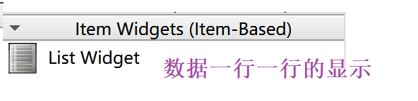
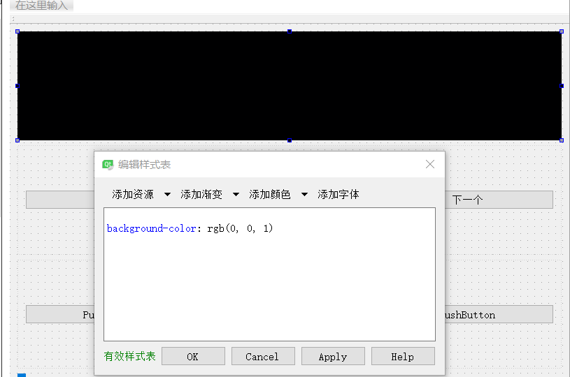
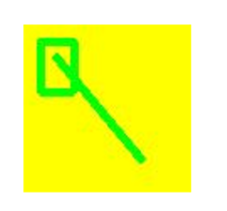
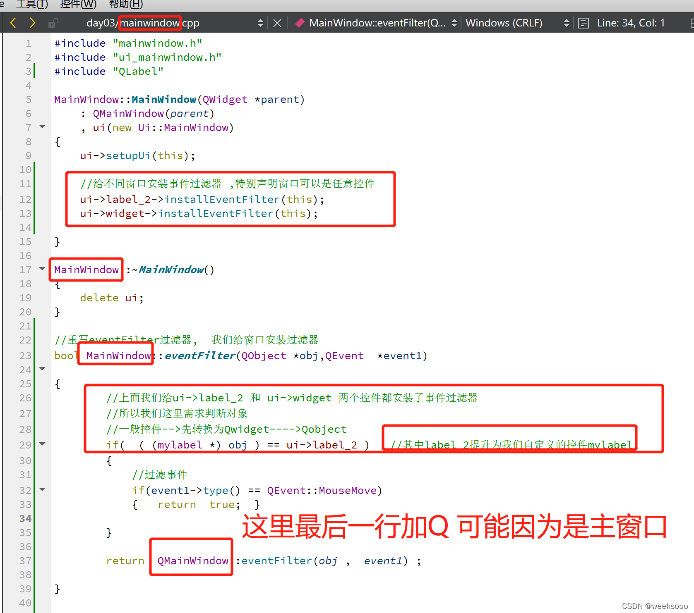

程序运行发布和设置APP图标


## 程序运行发布(给别人电脑上能够正常运行):

+  **用  release** 下创建


+ 得到 exe文件


+ 拷贝exe文件道要发布的文件夹里

  


+ 借助工具-->自动生成exe文件的一系列依赖

     添加好环境变量就能直接使用工具      windeployqt

  


+ 最终结果(可以打包成压缩包)


## 设置APP图标

+ 原本的:(比较丑)


+ **修改方式 ** 如下:   

1. 网上找 .ico后缀的图片
2. 把图片放到源代码中,注意不是release中
3. 添加一行代码
4. 


-------------------


#   QMainWindow、QWidget、QDialog的区别

**QMainWindow 类提供一个有菜单条、锚接窗口（例如工具条）和一个状态条的主应用程序窗口。** 主窗口通常用在提供一个大的中央窗口部件（例如文本编辑或者绘制画布）以及周围菜单、工具条和一个状态条。QMainWindow常常被继承，因为这使得封装中央部件、菜单和工具条以及窗口状态条变得更容易，当用户点击菜单项或者工具条按钮时，槽会被调用。

**QWidget类是所有用户界面对象的基类。** 窗口部件是用户界面的一个基本单元：它从窗口系统接收鼠标、键盘和其它事件，并且在屏幕上绘制自己。每一个窗口部件都是矩形的，并且它们按Z轴顺序排列。一个窗口部件可以被它的父窗口部件或者它前面的窗口部件盖住一部分。

**QDialog 是最普通的顶级窗口。** 一个不会被嵌入到父窗口部件的窗口部件叫做顶级窗口部件。通常情况下，顶级窗口部件是有框架和标题栏的窗口（尽管使用了一定的窗口部件标记，创建顶级窗口部件时也可能没有这些装饰。）在Qt中，QMainWindow和不同的QDialog的子类是最普通的顶级窗口

##  选用原则

1. **如果是主窗体**，则基于QMainWindow创建。
2. 如果是顶级对话框，则基于QDialog创建。
3. **如果需要嵌入到其他窗体中**，则基于QWidget创建
4. 如果不确定，或者1 2两种情况都有，那么，就选择QWidget。


-------------

- 


# 项目文件组成及分析

Qt项目文件

- [介绍一下项目管理文件（.pro文件）](https://blog.csdn.net/weixin_43288201/article/details/105105777#pro_10)
- [Qt的main介绍](https://blog.csdn.net/weixin_43288201/article/details/105105777#Qtmain_49)
- [Qt的widget.h介绍](https://blog.csdn.net/weixin_43288201/article/details/105105777#Qtwidgeth_72)
- [Qt的widget.cpp介绍](https://blog.csdn.net/weixin_43288201/article/details/105105777#Qtwidgetcpp_92)
- - [Widget::Widget(QWidget *parent) : QWidget(parent)](https://blog.csdn.net/weixin_43288201/article/details/105105777#WidgetWidgetQWidget_parent__QWidgetparent_109)

在 Qt Creator 中新建一个 Widget Application 项目 samp2_1，在选择窗口[基类](https://so.csdn.net/so/search?q=基类&spm=1001.2101.3001.7020)的页面选择 QWidget 作为窗体基类，并选中“Generate form”复选框。创建后的项目文件目录树如图 1 所示。
图 1 项目文件的目录树
这个项目包含以下一些文件：#千锋教育#

- 项目管理文件 samp2_1.pro，存储项目设置的文件。
- 主程序入口文件 main.cpp，实现 main()函数的程序文件。
- 窗体界面文件 widget.ui，一个 XML 格式存储的窗体上的元件及 其布局的文件。
- widget.h 是所设计的窗体类的头文件，widget.cpp 是 widget.h 里 定义类的实现文件。C++ 中，任何窗体或界面组件都是用类封装的，一个类一般有一个头文件（.h 文件）和一个源程序文件（.cpp 文件）。


## 一. 项目管理文件（.pro文件）

**后缀为“.pro”的文件是项目的管理文件，文件名就是项目的名称，如本项目中的 samp2_1.pro。 下面是 samp2_1.pro 文件的内容。**

- ```c++
  QT       += core gui	//包含的模块
  //QT       += sql  // 需要sql
  greaterThan(QT_MAJOR_VERSION, 4): QT += widgets	  //大于Qt4的版本 才需要包含widgets
  TARGET = samp2_1		//应用程序名 生成的.exe文件名
  TEMPLATE = app			//模板类型 应用程序模板
  SOURCES += \			//包含的源文件
          main.cpp \
          widget.cpp
  HEADERS += \			//包含的头文件
          widget.h
  FORMS += \				//包含的ui文件
          widget.ui
  
  ```

  

项目管理文件用于记录项目的一些设置，以及项目包含文件的组织管理。

- ```
  “Qt += core gui”表示项目中加入 core gui 模块。core gui 是 Qt 用于 GUI 设计的类库模块，
  如果创建的是控制台（Console）应用程序，就不需要添加 core gui。
  ```

  

Qt 类库以模块的形式组织各种功能的类，根据项目涉及的功能需求，在项目中添加适当的类库模块支持。例如，如果项目中使用到了涉及数据库操作的类就需要用到 sql 模块，在 pro 文件中需要增加如下一行：

```
Qt +=sql
```

samp2_1.pro 中的第 2 行是：

```
greaterThan(Qt_MAJOR_VERSION, 4): Qt += widgets
```

这是个条件执行语句，表示当 Qt 主版本大于 4 时，才加入 widgets 模块。

- ```
  “TARGET = samp2_1”表示生成的目标可执行文件的名称，即编译后生成的可执行文件是 samp2_1.exe。
  
  “TEMPLATE = app”表示项目使用的模板是 app，是一般的应用程序。
  ```

  

后面的 SOURCES、HEADERS、FORMS 记录了项目中包含的源程序文件、头文件和窗体文件（.ui 文件）的名称。这些文件列表是 Qt Creator 自动添加到项目管理文件里面的，用户不需要手动修改。当添加一个文件到项目，或从项目里删除一个文件时，项目管理文件里的条目会自动修改。

## 二. main.cpp介绍

main.cpp

- ```c++
  #include "widget.h"
  #include <QApplication>
  
  int main(int argc, char *argv[])
  {
      //QApplication 应用程序类 初始化我们的应用程序
      QApplication a(argc, argv);
  
      //创建一个窗口控件
      Widget w;
  
      //显示一个窗口  hide隐藏窗口
      //窗口默认是隐藏的
      w.show();
  
      //a.exec() 主事件循环（带阻塞 等待用户操作界面）
      return a.exec();
  }
  ```

  

## 三. Qt的widget.h介绍

widget.h

```c++
#ifndef HELLOWORLD_H
#define HELLOWORLD_H

#include <QWidget>

namespace Ui {  // 名称空间
class HelloWorld;  //自动生成的ui-xxx文件
}

class HelloWorld : public QWidget   //HelloWorld 和上面的那个不是一会事,只是同名.   // 这个是继承 QWidget
{
    Q_OBJECT  // 宏 //让Widget支持信号和槽机制

public:
    explicit HelloWorld(QWidget *parent = 0);  // 构造
    ~HelloWorld();  // 析构

private:
    Ui::HelloWorld *ui;  //通过ui 指向ui界面的组件
};

#endif // HELLOWORLD_H

```


## 四.Qt的widget.cpp介绍

- ```c++
  #include "helloworld.h"
  #include "ui_helloworld.h"
  
  HelloWorld::HelloWorld(QWidget *parent) :      // 派生类的构造函数   //QWidget(parent)是基类的构造函数
      QWidget(parent),        // Widget是调用了QWidget下面的构造函数
      ui(new Ui::HelloWorld)  // 成员初始化列表的方式
  {
      ui->setupUi(this);   // setupUi()一个函数,实现各种基础功能 //界面的设计是在 窗口控件的构造函数中设计
  }
  
  HelloWorld::~HelloWorld()  //析构
  {
      delete ui;
  }
  
  ```

  

Widget::Widget(QWidget *parent) : QWidget(parent)

既然调用了QWidget(parent)这个构造函数，QWidget父类都做了哪些动作呢？
下面是QWidget源码中的一部分节选：

- ```c++
  QWidget::QWidget( QWidget *parent, const char *name, WFlags f )
      : QObject( parent, name ), QPaintDevice( PDT_WIDGET ),
        pal( parent ? parent->palette()		// use parent's palette//使用父母的板
             : *qApp->palette() )			// use application palette
  {
      if ( parent ) {
  	QChildEvent *e = new QChildEvent( Event_ChildInserted, this );
  	QApplication::postEvent( parent, e );
      }
  }
  
  ```

  

从上面可以看出，如果parent参数非空的话，那么该构造函数使用了其父窗口的调色板，并且发送了QChildEvent事件，这会让新的窗口成为parent所指窗口的子窗口，那么当父窗口被删除时，子窗口也会自动的被删除。


## 五ui_widght.h文件

自动生成的


------------------


#  **main（）认识：**

 **快捷键**

//注释  ctrl + /
//运行  ctrl + r
==//保存  ctrl + s==
==//编译  ctrl + b==
//查找  ctrl + f
//字体缩放 ctrl+ 鼠标滚轮
==//帮助文档  f1==
==//自动对齐  ctrl + i==
==//同名之间的.h 和.cpp文件的切换 f4==

+  2，文件名和创建路径==一定不能用中文==

+  **QT中main（）认识：**

+  

+++++

 **QT有的类为什么不添加头文件也能直接使用原因**：

==类继承很复杂你已经添加头文件中已经引入其他类的头文件了==

++++

**代码化ui设计的原则:**

+  能用可视化u的方式就用可视化的方式,有些组件不能通过ui的方式就用代码

-------------


#   知识点一: 按钮的使用与窗体的简单设置


**代码化ui设计的原则 :**

+  **能用可视化u的方式就用可视化的方式,有些组件不能通过ui的方式就用代码**

--------------

  + 1. \#include <QPushButton>

    2. QPushButton  * btn3 = new  QPushButton("按键内容" , this);  

    2. 尽量别再方法中声明按钮

    3.  **内存自动回收：** 

    4. ```
           QT中的对象指针在满足下列情况会自动回收内存
           // 1. 从QObject派生的类 1.直接 2.间接
           // 2. 指定父类, 父亲析构的时候,先析构他的孩子
           // 创建自定义按钮对象
       QPushButton的常用信号：&QPushButton::clicked  
       ```
       
    3. 窗体相关属性设置：
       
       **下列全是方法**
       
       ```c++
       show()方法  //默认是会以顶层方式重新弹出来一个窗口
       
       move（x,y）  //改变子窗位置
       
       """
       setText(”文本“) 设置文本   <=> QPushButton  * btn3 = new                                                                                       QPushButton("文本" ,this); 
       setParent（this）设置父类  <=>
       """
       
       resize(600,1200);   //设置窗口大小，左上角是原点 
       
       setFixedSize(600,800); //设置固定窗口的大小,不能被移动
       
       setWindowIcon(QIcon("E:\\1.jpg图片路径")); //给窗口加图标
       
       setWindowTitle（”标题“） //设置窗口标题
       
       //当前主窗口的宽度与高度
       int a = this->width();   
       int b = this->height() ;
       

+ **资源文件：**

  + 设置图片（==setWindowIcon(QIcon("E:\\1.jpg图片路径")); //给窗口加图标== ）
  + 


# 对象树

+ **当创建一个以另一个对象作为父对象的QObject时，它被添加到父对象的children()列表中，并在父对象是时被删除。**

+ **但关闭窗口时,组件是依附窗体,会自动关闭. 所以不用delete**

+ **内存自动回收:**

  ```c++
  QT中的对象指针在满足下列情况会自动回收内存
  // 1. 从QObject派生的类 1.直接 2.间接
  // 2. 指定父类, 父亲析构的时候,先析构他的孩子
  // 创建自定义按钮对象
  ```

  

  


# 知识点二: 信号槽机制(重要)(难点)

signal and slot

  + 

##  普通信号普通槽(系统自带)


+ 例如QPushButton的父类QAbstractButton 有Signals里面有 **clicked , pressed , released,toggled**
    ​
+ 信号和槽函数 都是函数,
+ **信号只需要声明(只是函数的声明)**（需要发出去时要用emit发送）,不需要函数定义 ,  
+ **槽需要声明和定义**,属于回调函数  
+ **使用connect()**

```c++
// 需求 点击上面的btn按钮,执行窗口关闭动作  

    //建立两者的连接:  connect(btn, 发出的信号, this, 处理信号的槽函数);

    connect(&btn, &QPushButton::clicked, this, &MyWidget::close);

    /*      格式:  & + 信号发出者类的名字 + :: + 信号的名字
     * b1: 信号的发出者, 此参数必须是是一个指针
     * &QPushButton::clicked: 信号发出者, 内部的一个信号   // 在类以外直接用类的属性或者方法 用::
     * this: 信号的接收者, 此参数是一个指针
     * &MyWidget::close: 信号的处理函数, 属于this
    */ emit
```

==**注意：是发出槽函数的类，不一定是qt自带的类**==

1. 槽函数可以发出信号或者自己做某些功能
2. 一个信号可以触发另一个信号，
3. 一个信号关联多个槽函数

--------


### 自定义槽函数

不创建新的c++的情况

1. 声明


2. 定义


3. 使用


### 重点  看 Signal_Slot的代码


## **自定义信号和槽函数 **

定义对象->声明一个槽函数->定义一个槽函数：写明具体功能

==回去： 先通过槽函数发出信号 ，主窗口接受再发过来信号  （定义一个槽函数和信号（目的通过这个槽函数发起信号）再主窗口定义一个槽函数去接受发过来的信号==

```ASN.1
// 自定义槽函数
    /*
     * 1. 槽函数在Qt5 可以是任意类成员函数, 全局函数, 静态函数, lambda表达式(隐式函数)
     * 2. 槽函数需要与信号对相应(返回值, 参数)
     * 3. 信号,槽函数返回值是: void
     定义成共有部分
     * 4. void mysig(int, double, QString);
     *    void myslot(int, double);
     * 5. 槽函数的参数是为了接受信号传过来的的数据
     * 6. 槽函数的参数应该是不能够大于信号的参数个数, 可以少于信号的参数个数
     * 7. 槽函数可以重载，注意槽函数重载了，必须使用函数指针QT的格式: void (Subwigdet::*MySigSub)() = 
                                                                           &Subwigdet::sigSub;
     
     * 8. emit发信号
```

**需要新建一个.cpp文件**

+ 在signals下面定义信号

+ 在public slots:下声明槽函数

  

**代码**：


### 定义槽函数

```c++
mainwidget.h文件
    
#ifndef WIDGET_H
#define WIDGET_H

#include <QWidget>
#include<QPushButton>
#include<subwigdet.h> //a自己添加的类在那用就要include

class Widget : public QWidget
{
    Q_OBJECT

public:
    Widget(QWidget *parent = 0);
    ~Widget();

private:
    QPushButton* btn;
    QPushButton b1;
    //a1
    QPushButton* b3;

 //1自定义槽函数
    void slotForwidget();

    void slotHideme(); // a4
 
    //创建一个子窗口对象（a）
    Subwigdet subw;       //b2  // 创建一个子窗口对象 Subwidget: 就是封装了一个子窗口
    //  b 槽函数
    void slotshowme();   //b3
    void slotsubmsg(int num, QString str); //c

};

#endif // WIDGET_H


```

```c++
mainwidget.cpp文件

#include "widget.h"
#include<QPushButton>
#include<QDebug>  //输出

Widget::Widget(QWidget *parent)
    : QWidget(parent)
{
    btn = new QPushButton("按钮",this);
    btn->move(300,200);

    this->setWindowTitle("fcc");
    this->setWindowIcon(QIcon("c:\\Users\\16658\\Desktop\\q"));
    connect(btn,&QPushButton::clicked,this,&Widget::close);

    //1定义槽函数：
    b1.setText("老二");
    b1.setParent(this);
    connect(&b1,&QPushButton::released,this,&Widget::slotForwidget); // 简单的使用自定义槽函数


    //a2
    b3 = new QPushButton("软件园",this);
    b3->move(200,200);
    b3->resize(100,50);
    connect(b3,&QPushButton::clicked,this,&Widget::slotHideme);  //a3开始定义槽函数
    //a进去子窗口之后在回到主窗口b1
    //b2开始设置信号和信号接收对象
    void (Subwigdet::*MySigSub)() = &Subwigdet::sigSub;  //函数指针
    connect(&subw,MySigSub,this,&Widget::slotshowme);   //slotshowme槽函数

    void (Subwigdet::*MysigPlus)(int,QString) = &Subwigdet::sigSub; //函数指针
    connect(&subw,MysigPlus,this,&Widget::slotsubmsg);  //槽函数重载c //函数指针,如果你的信号或者超发生重载就要使用函数指针

}
Widget::~Widget(){}
//1
void Widget::slotForwidget()
{
    b1.setText("修改了");
}

//a5 写槽函数的目的  写明具体功能
void Widget::slotHideme()
{
    //隐藏自己（主窗口）
    hide();
    //显示软件园窗口 a6去编写子窗口按钮
    subw.show();
}

//b
void Widget::slotshowme()  //slotshowme
{
    //显示自己
    show();
    //软件园窗口
    subw.hide();
}
//显示一下发过来的重载信号
void Widget::slotsubmsg(int num, QString str)
{
    qDebug() << num << str;
}

```

-----------


### 定义信号

```c++
subwidget.h

#ifndef SUBWIGDET_H
#define SUBWIGDET_H

#include <QWidget>
#include<QPushButton>

//Subwiget是一个窗口类但是一个子窗口
class Subwigdet : public QWidget
{
    Q_OBJECT
public:
    explicit Subwigdet(QWidget *parent = nullptr);

signals:
    //在signals下面定义信号
    void sigSub();        //b2
    //1,可以有参数
    //2,可以重载
    //3,返回zhi为void
    //4,发送信号： emit + 信号名
                //emit sigsub()；
    void sigSub(int,QString); //c


public slots:
    void myslot();        //b3

private:
    QPushButton* b1; //a7（1）

};

#endif // SUBWIGDET_H

```


```c++
subwidget.cpp

#include "subwigdet.h"

Subwigdet::Subwigdet(QWidget *parent) : QWidget(parent)
{
    //b7 子窗口的编写
    b1 = new QPushButton("中层",this);
    b1->resize(100,100);
    b1->setWindowTitle("软件园窗口");
    resize(400,600);

    //a进去子窗口之后在回到主窗口b
    connect(b1,&QPushButton::clicked,this,&Subwigdet::myslot);  //myslot() 子窗口的槽函数

}

//b  子窗口的槽函数
void Subwigdet::myslot()
{
    //发出信号
    emit sigSub();
    emit sigSub(250, "二百五"); //c
}

```

重点：

==**注意：是发出槽函数的类，不一定是qt自带的类**==

==**信号的发出者, 此参数必须是是一个指针**==

==**尽量别再方法中声明按钮**==,除非用动态对象时

==**要用就必须连用  public slots:和  signals: 在去定义相应的槽函数和信号**==


-----------------------------


# QT的输出qDebug()函数

**qDebug()  <<**

```c++
#include <QDebug>

qDebug() << "hello , 您好";

int num = 18;
QString str = "小魔女琪琪";
qDebug() << num << str;
qDebug() << num << str.toUtf8().data();  //如果出现中文乱码的情况,可以这样
```


# QStrnglist  所有字符串的列表

**返回包含子字符串 str 的所有字符串的列表：**

1. ```c++
   1.  QStringList list;
   2.  list << "Bill Murray" << "John Doe" << "Bill Clinton";
   ```

   


# 知识点四: QT中的lambda表达式


+ **lambda作为槽函数就不需要额外的定义了 **（槽函数简单的时候用来直接代替槽函数）`,当然这种方式需要在 .pro文件中 引入c+11的特性,因为lambda是c++11的一个特性,引入命令`

+ 1.**CONFIG += c++11**

+ 2.

  connect(对象, &+ 信号发出者类的名字 + :: + 信号的名字,对象，【=】()
  
  {    
  
  ​          **.............**
  
  });
  
  
  
  ==如：==
  
  
  

要的：

==**#include <QDebug>**==

==**qDebug() << "hello , 您好";**==


-----------------------

# 知识点五: 带UI界面的项目


## **通过ui->控件名**        访问到控件

## 一般情况下;   回去点击跳转到槽----->可以直接自动声明槽函数(方便)

+++++

## 各种控件作用


## Buttons控件


------

###  2.Radio Button  &&  Group Button

+ **成组使用, 只能单选.**


**组框一般与radio button 连用**  .  目的: 让几个成组的radio button不是同一个组的东西, 


### 3.Cheak Bax


​																**勾选后会有三种状态**


## List Widget控件


### 1.list Widget



####  additem(字符串)

==**使用在控件中添加一行内容 ：      additem（“一行内容”）**==：    可以是文本可以是 图片


------------

 **文本对齐方式**:     ==setTextAlignment()==    Alignment   对齐

----------------


#### addItems(list列表)


-------------


### 2. Tree Widget控件


基本


设计图标


------------------

再添加分支:


### 3.Table Widget

表格


+ 

```c++
Table Widget设置：
setRowCount（10） 设置行数   “肉”
setColumnCount（6）设置列数  “抗蒙”

QStringList list；
list <<  "" << "" << "" << "" ;  一次性加多个

setHorizontalHeaderLables(list)     以水平的方式设置上述内容
----------------------
setItem（row, col, list）                      以一行一行的设置内容
```

-->==

-------------


---------

## Containers控件


++++


---------


--------------


-------

**通过按钮才能切换控件**

stack wight 顾名思义一推控件


<!---->==**使用setCurrentIndex（索引）**==   **跳转到相应页面**   “可瑞婷大克斯”

+++++++


---------------


## Input Widget控件


...............


++++

##  自定义控件


++++


                                                                                                                                                                                                                                                                                                                                                                                                                                                                                                                                                                                                                                                                      

+++

QSpinBox ”死频波克斯 “和 horizontalSlider:   "死来爹儿"：


-----------------


**是和上面有所不同的**


代码：

```c++
子窗口.h
    
#ifndef SMALLWIDGET_H
#define SMALLWIDGET_H

#include <QWidget>

namespace Ui {
class SmallWidget;
}

class SmallWidget : public QWidget
{
    Q_OBJECT

public:
    explicit SmallWidget(QWidget *parent = 0);
    ~SmallWidget();

    // 获取值
    int getValue();
    // 设置值
    void SetValue(int value);

private:
    Ui::SmallWidget *ui;
};

#endif // SMALLWIDGET_H

```

```c++
子窗口.cpp

#include "smallwidget.h"
#include "ui_smallwidget.h"

SmallWidget::SmallWidget(QWidget *parent) 
    QWidget(parent
    ui(new Ui::SmallWidget)
{
    ui->setupUi(this);

    // 指向正确的函数版本,z   5/11
    void (QSpinBox::*sigValueChange)(int) = &QSpinBox::valueChanged;   // 指向正确的函数版本
    connect(ui->spinBox, sigValueChange, ui->horizontalSlider, &QSlider::setValue);

    connect(ui->horizontalSlider, &QSlider::valueChanged, ui->spinBox, &QSpinBox::setValue);
}

SmallWidget::~SmallWidget()
{
    delete ui;
}

void SmallWidget::SetValue(int value)
{
    if(value > 0 && value < 100)
    {
        ui->spinBox->setValue(value);
    }
}

int SmallWidget::getValue() //获取值
{
    return ui->spinBox->value();
}

```


**上述代码用指针函数的原因：该信号就是重载的**


##   lable标签控件

### 加图片\动态图片


```c++
#include <QMovie>    //加动态图片
```


```c++
{
    ui->setupUi(this);
    //显示文字
    ui->label->setText("I love you Rick!");  
    //显示图片
    ui->label_2->setPixmap(QPixmap(":/Image/Image/1.jpeg"));
    ui->label_2->setScaledContents(true);   // 缩放
    //显示动图
    QMovie *mv = new QMovie(":/Image/Image/2.gif");
    ui->label_3->setMovie(mv);
    ui->label_3->setScaledContents(true);  // 缩放
    mv->start();
}
```


<video src="../../QQ录屏20220701214808.mp4"></video>

------------


### 设置label的颜色：


```c++
background-color: rgb(0, 0, 1)
```



+++

--------------------


# ------------------------------------------------

# QMainWindow

## QMainWindow(代码版 )

###  **QMainWindow_菜单栏和工具栏**

​    // MenuBar

```c++
#include "mainwindow.h"
#include <QMenuBar>    // 创建菜单栏
#include <QToolBar>    // 创建工具栏
MainWindow::MainWindow(QWidget *parent)
    : QMainWindow(parent)
{
    resize(600,  400);
        
    // MenuBar
    QMenuBar *menubar = new QMenuBar(this);
    setMenuBar(menubar);  //设置进去主窗体

    //添加菜单选项
    QMenu *filename = menubar->addMenu("文件(&f)");  // 设置快捷键的方式 : f
    QMenu *editmnue = menubar->addMenu("编辑(&e)");
    QMenu *buildname = menubar->addMenu("构建(&b)");

    // 添加选项的动作 如: 新建,打开,关闭
    filename->addAction("新建文件");
    filename->addAction("打开文件");
    filename->addSeparator();      // 分隔线   [计] 分隔符
    filename->addAction("关闭文件");
        
        
    // ToolBar
    QToolBar *toolbar = new QToolBar(this);
    addToolBar(Qt::TopToolBarArea, toolbar);

    toolbar->addAction("新建");
    toolbar->addSeparator();  // 分隔线
    toolbar->addAction("打开");    

}
```


### QMainWindow_状态栏和停靠窗口

// QStatusBar

// QDockWidget

```c++
#include <QStatusBar>  // 状态栏
#include <QLabel>

.........
   
// QStatusBar
QStatusBar *stbar = new QStatusBar(this);
setStatusBar(stbar);
QLabel *label = new QLabel("状态栏",this);
stbar->addWidget(label);
```


----------------------


```c++
#include <QDockWidget>    //停靠窗口
#include <QTextEdit>     //用来做中心组件

...........

// QDockWidget
QDockWidget *dockwidget = new QDockWidget("小窗口", this);  // Dock 船坞 /停靠 /船厂
addDockWidget(Qt::LeftDockWidgetArea, dockwidget);   // 放在中心部件的相对位置

//Central widget
QTextEdit *edit = new QTextEdit(this);
setCentralWidget(edit);  // 设置成中心组件

```


## QMainWindow(ui界面版)

#### 1.**菜单栏**：

==single一般用==      **&QAction::triggered**

**快捷键:  (& 快捷键的符号)**

注意:  objectname 一定是中文

**默认是不能输入中问的但是可以之后手动修改,找到text修改成中文即可**


​                                                                                                                                                          **通过这个名字访问控件**


#### 2.**工具栏：**

拖拽的是菜单栏中的东西


**点击工具栏, 找到绿色区域 (其实绿色区域大部分都是这些)   :**


+++


#### 3.状态栏：

```c++
状态栏只能通过代码控制进行插入,可以插入widget派生的任何东西.

状态栏的名字默认叫statusBar  通过ui->statusBar访问
addWidget( 控件 )          将控件添加到状态栏 
```


**效果：**


++++


#### 4.  浮动窗口


----------

**浮动窗口：**


浮动窗口要使用show()方法   会以顶层方式重新弹出来一个窗口


---------------


--------------------


#### 5. 中心组件


--------------


# 设置图标

**使用代码的方式**

## 具体操作

+ **现自己 定义文件放好东西,再把这个文件夹加入资源文件** 
+ 

+ **添加新文件    选择   资源文件：**

+ + 

+ 命名 resourse

+ 前缀  :   /xxx

  

## 使用格式:


+  **":    +  前缀  + 文件名"**

+ ```
  设置控件的   setIcon()
  ```

  + ```
    设置窗口的图片（setWindowIcon(QIcon("E:\\1.jpg图片路径")); //给窗口加图标 ）
    ```

    


-----------------


# 对话框


## 模态和非模块对话框


**类型一:   模态对话框 ,特点弹出对话框不能操作其他窗口.**

**类型二:   非模态对话框 ,特点弹出对话框依然能操作其他窗口.**


**标准对话框 :**

+ 颜色对话框
+ 文件对话框
+ 字体对话框
+ 输入对话框
+ 消息对话框
+ 进度对话框
+ 错误信息对话框
+ 向导对话框

----------------------

## 知识点六：对话框

```ASN.1
类型一: 模态对话框 ,特点弹出对话框不能操作其他窗口.
```


--------------------


```ASN.1
类型二: 非模态对话框 ,特点弹出对话框依然能操作其他窗口.
```

解释一：


解释二：


####  要点：

+ **加一行 dialog->setModl(true);   // 阻塞 成为模态对话框**


**头文件 :**    #include<QDialog> 

第一种：**模态对话框**

​        **QDialog dig(this);  **       

​        **dig.exec();**    

或者   (推荐)

```c++
QDialog dialog = new QDialog(this);  
dialog->setModl(true);   // 阻塞
dialog->show()
dialog->setAttribute(Qt::WA_DeleteOnClose);
```

​			

第二种： **非模块对话窗**

​      **QDialog *  dig = new QDialog(this)  **

​     **dig->setAttribute(Qt::WA_DeleteOnClose); **    ///==Qt::WA_DeleteOnClose==主动关闭时候去析构      setAttribute（） 设     置属性

​     **dig->show();  **

==效果：==


----------------------------


##  知识点七：文件对话窗

```c++
//方法：
#include<QFileDialog>  //文件对话窗
#include<QMessageBox>   //提示对话框

connect(ui->selectFile,&QPushButton::clicked,this,[=]()
{
     QString filename = QFileDialog::getOpenFileName(this,"窗口名（“标题”）","窗口路径  （"C:\\"）"，"过滤条件") ; //会弹出相应窗口，并且返回打开文件的一个路径；
   
  //没有选择文件进行警告：
 if (filename.isEmpty()==true)
 {
      QMessageBox::warning(this,"warning","select file faild!");
      return;
  }
//ui->filePath->setText(filename); //把文件路径显示到到filePath文本窗口中
//创建文件对象,并打开文件（filename）：
//QFile file(filename);
    
}
```

==要点：==

**#include<QFileDialog>  //文件对话窗**

 **QString filename = QFileDialog::getOpenFileName(this,"窗口名（“标题”）", "窗口路径（"C:\\"）, "过滤条件")**

==效果：==


加了过滤条件的

+ **写字符串的内容都会显示**


+++


+++

## 消息对话框


### 问题对话框

==question:问题==


```c++
//方法：
#include <QMessageBox>
```

例子1.

```c++
QMessageBox::question(this,"erro","系统文件错误",QMessageBox::Ok   QMessageBox::Cancel,QMessageBox::Cancel);   //返回值是设置的按钮（QMessageBox::Cancel）
```

+++


例子2.

代码

```c++
//问題对活框
int ret1 = QMessageBox::question(this, "问题对话框", "你是否使用Qt", QMessageBox::Yes, QMessageBox::No);
if (ret1 == QMessageBox::Yes)
     qDebug() << "Great";
```


>

-----------


### 错误对话框

==critical:错误提示== ”亏提口“


### 警告对话框

### 提示对话框


--------------------------------


###  关于对话框

==about: 关于==

+ 不用设置按钮

```c++
//方法：
#include <QMessageBox>
```


------------------


-------------------


##  知识点九: 颜色对话框

**头文件**

```c++
#include <QColorDialog> //颜色对话框   ”卡勒儿“
```

创建方法:

法一:     省略去创建类

```c++
QColor color = QColorDialog::getColor(Qt::red, this) 
    
//QColorDialog::grtColor 的原因是 getColor是静态方法, 使用方法是== 类名::静态函数 
```


法二:  创建了类来使用(不推荐)

```c++
QColorDialog color = new QColorDialog(this);
```


> 

## 字体对话框 和 输入对话框

###  字体对话框

头文件

```c++
#include <QFontDialog>  //字体对话框   ”放特“
```


++++


### 输入对话框

 头文件 #include<QInputDialog>


```c++

    bool ok;
    QString string  = QInputDialog::getText(this, "输入字符串对话框", "请输入用户名", QLineEdit::Normal, "hello", &ok);
    if (ok)
        qDebug() << "string" << string;

    // 输入整数对话框
    int value = QInputDialog::getInt(this, "输入整数对话框", "请输入0--100", 0, 0, 100, 1,&ok);
    if (ok)
        qDebug() << "value" << value;
```

效果:


--------------------------


## 进度对话框

==Progress: 进程==


+ **没有静态方法,只能创建类对象的方式**
  + 用new的方式创建的话，如果不delete它就会一直存在.所以不用new的方式


代码:

```c++
 QProgressDialog prodlg("复制内容","取消", 0, 50000, this);
    prodlg.setWindowTitle("复制文件");
    prodlg.setWindowModality(Qt::WindowModal);  // 设置模态
    prodlg.show();
    for (int i = 0; i< 50000; i++)
    {
        prodlg.setValue(i);  // 进度条
        QCoreApplication::processEvents();   // 检查是否有其他任务 // 相当于多进程
        if(prodlg.wasCanceled())  // 点击了取消
            break;
    }
    prodlg.setValue(50000);
     qDebug() << "拷贝完成";
```


---------


## 错误信息对话框

###  mesage对话框


+ **没有静态方法,只能创建类对象的方式**


#### 不带图片:


#### 带图片


## 导向对话框

**QWizard**        Wizard 向导


+ **没有静态方法,只能创建类对象的方式**


```c++
QWizard wizard(this);
 wizard.setWindowTitle("向导对话框");
 wizard.addPage(createPage1);   // 设置页面
 wizard.addPage(createPage2);
```


-----------------


## 对话框的总结

字体对话框 ,   输入对话框   === 需要   bool ok


进度对话框,   错误信息对话框,   导向对话框              ===没有静态方法, 使用类就好不用指针.


关于对话框            === 不用设置按钮


--------------


## 知识点十二: QString（格式化输出）

**qt字符串的拼接**：


# ---------------------------------------------


# 事件

### 1.鼠标事件


#include <QMouseEvent>

子窗口==.h文件：==

```c++
#ifndef MYLABEL_H
#define MYLABEL_H

#include <QLabel>        //自己修改的

class MyLabel : public QLabel   //自己修改的
{
    Q_OBJECT
public:
    explicit MyLabel(QWidget *parent = 0);

signals:

public slots:

protected:
    // 鼠标进入
    void enterEvent(QEvent *);
    // 鼠标离开
    void leaveEvent(QEvent *);
    // 鼠标按下
    void mousePressEvent(QMouseEvent *ev);
    // 鼠标释放
    void mouseReleaseEvent(QMouseEvent *ev);
//    // 鼠标移动
    void mouseMoveEvent(QMouseEvent *ev);
    
};

#endif // MYLABEL_H

```

子窗口==.cpp文件：==

```c++
#include "mylabel.h"
#include <QMouseEvent>

// QWidget 默认是不追踪鼠标事件的
MyLabel::MyLabel(QWidget *parent) : QLabel(parent)
{
    // 设置窗口追踪鼠标键
    this->setMouseTracking(true);
}

// 进入还是离开边界的一瞬间来完成的
// 鼠标进入
void MyLabel::enterEvent(QEvent *)
{
    setText("你不要在我身上乱摸!!!!");
}

// 鼠标离开
void MyLabel::leaveEvent(QEvent *)
{
    setText("终于离开了...");
}

void MyLabel::mousePressEvent(QMouseEvent *ev)
{
    // 字符串拼接 QString().arg()
    // %1, %2, %3 -- 占位符
    QString btn;
    if(ev->button() == Qt::LeftButton)
    {
        btn = "LeftButton";
    }
    else if(ev->button() == Qt::RightButton)
    {
        btn = "RightButton";
    }
    else if(ev->button() == Qt::MidButton)
    {
        btn = "MidButton";
    }
    QString str = QString("MousePree[%3]:(%1, %2)").arg(ev->x()).arg(ev->y()).arg(btn);

    setText(str);
}

void MyLabel::mouseReleaseEvent(QMouseEvent *ev)
{
    QString btn;
    if(ev->button() == Qt::LeftButton)              // button()表示瞬间的状态

    {
        btn = "LeftButton";
    }
    else if(ev->button() == Qt::RightButton)
    {
        btn = "RightButton";
    }
    else if(ev->button() == Qt::MidButton)
    {
        btn = "MidButton";
    }
    QString str = QString("MouseRelease[%3]:(%1, %2)").arg(ev->x()).arg(ev->y()).arg(btn);

    setText(str);
}

 
//鼠标移动   // buttons() 按住
void MyLabel::mouseMoveEvent(QMouseEvent *ev)
{
    QString btn;
    if(ev->buttons() & Qt::LeftButton )
    {
        btn = "LeftButton";
    }
    else if(ev->buttons() & Qt::RightButton)
    {
        btn = "RightButton";
    }
    else if(ev->buttons() & Qt::MidButton)
    {
        btn = "MidButton";
    }
    QString str = QString("MouseMove[%3]:(%1, %2)").arg(ev->x()).arg(ev->y()).arg(btn);

    setText(str);
}


```

==要点：==

+ 1.鼠标函数用 protected方式定义

+ 2.button（）==  表示瞬间的状态

   + 3.buttons（）&  表示一种连续的方法
   + 把创建的class c++ 文件（不是qt设计文件） 的.h文件 更改类为自己想定义的类  看上面代码


>
>
>


**例子2:**


```c++
#ifndef WIDGET_H
#define WIDGET_H

#include <QWidget>

namespace Ui {
class Widget;
}

class Widget : public QWidget
{
    Q_OBJECT

public:
    explicit Widget(QWidget *parent = 0);
    ~Widget();

private:
    Ui::Widget *ui;
    QPoint pos;     //当前窗体的位置

protected:
    // 鼠标按下
    void mousePressEvent(QMouseEvent *event);
    //鼠标释放
    void mouseReleaseEvent(QMouseEvent *event);
    //鼠标双击事件
    void mouseDoubleClickEvent(QMouseEvent *event);
    //鼠标移动
    void mouseMoveEvent(QMouseEvent *event);
    // 滚轮
    void wheelEvent(QWheelEvent *event);
};

#endif // WIDGET_H

```


```c++
#include "widget.h"
#include "ui_widget.h"
#include <QMouseEvent>
#include <QDebug>

Widget::Widget(QWidget *parent) :
    QWidget(parent),
    ui(new Ui::Widget)
{
    ui->setupUi(this);
}

Widget::~Widget()
{
    delete ui;
}

void Widget::mousePressEvent(QMouseEvent *event)
{
    if(event->button() == Qt::LeftButton)
    {
        // 左键被按下
        qDebug() << "Left Button is pressed.";
        //qDebug() << "x = " << event->x() << ", y = " << event->y();   // 显示坐标
        qDebug() << "x = " << event->globalX() << ", y = " << event->globalY();  // 全局的相当于桌面的的坐标
    }
    else if(event->button() == Qt::RightButton)
    {
          qDebug() << "Right Button is pressed.";
          qDebug() << "x = " << event->x() << ", y = " << event->y();
    }
}

void Widget::mouseReleaseEvent(QMouseEvent *event)
{
        qDebug() << "Button is released";
}


void Widget::mouseDoubleClickEvent(QMouseEvent *event)
{
    // 目的是左键双击,设置成全屏
    if(event->button() == Qt::LeftButton)
    {
        if(windowState() != Qt::WindowFullScreen)
        {// 不是全屏
            setWindowState(Qt::WindowFullScreen); // 设置成满屏
        }
        else
        {
            setWindowState(Qt::WindowNoState);   // 再次双击就是回到初始化的状态
        }
    }
}

// 移动
void Widget::mouseMoveEvent(QMouseEvent *event)
{
    if(event->buttons() & Qt::LeftButton)
    {
        QPoint temp;  //坐标点

        temp = event->globalPos() - pos;   // 全局位置 - 当前窗体的位置
        move(temp);  // 进行窗体移动
    }
}


//滚轮-->放大字体之类的
void Widget::wheelEvent(QWheelEvent *event)
{
    if(event->delta() > 0)
        ui->textEdit->zoomIn();  // 向上滚放大
    else
        ui->textEdit->zoomOut();
}

```


----------


###  2.定时器


+ **定时器—>第一种写法**:
+ 


```c++
.h文件：
// 定时器
void timerEvent(QTimerEvent *);


.cpp文件：
#include <QTimerEvent>

MyLabel::MyLabel(QWidget *parent) : QLabel(parent)
{
    // 启动定时器
    // 参数 1: 触发定时器的时间, 单位: ms
    // 参数2: 使用默认值
    // 返回值: 定时器ID
    id = startTimer(2000);
}
    
    
// 每触发一次定时器, 进入该函数中
void MyLabel::timerEvent(QTimerEvent *e)
{
    QString str;
    if(e->timerId() == id)
    {
        static int num = -100;
        str = QString("%1: %2").arg("Time out: ").arg(num++);
        if(num >= 100)
            killTimer(id); // 关闭定时器        
    }
 }   
```

++++


+ **定时器—>第二种写法**:


第二种定时器用法：（推荐)

```c++
第二种定时器用法：
    
#include <QTimer> //导入QTimer类
     
 QTimer * timer = new QTimer(this);
 timer->start(100);                                    //说明定时器每隔100ms触发一次
 connect(timer, &QTimer::timeout, this, [=]()          //&QTimer::timeout每到100ms就触发一次信号
 {
     static int number = 0;                            // 只初始化一次  // 静态的
     this->setText(QString::number(number++));    // QString::number转换
  });

// 每个一秒钟进行
```

++++


### 3.事件分发


-------------------


# 绘图

## 绘图基本操作—>QPainter

”屏特儿”


```c++
#ifndef WIDGET_H
#define WIDGET_H

#include <QWidget>

namespace Ui {
class Widget;
}

class Widget : public QWidget
{
    Q_OBJECT

public:
    explicit Widget(QWidget *parent = 0);
    ~Widget();

protected:
    /*
     *  1. 回调函数
     *  2. 此函数不需要用户与调用, 再刷新的时候会自定调用
     *      1. 窗口显示的时候
     *      2. 最大化, 最小化
     *      3. 窗口被这遮挡, 重新显示的时候
     *      4. 用户强制刷新的时候
     *      5. ...........
     *  3. 如果想使用画家类在窗口中画图, 操作必须在paintEvent函数中完成
    */
    void paintEvent(QPaintEvent *);  // 核心

private:
    Ui::Widget *ui;
 // int x;
};

#endif // WIDGET_H

```


**重点：在当前窗口实现绘画的话     就是在protected下定义  “画家函数” void paintEvent(QPaintEvent *);**

​                                                             **并且只能在画家函数下使用画家类**

### 核心

```c++
void Widget::paintEvent(QPaintEvent *)
{
    QPainter painter(this);

    // 设置画笔
    QPen pen(QColor(255, 0, 0));  // QColor()设置颜色agb
    pen.setWidth(3);  // 设置宽度
    pen.setStyle(Qt::DashDotLine);  // 画的线类型
    // 画家拿到画笔
    painter.setPen(pen);


    //两点确定一条直线
    painter.drawLine(QPoint(0,0), QPoint(100, 100));
    //圆心 a b --->椭圆
    painter.drawEllipse(QPoint(100,100), 20, 20);
    //左上角的坐标 长 宽 --->矩形
    painter.drawRect(100, 100, 10, 20);
    //坐标 字符串 -->设置文字
    painter.drawText(200, 200,"文字");  // 默认的字体
    QFont font("华文彩云", 48, 75, true);   //QFont 设置字体：
    painter.setFont(font);
    painter.drawText(100, 400, "我是中国人, 我爱我的祖国!!!");

   //设置画刷
    QBrush brush(Qt::green, Qt::Dense3Pattern); // 颜色 画刷类型
    painter.setBrush(brush);
    painter.drawRect(300, 300, 50, 80);

    //坐标 起始度数(0-360) 锥形渐变
    QConicalGradient conicalGradint(QPointF(200.0, 100.0), 0);  // QPointF 浮点型的坐标点
    conicalGradint.setColorAt(0.2, Qt::cyan);   // 渐变颜色->用给定的颜色在给定的位置创建一个停止点。给定位置必须在0到1的范围内。  Qt::cyan青色
    conicalGradint.setColorAt(0.4, Qt::black);
    conicalGradint.setColorAt(0.7, Qt::red);
    conicalGradint.setColorAt(1, Qt::yellow);
    painter.setBrush(conicalGradint);   // 必须使用画刷
    painter.drawEllipse(QPoint(250, 250), 50, 50);

}
```


+++

### **常见图形**

```c++
void Widget::paintEvent(QPaintEvent *)
{
    QPainter painter(this);

    // 两点确定一条直线
    painter.drawLine(QPoint(0,0), QPoint(100, 100));
    //圆心 a b --->椭圆
    painter.drawEllipse(QPoint(100,100), 20, 20);
    //左上角的坐标 长 宽 --->矩形
    painter.drawRect(100, 100, 10, 20);

}
```


--------


### **画笔**

```c++
// 设置画笔
QPen pen(QColor(255, 0, 0));  // QColor()设置颜色agb
pen.setWidth(3);  // 设置宽度
pen.setStyle(Qt::DashDotLine);  // 画的线类型
// 画家拿到画笔
painter.setPen(pen);
```

大致效果：


补充：


**重点：//#include <QFont>**

+++


### **画刷**

```c++
//设置画刷
QBrush brush(Qt::green, Qt::Dense3Pattern); // 颜色 画刷类型
painter.setBrush(brush);
painter.drawRect(300, 300, 50, 80);
```


==效果：==


+++


### **字体**

```c++
//坐标 字符串 -->设置文字
// 字体样式 字体大小 加粗 斜体
painter.drawText(200, 200,"文字");  // 默认的字体
QFont font("华文彩云", 48, 75, true);   //QFont 设置字体：
font。setUnderline(turn)  // 设置下划线
painter.setFont(font);
painter.drawText(100, 400, "我是中国人, 我爱我的祖国!!!");
```

大致效果：


补充：


----


### 锥形渐变

Conical  Gradient    n. 锥形渐变  抗你q  格瑞顶t

```c++
//坐标 起始度数(0-360) 锥形渐变
QConicalGradient conicalGradint(QPointF(200.0, 100.0), 0);  // QPointF 浮点型的坐标点
conicalGradint.setColorAt(0.2, Qt::cyan);   // 渐变颜色->用给定的颜色在给定的位置创建一个停止点。给定位置必须在0到1的范围内。  Qt::cyan青色
conicalGradint.setColorAt(0.4, Qt::black);
conicalGradint.setColorAt(0.7, Qt::red);
conicalGradint.setColorAt(1, Qt::yellow);
painter.setBrush(conicalGradint);   // 必须使用画刷
painter.drawEllipse(QPoint(250, 250), 50, 50);
```

大致效果：


补充

```c++
#include "widget.h"
#include "ui_widget.h"

#include <QPainter>
#include <QFont>

Widget::Widget(QWidget *parent) :
    QWidget(parent),
    ui(new Ui::Widget)
{
    x = 20;
    ui->setupUi(this);

 /* connect(ui->move, &QPushButton::clicked, this, [=]()
    {
       // 手动刷新窗口
       update();   // 系统调用paintEvent 函数
    });
 */
}

Widget::~Widget()
{
    delete ui;
}


void Widget::paintEvent(QPaintEvent *)    //定义画家类
{
    // 创建画家类对象
    QPainter p(this);   // 指定绘图设备（重要）

    // 创建新画笔 -- 轮廓
    QPen pen;
    pen.setColor(/*Qt::green*/QColor(0, 255, 0));
    pen.setWidth(10);   // 像素
    pen.setStyle(Qt::DotLine);
 
    // 闭合区域使用画刷  brush 刷
    QBrush brush(QPixmap(":/Image/face.png"));
    p.setBrush(brush);

    // 将新画笔设置给画家类
    p.setPen(pen);
    
    // 画背景图   drawPixmap
    p.drawPixmap(0, 0, QPixmap(":/Image/xks.png"));  //（0，0）表示开画的初始位置

    // 画直线
    p.drawLine(QPoint(100, 100), QPoint(300, 500));

    // 画椭圆
    p.drawEllipse(QPoint(200, 200), 100, 50);

    // 画矩形
    p.drawRect(400, 200, 200, 200);

    // 写字
    //QFont 设置字体：
    QFont font("华文彩云", 48, 75, true);
    p.setFont(font);
    p.drawText(100, 400, "我是中国人, 我爱我的祖国!!!");

    
  /*  提供海贼船：
    int width = this->width();
    int heght = this->height();
    x += 5;
    if(x > this->width()) //x如果大于窗口宽度就重新赋值
    {
        x = 20;
    }
    p.drawPixmap(x, 100, QPixmap(":/Image/sunny.png"));
   */
}
```


### 绘制容器--作用可以重复使用

```c++
QPainter painter(this);

// 使用容器
QPainterPath path;
path.moveTo(50, 250); // 起始位置
path.lineTo(50, 200); // 画直线
path.lineTo(100, 100);
path.addEllipse(QPoint(100, 100), 30, 30);
painter.setPen(QPen(Qt::red));
painter.drawPath(path);  // 绘制容器

path.translate(200, 0);
painter.setPen(QPen(Qt::blue));
painter.drawPath(path);  // 绘制容器
```

效果：


---------------


## 抗锯齿和坐标系变换

作用 是提高画纸。*抗锯齿*，也叫*反锯齿*，它的作用是边缘柔化，可以消除混叠等


### 1.抗锯齿

```c++
QPainter painter(this);
//1.反锯齿    Antialiasing /æntiˈeɪliəsɪŋ/ n.反锯齿  安题e零谁
painter.setRenderHints(QPainter::Antialiasing | QPainter::TextAntialiasing);  // 启动抗锯齿,会增加计算机额外负担
```


### 2.坐标轴变换

```c++
//2. 坐标系的变换
painter.drawLine(QPoint(10, 10), QPoint(100, 100));
painter.save();  // 保存当前坐标系
painter.translate(200, 0);  // 平移 像素点
painter.rotate(90);  // 旋转 度数   //rotate  v. （使）旋转，
painter.setPen(QPen(Qt::cyan, 5));
painter.drawLine(QPoint(10, 10), QPoint(100, 100));
painter.restore();  // 恢复坐标系
```

效果：


### 3.坐标轴缩放

**坐标和长宽都会变化**

```c++
//3. 坐标系缩放
painter.setPen(QPen(Qt::red));
painter.setBrush(Qt::yellow);
painter.drawRect(200, 200, 50, 50);
painter.save();
painter.scale(1.5, 2);   // 缩放  (nx,my)
painter.setBrush(Qt::cyan);
painter.drawRect(200, 200, 50, 50);
```


-------

### 4.坐标轴扭曲

 **x坐标轴扭曲表示: 左上角和右下角->撑**

```c++
//4.坐标系扭曲
painter.setPen(QPen(Qt::blue));
painter.setBrush(Qt::yellow);
painter.drawRect(100, 100, 50, 50);
painter.save();
painter.shear(1.5, 2);   // 扭曲  x坐标轴扭曲表示: 左上角和右下角
painter.setBrush(Qt::cyan);
painter.drawRect(100, 100, 50, 50);

```


---------------


## 手动调用绘图事件处理函数-----刷新窗口

### 案例1

```c++
#include "widget.h"
#include <QPainter>
#include <QTimer>

Widget::Widget(QWidget *parent)
    : QWidget(parent)
{
    angle = 0;

    QTimer * timer = new QTimer(this);
    timer->start(1000);
    connect(timer, &QTimer::timeout, [&](){
        update();  // 刷新 窗口
    });
}

Widget::~Widget()
{

}

void Widget::paintEvent(QPaintEvent *)
{
    angle += 10;
    if (angle == 360)
        angle = 0;
    QPainter painter(this);
    painter.setRenderHints(QPainter::Antialiasing | QPainter::TextAntialiasing);
    painter.translate(width()/2, height()/2);   // 坐标轴就在界面中心
    painter.drawEllipse(QPoint(0, 0), 120, 120);
    painter.rotate(angle); // 旋转
    painter.drawLine(QPoint(0, 0), QPoint(100, 0));

}
```


**效果：  指针会动**


--------------

###  案例2


**效果：  点击移动按钮船会动**


---------------


==要的：==

​        **手动刷新的是刷新 画家函数里的东西**

++++


## 知识点十六: 绘图设备（给画家的纸）





```c++
// QWidget
// QPixmap QImage QPicture QBitmap(黑白图片)
// QBitmap 父类 QPixmap
// QPixmap -- 图片类, 主要用来显示, 它针对于显示器显示做了特殊优化, 依赖于平台的, 只能在主线程中使用(UI线程)
// QIamge -- 图片(image)类 , 不依赖有平台（格式不会变）, (图片传输 , 可以在多线程中对其进行操作)

// 有绘图设备就不用非要画家函数了
```
+ 在QPixmap中画图:

```c++
// 在QPixmap中画图
    QPixmap pix(300, 300);  // 纸的大小（默认是黑色）

    pix.fill(Qt::red); // 设置一下纸的颜色

    QPainter p(&pix);    //创建一个画家

    p.setPen(QPen(t::green, 10));  //设置画家的画笔
    p.drawRect(10, 10, 280, 280);    //画个矩形
    p.drawEllipse(150, 150, 50, 50);  //画个圆

    pix.save("C:\\mypixmap.png");   //保存图片
```

+ > 指定绘图设备 1. 构造函数中(参数是绘图设备)如：如上：
  >
  > ​                          2.或者： begin(参数是绘图设备)和 end();   对应使用

  + 在QImage中画图：

```c++
// 在QImage中画图
    QImage img(300, 300, QImage::Format_RGB32);  // 纸的大小,指定格式

    img.fill(Qt::white)  //设置一下纸的颜色
        
    p.begin(&img);  // begin(参数是绘图设备) 和 end();   对应使用

    p.setPen(QPen(Qt::green, 10));  //设置画家的画笔
    p.drawRect(10, 10, 280, 280);    //画个矩形
    p.drawEllipse(150, 150, 50, 50);  //画个圆

    p.end();         // 2. begin(参数是绘图设备)和 end();   对应使用
    img.save("C:\\myImage.png")
```


+ 在QPicture中画图（只是一个绘图设备）:
   **作用：// 1. 保存的是  绘图步骤 -- 画家类**
               **// 2. 不是图片, 二进制文件(save保存生成的文件)（这个可以用任意后缀）**
              **// 3. 不依赖平台**
   

  ```c++
  在QPicture中画图:
       QPicture pic;  // 纸的大小（有默认值）（假纸）
       p.begin(&pic);
       p.setPen(QPen(Qt::green, 10));
       p.drawRect(10, 10, 280, 280);
       p.drawEllipse(150, 150, 50, 50);
       p.end();
       pic.save("C:\\mypic.aaa");
       //作用不依赖与平台
  ```

  > QPicture绘画完虽然以.jpg保存,但并不是 一个图片,而是绘图步骤,所以我们可以通过重写画家类把这个绘图步骤绘画出来.
  >
  > 可以使用任何的扩展名 , 如果我们要画一个机密图 ,就可以采用这种方式,别人即使得到我们的文件,也不一定知道我们是用QT中的Qpicture绘画出来的.

  

  ==**在窗口中画出来**==（相当于画背景图）
  
  ==**集合：**==

```
#include "widget.h"
#include "ui_widget.h"
#include <QPainter>
#include <QPicture>

Widget::Widget(QWidget *parent) :
    QWidget(parent),
    ui(new Ui::Widget)
{
    ui->setupUi(this);

    // 使用QPixmap画图
    QPixmap pixmap(300, 300);
    pixmap.fill();
    QPainter p;
    p.begin(&pixmap);
    p.setPen(QPen(Qt::red, 5));
    p.drawRect(10, 10, 280, 280);
    p.drawEllipse(QPoint(150, 150), 50, 50);
    p.end();
    pixmap.save("d:\\mypixmap.png");

    // 使用QImage 画图
    QImage image(300, 300, QImage::Format_RGB32);
    image.fill(Qt::yellow);
    p.begin(&image);
    p.setPen(QPen(Qt::blue, 5));
    p.drawRect(10, 10, 280, 280);
    p.drawEllipse(QPoint(150, 150), 50, 50);
    p.end();
    image.save("d:\\myimage.png");

    // 使用QPicture 画图
    QPicture pic;
    p.begin(&pic);
    p.setPen(QPen(Qt::blue, 5));
    p.drawRect(10, 10, 280, 280);
    p.drawEllipse(QPoint(150, 150), 50, 50);
    p.end();
    pic.save("d:\\mypic.pic");
}

Widget::~Widget()
{
    delete ui;
}

//在窗口中画出来
void Widget::paintEvent(QPaintEvent *)
{
    QPainter p(this);
    QPicture pic;
    pic.load("D:\\mypic.pic");
    p.drawPicture(10, 10, pic);
}

```


+++


## 知识点十七: 不规则窗口—>透明窗口


==**核心：**==

```c++
    // 去掉边框      Flags标志
    this->setWindowFlags(Qt::FramelessWindowHint);   
    // (框)设置背景透明：
    this->setAttribute(Qt::WA_TranslucentBackground);   //120 Attribute “啊崔bui特” 属性   //对话                                                          框的属性设置一样
```

**代码：**

.h文件：

```c++
#ifndef WIDGET_H
#define WIDGET_H

#include <QWidget>

namespace Ui {
class Widget;
}

class Widget : public QWidget
{
    Q_OBJECT

public:
    explicit Widget(QWidget *parent = 0);
    ~Widget();

protected:
    void paintEvent(QPaintEvent *);  //绘图事件
    
//下面代码不是蝴蝶动的代码：
    void mousePressEvent(QMouseEvent *); //重写鼠标事件  按压
    void mouseMoveEvent(QMouseEvent *);  //重写鼠标事件  移动

private:
    Ui::Widget *ui;
    
    QPoint pt;  // 差值
    bool fly;
    int x;
    int y;
};

#endif // WIDGET_H

```

.cpp文件：

```c++
#include "widget.h"
#include "ui_widget.h"
#include <QPainter>
#include <QMouseEvent>
#include<QTimer>

Widget::Widget(QWidget *parent) :
    QWidget(parent),
    ui(new Ui::Widget)
{
    ui->setupUi(this);
    // 加载图片 // 两张图
    QPixmap up;
    QPixmap down;     
    up.load(":/image/up");
    down.load(":/image/down");
    
    // 去掉边框：
    this->setWindowFlags(Qt::FramelessWindowHint);
    // (框)设置背景透明：
    this->setAttribute(Qt::WA_TranslucentBackground);  //120  //对话框的属性设置一样

    fly = true;
    // 定时器 设置时间间隔
    // QTimer
    // connect(timer, timeout, [=](){ 刷新窗口 });
    //定时器每个1s执行：
    QTimer* timer = new QTimer(this);
    timer->start(100);
    connect(timer,&QTimer::timeout,this,[=](){
        fly = !fly;
        qsrand(time(NULL));
        x = qrand()%20 + x;  //20以内
        y = qrand()%20 + y;

        //做一个边界判断
        if (x > this->width())
            x = 0;
        if (y > this->height())
            y = 0;
        if (x < 0)
            x = this->width();
        if (y < 0)
            y = this->height();

        update();  //更新窗口
    });

    //主窗口最大化
    this->showMaximized();
    
    qsrand(time(NULL)); //时间种子
    x = qrand()% this->width();
    y = qrand()% this->height();

//  QDesktopWidget* wg = QApplication::desktop(); //staric function//获取屏幕（显示器）的对象

}

Widget::~Widget(){delete ui;}

void Widget::paintEvent(QPaintEvent *)
{
    //在指定绘图设备
    QPainter p(this);
    // 在窗口中将图片画出来
    if (f)
        p.drawPixmap(x, y, up);
    else
        p.drawPixmap(x, y, down);

}

//下面代码不是蝴蝶动的代码：
/*
//右击鼠标关闭窗口,左键鼠标拖动:

//重写鼠标事件  按的操作
void Widget::mousePressEvent(QMouseEvent *e)
{
    if(e->button() == Qt::LeftButton)   //button是判断一瞬间的状态
    {
        // 求差值（ 鼠标左键按下的点 - 图像窗口坐上角的点坐标） 才是真鼠标移动的
        pt = e->globalPos() - this->frameGeometry().topLeft();  //this->frameGeometry().topLeft();
                                                                //返回的是窗口的位置信息
    }
    else if(e->button() == Qt::RightButton)  //按下鼠标右键就关闭
    {
        // close windows
        this->close();
    }
}

//重写鼠标事件  移动的操作
void Widget::mouseMoveEvent(QMouseEvent *e)
{
    // mvoe x , y 使用的是屏幕坐标系
    //而 e->x() , e->y() 是窗口的坐标系 Widget（看鼠标事件那章）

    this->move(e->globalPos() - pt);
}
*/
```

==效果：可以随机移动；并且可以扇翅膀（因为有两张翅膀）。==


+++


## 知识点十八: Qt中的随机数

```c++
生成随机数：
    
qsrand(time(NULL));
Int n1= qrand()%8;  //产生0-7d
```


# day04

## 知识点十九: 重写事件event/eventFilter–>过滤事件


事件分发器的规则是 :
`如果返回值true--代表事件被处理过了,不再向下分发,停止了.`
`false --事件没有被处理,会继续分发.`
event过滤事件是在event中进行拦截处理

**定时器的第一种写法:重写timerEvent**

需要在对应的.h文件中申明 `void timerEvent(QTimerEvent *envent);`

```c++
//需要在对应的.h文件中声明bool event(QEvent  *event1);

bool mylabel::event(QEvent  *event1)
{
    /*返回值
     * true --代表事件被处理过了,不再向下分发,停止了.
     * false --事件没有被处理,会继续分发.
    */
        if(event1->type() == QEvent::Timer ) //过滤定时器事件 
        {
            return  true;     //返回一个true就不会执行该操作

        }

        return  QLabel::event( event1) ;  // 让父类执行默认的处理

}

```

## 知识点二十: 事件过滤器eventFilter


.
步骤一: 给窗口安装事件过滤器,例如前面是给实例化的对象dsq
`dsp -> insatllEventFilter(this) ;`
.
步骤二: 需要在事件过滤器中处理





==   注意return的是主窗口的类 ==

## 知识点二十一: 

### QT文件读取

> 需求:点击选择文件按钮,就打开本地选择文件 ,右边的line Edit里面显示文件的路径,下面Text Edit显示文本内容

==效果：==


```c++
#include "widget.h"
#include "ui_widget.h"

#include<QFile>          //读取文件
#include<QFileDialog>    //文件对话框
#include<QMessageBox>    //提示对话框

Widget::Widget(QWidget *parent) :
    QWidget(parent),
    ui(new Ui::Widget)
{
    ui->setupUi(this);
    connect(ui->selectFile,&QPushButton::clicked,this,[=]()
    {
       //打开文件对话框:  
       QString filename = QFileDialog::getOpenFileName(this,"open file","C:\\") ;  
       //没有选择文件进行警告：
       if (filename.isEmpty()==true)
       {
           QMessageBox::warning(this,"warning","select file faild!");
           return;
       }
       
      
       ui->filePath->setText(filename); //把文件显示到到filePath文本窗口中

       //创建文件对象,并打开文件（filename）开始读取对象：
       QFile file(filename);
        
     //采用file对象读取 中文乱码转换：
      /* QT中读文件;默认读取的文件格式不是是utf-8,需要转换
//       #include <QTextCodec>
//       QTextCodec * textcode = QTextCodec::codecForName( "gbk") ;
//       setText(textcode->toUnicode(array));
*/

       //指定打开方式：
       bool a = file.open(QFile::ReadOnly);  // Readonly是只读 ， 返回值是bool
       //打开失败的情况：
       if (a == false){
           QMessageBox::critical (this  ,   "警告" , "文件打开失败");
           return ;
       }

       //读文件： //默认读取的文件格式是utf-8,也就是说如果你的txt文件是utf8格式的就正常显示 ,如果是gbk格式的就会乱码，用上述方法修改
       QByteArray array =  file.readAll() ;  //直接所有读取

    //一行一行读取：
    /*QByteArray array ;
     while (! file.atEnd())
     {    //如果不在最后一行,那么一直读:
          QByteArray array = array + file.readLine() ;
     }
    */

       //显示到textEdit文本框:
       ui->textEdit->setText(array);

       //关闭文件:
       file.close();
    });
}


Widget::~Widget()
{
    delete ui;
}
```


**//设置文件打开方式：file.open(QFile::ReadOnly)**

```
     * QIODevice::ReadWrite 可读写
     * QIODevice::Text 换行符生效
     * QIODevice::Append 追加写入
     * QFile::Truncate 表示将原文件清空
```

### QT文件写入


## 知识点二十二: QT中的文本流和数据流

### 文本流QTextStream的读写方式

> \#include <QTextStream>   //操作基础数据类型:  int , float , string

**文本流的读取方式**


**文本流的写入方式**：


+++

###   **数据流QDataStream的读写方式**

> #include <QDataStream>   //可以操作二进制类型: QImage  Qpoint  QRect ,不依赖于平台


不建议使用：


**对内存进行操作,读写内存**QByteArray（读写)

> 网络通信


## 知识点二十三: QFileInfo文件属性

```c++
#include <QFileInfo>
```


> 要的：间接放个文件   或者直接放一个路径

### QDateTime 获取系统时间

#include <QTimer>
#include <QDateTime>


## 知识点二十四: QT中的TCP通信

```
#include<QTcpServer>  // 监听套接字
#include<QtcpSocket>  // 通讯的套接字 “说剋特”
```


### 服务器端：

**.pro文件；**

```c++
QT       += core gui network
```

**.h文件：**

```c++
#ifndef SERVER_H
#define SERVER_H

#include <QWidget>

#include<QtcpSocket>       // 通讯的套接字    “说剋特”
#include<QtcpSocket>       // 监听套接字

namespace Ui {
class Server;
}

class Server : public QWidget
{
    Q_OBJECT

public:
    explicit Server(QWidget *parent = 0);
    ~Server();

private:
    Ui::Server *ui;
    QTcpServer* server;  //监听套接字
    QTcpSocket* conn; // 通讯的套接字
};

#endif // SERVER_H
```

**.cpp文件：**

```c++
#include "server.h"
#include "ui_server.h"

Server::Server(QWidget *parent) :
    QWidget(parent),
    ui(new Ui::Server)
{
    ui->setupUi(this);
        
    //ui实例化
    ui->sIp->setText("127.0.0.1");  //在sIp命名的文本窗口里设置127.0.0.1（本地）
    ui->sPort->setText("9999");
        
      
    //实例化 init
    server = new QTcpServer(this);
    //监听
    server->listen(QHostAddress(ui->sIp->text()), ui->sPort->text().toInt());  //port是字符串，用toint（）转化成整形值
    
      
    //链接(建立链接)【接受信号&QTcpServer::newConnection】
    connect(server,&QTcpServer::newConnection,this,[=]()
    {
       //接受客服端的套接字对象 accpept
       //sock_addr 结构体 == 相当于qt中的 类QTcpSocket
       conn = server->nextPendingConnection();  //监听请求队列拿到一个请求给“通讯”,初始化了conn .                                nextPendingConnection()接受客服端的套接字对象【及保存客户端的IP，port】
       ui->msg_record->append("有新的连接.....");
        
       //保证conn 是一个有效的对像
       //接受数据 【&QTcpSocket::readyRead】 （保证在连接成功的情况下接受数据）
       connect(conn,&QTcpSocket::readyRead,this,[=]()
       {
           QByteArray array = conn->readAll();  //conn->readAll();读取数据    QByteArray array接受返回值
           ui->msg_record->append("对方说的：" +array);   //接受到的数据也放到聊天记录文本框
       });
    });
   
        
    //发送数据【write】
    connect( ui->send,&QPushButton::clicked,this,[=]()
    {
        conn->write(ui->msg->toPlainText().toUtf8().data());  //访问发送的文本框内容，并发送数据   //toPlainText()返回值是QString 而write（）接受值是char*或QBytearrayy
//把QString转化成QBytearrayy 用.toUtf8().data()转化
        ui->msg_record->append("My Say: " + ui->msg->toPlainText() );  //在msg_record命名聊天记录文本框中显示聊天记录
        //clear
        ui->msg->clear();  //发送完成后清空 msg_record命名聊天记录文本框
    });
}

Server::~Server(){delete ui;}
```


==**要的：**==

+ **server->listen(QHostAddress(ui->sIp->text()),ui->sPort->text().toInt()   **
  + 建立连接**接受信号【&QTcpServer::newConnection】   用toInt（）转化成整形值**

+ **nextPendingConnection()接受客服端的套接字对象【及保存客户端的IP，port】**

+ **接受数据 【&QTcpSocket::readyRead】**

+ **conn->readAll();  接受读取数据**   

+ **发送数据【write（）】       .toPlainText().toUtf8().data()转换： 把QString转化成QBytearrayy**

+++

### 客户端：

客户端 .h 文件：

```c++
#ifndef CLIENT_H
#define CLIENT_H

#include <QWidget>
#include<QTcpSocket>
namespace Ui {
class Client;
}

class Client : public QWidget
{
    Q_OBJECT

public:
    explicit Client(QWidget *parent = 0);
    ~Client();

private:
    Ui::Client *ui;
    
    QTcpSocket* client;    // 通讯的套接字
};

#endif // CLIENT_H
```


客户端.cpp文件：

```c++
#include "client.h"
#include "ui_client.h"
#include<QHostAddress>

Client::Client(QWidget *parent) :
    QWidget(parent),
    ui(new Ui::Client)
{
    ui->setupUi(this);
    //ui实例化
    ui->sIp->setText("127.0.0.1");
    ui->sPort->setText("9999");

    //init
    client = new QTcpSocket(this);
        
    //链接(建立链接）  连接服务器    
    client->connectToHost(QHostAddress(ui->sIp->text()),ui->sPort->text().toInt());
        
    //接收数据:  [如果链接成功去]
    connect(client,&QTcpSocket::readyRead,this,[=](){
       //接受数据
        QByteArray array = client->readAll();  //client->readAll();读取数据    QByteArray array接受返回值
        ui->msg_record->append("对方说的：" + array);   //接受到的数据也放到聊天记录文本框
    });
        
        
    //发送数据
    connect( ui->send,&QPushButton::clicked,this,[=]()
    {
        client->write(ui->msg->toPlainText().toUtf8().data());  //访问发送的文本框内容，并发送数据   toPlainText()返回值是QString 而write（）接受值是char*或QBytearrayy
                                                              //把QString转化成QBytearrayy 用.toUtf8().data()转化
        ui->msg_record->append("Me Say: " + ui->msg->toPlainText() );  //在聊天记录文本框中显示聊天记录
        //clear
        ui->msg->clear();  //发送完成后清空
    });
}

Client::~Client()
{
    delete ui;

   
```

**要点：**//链接(建立链接）  连接服务器
    client->**connectToHost**(QHostAddress(ui->sIp->text()),ui->sPort->text().toInt())

+++

main.cpp文件：

```c++
#include "server.h"
#include <QApplication>
#include<client.h>           //添加客户端头文件

int main(int argc, char *argv[])
{
    QApplication a(argc, argv);
    
    
    Server w;
    w.show();
    w.setWindowTitle("server");
    w.setFixedSize(714,650);

    Client c;
    c.show();
    c.setWindowTitle("client");
    c.setFixedSize(496,430);


    return a.exec();
}
```


## 知识点二十五: QT中的UDP通信


**.pro文件；**   

```
+= core gui network
```

*.h文件：

```c++
#ifndef WIDGET_H
#define WIDGET_H

#include <QWidget>
#include<QUdpSocket>

namespace Ui {
class Widget;
}

class Widget : public QWidget
{
    Q_OBJECT

public:
    explicit Widget(QWidget *parent = 0);
    ~Widget();

private:
    Ui::Widget *ui;
    
    QUdpSocket* udp1;        // 通讯的套接字

};

#endif // WIDGET_H
```

### 服务器端

**.cpp文件：**

```c++
#include "widget.h"
#include "ui_widget.h"
#include<QHostAddress>

Widget::Widget(QWidget *parent) :
    QWidget(parent),
    ui(new Ui::Widget)
{
    ui->setupUi(this);
        
    ui->cIp->setText("127.0.0.1");
    ui->cPort->setText("9999");
        
    ui->sPort->setText("8888");  //服务器端口
    //init
    udp1 = new QUdpSocket(this);
    //if want recive must bind port绑定自己的端口
    udp1->bind(ui->sPort->text().toInt());
        
        
    //send msg发送数据       （不能保证在连接成功的情况下接受数据）
    connect(ui->send,&QPushButton::clicked,this,[=]()
    {
        udp1->writeDatagram(ui->msg->toPlainText().toUtf8().data(), QHostAddress(ui->cIp->text()),ui->cPort->text().toInt() ); //QHostAddress(ui->cIp->text(),ui->cPort->text().toInt(
                                                                                                                             //对方的
        ui->msg_record->append("My say: " + ui->msg->toPlainText());
        ui->msg->clear();     //清理msg
    });
        
        
    //read msg接受数据：
    connect(udp1,&QUdpSocket::readyRead,this,[=]
    {
        qint64 size = udp1->pendingDatagramSize();   //pending待定   Datagram数据报
        QByteArray array(size,0);
        udp1->readDatagram(array.data(),size);
        
        ui->msg_record->append("对方： " + array);

    });
}

Widget::~Widget()
{
    delete ui;
}
```

客户端 .h 文件：没有添加的

### **客户端**

**.cpp文件：**

```c++
#include "client.h"
#include "ui_client.h"

Client::Client(QWidget *parent) :
    QWidget(parent),
    ui(new Ui::Client)
{
    ui->setupUi(this);

    ui->setupUi(this);
    ui->sIp->setText("127.0.0.1");
    ui->sPort->setText("8888");
        
    ui->cPort->setText("9999"); //自己的端口

    udp2 = new QUdpSocket(this);
    //if want recive must bind port
    udp2->bind(ui->cPort->text().toInt());
        
        
    //send msg指定要发送的客户端IP和端口
    connect(ui->send,&QPushButton::clicked,this,[=]
    {
        udp2->writeDatagram(ui->msg->toPlainText().toUtf8().data(),QHostAddress(ui->sIp->text()),ui->sPort->text().toInt());
        ui->msg_record->append("My say: " + ui->msg->toPlainText());
        ui->msg->clear();
    });
        
        
    //read msg、接受数据
    connect(udp2,&QUdpSocket::readyRead,this,[=]{

        qint64 size = udp2->pendingDatagramSize();
        QByteArray array(size,0);
        udp2->readDatagram(array.data(),size);

        ui->msg_record->append("对方: " + array);
    });

}

Client::~Client()
{
    delete ui;
}

```


==要点：==

+ **bind(ui->sPort->text().toInt())    直接建立连接，不用监听**

* **发送数据 writeDatagram**      .toPlainText().toUtf8().data()转换： 把QString转化成QBytearrayy****

+ **接受数据 【&QTcpSocket::readyRead】****

  + **qint64 size = udp1->pendingDatagramSize();   //pending待定   Datagram数据报**

  ​       **QByteArray array(size,0);**
  ​       **udp1->readDatagram(array.data(),size);**


## 知识点二 十六: QT广播/组播

### **广播**：UDP

> 例如前面在UDP中， 我们发送信息都是指定发送的内容，对方的IP地址和对方的端口号，相当于给一个人发信息。广播的意义在于给好多人发消息。
> .
> **于是IP换一下就成为广播了**


**组播**

> 例如服务器要进行组播,组播的话要进行设置组播段号,同时还需要要自身绑定更改


+++

# day05

## 知识点二十七: TCP文件传输


### **服务端**：

```c++
#ifndef SERVER_H
#define SERVER_H

#include <QWidget>
#include<QTcpServer>
#include<QTcpSocket>
#include<QFile>
#include<QTimer>
namespace Ui {
class Server;
}

class Server : public QWidget
{
    Q_OBJECT

public:
    explicit Server(QWidget *parent = 0);
    void sendData(); //接受文件数据
    ~Server();

private:
    Ui::Server *ui;
    QTcpServer* watch;
    QTcpSocket* chat;

};

#endif // SERVER_H
```


```c++
#include "server.h"
#include "ui_server.h"
#include <QFile>
#include <QFileDialog>
#include <QMessageBox>
#include <QTimer>
#include <QPushButton>

Server::Server(QWidget *parent) :
    QWidget(parent),
    ui(new Ui::Server)
{
    ui->setupUi(this);
    //监听套接字
    watch =new QTcpServer(this);

    //监听  这里是任意 IP 但是指定了端口号
    watch->listen( QHostAddress::Any , 77 );

    //如果有新的连接  watch相对与之前的serrver都是命名
    connect( watch ,&QTcpServer::newConnection,   this, [=]()
    {

        //接收客户端套接字对象,从连接请求中选择一个请求连接
        chat = watch->nextPendingConnection();

        //获取对方的ip和端口：
        QString ip = chat->peerAddress().toString();
        quint16 sort = chat->peerPort();
        
		//input1是文本框命称
        ui->input1->append( QString("连接成功%1:%2").arg(ip).arg(sort) );
        ui->input1->append("请选则你要传输的文件" );
    });

        
    //选择文件 + 读取文件：
     connect(ui->choose1 , &QPushButton::clicked , this, [=]()
     {
        QString filepath = QFileDialog::getOpenFileName ( this ,  "请选择文件" , "e\\" );
        if( filepath.isEmpty() == true  )
            QMessageBox::warning (this  ,   "警告" , "文件打开失败");
      
        //文本框里显示文件路径：
        ui->input1->append(filepath);

        //获取文件的名字和大小
        QFileInfo qfi(filepath) ;
        //为头报文做准备    
        QString filename= qfi.fileName();
        qint64 filesize = qfi.size();

        //设置已发送大小变量
         qint64 sendsize = 0;

         //读取文件
        QFile file；
        file.setFileName(filepath) ;    //or QFile file(filepath)
        bool a = file.open(QFile::ReadOnly);
        if (a == false)
        {
            QMessageBox::critical (this  ,   "警告" , "文件读取失败");
            return ;
        }
    });

   QTimer timer = new QTimer(this);
   connect (&timer ,&QTimer::timeout , this , [=](){
        //先关闭定时器要用的时候开启
       timer.stop();
       // 调用自定义的函数：
       sendData();  
    });

   //发送按钮
   connect(ui->send1 , &QPushButton::clicked , this, [=]()
   {
         //【先】发送头报文
         QString  head = QString("%1##%2").arg(filename).arg(filesize);

         qint64 len_head = chat->write( head.toUtf8() );   
      /* tcp 通讯的：
        conn->write(ui->msg->toPlainText().toUtf8().data());  
       //访问发送的文本框内容，并发送数据  
       //toPlainText()返回值是QString 而write（）接受值是char*或QBytearrayy
        //把QString转化成QBytearrayy 用.toUtf8().data()转化
       */
       
      
         if (len_head > 0)         //如果发送的投报文有就执行
         {
            timer.start(1000) ;   //开启定时器
            ui->input1->append("正在发送文件");
         }
         else
         {
           qDebug()<<"头部信息发送失败" ;
           file.close();
         }
   });
}

//自定义的函数：
void Server::sendData(){

    //发送文件信息

    //发送文件
    qint64 len = 0 ;

    do{
        //设置,每次发送的大小为4k 
        char buf[4*1024]= {0};

        //读入源文件数据read（）
        len= file.read(  buf , sizeof(buf) );

        //发出数据 （这里是读多少,发送多少）
        len=chat->write( buf , len);

        //发送数据需要累积
        sendsize = sendsize + len;

    }while(len>0 );   //只要len>0 就不断循环do中的内容

    if (filesize == sendsize)
        {

        ui->input1->append("发送成功");
        file.close();

        //把客户端关了
        chat->disconnectFromHost();
        chat->close();
    }
}


Server::~Server(){ delete ui;}

```

+++

###  **客户端**：

```c++
#ifndef CLIENT_H
#define CLIENT_H

#include <QWidget>
#include<QTcpSocket>
#include<QFile>

namespace Ui {
class client;
}

class client : public QWidget
{
    Q_OBJECT

public:
    explicit client(QWidget *parent = 0);
    ~client();

private:
    Ui::client *ui;
    QTcpSocket* chat1;
    QFile file;
    QString filename;
    qint64 filesize;
    qint64 recevesize;

    bool a;

};

#endif // CLIENT_H
```

```c++
#include "client.h"
#include "ui_client.h"
#include <QMessageBox>
#include<QHostAddress>

client::client(QWidget *parent) :
    QWidget(parent),
    ui(new Ui::client)
{
    ui->setupUi(this);

    chat1= new QTcpSocket;

    a = true ;

    connect( ui->connect ,  &QPushButton::clicked , this ,  [=](){

        QString ip = ui->ip1->text();
        qint16 sort = ui->sort1->text().toInt();

        //连接服务器 connectToHost
        chat1->connectToHost(QHostAddress(ip) , sort);

    } );
        

    //接受数据
    connect ( chat1 , &QTcpSocket::readyRead, this, [=]()
    {

        QByteArray bta = chat1->readAll();    //发的就是头报文
        qDebug()<<bta;


        if(true == a )
        {

            //用a ==true,表示接受头部信息
            a = false ; 下一次执行else的代码去判断是否接受完毕（因为服务器是用循环一部分一部分发送的） 

            //解析头 ,字节数组转换为QString
            filename =QString(bta).section("##",0,0);
            filesize = QString(bta).section("##",1,1).toInt();

            recevesize=0;

            qDebug()<<filename<<filesize ;

            //打开文件(不会显示的)
            file.setFileName("C:\\"+filename);
            bool ab = file.open(QFile::WriteOnly);
            if (ab == false)
                QMessageBox::critical (this  ,   "警告" , " 接受文件失败");
        
        else  //文件信息
        {
            qint64 len = file.write(bta);  //这里的write是文件的读写
            recevesize = len +recevesize;

            if (recevesize == filesize)
            {
                file.close();
                QMessageBox::information(this , "恭喜" , "文件接受完成");
                //关掉连接
                chat1->disconnectFromHost();
                chat1->close();
             }
         }
   });
}

client::~client(){delete ui;}
```

效果：


+++


## 知识点二十八：视频播放 —>基础  视频功能实现

```c++
//QMediaPlayer 类是   高级媒体播放类。可用于回放歌曲、电影及互联网广播内容。 ”Media“
#include <QMediaPlayer>

//这个是控制声音相关的  “哦丢‘
#include <QAudioOutput >

//QVideoWidget可以用于QMediaPlayer为渲染视频 和QMdeidaPlaylist为访问播放列表的功能
#include <QVideoWidget>
```


> 在相应的pro文件里面引入

```c++
QT       += core gui multimedia multimediawidgets 
```


> 对应的.h文件中


> 对应.cp文件中


> 上面的代码是最基本的 播放，可以看到我们定义了一个播放窗口，实现效果如下： 并没有按我们预想的那样，展示在橙色区域，那是因为我们没有给他做一个联动。


==ui界面：==


代码：

```

```


------------------------

# -----------------------------------------------------

