# Qt使用QtCharts画滚动动态曲线

## QtCharts画二维曲线图步骤

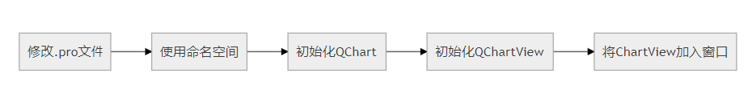

动态绘图，也就是说折线随着横坐标的增长而实时变化。

从这一秒和上一秒的变化看来，就是坐标轴不动，整个图像往前移了一个单位，然后在空出的最后一个位置增加了一个新的点。

###   1. 修改.pro文件

```
QT    +=charts
```

### 2. 使用命名空间

```c++
QT_CHARTS_USE_NAMESPACE
```
### 3. 代码1:

```c++
#ifndef MAINWINDOW_H
#define MAINWINDOW_H

#include <QMainWindow>
/******************添加对应头文件***********/
#include <QChart>
#include <QChartView>
#include <QSplineSeries>
#include <QScatterSeries>
#include <QDateTime>

/****************************************/

/***图表2****/

#include <QtCharts/QChartView>
#include <QtCharts/QSplineSeries>

#include <QTime>
#include <QDateTime>
#include <QDateTimeAxis>
#include <QValueAxis>

/**************使用对应的命名空间***********/
QT_CHARTS_USE_NAMESPACE

/****************************************/

QT_BEGIN_NAMESPACE
namespace Ui
{
    class MainWindow;
}
QT_END_NAMESPACE

class MainWindow : public QMainWindow
{
    Q_OBJECT

public:
    explicit MainWindow(QWidget* parent = nullptr);
    ~MainWindow();

    /*************画图对应的方法***************/
    void buildChart();                                      //创建图表函数
    void buildChart2();
    /****************************************/

private:
    Ui::MainWindow* ui;

    /**************图表1 画图对应的数据**************/
    int maxSize;                        //展示的数据数量
    int maxX;                           //X轴长度
    int maxY;                           //Y轴长度
    QList<double> data;                 //存储坐标数据，使用list可以很方便的增删
    //
    QChart* chart;                      //chart对象，绘图的载体
    QChartView* chartView;              //chartView,chart展示的载体
    QSplineSeries* splineSeries;        //绘图数据，连续曲线
    QScatterSeries* scatterSeries;      //绘图数据，散点
    /****************************************/

    /**************图表2 画图对应的数据**************/
    QChart* chart2;
    QChartView* chartView2;
    QSplineSeries* slineSeries2;

};

#endif // MAINWINDOW_H
```


```c++
#include "mainwindow.h"
#include "ui_mainwindow.h"

#include <QHBoxLayout>   // 水平布局

#include <QTimer>


MainWindow::MainWindow(QWidget* parent) :
    QMainWindow(parent),
    ui(new Ui::MainWindow)
{
    ui->setupUi(this);
    this->resize(1500, 650);
    //创建图表
    buildChart();
    buildChart2();
}

MainWindow::~MainWindow()
{
    delete ui;
}

void MainWindow::buildChart()
{
    //初始化数据成员
    maxSize = 15; // 只存储最新的 31 个数据
    maxX = 30;
    maxY = 10;
    splineSeries = new QSplineSeries();
    QPen pen(0x000001);
    pen.setWidth(1);
    splineSeries->setPen(pen);              //设置画笔(及线的颜色和大小)
    scatterSeries = new QScatterSeries();
    scatterSeries->setMarkerSize(5);        //设置散点大小
    scatterSeries->setColor(0x0000FF);      //设置散点颜色
    //
    chart = new QChart();
    chart->addSeries(splineSeries);         //添加数据源
    chart->addSeries(scatterSeries);        //添加数据源
    chart->legend()->hide();                //隐藏图例
    chart->setTitle("实时动态曲线");
    chart->createDefaultAxes();
    //设置X轴,此类方式已经被弃用（不推荐，会报警告，但可读性更高）
//    chart->axisX()->setRange(0, maxX);
//    chart->axisX()->setGridLineVisible(false);
//    chart->axisX()->setTitleText("X轴");
    //设置Y轴
//    chart->axisY()->setRange(0, maxY);
//    chart->axisY()->setGridLineVisible(false);
    chart->axisY()->setTitleText("Y轴");
    //上述方式已经被下面这种方式代替(推荐，不会报警告，但可读性不高)
    chart->axes(Qt::Horizontal).back()->setRange(0, maxX);
    chart->axes(Qt::Horizontal).back()->setGridLineVisible(false);
    chart->axes(Qt::Horizontal).back()->setTitleText("X轴");
    chart->axes(Qt::Vertical).back()->setRange(0, maxY);
    chart->axes(Qt::Vertical).back()->setGridLineVisible(false);
    chart->axes(Qt::Vertical).back()->setTitleText("Y轴");
    // 为chart对象实例化一个Qchartview
    chartView = new QChartView(chart);
    chartView->setRenderHint(QPainter::Antialiasing);         //防止曲线变形，保持曲线圆滑
    QHBoxLayout* layout = new QHBoxLayout();
    layout->addWidget(chartView);
    ui->widget_chart->setLayout(layout);
    //
    //初始化定时器,100ms定时一次
    QTimer* timer = new QTimer(this);
    timer->start(200);
    connect(timer, &QTimer::timeout, this, [ = ]()
    {
        // 产生一个数据，模拟不停的接收到新数据
        int newData;
        newData = qrand() % maxY;  //[0, maxY)
        data << newData;
        // 数据个数超过了最大数量,删除首个，数据往前移，添加最后一个
        if (data.size() > maxSize)
        {
            data.pop_front();
        }
        //清空数据
        splineSeries->clear();
        scatterSeries->clear();
        //以1为步长
        for (int i = 0; i < data.size(); ++i)
        {
            splineSeries->append(i, data.at(i));
            scatterSeries->append(i, data.at(i));
        }
    });
}

void MainWindow::buildChart2()
{
    //初始化QChart
    chart2 = new QChart();
    //初始化QSplineSeries
    slineSeries2 = new QSplineSeries();
    //设置曲线的名称
    slineSeries2->setName("随机数测试曲线");
    //把曲线添加到QChart的实例chart中
    chart2->addSeries(slineSeries2);
    chart2->setTitle("实时随机数测试曲线");
    //声明并初始化X轴、两个Y轴
    QDateTimeAxis* axisX = new QDateTimeAxis();  // x轴为时间轴
    QValueAxis* axisY = new QValueAxis();        // y轴为数值轴
    // 隐藏背景网格X轴框线
    axisX->setGridLineVisible(false);
    // x轴显示的文字倾斜角度
    axisX->setLabelsAngle(0);
    // 轴上点的个数
    axisX->setTickCount(10);
    axisX->setFormat("mm:ss");
    //设置y坐标轴上的格点
    axisY->setTickCount(10);
    axisY->setMin(-5);
    axisY->setMax(20);
    //设置坐标轴显示的名称
    QFont font("Microsoft YaHei", 8, QFont::Normal); //微软雅黑。字体大小8
    axisX->setTitleFont(font);
    axisY->setTitleFont(font);
    //axisX->setTitleText("X-Test");
    axisX->setTitleText("时间(分:秒)");
    axisY->setTitleText("Y轴");
    //设置网格不显示
    axisY->setGridLineVisible(false);
    // 把图表关联到坐标轴
    //把曲线关联到坐标轴
    chart2->addAxis(axisX, Qt::AlignBottom); 
    slineSeries2->attachAxis(axisX);
    chart2->addAxis(axisY, Qt::AlignLeft);
    slineSeries2->attachAxis(axisY);
    //chart2->legend()->hide();                  //隐藏图例
    chart2->setTheme(QChart::ChartThemeDark);    // 设置主题(注意设置位置)
    //把chart显示到窗口上
    //为chart对象实例化一个Qchartview
    chartView2 = new QChartView();
    chartView2->setChart(chart2);
    chartView2->setRenderHint(QPainter::Antialiasing);  // 设置渲染：抗锯齿，如果不设置那么曲线就显得不平滑
    QHBoxLayout* layout2 = new QHBoxLayout();
    layout2->addWidget(chartView2);
    ui->widget_chart2->setLayout(layout2);
    //
    //初始化定时器,100ms定时一次
    QTimer* timerDrawLine = new QTimer(this);7
    timerDrawLine->start(500);
    connect(timerDrawLine, &QTimer::timeout, this, [ = ]()
    {
        // 更新X轴的范围
        chart2->axisX()->setMin(QDateTime::currentDateTime().addSecs(-1 * 10));
        chart2->axisX()->setMax(QDateTime::currentDateTime().addSecs(0));
        //在线上添加点
        slineSeries2->append(QDateTime::currentDateTime().toMSecsSinceEpoch(), rand() % 20);
    });
}

```

**运行结果:**

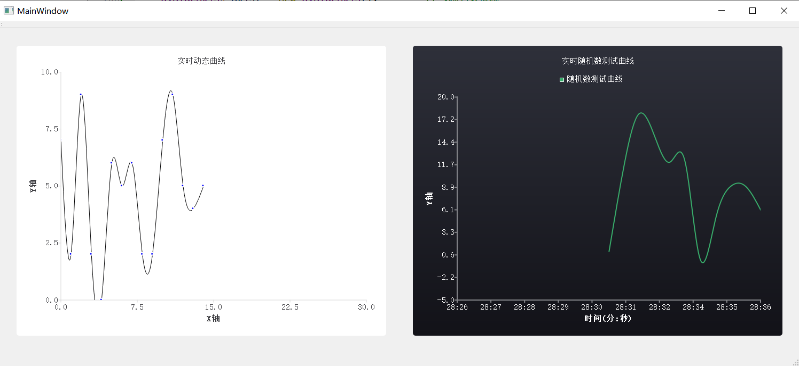


### 4. 代码2:

```c
#include "widget.h"
#include "ui_widget.h"
#include <QPen>
#include <QLegend>
#include <QLegendMarker>
#include <QBrush>
#include <QTime>
#include <QDebug>
int timeId;
Widget::Widget(QWidget* parent) :
    QWidget(parent),
    ui(new Ui::Widget)
{
    ui->setupUi(this);
    resize(1200, 700);
    buildChart();
}

// 创建图表
void Widget::buildChart()
{
    m_chart = new QChart();
    //设置x坐标轴
    axisX = new QValueAxis;
    axisX->setRange(0, 100);  //范围
    axisX->setLabelFormat("%d");     //图例的格式  %d为十进制显示
    axisX->setGridLineVisible(true);//网格
    axisX->setTickCount(10);   //主要刻度
//	axisX->setMinorTickCount(5);//小刻度
    axisX->setTitleText("time/(s)");//标题
    //设置y坐标轴
    axisY = new QValueAxis;
    axisY->setRange(0, 20);
    axisY->setLabelFormat("%d");
    axisY->setGridLineVisible(true);    //设置网格显示
    axisY->setTickCount(10);//轴上有多少个标记数目
    axisY->setMinorTickCount(5);//主要刻度之间有多少网格线
    axisY->setTitleText("altitude/(%)");
    // 把图表关联到坐标轴
    m_chart->addAxis(axisX, Qt::AlignBottom);  //将坐标轴加到chart上，居下
    m_chart->addAxis(axisY, Qt::AlignLeft);//居左
    m_chart->setTitle("example of chart");   //设置图表标题
    //m_chart->setAnimationOptions(QChart::SeriesAnimations);  //曲线动画模式，不能启用这一项或是选择这个选项，这个会导致曲线闪烁
    //设置图例可见
    m_chart->legend()->setVisible(true);
    m_chart->legend()->setLayoutDirection(Qt::LeftToRight);
    m_chart->legend()->setAlignment(Qt::AlignLeft);
    //生成一小段数据列表用作绘图初始数据
    QList<QPointF> mydata1;
    for (int i = 0; i < 100; i++)
    {
        mydata1.append(QPointF(i, 0.1 * i));
    }
    m_chart->setTheme(QChart::ChartThemeBlueIcy);    // 设置主题
    //增加一条曲线，数据集为mydata1
    addSeries(mydata1);
    //可以勾选图例进行显示与隐藏函数
    connectMarkers();
    //把第一条曲线曲线关联到坐标轴
    m_chart->setAxisX(axisX, m_serieslist.first());
    m_chart->setAxisY(axisY, m_serieslist.first());
    timeId = startTimer(1000);    //qobject中的函数，设置定时器时间间隔
    //把chart显示到窗口上
    //为chart对象实例化一个Qchartview
    m_chartView = new QChartView(m_chart);
    //m_chart = m_chartView->chart();//画笔
    m_chartView->setRubberBand(QChartView::NoRubberBand);  //矩形缩放
    m_chartView->setRenderHint(QPainter::Antialiasing); //设置抗锯齿
    QHBoxLayout* layout = new QHBoxLayout();
    layout->addWidget(m_chartView);
    ui->widget->setLayout(layout);
//    m_chartView->resize(600, 600);   //画布大小
//    m_chartView->setContentsMargins(0, 0, 0, 0);
//    m_chartView->show(); //显示
}


void Widget::addSeries(QList<QPointF>& data)  //用于新增曲线
{
    /***
     * 曲线
    ****/
    QSplineSeries* series = new QSplineSeries(this);  //平滑曲线
    //将曲线加到曲线列表中进行管理
    m_serieslist.append(series);
    //设置曲线的名称
    series->setName(QString("line " + QString::number(m_serieslist.count()))); //设置曲线对应的名字，用于图例显示
    series->append(data);  //将数据加到曲线中
    //把曲线添加到QChart的实例chart中
    m_chart->addSeries(series);
    axisX->setRange(0, series->count());  //坐标轴初始范围为图表中的数据数。 这个在绘制多条曲线中需注释
    // 设置线的属性
    QPen splinePen, linePen;
    splinePen.setBrush(Qt::red);
    splinePen.setColor(Qt::red);
    series->setPen(splinePen);
    /****
     * 折线
    ***/
    QSplineSeries* lineSeries = new QSplineSeries(this);  //折线类点的集合
    lineSeries->setName(QStringLiteral("折线"));
    QList<QPointF> lineData;
    QPoint newPoint;
    foreach (QPointF point, data)
    {
        newPoint.setX(point.x() * 1.5);
        newPoint.setY(point.y() * 1.5);
        lineData.append(newPoint);
    }
    lineSeries->append(lineData);
    linePen.setBrush(Qt::blue);
    lineSeries->setPen(linePen);
    m_serieslist.append(lineSeries);
    //把折现添加到QChart的实例chart中
    m_chart->addSeries(lineSeries);
}

//移除一条曲线
void Widget::removeSeries()
{
    // Remove last series from chart
    if (m_serieslist.count() > 0)
    {
        QSplineSeries* series = m_serieslist.last();
        m_chart->removeSeries(series);
        m_serieslist.removeLast();
        delete series;
    }
}

//将槽函数与图例的鼠标点击事件连接起来
void Widget::connectMarkers()
{
    // 遍历所有的图例的标记
    foreach(QLegendMarker* marker, m_chart->legend()->markers())
    {
        //断开可能存在的连接，以避免多个连接
        //功能：当使用connect将一个信号函数与槽函数关联之后，如果想要取消这种关联，就可以使用disconnect函数
        disconnect(marker, &QLegendMarker::clicked, this, &Widget::handleMarkerClicked);
        connect(marker, &QLegendMarker::clicked, this, &Widget::handleMarkerClicked);
    }
}

void Widget::handleMarkerClicked()//图例点击事件
{
    QLegendMarker* marker = qobject_cast<QLegendMarker*> (sender());  //sender()指向信号发出的对象的指针
    Q_ASSERT(marker);  // 如果test为false，则打印包含源代码文件名和行号的警告消息
    switch (marker->type())
    {
        case QLegendMarker::LegendMarkerTypeXY://线和线条，散列的图标标记
            {
                marker->series()->setVisible(!marker->series()->isVisible());
                marker->setVisible(true);
                qreal alpha = 1.0;
                if (!marker->series()->isVisible())  //不可见
                {
                    alpha = 0.5;
                }
                //  标签绘制成响应的画笔
                QColor color;
                QBrush brush = marker->labelBrush(); // 返回用于绘制标签的画笔
                color = brush.color();
                color.setAlphaF(alpha);  //设置颜色范围
                brush.setColor(color);
                marker->setLabelBrush(brush);  //标签绘制成响应的画笔
//        brush = marker->brush();
//        color = brush.color();
//        color.setAlphaF(alpha);
//        brush.setColor(color);
//        marker->setBrush(brush);
//        QPen pen = marker->pen();
//        color = pen.color();
//        color.setAlphaF(alpha);
//        pen.setColor(color);
//        marker->setPen(pen);
                break;
            }
        default:
            {
                qDebug() << "Unknown marker type";
                break;
            }
    }
}

QList<QPointF> Widget::setdata()  //设置图表数据的函数接口
{
    QList<QPointF> datalist;
    for (int i = 0; i < 500; i++)
    {
        datalist.append(QPointF(i, i * 0.01));
    }
    return datalist;
}

void Widget::timerEvent(QTimerEvent* event)    //定时器事件的重构
{
    if (event->timerId() == timeId)//定时器时间到，模拟数据填充
    {
        static QTime dataTime(QTime::currentTime());
        long int eltime = dataTime.elapsed();  //上次start经过毫秒数
        static int lastpointtime = 1;
        int size = (eltime - lastpointtime);//数据个数
        //qDebug() << "size-->" << size;
        foreach (QSplineSeries*  splineSeries, m_serieslist)
        {
            if (splineSeries->isVisible())
            {
                QVector<QPointF> olddata = splineSeries->pointsVector();
                olddata.append(QPointF(lastpointtime + olddata.count(), lastpointtime * 0.3)); //填充数据--->>相当于每一分钟增加一点
                axisX->setRange(0, lastpointtime + splineSeries->count());//设置x坐标轴
                //后期需更改为一开始固定，只有当数据个数超出坐标轴范围时坐标轴开始扩展。
                splineSeries->replace(olddata);
                lastpointtime++;
            }
        }
    }
}


Widget::~Widget()
{
    delete ui;
}

```

运行结果:

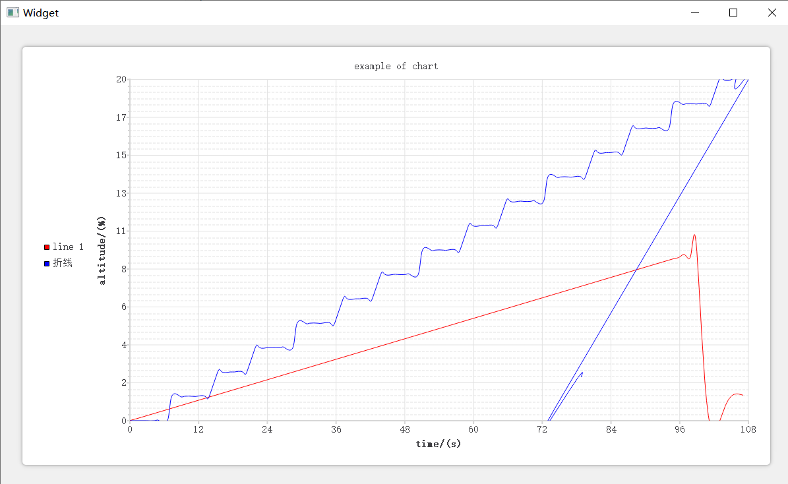


# Qt 之水平/垂直布局

QBoxLayout可以在水平方向或垂直方向上排列控件，由QHBoxLayout、QVBoxLayout所继承。

QHBoxLayout：水平布局，在水平方向上排列控件，即：左右排列。
QVBoxLayout：垂直布局，在垂直方向上排列控件，即：上下排列。

## 水平布局的基本使用

## 效果

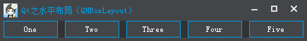

## 源码

创建5个按钮，然后添加至水平不居中。

```Qt
QPushButton *pButton1 = new QPushButton("One");
QPushButton *pButton2 = new QPushButton("Two");
QPushButton *pButton3 = new QPushButton("Three");
QPushButton *pButton4 = new QPushButton("Four");
QPushButton *pButton5 = new QPushButton("Five");

QHBoxLayout *pHLayout = new QHBoxLayout();
pHLayout->addWidget(pButton1);
pHLayout->addWidget(pButton2);
pHLayout->addWidget(pButton3);
pHLayout->addWidget(pButton4);
pHLayout->addWidget(pButton5);

setLayout(pHLayout);
```

## 常用接口

我们可以看到，默认的外边距为0，为了美观性我们可以设置下Margin。

- setMargin(int)
- setContentsMargins(int left, int top, int right, int bottom);
- setContentsMargins(const QMargins &margins)
  设置外边距

setMargin可以设置左、上、右、下的外边距，设置之后，他们的外边距是相同的。
setContentsMargins与其功能相同，但是可以将左、上、右、下的外边距设置为不同的值。

这里我使用setMargin(10)将外边距设置为10。

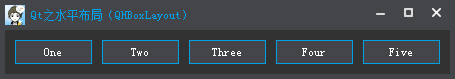

------

- setSpacing(int)
  设置间距

一般情况下，会有一个默认间距值，为了保持所有布局的统一性，或者你需要一个更合适的间距值，则需要手动设置。

这里我使用setSpacing(0)将间距设置为0。

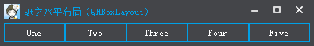

------

- addStretch()
  添加了一个伸缩空间（QSpacerItem）。

**居右**

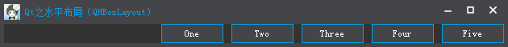

在第一个控件之前添加伸缩，这样所有的控件就会居右显示。

```Qt
QHBoxLayout *pHLayout = new QHBoxLayout();
pHLayout->addStretch();  // 添加伸缩
pHLayout->addWidget(pButton1);
pHLayout->addWidget(pButton2);
pHLayout->addWidget(pButton3);
pHLayout->addWidget(pButton4);
pHLayout->addWidget(pButton5);1234567
```

**居左**

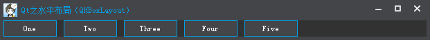

在最后一个控件之后添加伸缩，这样所有的控件就会居左显示。

```Qt
QHBoxLayout *pHLayout = new QHBoxLayout();
pHLayout->addWidget(pButton1);
pHLayout->addWidget(pButton2);
pHLayout->addWidget(pButton3);
pHLayout->addWidget(pButton4);
pHLayout->addWidget(pButton5);
pHLayout->addStretch();  // 添加伸缩1234567
```

**居中**

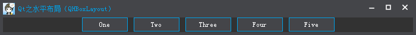

在第一个控件之前、最后一个控件之后添加伸缩，这样所有的控件就会居中显示。

```Qt
QHBoxLayout *pHLayout = new QHBoxLayout();
pHLayout->addStretch();  // 第一个控件之前添加伸缩
pHLayout->addWidget(pButton1);
pHLayout->addWidget(pButton2);
pHLayout->addWidget(pButton3);
pHLayout->addWidget(pButton4);
pHLayout->addWidget(pButton5);
pHLayout->addStretch();  // 最后一个控件之后添加伸缩
pHLayout->setSpacing(10);123456789
```

**均分**

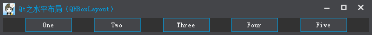

在每一个控件之间都添加伸缩，这样所有的控件之间的间距都会相同。

```Qt
QHBoxLayout *pHLayout = new QHBoxLayout();
pHLayout->addStretch();
pHLayout->addWidget(pButton1);
pHLayout->addStretch();
pHLayout->addWidget(pButton2);
pHLayout->addStretch();
pHLayout->addWidget(pButton3);
pHLayout->addStretch();
pHLayout->addWidget(pButton4);
pHLayout->addStretch();
pHLayout->addWidget(pButton5);
pHLayout->addStretch();
pHLayout->setSpacing(0);12345678910111213
```

------

- addWidget(QWidget *, int stretch = 0, Qt::Alignment alignment = 0)
  添加控件

默认的，我们添加控件至水平布局中，默认都是垂直方向居中对齐的。

例如：

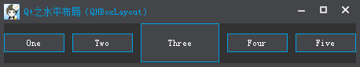

其中有控件大小不相同的时候就会看得很明显了，如果我们需要将其中的某些控件居上、居下显示，那么可以使用对齐方式Qt::Alignment。

下面，我们使用向上、向下对齐来设置其它控件。

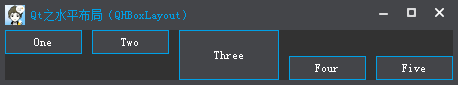

```Qt
QHBoxLayout *pHLayout = new QHBoxLayout();
pHLayout->addStretch();
// 水平居左 垂直居上
pHLayout->addWidget(pButton1, 0 , Qt::AlignLeft | Qt::AlignTop);
pHLayout->addWidget(pButton2, 0 , Qt::AlignLeft | Qt::AlignTop);
pHLayout->addWidget(pButton3);
// 水平居左 垂直居下
pHLayout->addWidget(pButton4, 0 , Qt::AlignLeft | Qt::AlignBottom);
pHLayout->addWidget(pButton5, 0 , Qt::AlignLeft | Qt::AlignBottom);
pHLayout->setSpacing(10);12345678910
```

------

- setDirection(Direction)
  设置布局方向

可以设置从左到右、从右到左、从上到下、从下到上等。。。

setDirection(QBoxLayout::RightToLeft)


setDirection(QBoxLayout::TopToBottom);

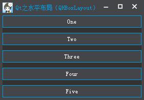

既然使用了QHBoxLayout，一般就不建议使用TopToBottom或者BottomToTop，如果实在确定不了方向，或者方向可以随意变化，那么建议使用QBoxLayout。

------

- setStretchFactor(QWidget *w, int stretch);
- setStretchFactor(QLayout *l, int stretch);
  设置控件、布局的拉伸系数

当窗体大小变化时，控件会根据拉伸系数来做相应的调整。

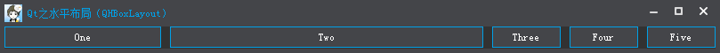

setStretchFactor(pButton1, 1);
setStretchFactor(pButton2, 2);

设置pButton1的拉伸系数为1，pButton2拉伸系数为2，当窗体变大时，会优先将pButton2进行拉伸，当达到一定程度时，再拉伸pButton1，pButton1与pButton2的宽度比例为1:2。


# 网格布局

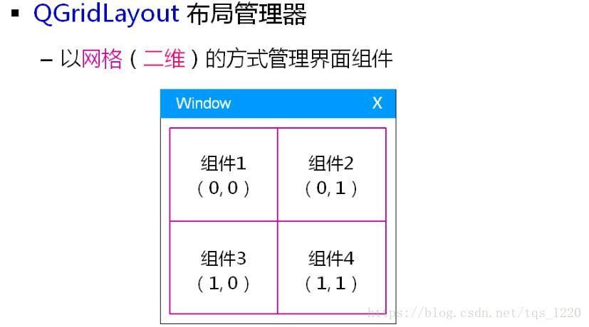

layout->setRowStretch(int row, int stretch);//设置行比例系数
layout->setColumnStretch(int column, int stretch);//设置列比例系数

```c++
QGridLayout* layout = new QGridLayout();

TestBtn1.setText("Test Button 1");
TestBtn1.setSizePolicy(QSizePolicy::Expanding, QSizePolicy::Expanding);//设置组件大小可扩展
TestBtn1.setMinimumSize(160, 30);//设置最小尺寸

TestBtn2.setText("Test Button 2");
TestBtn2.setSizePolicy(QSizePolicy::Expanding, QSizePolicy::Expanding);
TestBtn2.setMinimumSize(160, 30);

TestBtn3.setText("Test Button 3");
TestBtn3.setSizePolicy(QSizePolicy::Expanding, QSizePolicy::Expanding);
TestBtn3.setMinimumSize(160, 30);

TestBtn4.setText("Test Button 4");
TestBtn4.setSizePolicy(QSizePolicy::Expanding, QSizePolicy::Expanding);
TestBtn4.setMinimumSize(160, 30);

layout->setSpacing(10);//设置间距
layout->addWidget(&TestBtn1, 0, 0);//往网格的不同坐标添加不同的组件
layout->addWidget(&TestBtn2, 0, 1);
layout->addWidget(&TestBtn3, 1, 0);
layout->addWidget(&TestBtn4, 1, 1);

layout->setRowStretch(0, 1);//设置行比例系数
layout->setRowStretch(1, 3); 
layout->setColumnStretch(0, 1);
layout->setColumnStretch(1, 3);

setLayout(layout);//设置顶级布局管理器
```

大概可以看出来行列的比例是1:3。

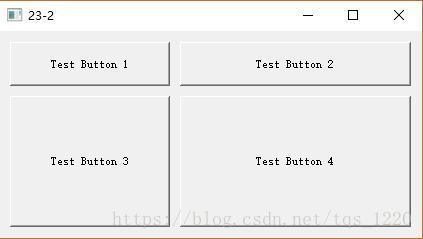


# Qt中实现屏幕或窗口(控件)截图功能

要想在Qt中实现屏幕或窗口截图功能 ，通常有两种方法：

　　1 -- 使用 QPixmap 类

　　2 -- 使用 QScreen类

然而虽然俩两种方法用到的类不相同，但是调用到的[类成员](https://so.csdn.net/so/search?q=类成员&spm=1001.2101.3001.7020)函数的函数名称和参数却是相同的都是 grabWindow() 这个函数

所不同的是

**QPixmap中的 grabWindow()函数 是静态成员**

**QScreen中的grabWindow()成员是非静态成员**

这两种方法：都需要包含所需要的相应的头文件

下面展示两种截屏的方法

**QPixmap方法**

//截屏并保存为 1.jpg

```cpp
//截屏并保存为 1.jpg
QPixmap::grabWindow(QApplication::desktop()->winId()).save("1","jpg");
/****************************************************************
要注意的是 QApplication::desktop()->winId()，返回的是
要截屏的窗口的ID ， 设为0 表示当前桌面 ，截屏时就会截全屏
******************************************************************/
```

　　　　注：这种方法在Qt5中已经过时 ， 应该使用QScreen方法代替

**QScreen方法**

功能同样是截屏 ， 注：QScreen的构造函数是私有的

```cpp
QScreen *screen = QGuiApplication::primaryScreen();
screen->grabWindow(0).save("1","jpg");
 
/******************************************************************
要注意的是 QApplication::desktop()->winId()，返回的是
要截屏的窗口的ID ， 设为0 表示当前桌面 ，截屏时就会截全屏
******************************************************************/
```

　　　　注：这种方法在Qt5中已经过时 ， 应该使用QScreen方法代替

```c++
// 开启定时器捕获屏幕(就是捕获图像)
QImage Client::CatchScreen()
{
    QScreen* screen = QGuiApplication::primaryScreen();
    return screen->grabWindow(0).toImage();  // 返回QImag
}
```
