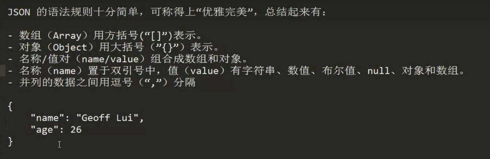

# JSON概念

JSON介绍：

- json现在多用于存储和交换文本信息的语法
- 进行数据的传输
- JSON 比 XML 更小、更快，更易解析。

# JSON语法

## JSON语法基本规则



1、数据在**键/值**对中：JSON数据由键值对构成。

- 键可以用引号（单双引号都行）引起来，也可以不使用引号引起来。
- 值的取值类型有：数字（整数或浮点数）、字符串（用双引号引起来）、布尔值（true或false）、数组（在方括号中）、对象（在花括号中）、null。

```bash
# 值是数字类型
{age: 10, score: 78.5}
# 值是字符串类型
{name: "张三", sex: "m"}
# 值是布尔值类型
{flag: true}
# 值是数组类型
{names: ["zhangsan", "lisi", "wangwu"]}
{students: [{name: "zhangsan"}, {name: "lisi"}]}
# 值是对象类型
{student: {name: "zhangsan", age: 18, flag: true}}
# 值是null类型
{value: null}
```

2、数据由逗号分隔：多个键值对用逗号进行分隔

```bash
{key1: value1, key2: value2, key3: value3, ...}
```

3、花括号保存对象：使用{}定义json格式的对象，又可以嵌套其他数据类型的值。

```bash
{student: {name: "zhangsan", hobbies: ["play", "read", "listen"]}}
```

4、方括号保存数组：[1,2,3,4,5]，又可以嵌套其他数据类型的值。

```bash
[{name1:"zhangsan"},{name2:"lisi"}]
[1,2,3,4,5,6]
```

##  读取JSON数据

读取通常是指在前端使用JavaScript读取JSON格式数据，后端Java不采用此语法：

```bash
# 读取对象类型中指定键的值
json对象.键名
json对象["键名"]
 
# 读取JSON数组中的值
数组对象[索引]
 
# 遍历对象
for (键名 in 对象) {
    # key为键名；对象[key]为键值
}
 
# 遍历数组
for (var i=0; i<数组.length; i++) {
    # 数组[i]获取数组的值
}
```

实例：

```html
<!DOCTYPE html>
<html lang="en">
<head>
    <meta charset="UTF-8">
    <title>json遍历</title>
</head>
<body>
<script>
    // 遍历对象
    // 键名可以不加引号，也可以加单引号或双引号
    var person1 = {name: "张三", age: 23, sex: "m"};
    var person2 = {"name": "张三", "age": 23, "sex": "m"};
    var person3 = {'name': "张三", 'age': 23, 'sex': "m"};
 
    // 获取person对象中所有的键和值
    // for in 循环
    for (key in person1) {
        // 无法使用person1.key，因为这样相当于person1."name"
        console.log(key, person1[key]);
    }
 
    // 遍历普通数组
    var arr=["唐僧","孙悟空","猪八戒","沙僧"];
    for (var i=0; i < arr.length; i++)
    {
        console.log(arr[i]);
    }
 
    // 遍历对象数组
    var ps = [{"name": "张三", "age": 23, "gender": true},
              {"name": "李四", "age": 24, "gender": true},
              {"name": "王五", "age": 25, "gender": false}];
    for (var i = 0; i < ps.length; i++) {
        var p = ps[i];
        for (key in p) {
            console.log(key + ":" + p[key]);
        }
    }
</script>
</body>
</html>
```

# JSON数据与Java数据的相互转换

## 概述

要想实现JSON数据与Java数据的相互转换，需要JSON解析器，即能够解析JSON格式数据的jar包。

常见的解析器：Jsonlib，Gson，fastjson，jackson。

本节中使用jackson，因为spring内置它，为以后打下基础。

## JSON转为Java对象

将JSON转换为Java对象的步骤如下：

- \1. 导入jackson的相关jar包
- \2. 创建Jackson核心对象 ObjectMapper
- \3. 调用ObjectMapper的相关方法进行转换：**readValue(json字符串数据, Class)**

第一步：导入相关jar包（注意，版本一定要匹配，三个版本应该一致，否则可能发生异常）


第二步：转换对象

```java

```

## Java对象转换为JSON

使用步骤：

- \1. 导入jackson的相关jar包
- \2. 创建Jackson核心对象 ObjectMapper
- \3. 调用ObjectMapper的相关方法进行转换

所用方法如下：

```java

```

实例：

```java

```

## 案例之校验用户名是否存在

```bash

```

其中前端html页面代码如下：

```html

```

 `CheckUsernameServlet.java`

```java
@WebServlet("/checkUsernameServlet")
public class CheckUsernameServlet extends HttpServlet {
    protected void doPost(HttpServletRequest request, HttpServletResponse response) throws ServletException, IOException {
        // 设置请求编码
        request.setCharacterEncoding("utf-8");
        // 设置MIME类型和响应编码
        response.setContentType("application/json;charset=utf-8");
        // 获取请求参数
        Map<String, String[]> parameterMap = request.getParameterMap();
        // 封装实体类对象
        ResultInfo resultInfo=new ResultInfo();
        resultInfo.setFlag(true);
        resultInfo.setMsg("请求成功！");
        resultInfo.setData(parameterMap);
        // 实例化ObjectMapper对象
        ObjectMapper mapper=new ObjectMapper();
        // 将实体类对象转换成JSON格式字符串
        String s_json = mapper.writeValueAsString(resultInfo);
        // 响应到前台
        response.getWriter().print(s_json);
    }
 
    protected void doGet(HttpServletRequest request, HttpServletResponse response) throws ServletException, IOException {
        this.doPost(request, response);
    }
}
 
class ResultInfo{
    private boolean flag;
    private String msg;
    private Object data;
 
    public ResultInfo() {
    }
 
    public boolean isFlag() {
        return flag;
    }
 
    public void setFlag(boolean flag) {
        this.flag = flag;
    }
 
    public String getMsg() {
        return msg;
    }
 
    public void setMsg(String msg) {
        this.msg = msg;
    }
 
    public Object getData() {
        return data;
    }
 
    public void setData(Object data) {
        this.data = data;
    }
}
```

