# 1.序列化

> 序列化(Serialization)将对象的状态信息转换为可以存储或传输的形式的过程，与之相对应的过程称之为反序列
> 化（Unserialization）。**序列化和反序列化主要用于解决在跨平台和跨语言的情况下,模块之间的交互和调用,
> 但其本质是为了解决数据传输问题**

**实现数据序列化:**

+ 要有原始数据

  + 复合类型->最常见的情况
  + 基础数据类型

+ 通过某些方式-->另外一种形式的数据

+ 目的:进行分发,分发到不同的终端/平台,保证不同的平台能正确解析

  + 网络传输

  + 网盘拷贝

  ==序列化目的不是为了加密,为的是数据的跨平台传输==

**实现数据序列化的原因:**

+ 平台不同(32位 64位)
+ 平台不同,  某些数据类型占用的内存大小不同
+ 如果不是字符串,需要进行字节序转换
  + 字符串没有字节序问题,字符在内存中只占一个字节
  + 大小端问题
+ 语言不同, 数据类型占用的内存有可能不同 (比如: c-> char ->1字节  java -> char ->2字节
+ 字节对齐问题

**序列化的整体过程:  **

发送端:

+ 原始数据->序列化(编码)->特殊格式的字符串
+ 发送这个字符串

接收端: 

+ 接收数据
+ 特殊格式的字符串->反序列化(解码)->原始数据
+ 对原始数据进行处理

**protobuf 使用场景: **

protobuf 是一个跨平台和跨语言的[数据结构](https://so.csdn.net/so/search?q=数据结构&spm=1001.2101.3001.7020&login=from_csdn)存储和传输的便利工具。
适用场景举例：

1. 比如 C++ 实现了算法，需要用 Python 或者 C# 去调用，并实现在不同语言间用户自定义复杂结构的数据传输。
2. 比如用 PyTorch 在 Windows 平台下训练了一个 Python 语言的模型，需要部署到 Linux 系统下面的 C++ 写的软件中。
   跨平台，跨语言的数据结构传输是非常困难的，如果使用 XML 等工具，传输的速度和解析速度会受限制，而 protobuf 很好地解决了这一困难。

**协议:**

+ Netcat演示协议实验
+ 序列化

数据交换形式:

+ http + json
+ socket + protobuf

## 1.2常用的序列化方式

1. XML

   ```xml
   <?xml version="1.0" encoding="ISO-8859-1"?>
   <note>
   <to>George</to>
   <from>John</from>
   <heading>Reminder</heading>
   <body>Don't forget the meeting!</body>
   </note>
   ```

1. Json
2. Protocol Buffer

3. ASN.1抽象语法标记
4. boost序列化的类


# 2. protobuf

## 2.1配置

**protobuf 官网**

[GitHub](https://so.csdn.net/so/search?q=GitHub&spm=1001.2101.3001.7020&login=from_csdn) 地址：
https://github.com/protocolbuffers/protobuf

官方文档地址：
https://developers.google.com/protocol-buffers/

Releases 下载地址：
https://github.com/protocolbuffers/protobuf/releases

### 2.1.1 下载

进入发布版下载地址：
https://github.com/protocolbuffers/protobuf/releases

可以看到有几种下载类型可以选择：
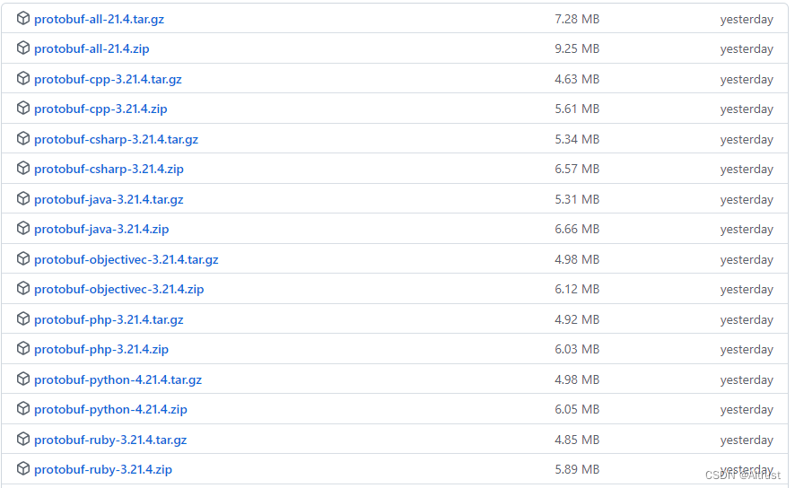
这里如果仅仅使用某种语言可以下载对应的文件

另外往下可以看到分平台的文件：
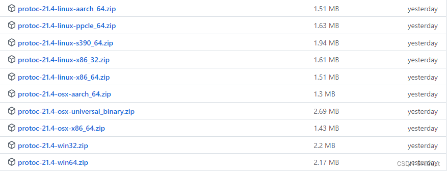

下载完成后进行解压

### 2.1.2  安装 CMake

由于这里需要自己进行编译，那么 CMake 是少不了的

CMake 官网：
https://cmake.org/

CMake 下载地址：
https://cmake.org/download/

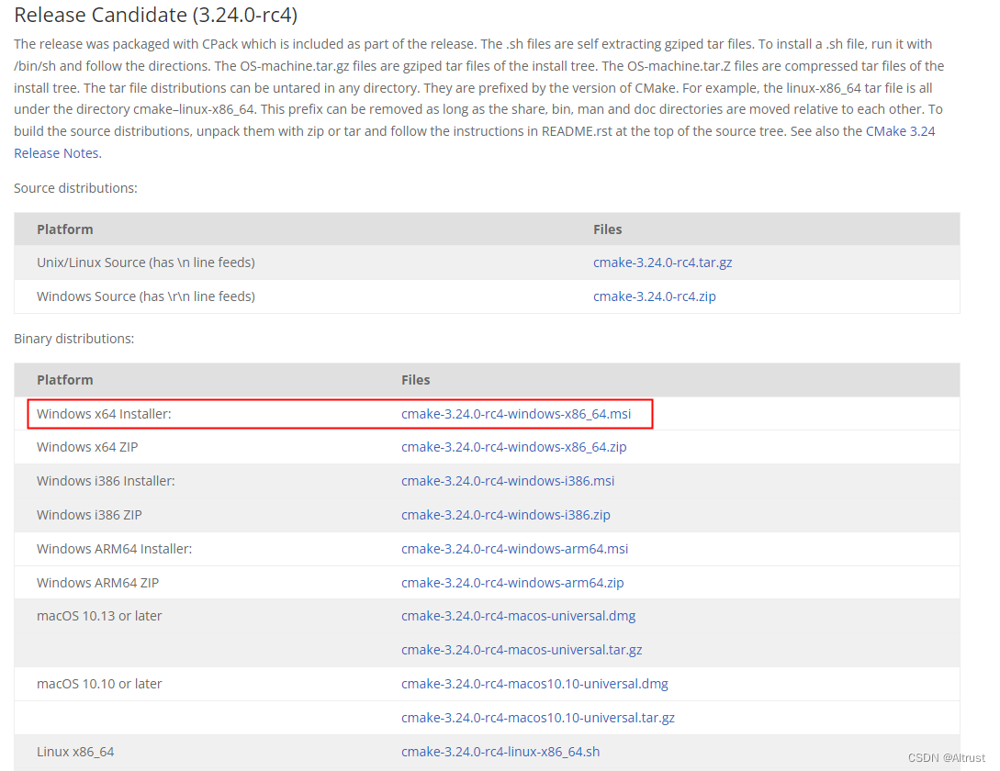
这里我们选择下载 Windows 下的安装版 cmake-3.24.0-rc4-windows-x86_64.msi

安装完成后，找到 CMake 的安装目录, 设置成环境变量中的 PATH


### 2.1.3 使用 CMake 进行编译

我们先查看下之前下载的 protobuf-cpp-3.21.4.zip 解压后的目录，这里是：
E:\protobuf-cpp-3.21.4\protobuf-3.21.4

目录下的文件列表如下：
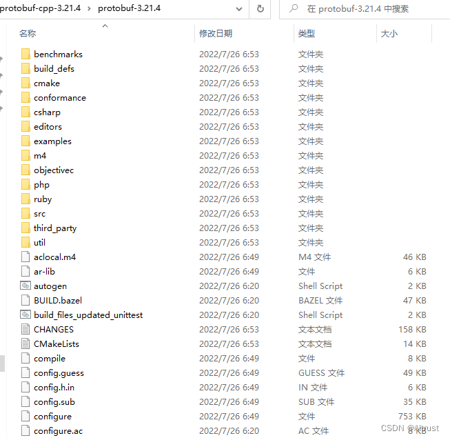

进入 CMake 界面，输入对应的目录位置
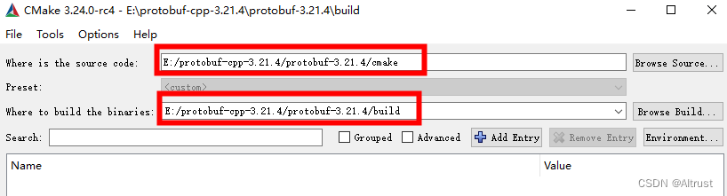
点击 “Configure”，选择 generator 和 platform
这里我们使用 Visual Studio 2019，x64

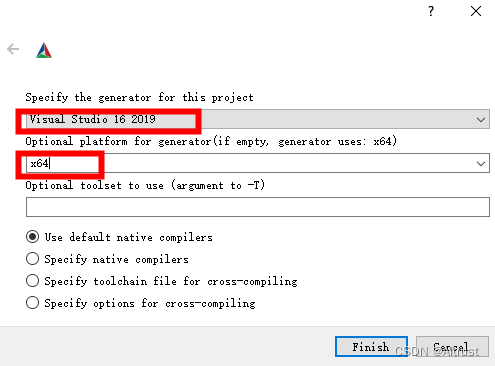
完成后显示 Configuring done
这里有很多选项，可以参考官方文档每一个的作用，这里先不用修改
点击 Generate
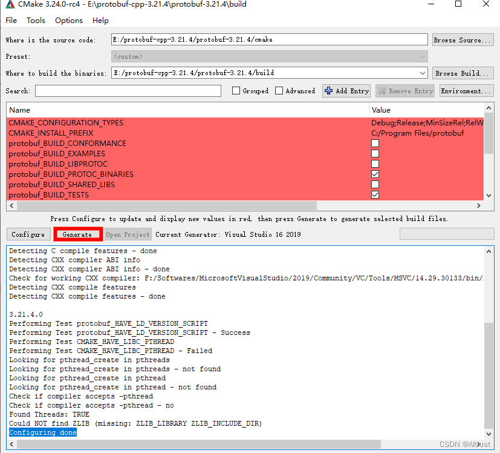
完成后显示 Generating done
进入我们设置的 build 文件夹可以看到编译完成的文件
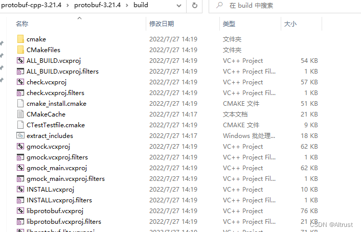
在 CMake 界面上点击 Open Project，即可在 Visual Studio 中打开编译完成的项目
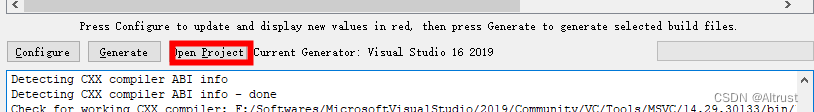
或者也可以在文件目录中打开 protobuf.sln 进入工程
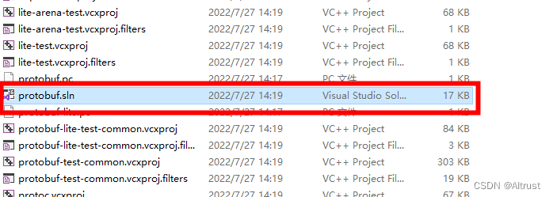

### 2.1.4. 编译 VS 工程

在解决方案管理器中可以看到如下项目目录
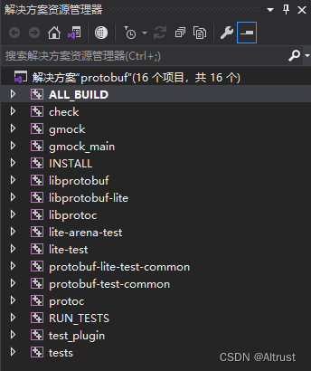
这里在 Debug 模式下进行测试

右键点击“解决方案”——》选择“生成解决方案”

完成后，进入目录：
E:\protobuf-cpp-3.21.4\protobuf-3.21.4\build\Debug
**可以看到我们所需的几个文件**
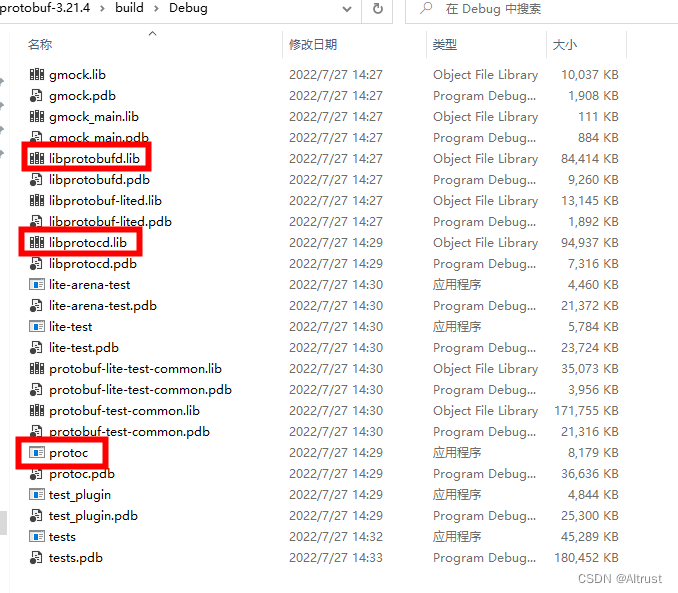

新建一个文件交包含( include文件夹放入protobuf源文件src里的东西 ,  lib文件夹放入上述东西)

再配置下列: 

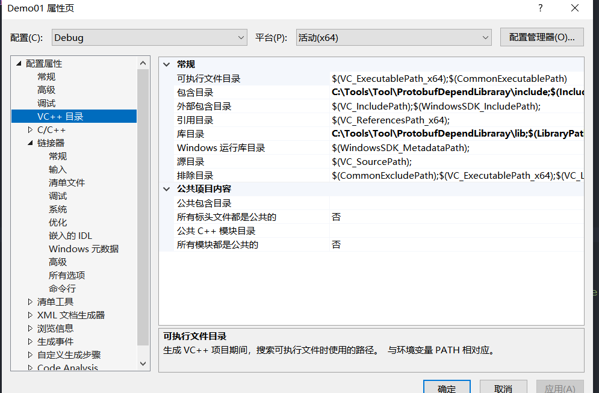

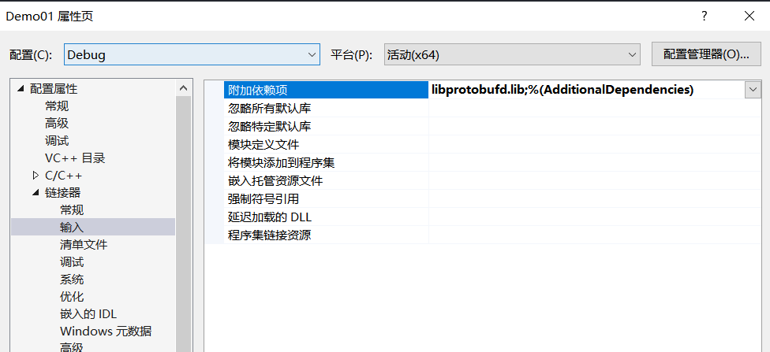

[(14条消息) VisualStudio配置Protobuf_Asce66的博客-CSDN博客_vs配置protobuf](https://blog.csdn.net/weixin_43967805/article/details/108916227)

### 2.1.5 其他(qt)编译

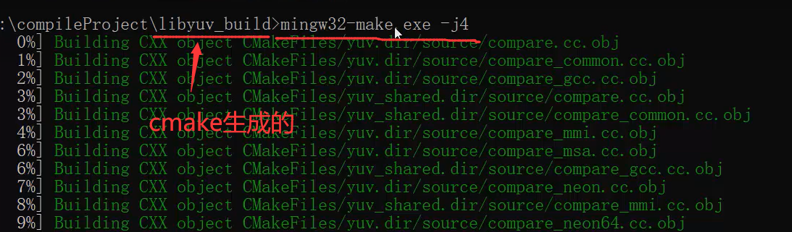

## 2.2 使用

```
准备数据
	复合类型:结构体/类 
	基础类型
创建一个新文件xox.proto
	将我们要序列化的数据->写入到proto文件
通过一个命令 protoc将xxx.proto文件生成一个c++的类
	使用操作命令>在window终端中: >protoc xxx.proto --cpp_out=./ 生成对应一个头文件/源文件
直接使用这个类
	里边有对数据操作的api
		读数据api  方法名字:  变量名()
		写数据api  方法名字:  set_变量名(arg)
```

- 使用protobuf编译器生成C++类

  ```shell
  # protobuf编译器, 编译源码得到的 protoc.exe
  # 语法
  # --cpp_out 生成的c++类的位置
  protoc.exe xxx.proto --cpp_out=目录
  ```

- 使用C++ API来读写消息

  - 读: `变量名()`小写
  - 写: `set_变量名(arg1, arg2, ...) `小写

+ 在.proto文件中定义消息格式

  ```protobuf
  // protobuf的版本
  syntax = "proto3";	// proto2
  // 组织Persion结构体
  // 语法格式
  message 关键字(相当于被创建出的类的名字)
  {
  	// 成员变量
  	数据类型 变量名 = 变量的编号;	// 编号从1开始, 不能重复
  }
  ```

  

例子:

①  **要序列化的数据**


```c++
struct Person
{
	int32 id;
	string name;
	string srx;
	int32 age;
}

int id;
```

②**定义.proto 文件**

```protobuf
syntax = "proto3";
message Preson
{
    int32 id = 1;
    bytes name = 2;
    string sex = 3;
    int32 age = 4;
}
```

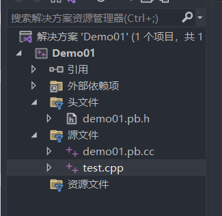

```c++
#include <iostream>
#include "demo01.pb.h"
#include <string>

using namespace std;
int main(void)
{
	// 1.创建persion对象，并初始化
	Preson p;

	p.set_id(1);
	p.set_name("小明");
	p.set_sex("man");
	p.set_age(10);

	// 2.将persion对象序列化->字符串
	string output;
	p.SerializeToString(&output);
	cout << "序列前的数据: " << output << endl;
	// 3.数据传输
	// 4，接收数据，解析（output）->解码->原始数据
	// 4.1创建Persion对象
	Preson pp;
	pp.ParseFromString(output);
	cout << "id: " << pp.id() << " name: " << pp.name() << " sex: " << pp.name() << " age: " << pp.age();

	return 0;
}
```

运行结果:

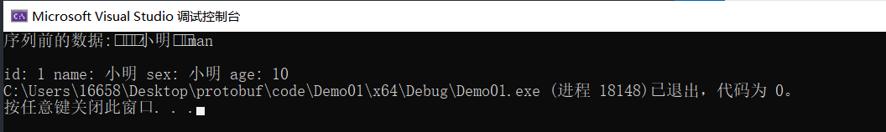


### 2.2.1 类型

注意:  Protobuf的属性基本包含了c++需要的所有基本属性类型:

| **protobuf**属性 | **C++属性** | **java属性** | **备注**                                                     |
| ---------------- | ----------- | ------------ | ------------------------------------------------------------ |
| double           | double      | double       | 固定8个字节                                                  |
| float            | float       | float        | 固定4个字节                                                  |
| int32            | int32       | int32        | 使用变长编码，对于负数编码效率较低，如果经常使用负数，建议使用sint32 |
| int64            | int64       | int64        | 使用变长编码，对于负数编码效率较低，如果经常使用负数，建议使用sint64 |
| uint32           | uint32      | int          | 使用变长编码                                                 |
| uint64           | uint64      | long         | 使用变长编码                                                 |
| sint32           | int32       | int          | 采用zigzag压缩，对负数编码效率比int32高                      |
| sint64           | int64       | long         | 采用zigzag压缩，对负数编码效率比int64高                      |
| fixed32          | uint32      | int          | 总是4字节，如果数据>2^28，编码效率高于unit32                 |
| fixed64          | uint64      | long         | 总是8字节，如果数据>2^56，编码效率高于unit32                 |
| sfixed32         | int32       | int          | 总是4字节                                                    |
| sfixed64         | int64       | long         | 总是8字节                                                    |
| bool             | bool        | boolean      |                                                              |
| string           | string      | String       | 一个字符串必须是utf-8编码或者7-bit的ascii编码的文本          |
| bytes            | string      | ByteString   | 可能包含任意顺序的字节数据                                   |

 **标注**

> 标注包括“required”、“optional”、“repeated”三种，其中

**required**表示该属性为**必选属性**，否则对应的message“未初始化”，debug模式下导致断言，release模式下解析失败；

**optional**表示该属性为**可选属性**，不指定，使用默认值（int或者char数据类型默认为0,string默认为空，bool默认为false，嵌套message默认为构造，枚举则为第一个）

**repeated**表示该属性为**重复字段**，可看作是**动态数组**，类似于C++中的vector。

如果为optional属性，发送端没有包含该属性，则接收端在解析式采用默认值。对于默认值，如果已设置默认值，则采用默认值，如果未设置，则类型特定的默认值为使用，例如string的默认值为””。

删除文件中的所有.cc

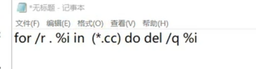


### **2.2.2数组;**

```protobuf
syntax = "proto3";
message Preson
{
    int32 id = 1;
    repeated bytes name = 2;
    string sex = 3;
    int32 age = 4;
}
```

### 2.2.3**枚举:**

```protobuf
syntax = "proto3";

enum CoLor
{
    Red = 0;      // protbuf中第一个枚举值必须为店
    Green = 6;
    Blue = 9;
}

message Preson
{
    int32 id = 1;
    repeated bytes name = 2;
    string sex = 3;
    int32 age = 4;
}
```

代码:

```c++
#include <iostream>
#include "demo01.pb.h"
#include <string>

using namespace std;
int main(void)
{
	// 1.创建persion对象，并初始化
	Preson p;

	p.set_id(1);

	//name使用repeated相对于vector
	//申请一块内存，存储名字
	p.add_name();
	p.set_name(0, "小明");
	p.add_name();
	p.set_name(1, "小红");
	p.add_name();
	p.set_name(2, "小水");

	//枚举
	p.set_color(Blue);

	p.set_sex("man");
	p.set_age(10);

	// 2.将persion对象序列化->字符串
	string output;
	p.SerializeToString(&output);
	cout << "序列前的数据: " << output << endl;
    
    
	// 3.数据传输
    
    
	// 4，接收数据，解析（output）->解码->原始数据
	// 4.1创建Persion对象
	Preson pp;
	pp.ParseFromString(output);
	cout << "id: " << pp.id() << " name1: " << pp.name(0) << " name2: "
		<< pp.name(1) << " name3: " << pp.name(2) << " sex: " << pp.sex() << " age: " << pp.age()
		<< " 枚举: " << pp.color();
	return 0;
}
```

### 2.2.4**在一个proto中导入其他proto文件**:

```protobuf
syntax = "proto3";
// 导入另一个文件
import "info.proto";

enum CoLor
{
    Red = 0;      // protbuf中第一个枚举值必须为店
    Green = 6;
    Blue = 9;
}

message Preson
{
    int32 id = 1;
    repeated bytes name = 2;
    string sex = 3;
    int32 age = 4;
    CoLor CoLor = 5;
    Info info = 6;
}
```

```protobuf
syntax = "proto3";
message Info
{
    bytes address = 1;
    int32 number = 2;
}
```

代码

```c++
#include <iostream>
#include "demo01.pb.h"
#include <string>

using namespace std;
int main(void)
{
	// 1.创建persion对象，并初始化
	Preson p;

	p.set_id(1);

	//name使用repeated相对于vector
	//申请一块内存，存储名字
	p.add_name();
	p.set_name(0, "小明");
	p.add_name();
	p.set_name(1, "小红");
	p.add_name();
	p.set_name(2, "小水");

	//枚举
	p.set_color(Blue);

	p.set_sex("man");
	p.set_age(10);

	// 另一个message
	Info* info = p.mutable_info();
	info->set_address("北京昌平区tdb大厦");
	info->set_number(911);

	// 2.将persion对象序列化->字符串
	string output;
	p.SerializeToString(&output);
	cout << "序列前的数据: " << output << endl;

	// 3.数据传输
	// 4，接收数据，解析（output）->解码->原始数据
	// 4.1创建Persion对象
	Preson pp;
	pp.ParseFromString(output);

	// 将Info对象里的值取出
	Info li = pp.info();
	cout << "\n反序列的数据: " << endl;
	cout << "id: " << pp.id() << " name1: " << pp.name(0) << " name2: "
		<< pp.name(1) << " name3: " << pp.name(2) << " sex: " << pp.sex() << " age: " << pp.age()
		<< " 枚举: " << pp.color()
		<< " adrees(Info): " << li.address()
		<< " number(Info): " << li.number() << endl;
	return 0;
}
```

运行结果:

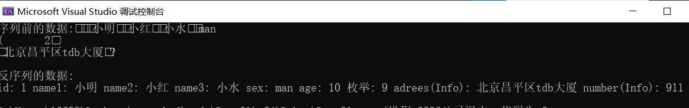

### 2.2.5 **命名空间**

```protobuf
syntax = "proto3";
// 导入另一个文件
import "info.proto";

package pr; //命名空间


enum CoLor
{
    Red = 0;      // protbuf中第一个枚举值必须为店
    Green = 6;
    Blue = 9;
}

message Preson
{
    int32 id = 1;
    repeated bytes name = 2;
    string sex = 3;
    int32 age = 4;
    CoLor CoLor = 5;
    In.Info info = 6;
}
```

```protobuf
syntax = "proto3";

package In;   //命名空间

message Info
{
    bytes address = 1;
    int32 number = 2;
}
```

代码

```c++
#include <iostream>
#include "demo01.pb.h"
#include <string>

using namespace std;
int main(void)
{
	// 1.创建persion对象，并初始化
	pr::Preson p;

	p.set_id(1);

	//name使用repeated相对于vector
	//申请一块内存，存储名字
	p.add_name();
	p.set_name(0, "小明");
	p.add_name();
	p.set_name(1, "小红");
	p.add_name();
	p.set_name(2, "小水");

	//枚举
	p.set_color(Blue);

	p.set_sex("man");
	p.set_age(10);

	// 另一个message
	in::Info* info = p.mutable_info();
	info->set_address("北京昌平区tdb大厦");
	info->set_number(911);

	// 2.将persion对象序列化->字符串
	string output;
	p.SerializeToString(&output);
	cout << "序列前的数据: " << output << endl;

	// 3.数据传输
	// 4，接收数据，解析（output）->解码->原始数据
	// 4.1创建Persion对象
	pr::Preson pp;
	pp.ParseFromString(output);

	// 将Info对象里的值取出
	in::Info li = pp.info();
	cout << "\n反序列的数据: " << endl;
	cout << "id: " << pp.id() << " name1: " << pp.name(0) << " name2: "
		<< pp.name(1) << " name3: " << pp.name(2) << " sex: " << pp.sex() << " age: " << pp.age()
		<< " 枚举: " << pp.color()
		<< " adrees(Info): " << li.address()
		<< " number(Info): " << li.number() << endl;
	return 0;
}
```


# 3. 业务数据分析

## 3.1 客户端

```c++
// 准备要发送的数据
struct RequestMsg
{
    //1 密钥协商 //2 密钥校验; // 3 密钥注销
    int cmdType; // 报文类型
    string clientId; // 客户端编号
    string serverId; // 服务器端编号
    string sign;
    string data;
};
```

```protobuf
message RequestMsg
{
	int32 cmdType;
	bytes clientId;
}
```

## 3.2 服务器端

```c
struct RespondMsg
{
    bool rv; // 返回值
    int seckeyid; 		// 对称密钥编号 keysn
    string clientId; 	// 客户端编号
    string serverId; 	// 服务器编号
    string data; 	// 服务器端随机数
};
```

[(13条消息) Protobuf使用手册--中文版_一颗小树x的博客-CSDN博客_jprotobuf](https://blog.csdn.net/qq_41204464/article/details/95631781)
